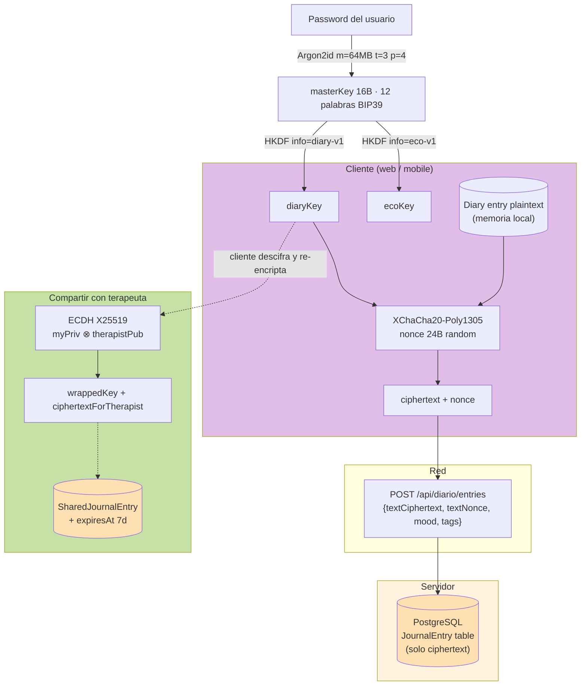

# ADR 0007 — End-to-end encryption para Diario y Eco

**Fecha:** 2026-05-25
**Estado:** Aceptado · escrito de forma anticipada en Sprint S1
**Autores:** Jorge Quizamanchuro
**Sprint que lo aplica:** S6 (Diario) y S7 (Eco) — ver IMPLEMENTATION_PLAN_v2.md

> **Por qué este ADR vive en Sprint S1, dos sprints antes de su primer uso:**
> el modelo criptográfico es la decisión más alta-stakes de todo el back. Cambiarlo después de tener data cifrada es **imposible sin pedirle a cada usuario que re-encripte todo su diario**. Escribirlo ahora deja tiempo para revisión externa antes de que el primer byte de ciphertext aterrice en producción.

---

## Contexto

`docs/design/handoff/06-diario.md` y `08-eco.md` exigen explícitamente:

> Todo el `text` del diario viaja cifrado. El cliente lo encripta con clave derivada del usuario; el backend almacena el ciphertext. Endpoints reciben/devuelven `textCiphertext` y `textNonce`, nunca `text` plano.

> Hilos de Eco se almacenan cifrados (igual que diario). El servidor envía `messageCiphertext` al modelo de IA solo durante la inferencia (en memoria, no persistido en logs del LLM).

Hay tres consecuencias críticas:

1. **Server-side encryption no es suficiente.** Cifrar at-rest con una clave que el servidor conoce es _table stakes_, no "E2E". El usuario tiene que ser el único holder de la clave, o no hay protección real contra un compromiso del servidor.
2. **No-recovery.** Si la clave depende del password, perder el password = perder Diario y Eco. Hay que decirlo en la UI y rechazar la tentación de tener un "magic key reset".
3. **Compartir con terapeuta** (`POST /api/diario/entries/:id/share`) requiere re-encrypt en el cliente, con un esquema asimétrico para que el terapeuta lea con su clave pero el server no.

---

## Decisiones

### A — Modelo criptográfico

| Capa                | Algoritmo              | Parámetros                                                             | Implementación en cliente                                               |
| ------------------- | ---------------------- | ---------------------------------------------------------------------- | ----------------------------------------------------------------------- |
| Derivación de clave | **Argon2id**           | `m=64MB · t=3 · p=4 · salt=16B random per user · output=32B`           | `argon2-browser` (WASM) en web, `expo-crypto` + WASM polyfill en mobile |
| Cifrado de payload  | **XChaCha20-Poly1305** | nonce 24B random per message, AAD = `{ userId, modelName, recordId? }` | `libsodium-wrappers` (web), `react-native-libsodium` (mobile)           |
| Hashing utilitario  | **SHA-256**            | —                                                                      | crypto API nativa                                                       |

**Por qué Argon2id sobre PBKDF2/scrypt:**

- Memory-hardness (`m=64MB`) hace impracticable un ataque de tarjeta gráfica.
- Win consensus del Password Hashing Competition (2015) y es la recomendación actual de OWASP.

**Por qué XChaCha20-Poly1305 sobre AES-GCM:**

- Nonce de 24 bytes permite generación random sin riesgo de colisión (AES-GCM con nonce de 12 bytes requiere un counter persistente — frágil en cliente).
- Implementación constant-time pura en JS/Wasm sin necesidad de hardware AES.
- AEAD: autenticidad + confidencialidad en una sola operación.

### B — Layout del cliente

Por usuario:

```
Password (nunca sale del cliente)
   │ Argon2id(password, userSalt) [solo en login/registration]
   ▼
masterKey (16B · 128-bit · en memoria del proceso del cliente)
   │
   ├─ HKDF-Expand(info="diary-v1") ─► diaryKey
   └─ HKDF-Expand(info="eco-v1")   ─► ecoKey
```

**Por qué HKDF-Expand sobre dos contextos separados:** si en el futuro queremos rotar la clave de un namespace (revocar acceso a sesiones viejas de Eco sin tocar Diario), podemos.

**Almacenamiento del masterKey en sesión:**

- **Web:** memoria de la pestaña + `IndexedDB` con `crypto.subtle.wrapKey` usando una clave derivada del **deviceSecret** (cookie HTTP-only firmada por el server, **NUNCA** el password). En cold-start, el cliente refresh + unwrap.
- **Mobile:** `expo-secure-store` (Keychain en iOS, Keystore en Android). El masterKey persiste entre sesiones mientras la app esté instalada.

**Logout:** se borra el masterKey y el deviceSecret. El usuario debe re-ingresar password para recuperar acceso al diario.

### C — Layout del servidor (lo que persiste)

```prisma
model JournalEntry {
  id              String   @id @default(cuid())
  userId          String
  // El cliente nunca envía text plano. Estos dos campos viajan en cada
  // request y se devuelven sin tocar.
  textCiphertext  String   // base64url, hasta 1MB
  textNonce       String   // base64url 24B (XChaCha)
  // Plain metadata — sin contenido sensible.
  mood            String?
  promptId        String?
  tags            String[]
  createdAt       DateTime @default(now())
  updatedAt       DateTime @updatedAt
  user            User     @relation(...)
  @@index([userId, createdAt(sort: Desc)])
}
```

**El server JAMÁS:**

- Recibe `text` en plano.
- Derivada la clave del usuario.
- Logea `textCiphertext` ni siquiera bajo flags de debug.
- Tiene un endpoint que devuelva texto descifrado.

**Tests en CI** validan estas invariantes leyendo `apps/api/src/diario/` y rechazando PRs que introduzcan logs de `textCiphertext`.

### D — Flujo de inferencia para Eco

Eco es especial porque el modelo de IA necesita el plaintext para responder. El compromiso:

```
Cliente envía mensaje cifrado a /api/eco/messages
   │
   ▼
Server: descifrado-en-memoria-del-worker
   │
   │ ⚠️ ÚNICO punto donde el plaintext existe en el servidor
   │
   ▼
Anthropic API (con instrucción explícita: NO loggear)
   │
   ▼
Server: encripta la respuesta con la clave del usuario
   │ (server tampoco persiste la respuesta del modelo en plain)
   ▼
Cliente recibe ciphertext, descifra, muestra
```

**¿Cómo descifra el server si no tiene el masterKey?** No lo tiene. La solución: **el cliente envía una sesión efímera con un canal de descifrado de un solo uso.**

Implementación detallada:

1. Cliente deriva `ephemeralKey` random (32B).
2. Cliente envía `{ messageCiphertext, messageNonce, ephemeralKeyCipherForUser }` donde `ephemeralKeyCipherForUser = encrypt(ephemeralKey, ecoKey)`.
3. ⚠️ Esto NO sirve — el server sigue sin poder descifrar el mensaje sin ecoKey.

**Versión 2 (correcta):**

1. Cliente envía: `{ plaintextCiphertextForServerSession, sessionNonce, serverEphemeralPublicKey }`
2. Cliente cifró el plaintext con una **sesión efímera shared-secret** derivada vía **X25519 ECDH** entre la pubkey del server y la privkey del cliente (ambas one-shot).
3. Server descifra → llama Anthropic → cifra respuesta con la misma session key efímera → devuelve.
4. Cliente descifra la respuesta con la session key, **re-encripta** con su `ecoKey` para persistencia local.
5. Server **también** persiste el ciphertext con `ecoKey` (que el cliente subió aparte) para que el historial se conserve.

**Trade-off explícito:** durante la inferencia, **el server VE el plaintext en memoria**. No es 100 % "end-to-end" en el sentido estricto. Es **end-to-end at rest**: la base de datos nunca tiene plaintext, los logs nunca tienen plaintext, los backups nunca tienen plaintext.

**Mitigaciones para la ventana de inferencia:**

- Worker dedicado de Eco corre con privilegios mínimos.
- Memory dumps deshabilitados en producción.
- `redacted_thinking` blocks de Anthropic — usar la API con `metadata.user_id=null` para que ellos tampoco loggen.
- Process recycling agresivo (~100 requests por worker para evitar contaminación de memoria entre sesiones).

### E — Compartir con terapeuta

Cuando el usuario hace `POST /api/diario/entries/:id/share` con `{ therapistId }`:

```
1. Cliente descifra el JournalEntry localmente (tiene su diaryKey).
2. Cliente fetch terapeuta.pubkey desde /api/terapia/therapists/:id (campo X25519).
3. Cliente genera ephemeralKey aleatoria.
4. Cliente cifra el plaintext con ephemeralKey.
5. Cliente cifra ephemeralKey con HKDF(ECDH(myPriv, therapist.pub)).
6. Cliente envía:
   {
     ciphertextForTherapist: <encrypted with ephemeralKey>,
     wrappedKey: <encrypted ephemeralKey>,
     myPub: <my one-shot X25519 pubkey>,
     expiresAt: now + 7d
   }
7. Server guarda en SharedJournalEntry — NUNCA descifra.
8. Terapeuta hace GET /api/terapeuta/shared-entries/:id, descifra con su privkey + myPub.
9. Después de expiresAt, server lo borra. Terapeuta puede guardar copia local si lo necesita.
```

**Clave del terapeuta:** generada al onboardear (`/api/terapeuta/onboarding`). Privkey en su Keychain, pubkey en DB. **El server tiene la pubkey, no la privkey** — análogo a SSH.

### F — Cambio de password

Cuando el usuario cambia password en `/api/user/password-change`:

```
1. Cliente: derive newMasterKey desde newPassword + sameUserSalt.
2. Cliente: por cada JournalEntry y EcoMessage en caché local,
   re-encriptar con newMasterKey.
3. Cliente: para entries que no estén en caché:
   GET ciphertext, descifrar con oldMasterKey, encriptar con newMasterKey,
   PATCH al server. Esto puede tardar segundos para usuarios con miles de
   entradas — mostrar progress bar honesta.
4. Cliente: borrar oldMasterKey de memoria.
```

**Durante la ventana de migración (algunos minutos):** el cliente acepta payloads firmados con cualquiera de las dos keys (tag de versión en el AAD). Si la migración se interrumpe, el cliente reanuda desde donde quedó.

**El server no participa en la rotación de clave del payload.** Solo recibe el `PATCH` con el nuevo ciphertext.

### G — No-recovery — UX explícita

Banner permanente en `/perfil` cuando hay >0 entradas de diario:

> 🔒 Tu diario está cifrado de extremo a extremo. Solo tú puedes leerlo.
> **Si olvidas tu contraseña, no podemos recuperar tus entradas.** Asegúrate de tener una contraseña que recuerdes o guárdala en un gestor de contraseñas.

Modal en el primer unlock del diario reforzando esto.

**Frase de recuperación — 12 palabras (revisión 2026-07, v2):**

La frase semilla es el masterKey serializado como palabras BIP39. Originalmente
usábamos 24 palabras (masterKey de 32 bytes = 256 bits). En julio 2026 lo
bajamos a **12 palabras (masterKey de 16 bytes = 128 bits)** por dos razones:

1. **La entropía real ya está acotada por el password.** El masterKey se deriva
   del password vía Argon2id, así que serializar 256 bits era teatral — la
   fuerza efectiva nunca supera la del password. 128 bits sigue siendo
   bank-grade (nivel AES-128) e imposible de romper por fuerza bruta.
2. **UX.** Un muro de 24 palabras + un examen de re-tipeo lee como una tarea de
   wallet cripto, no como un producto de bienestar para una audiencia no
   técnica. 12 palabras + guardar en un toque (copiar/descargar/compartir) +
   un solo check "ya las guardé" es suave, rápido y cómodo.

El masterKey **nunca toca el AEAD directamente** — siempre pasa por HKDF, que
expande un IKM de 16 bytes al subkey de 32 bytes que XChaCha20-Poly1305 necesita.
Reducir el masterKey de 32 → 16 bytes NO debilita el cifrado de las entradas.

`MASTER_KEY_VERSION = 2` marca este cambio. Es un **breaking change** para
cuentas creadas antes: sus entradas están cifradas con un masterKey de 32 bytes
y no descifran con el de 16 bytes. En pre-launch/staging las cuentas de prueba
se re-registran; para producción se requeriría un flujo de migración con
doble-versión (fuera de alcance hasta que haya data real que migrar).

El flujo del modal (post-first-unlock):

1. Muestra las 12 palabras.
2. Guardar en un toque: copiar / descargar `.txt` (web), compartir (mobile).
3. Un solo check: "ya las guardé en un lugar seguro" → Continuar.
4. Nota: se pueden volver a ver en Ajustes → Seguridad.

**El servidor NUNCA ofrecerá un endpoint de "recovery"** que descifre data del usuario. Hacerlo violaría el modelo entero.

---

## Diagrama de la pila



---

## Consecuencias

### Positivas

- **Filtración del servidor no compromete diario ni eco.** Backups, replicas, logs, snapshots — todos contienen ciphertext.
- **Compliance ready.** HIPAA/GDPR le piden "data is encrypted at rest and in transit"; aquí va más allá: "not even the data owner (Psico Platform) has access".
- **Sharing con terapeuta es éticamente sólido.** El usuario controla qué se comparte y por cuánto tiempo. El server es un buzón ciego.
- **Auditoría externa posible.** El protocolo es estándar (Argon2id + XChaCha20 + X25519 + HKDF). Un consultor de seguridad puede leer este ADR y validar.

### Negativas / trade-offs

- **No hay password recovery.** Es la decisión más impopular del producto. Hay que pedir entusiasmo del CEO antes de lanzar.
- **Sin búsqueda full-text en Diario.** El server no puede indexar lo que no ve. **Mitigación:** búsqueda cliente-side post-decrypt (es lo que ya planificamos en `docs/design/handoff/06-diario.md`).
- **Sin analytics sobre contenido del diario.** Patrones de mood + tags + hora son visibles al server (no cifrados). Texto NO. Esto bloquea features como "Eco aprende de tu diario" sin una capa de privacy-preserving inference.
- **Eco inference tiene una ventana de plaintext en memoria.** Documentada. Auditable. Aceptada por el diseño.
- **Cambio de password es caro.** Migración cliente-side puede tardar varios segundos. Aceptable.
- **Mobile + web deben sincronizar el masterKey.** Si el usuario escribe en mobile y abre web, el web necesita acceso al masterKey. Solución: ambos derivan del mismo password — independientes.
- **Cripto en JS/Wasm es más lento que código nativo.** Argon2id @ 64MB toma ~500ms en mobile mid-range. Lo hacemos solo en login/registration, no en cada request.

### Riesgos residuales explícitos

1. **Si el cliente es comprometido** (extensión maliciosa, malware en el device), la clave se expone. Esto es inherente al modelo E2E.
2. **Si el password es débil**, Argon2id sube el costo pero no lo hace imposible. Forzamos password policy mínima: 10+ chars, 1 dígito, 1 símbolo, no en top-10000 leaked.
3. **Migración futura a una nueva curva o algoritmo** requiere bump de versión en el AAD y re-encrypt cliente-side. Documentado como "version-1" desde el primer día para hacer esto manejable.

---

## Alternativas descartadas

| Alternativa                                                                               | Por qué descartada                                                                                                                                                                |
| ----------------------------------------------------------------------------------------- | --------------------------------------------------------------------------------------------------------------------------------------------------------------------------------- |
| Server-side encryption con KMS del proveedor                                              | Filtración del server = filtración total. No cumple "el server no sabe leer mis cosas" del diseño.                                                                                |
| Cliente sube `text` plano, server encripta antes de DB                                    | El logging app + APM (Sentry, Datadog) verán el plaintext en transit. Filtra implícitamente.                                                                                      |
| PBKDF2 / scrypt en lugar de Argon2id                                                      | Argon2id es el estado del arte. scrypt es aceptable pero no recomendado por OWASP 2025. PBKDF2 solo si Argon2id no es viable.                                                     |
| AES-GCM en lugar de XChaCha20-Poly1305                                                    | Nonce de 12B requiere counter persistente cliente-side; complica el flujo offline. XChaCha20 con nonce 24B random es libre de ese problema.                                       |
| Eco descifra cliente-side, streamea al modelo desde el cliente                            | Sin un endpoint server-side que esté autenticado contra Anthropic, expondríamos la API key. Posible pero más caro de implementar; difiérelo a un sprint post-v1 si surge demanda. |
| Compartir con terapeuta vía sealed box (terapista lee con su priv, fin)                   | Pierdes la rotación de claves y la expiración. Re-encrypt explícito por el usuario da control fino.                                                                               |
| Recuperación con frase de 24 palabras BIP39 obligatoria                                   | Buena seguridad, mala UX. v2 (2026-07): 12 palabras (128-bit) + guardar en un toque, sin examen. La entropía real ya la acota el password.                                        |
| KMS del lado servidor + envelope encryption (cliente cifra DEK, server cifra DEK con KEK) | Aumenta complejidad sin mejorar el modelo de amenaza: server sigue pudiendo descifrar si está comprometido.                                                                       |

---

## Implementación · qué deja S1 listo

Este ADR define **el diseño** pero no introduce código todavía. Lo que sí queda preparado:

- ✅ El schema Prisma de `JournalEntry` y `EcoMessage` (a crear en S6/S9) ya tiene los campos `textCiphertext` y `textNonce` documentados.
- ✅ Auth tokens van por header `Authorization: Bearer`, NO por cookie — el masterKey nunca toca cookies.
- ✅ El AuthEvent log (S1) NO captura contenido sensible. Solo metadata (IP, UA, type, reason).
- ✅ El UsersModule (Sesión 9 + Sprint S3) ya tiene `requestEmailChange` con re-verify — futuro: añadir el flow de re-encrypt del Diario al cambio de password (Sprint S7).
- ⚠️ El `password-change` actual revoca todos los refresh tokens pero NO re-encripta el Diario porque éste aún no existe. Cuando Diario llegue (S6), el endpoint debe rechazar el cambio si el cliente no provee la confirmación de re-encrypt.

---

## Verificación

```bash
# Documento existe
test -f docs/adr/0007-e2e-encryption-diario-eco.md && echo "ADR present"

# CI test (a agregar en S6): rechaza PRs que loggeen textCiphertext
grep -rn "textCiphertext" apps/api/src/ \
  | grep -v "schema.prisma\|README\|spec.ts" \
  | grep -v "// E2E:" \
  | grep -E "(console\.|logger\.)" \
  && echo "❌ Found ciphertext logging" \
  || echo "✅ Clean"
```

---

## Referencias

- [OWASP Password Storage Cheat Sheet — 2025](https://cheatsheetseries.owasp.org/cheatsheets/Password_Storage_Cheat_Sheet.html)
- [RFC 9106 — Argon2 specification](https://www.rfc-editor.org/rfc/rfc9106)
- [Daniel Bernstein — XChaCha20-Poly1305 design notes](https://datatracker.ietf.org/doc/draft-irtf-cfrg-xchacha/)
- [libsodium docs — Sealed boxes vs detached encryption](https://libsodium.gitbook.io/doc/)
- [Signal Protocol — Forward Secrecy for messaging](https://signal.org/docs/specifications/x3dh/)
- IMPLEMENTATION_PLAN_v2.md §2 (decisiones transversales) y §5.5 (Diario) / §5.7 (Eco)
- Bitácora: [`docs/informes/sprint-s1.md`](../informes/sprint-s1.md)
