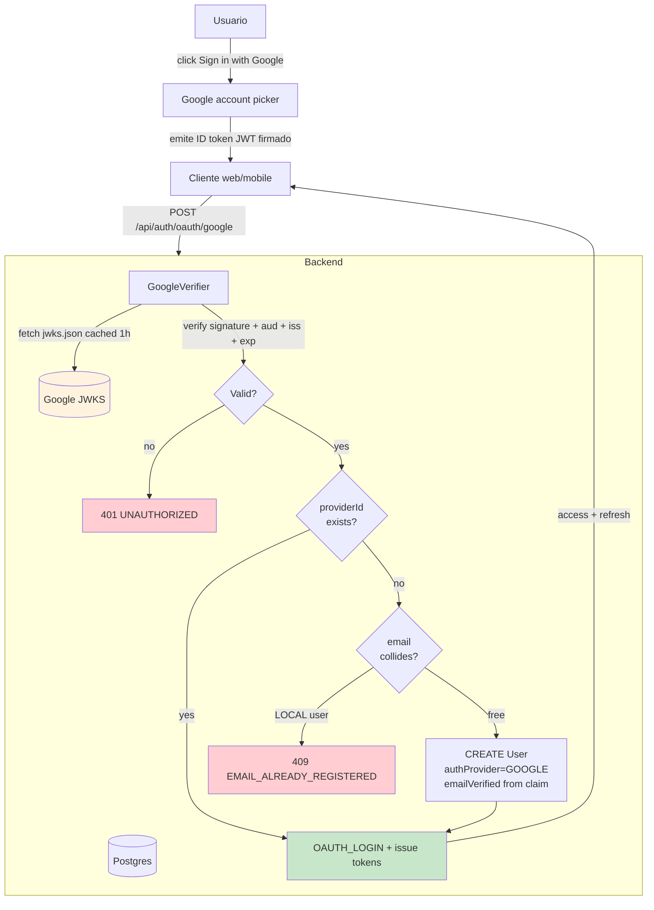

# ADR 0009 — OAuth via Google ID token verification (no Passport redirect flow)

**Fecha:** 2026-05-26
**Estado:** Aceptado
**Autores:** Jorge Quizamanchuro
**Sprint:** S2
**Aplica a:** `POST /api/auth/oauth/google`

---

## Contexto

`docs/design/handoff/99-endpoints.md` define:

| Método | Endpoint                    | Auth | Descripción                                         |
| ------ | --------------------------- | ---- | --------------------------------------------------- |
| POST   | `/api/auth/oauth/:provider` | No   | OAuth (Google/Apple) — `provider`: `google`/`apple` |

El verbo POST nos da una pista importante: el diseño asume que el **cliente** ya obtuvo un token de Google (vía la SDK / Identity Services) y lo envía al backend para verificación. **No** es el flujo clásico de Passport con redirect.

Cuando empecé Sprint S2, mi plan mencionaba `passport-google-oauth20`. Reconsideré antes de instalar.

---

## Decisión

Usar `google-auth-library` (paquete oficial de Google) para **verificar ID tokens server-side**. **No** usar `passport-google-oauth20`.

### Flujo implementado

```
┌─────────────────────────────────────────────────────────────────────┐
│ Cliente (web o mobile)                                              │
│                                                                     │
│  Web (Next.js):                                                     │
│   const credential = await googleSignInButton.click()               │
│   → Google Identity Services → ID token (JWT)                       │
│                                                                     │
│  Mobile (Expo / React Native):                                      │
│   const { idToken } = await GoogleSignin.signIn()                   │
│   → Google Sign-In SDK → ID token (JWT)                             │
└──────────────────┬──────────────────────────────────────────────────┘
                   │ POST /api/auth/oauth/google { idToken }
                   ▼
┌─────────────────────────────────────────────────────────────────────┐
│ Backend (NestJS)                                                    │
│                                                                     │
│  1. GoogleVerifier.verify(idToken)                                  │
│     │                                                               │
│     ├─► google-auth-library                                         │
│     │   • Fetches Google's public keys (cached automatically)       │
│     │   • Verifies JWT signature                                    │
│     │   • Validates `aud` === GOOGLE_CLIENT_ID                      │
│     │   • Validates `iss` ∈ {accounts.google.com,                   │
│     │                        https://accounts.google.com}           │
│     │   • Rejects expired tokens                                    │
│     │                                                               │
│     └─► Returns { sub, email, emailVerified, name, picture }        │
│                                                                     │
│  2. Lookup by (authProvider=GOOGLE, providerId=sub):                │
│     ├─ existing → OAUTH_LOGIN audit + issue tokens                  │
│     └─ not found → check email collision                            │
│                    ├─ LOCAL user has this email → 409 (no auto-link)│
│                    └─ free email → CREATE User + OAUTH_REGISTER     │
└──────────────────┬──────────────────────────────────────────────────┘
                   │ 200 { accessToken, refreshToken, user }
                   ▼
              Standard Psico session
```

---

## Por qué este flujo y no Passport redirect

### Passport redirect flow (descartado)

```
Cliente → Backend (initiate)
         ↓
Backend → 302 Location: accounts.google.com/o/oauth2/v2/auth?...
         ↓
Browser → Google login UI
         ↓
Google → 302 Location: <our-callback-url>?code=...
         ↓
Backend (callback handler) → exchange code for tokens → issue session
         ↓
Backend → 302 Location: <our-frontend>?session=...
```

| Problema del redirect flow                                              | Impacto en Psico Platform                                                                      |
| ----------------------------------------------------------------------- | ---------------------------------------------------------------------------------------------- |
| Necesita un callback URL **por entorno** (dev/staging/prod, web/mobile) | Mantener registro Google Cloud Console + env var por callback. Fricción alta.                  |
| Mobile no se puede redirect a un URL del navegador y volver fácilmente  | Habría que abrir una WebView o un browser tab y manejar deeplinks. Frágil en iOS y Android.    |
| El backend mantiene state (session middleware con `passport-session`)   | Conflicto con nuestro stateless JWT design. Tendríamos cookies de sesión + JWT — dos verdades. |
| Para SPAs el browser hace un round-trip extra que rompe la UX           | El usuario sale de nuestra app, va a Google, vuelve. ~3 segundos perdidos.                     |

### ID token flow (adoptado)

| Ventaja                             | Detalle                                                                                                                     |
| ----------------------------------- | --------------------------------------------------------------------------------------------------------------------------- |
| **Cero callback URLs**              | Google solo necesita conocer nuestro `clientId` (frontend) para emitir el token. El backend valida con el mismo `clientId`. |
| **Web + mobile comparten endpoint** | Ambos clientes obtienen un ID token y lo POSTean al mismo handler. No hay flujos divergentes.                               |
| **Sin sesiones server-side**        | Backend sigue stateless. El token de Google se descarta tras verificación.                                                  |
| **Sin redirect dance**              | El usuario nunca sale de nuestra app. UX más limpia.                                                                        |
| **Mismo match con el diseño**       | El diseño dice POST — este flujo es POST natural.                                                                           |
| **Trivial de testear**              | Mockeo de `OAuth2Client.verifyIdToken` y listo. Sin tener que simular browser redirects.                                    |

### El único costo

El cliente tiene que **integrar la SDK de Google** (Identity Services en web, Google Sign-In en mobile). Pero eso ocurre en cualquier flujo OAuth moderno — el Passport redirect requiere lo mismo o peor.

---

## Decisiones secundarias

### A. No auto-linking de cuentas

Si Google envía un email que **ya está registrado como LOCAL** en nuestra DB, **rechazamos con 409** en vez de fusionar las cuentas silenciosamente.

**Razón:** un atacante que registre cuenta Google con el email de un usuario LOCAL podría tomar control silenciosamente. Sí, el atacante necesita poseer el email en Google, pero hay paths (e.g. emails corporativos donde Google Workspace permite crear `+alias`) donde esto es viable.

**Trade-off:** algunos usuarios legítimos quedarán confundidos ("ya me registré antes pero con email + password"). El error message lo dice explícitamente, y el frontend debe sugerir el path correcto.

**Futuro:** un endpoint `POST /api/user/link-google` (post-v1) que **requiera contraseña actual** + ID token de Google. Auto-linking durante OAuth nunca.

### B. Confiamos en `email_verified` de Google

Si Google dice que el email del usuario está verificado, marcamos `User.emailVerified=true` directamente. No reenviamos nuestro propio email de verificación.

**Razón:** Google ya validó la propiedad del email. Pedir doble verificación es fricción innecesaria.

**Caso edge:** algunos providers federados con Google (e.g. Google Workspace con SAML) pueden tener `email_verified=false`. Nuestro verificador lanza `401` en ese caso. El usuario tiene que verificar primero en su workspace.

### C. Sin verification automática del clientId en producción

El usuario optó por **empezar con Google "unverified"** mientras se procesa la verification (4-6 semanas). El flujo funciona — Google muestra un screen "this app isn't verified" durante el consent screen, pero la verificación del token server-side sigue siendo válida. Esta decisión es UX-only, no afecta el ADR.

---

## Diagrama de seguridad



**Lo que NO confiamos del ID token:**

- Su origen físico (no chequeamos IP de quien lo envía).
- Su frescura más allá del `exp` claim que Google emite (típicamente 1 hora).
- Cualquier claim que no esté firmado por Google.

**Lo que SÍ confiamos:**

- `aud === GOOGLE_CLIENT_ID` (firma + audience verificadas por google-auth-library).
- `iss` en la lista canónica.
- `email`, `email_verified`, `sub`, `name`, `picture` del payload firmado.

---

## Consecuencias

### Positivas

- **Implementación mínima.** ~80 líneas en `google-verifier.ts`, sin sesiones, sin redirect.
- **Mantenible.** No hay env vars por entorno con callback URLs distintas. Un único `GOOGLE_CLIENT_ID`.
- **Multi-cliente nativo.** El mismo endpoint sirve web + mobile. Apple Sign-in (S2.5 cuando tengamos developer account) puede seguir el mismo patrón.
- **Auditable.** `AuthEvent.type = OAUTH_REGISTER | OAUTH_LOGIN` con `metadata.provider="GOOGLE"`. Pulso podrá graficar adopción por provider en Sprint S25.
- **Testable.** Mockear `OAuth2Client.verifyIdToken` es trivial — el flujo entero se puede E2E-testear sin tocar la red real de Google.

### Negativas / trade-offs

- **No tenemos refresh token de Google.** Solo el ID token de un solo uso. Si queremos hacer queries a Google APIs en nombre del usuario (Drive, Gmail, etc.) en un sprint futuro, vamos a necesitar OAuth refresh tokens — y eso sí requiere el flujo de redirect. Hasta que tengamos esa feature, no aplica.
- **Sin Apple en S2.** El usuario no tiene Apple Developer account aún. Apple Sign-in usará el mismo patrón cuando llegue (token JWT firmado por Apple). Cero rework en el endpoint shape — solo agregar un `AppleVerifier` análogo.
- **Frontend debe integrar Google SDK.** No es opcional. La carga de la SDK añade ~150 KB al bundle del web. En mobile es nativa y no impacta.
- **`GOOGLE_CLIENT_ID` no se valida en envSchema.** Es opcional — sin él, el endpoint responde 400 OAUTH_NOT_CONFIGURED. Por qué: queremos que deploys nuevos puedan booteear sin OAuth si todavía no se configuró Google Cloud Console.

---

## Alternativas descartadas

| Alternativa                                               | Razón                                                                                                                                          |
| --------------------------------------------------------- | ---------------------------------------------------------------------------------------------------------------------------------------------- |
| `passport-google-oauth20` (redirect flow)                 | Ya argumentado arriba. Tres cosas peor (callbacks, sesiones, UX).                                                                              |
| OpenID Connect Discovery con `openid-client`              | Más genérico (funciona con cualquier OIDC provider) pero overkill para 2 providers. Si en el futuro necesitamos Okta/Auth0/etc., reconsiderar. |
| Auth0 / Clerk / Supabase Auth como proveedor de identidad | Externaliza el problema pero te encadena al proveedor. Demasiado pronto para asumir ese costo.                                                 |
| Magic links en lugar de OAuth                             | Tampoco contradice OAuth — es complementario. Si lo agregamos, sería un endpoint distinto.                                                     |

---

## Verificación

```bash
# Sin GOOGLE_CLIENT_ID configurado:
curl -s -X POST http://localhost:3001/api/auth/oauth/google \
  -H "Content-Type: application/json" \
  -d '{"idToken":"'"$(printf 'x%.0s' {1..128})"'"}'
# → {"statusCode":400,"code":"OAUTH_NOT_CONFIGURED",...}

# Con GOOGLE_CLIENT_ID configurado + idToken inválido:
# → {"statusCode":401,"code":"UNAUTHORIZED","message":"Invalid Google credential",...}

# Tests
pnpm --filter @psico/api test  # 179 tests incl. 4 nuevos para loginWithGoogle
```

---

## Referencias

- [Google · Verify the integrity of the ID token (server-side)](https://developers.google.com/identity/sign-in/web/backend-auth)
- [google-auth-library — verifyIdToken API](https://github.com/googleapis/google-auth-library-nodejs#verifying-id-tokens)
- [Google Identity Services (web, frontend)](https://developers.google.com/identity/gsi/web/guides/overview)
- [Google Sign-In for iOS/Android (mobile, frontend)](https://developers.google.com/identity/sign-in/android/start-integrating)
- IMPLEMENTATION_PLAN_v2.md §2 (ADR 0009 placeholder) y §6.S2
- Bitácora S2: [`docs/informes/sprint-s2.md`](../informes/sprint-s2.md)
