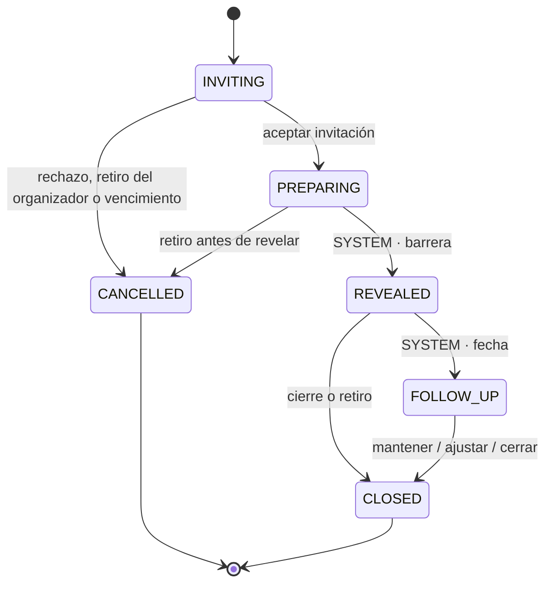

# FeelVerse Círculos v1 — contrato de dominio, permisos, estados y amenazas

```
STATUS=PROPOSED
CUT=PR2 · feat/circles-domain-foundation
BASE_SHA=c824a6a4ebb50c9dc619c29ddb896e60f3efcdd3
SPEC_SHA256=e94ff50cebd1b99bec3281f33880e6c41ec6b131e8cadb2847b176a793ce1b3d

RUNTIME_SCOPE=access_only
PRISMA_MODELS_ADDED=8
MIGRATIONS_ADDED=1
CROSS_CIRCLE_REFERENCES_REJECTED=true
CROSS_ACTIVITY_REFERENCES_REJECTED=true
DUO_REQUIRED_PARTICIPANTS_EXACTLY_TWO=true
PILOT_GUEST_REVALIDATES_INVITER=true
CIRCLE_EVENT_APPEND_ONLY=true
CIRCLE_EVENT_FREE_TEXT_ALLOWED=false
API_ROUTES_ADDED=3
WEB_ROUTES_ADDED=0
PUBLISHED_TEMPLATES=0
CIRCLES_ROLLOUT_MODE=off
PUBLIC_ACCESS_ENABLED=false
IMPLEMENTATION_AUTHORIZED=PR2
```

Este documento es la mitad **contractual** del programa Círculos. Fija qué es
una actividad compartida, quién puede hacer qué, qué transiciones existen y
contra qué se defiende — antes de que exista una sola tabla.

La especificación autoritativa del programa es
`feelverse-duo-circles-architecture-2026-09-09.md` (SHA-256 arriba). Este
documento no la reemplaza: la reconcilia con el código real y la vuelve
ejecutable. Donde se aparta de ella, lo dice en voz alta — ver §9.

El merge de PR1 constituyó **aprobación de contrato**. PR2 añade la base
persistente y de acceso —los ocho modelos, la migración aditiva, el módulo
Nest, el rollout, las invitaciones y la sesión de invitado— con
`CIRCLES_ROLLOUT_MODE=off`, que es la única razón por la que nada de eso es
alcanzable todavía. Participación, revelación, artefactos y UI siguen sin
autorizar: cada fase posterior requiere su propia instrucción.

Relacionados: [ADR 0023](../adr/0023-circles-one-domain-many-surfaces.md) ·
[ADR 0007](../adr/0007-e2e-encryption-diario-eco.md) (cifrado) ·
[ADR 0016](../adr/0016-content-core-work-edition-revision.md) (identidad editorial) ·
[ADR 0022](../adr/0022-guide-lineage-active-scope.md) (Guide, congelado).

Código del contrato:
[`packages/types/src/circles.ts`](../../packages/types/src/circles.ts) ·
[`packages/types/src/circles-catalog.ts`](../../packages/types/src/circles-catalog.ts).
Código de la base de acceso (PR2): los ocho modelos en
[`apps/api/prisma/schema.prisma`](../../apps/api/prisma/schema.prisma), sus
invariantes en
[`20260909180000_circles_domain_foundation`](../../apps/api/prisma/migrations/20260909180000_circles_domain_foundation/migration.sql)
y el módulo con sus pruebas en
[`apps/api/src/circles/`](../../apps/api/src/circles/).

---

## 1. Principios no negociables

1. **La preparación privada no existe en el servidor.** No hay campo para ella
   en ningún contrato, ni lo habrá. Lo que cruza la red es un snapshot que la
   persona previsualizó y confirmó. `circles-scope.spec.ts` lo verifica como
   ausencia de identificadores, no como intención.
2. **Nadie ve lo ajeno antes de la barrera.** `VIEW_OTHERS_SELECTION_BEFORE_REVEAL`
   es `NEVER` para **todos** los roles, organizador y admin incluidos. La
   barrera no es una regla de acceso con excepciones privilegiadas.
3. **El cliente nunca afirma quién es.** `CircleActor` lo construye el servidor
   desde un JWT o desde una sesión opaca de invitado. Ningún DTO acepta
   `userId`, `participantId` ni rol.
4. **PostgreSQL manda.** Invitaciones, consentimiento, idempotencia, revelación
   y revocación se resuelven en transacciones con constraints. Redis nunca
   autoriza ni revela.
5. **Vincular una cuenta no otorga nada personal.** Diario, Eco personal, Mapa
   y Patrones quedan fuera para siempre: `VIEW_OTHERS_PERSONAL_SURFACES` es
   `NEVER` para todos.
6. **Una persona siempre puede no compartir.** Toda plantilla debe ofrecer
   `KEEP_PRIVATE` o `WITHDRAW`; el validator rechaza las que no lo hacen.
7. **Cifrado de aplicación, dicho con claridad.** Lo compartido se cifra con
   una clave de Círculos que el servidor conoce. **No es E2E** y la interfaz no
   puede insinuar que lo sea.
8. **Sin diagnóstico ni puntuación.** No hay score de vínculo, comparación
   entre participantes ni inferencia sobre quien no respondió.

---

## 2. Qué añade este corte y qué no

|              |                                                                                                                                               |
| ------------ | --------------------------------------------------------------------------------------------------------------------------------------------- |
| **Añade**    | Contratos compartidos, validator, registro, catálogo vacío, matriz de permisos, dos máquinas de estados, threat model, fixtures y 55 pruebas. |
| **No añade** | Modelo Prisma, migración, `CirclesModule`, controladores, guards, rutas web, rollout, cifrado, worker, Eco, CTA y plantillas publicadas.      |

`apps/api/src/circles/` contiene únicamente specs y fixtures. Está ahí porque
`@psico/types` no tiene runner de pruebas y `apps/api` sí las ejecuta en CI —
y porque es donde el módulo aterrizará en PR2.

---

## 3. Decisiones (ADR-CIR-001 … 010)

Las diez decisiones vienen de la especificación. Aquí se registran con su
consecuencia sobre el código de este corte.

| ADR         | Decisión                                                                    | Dónde se ve en PR1                                                                                                                        |
| ----------- | --------------------------------------------------------------------------- | ----------------------------------------------------------------------------------------------------------------------------------------- |
| **CIR-001** | Un dominio (`CirclesModule`), varias superficies. Dúo es `Circle.kind=DUO`. | `participants {min,max,required}` en vez de suponer dos; `audience` con un único valor.                                                   |
| **CIR-002** | No tocar `GuideSession`. Una `CircleActivity` tiene lifecycle propio.       | Máquina de estados propia; cero ficheros de Guide modificados.                                                                            |
| **CIR-003** | Preview público ≠ sala pública. Dos URL, dos contratos.                     | `CircleTemplatePreview` + `toCircleTemplatePreview`, que **rechaza** DRAFT y ARCHIVED por sí mismo, con test de lo que no puede contener. |
| **CIR-004** | Preparación privada local; no se persiste.                                  | No existe tipo para una respuesta; ratchet de ausencia.                                                                                   |
| **CIR-005** | Se cifra lo deliberadamente compartido (`ciphertext+nonce+keyVersion`).     | Fuera del contrato compartido: es forma de dominio (PR3). Documentado en §5.                                                              |
| **CIR-006** | PostgreSQL manda; Redis ayuda.                                              | Documental en este corte; se implementa en PR2/PR3.                                                                                       |
| **CIR-007** | Plantillas versionadas en código; sin CMS.                                  | `CircleTemplateRegistry` + catálogo vacío.                                                                                                |
| **CIR-008** | Sin tiempo real. Polling 8–12 s.                                            | Documental; sin superficie en PR1.                                                                                                        |
| **CIR-009** | Rollout `off\|pilot\|on`, fail-closed.                                      | **No implementado aquí**: llega en PR2 siguiendo `guide-rollout.ts`.                                                                      |
| **CIR-010** | FeelVerse en copy; identificadores técnicos estables.                       | Rutas/tipos nuevos usan «Circle»; `@psico/*` y `psico-platform` sin tocar.                                                                |

---

## 4. Actor y matriz de permisos

El actor es siempre construido por el servidor:

```ts
type CircleActor =
  | { kind: "USER"; userId: string }
  | {
      kind: "GUEST";
      guestSessionId: string;
      activityId: string;
      participantId: string;
    };
```

Un invitado **no es un miembro ligero**: su identidad está atada a una
invitación y a **una** actividad, y esa actividad forma parte del actor. Por eso
toda lectura de invitado queda acotada por construcción y no por acordarse de
filtrar.

La matriz vive en `CIRCLE_PERMISSION_MATRIX` y se comprueba en
`circles-permissions.spec.ts`. Valores posibles:

| Valor                  | Significado                                         |
| ---------------------- | --------------------------------------------------- |
| `ALLOWED`              | Permitido.                                          |
| `ALLOWED_OWN_ACTIVITY` | Permitido solo dentro de su única actividad.        |
| `DENIED`               | No en v1; una política futura podría revisarlo.     |
| `NEVER`                | No debe permitirse en ninguna versión.              |
| `LOCAL_ONLY`           | Ocurre en el dispositivo; el servidor no lo recibe. |

`permits()` solo deja pasar los dos `ALLOWED`. `LOCAL_ONLY` **no** es permiso de
lectura.

| Capacidad                                | Organizador |  Miembro   |       Invitado       | Admin/pagador |
| ---------------------------------------- | :---------: | :--------: | :------------------: | :-----------: |
| Crear Dúo                                |   ALLOWED   |   DENIED   |        DENIED        |    DENIED     |
| Invitar                                  |   ALLOWED   |  DENIED¹   |        DENIED        |    DENIED     |
| Ver preview de plantilla                 |   ALLOWED   |  ALLOWED   |       ALLOWED        |   ALLOWED²    |
| Aceptar/rechazar                         |   DENIED³   |  ALLOWED   | ALLOWED_OWN_ACTIVITY |    DENIED     |
| Preparación privada                      | LOCAL_ONLY  | LOCAL_ONLY |      LOCAL_ONLY      |     NEVER     |
| Confirmar su selección                   |   ALLOWED   |  ALLOWED   | ALLOWED_OWN_ACTIVITY |     NEVER     |
| **Ver selección ajena antes de revelar** |  **NEVER**  | **NEVER**  |      **NEVER**       |   **NEVER**   |
| Ver contenido revelado                   |   ALLOWED   |  ALLOWED   | ALLOWED_OWN_ACTIVITY |     NEVER     |
| Proponer artefacto                       |   ALLOWED   |  ALLOWED   | ALLOWED_OWN_ACTIVITY |     NEVER     |
| Confirmar artefacto                      |   ALLOWED   |  ALLOWED   | ALLOWED_OWN_ACTIVITY |     NEVER     |
| Cerrar/retirarse                         |   ALLOWED   |  ALLOWED   | ALLOWED_OWN_ACTIVITY |    DENIED     |
| **Ver superficies personales ajenas**    |  **NEVER**  | **NEVER**  |      **NEVER**       |   **NEVER**   |

¹ Si un miembro no organizador puede invitar es una pregunta de política
futura, por eso `DENIED` y no `NEVER`.
² Solo como público: el preview no lleva estado de instancia.
³ La aceptación del organizador es implícita al crear el círculo.

**Las dos filas en negrita son la promesa del producto.**
`CIRCLE_NEVER_CAPABILITIES` las fija y un test falla si alguien las mueve.

---

## 5. Modelo de datos objetivo (PR2, aquí solo documentado)

Ocho modelos. **Ninguno existe todavía**; se registran para que la migración de
PR2 se audite contra algo escrito antes.

| Modelo                      | Invariantes que deben ser CHECK/UNIQUE/FK en PostgreSQL, no `if` en TypeScript                                                                      |
| --------------------------- | --------------------------------------------------------------------------------------------------------------------------------------------------- |
| `Circle`                    | Solo se crea `DUO` en v1; cerrar no borra auditoría.                                                                                                |
| `CircleMember`              | Único activo por `(circleId, userId)`; el rol de círculo no toca `User.role`.                                                                       |
| `CircleInvitation`          | Token y código **solo como hash**; un uso en Dúo; unicidad por hash.                                                                                |
| `CircleGuestSession`        | Atada a una actividad; opaca; revocable con efecto inmediato.                                                                                       |
| `CircleActivity`            | Pin de plantilla inmutable; `revealedAt` solo cuando el número requerido está `READY`.                                                              |
| `CircleActivityParticipant` | `num_nonnulls(memberId, invitationId) = 1`; sobre cifrado, nonce, keyVersion y `readyAt` presentes juntos o ausentes juntos; **nunca el borrador**. |
| `CircleArtifact`            | Un artefacto primario activo por actividad; versión monotónica; editar invalida confirmaciones previas.                                             |
| `CircleEvent`               | Append-only; sin texto libre; único por `(actor, comando, idempotencyKey)`.                                                                         |

**Cifrado (ADR-CIR-005).** El snapshot confirmado y el artefacto se guardan como
`ciphertext + nonce + keyVersion`, cifrados por la API con
`CIRCLES_SHARED_DATA_KEY_V*`. La clave nunca llega a `NEXT_PUBLIC_*` ni al
navegador. **Esto no es E2E**: el servicio puede descifrar lo compartido, y la
interfaz debe decirlo en lenguaje comprensible. La preparación privada sigue sin
existir en el servidor, cifrada o no.

Conceptos de Notion que **no** reciben tabla en v1: `ActivityTemplate` (catálogo
en código), `PrivateResponse` (no persiste), `ShareGrant` (campos en el
participante), `Agreement` (`CircleArtifact.kind`), `FollowUp` (campos),
`ConsentReceipt` y `SafetyEvent` (`CircleEvent` tipado).

---

## 6. Máquinas de estados

Declaradas exhaustivamente en `CIRCLE_ACTIVITY_TRANSITIONS` y
`CIRCLE_PARTICIPANT_TRANSITIONS`. Una arista que no está ahí no existe.



Propiedades que las pruebas fijan sobre el grafo completo, no caso a caso:

- **Nada sale de un estado terminal.** Un Dúo `CANCELLED` no puede volverse
  `REVEALED`.
- **La revelación es una decisión del servidor.** La única arista hacia
  `REVEALED` tiene trigger `SYSTEM`: nadie puede _pedir_ que se revele.
- **`CONFIRM_SHARE` no aparece en la tabla de la actividad.** Mueve al
  participante; la actividad se mueve cuando la barrera cuenta a todos.
- **`WITHDRAW` tiene un desenlace explícito en cada etapa, y solo tres.**
  Desde `INVITING` → `CANCELLED`: el organizador retira una invitación que
  nadie aceptó todavía; es terminal, silenciosa y no pide ni comunica una
  razón. Desde `PREPARING` → `CANCELLED` y se destruyen los sobres pendientes.
  Desde `REVEALED` → `CLOSED`: se corta el acceso futuro, y el producto nunca
  promete que la otra persona olvide lo que ya vio. No hay una cuarta.

  Sin la primera arista, una actividad podía quedarse atrapada en `INVITING`
  para siempre —basta con que la contraparte no conteste nunca— y el
  organizador no tenía forma de retirarla. Lo detectó la auditoría.

- **Se puede salir desde cualquier estado no terminal.** Un estado sin salida
  atraparía a una persona dentro de una actividad.
- **`PREPARING` no significa que el servidor tenga un borrador.** Significa que
  la actividad está abierta.

---

## 7. Contrato de plantilla

`CircleActivityDefinition` (§12 de la especificación) está en `circles.ts`; el
validator en `circles-catalog.ts` reconstruye campo a campo desde una gramática
cerrada, congela en profundidad y nunca muta ni aliasa su entrada.

Rechaza, entre otras cosas: claves desconocidas (así aparecería un borrador
privado en un contrato «que aún valida»), `contentUnitId` dentro de `source`,
cualquier `reveal.strategy` distinta de `ALL_CONFIRMED`, una audiencia no
habilitada, `DUO_ADULT` con participantes distintos de 2/2/2, `fieldKey`
duplicados, prototipos exóticos y versiones no positivas. El error lleva un
**código** y jamás el valor rechazado.

El registro resuelve por pin exacto `key@version`, sin «latest» ni vecinos.
`DRAFT` y `ARCHIVED` **sí** resuelven por pin —una actividad ya en curso debe
seguir funcionando— pero no se pueden listar, previsualizar ni instanciar, y la
negativa distingue «no publicada» de «no existe».

**La frontera pública falla cerrada por sí misma.** `toCircleTemplatePreview`
comprueba el estado él mismo y lanza `CIRCLE_CATALOG_NOT_PUBLISHED` ante un
DRAFT o un ARCHIVED, en vez de confiar en que quien llama haya pasado antes por
`getPublished()`. Dos guardas que deben ponerse de acuerdo son más débiles que
una que no se puede esquivar: un `map()` distraído bastaría para poner un
borrador sin revisar delante de una persona desconocida. Lo detectó la
auditoría.

### El catálogo está vacío, y eso es el entregable

`PRODUCTION_CIRCLE_TEMPLATES = []`. La especificación permite incorporar como
DRAFT dos candidatas —«Lo que necesito que puedas escuchar» y «Cómo prefiero ser
acompañado cuando algo me sobrepasa»— **si hay copy aprobado verificable**. No lo
hay: ese copy vive en Notion, que este corte no puede leer, e inventarlo sería
escribir contenido editorial que nadie aprobó. El motor se entrega demostrable­mente
listo y demostrable­mente sin contenido.

Los nueve `DUO_CANDIDATES` de _Parejas que perduran_ **no** se importan. Lo
declaran ellos mismos («PRODUCT DRAFT ONLY. No runtime, no tables, no
endpoints») y **PQP C07 lleva la lista vacía a propósito**: una actividad
bilateral es el instrumento equivocado donde puede haber coerción, control,
miedo o violencia. Un ratchet lo fija.

---

## 8. Las tres zonas de privacidad

| Zona                | Datos                                                          | Persistencia v1                  | Quién puede ver                          |
| ------------------- | -------------------------------------------------------------- | -------------------------------- | ---------------------------------------- |
| **Mi espacio**      | Borrador, respuestas privadas, razones para rechazar           | **Ninguna**; memoria del cliente | Solo la persona                          |
| **La mesa**         | Snapshot seleccionado y confirmado, estado listo/esperando     | Cifrado en API                   | Su autor antes de revelar; todos después |
| **Nuestro espacio** | Artefacto acordado, fecha de revisión, decisión de seguimiento | Cifrado y versionado             | Participantes vigentes                   |

Reglas que no se negocian: el organizador ve estado operativo, no borradores ni
razones de salida; el pagador no hereda permisos de contenido; las
notificaciones dicen «tienes una actividad pendiente» y nunca el tema, la
respuesta ni una emoción; un safety gate negativo permanece privado y jamás se
traduce en «tu pareja indicó…».

---

## 9. Dónde este corte va más lejos que la especificación

Dos invariantes son **más estrictas** que la prosa de la que salen. Se declaran
para que la auditoría pueda rechazarlas, no para colarlas.

1. **Toda plantilla debe ofrecer una salida sin compartir.** La especificación
   lista `KEEP_PRIVATE` y `WITHDRAW` entre los modos permitidos; aquí al menos
   uno es **obligatorio**. Sin esto se podría redactar una actividad cuya única
   salida es revelar, lo que contradice §11 de la especificación («puede
   rechazar, salir o guardar todo privado sin penalización»).
2. **`safety.level: "REINFORCED"` exige `privateGateRequired: true`.** La
   especificación pide compuerta privada «en actividades relacionalmente
   sensibles»; esto convierte esa frase en un límite verificable. Sin ello,
   `REINFORCED` sería una etiqueta sin mecanismo.

Una tercera desviación es de ubicación, no de fondo: las pruebas del contrato
viven en `apps/api/src/circles/` y no junto a los tipos, porque `@psico/types`
no tiene runner y añadirle uno significaría tocar CI en una PR de contratos.

---

## 10. Threat model

| Riesgo                       | Control                                                                                                   | Dónde se resuelve        |
| ---------------------------- | --------------------------------------------------------------------------------------------------------- | ------------------------ |
| Token en logs o `Referer`    | Fragmento `#`, POST same-origin, `history.replaceState`, `Referrer-Policy: no-referrer`, tests de logging | PR2 (hash) · PR4 (BFF)   |
| Fuerza bruta del código      | ≥10 caracteres no ambiguos, hash, respuesta uniforme, 5 intentos/15 min/IP, vencimiento                   | PR2                      |
| Enlace reenviado             | Un uso, preview antes de aceptar, revocación, alias del invitante, sesión de una actividad                | PR2                      |
| **Revelación temprana**      | Lock de actividad + condición dentro de la transacción + batería concurrente en PostgreSQL real           | PR3                      |
| Replay / doble clic          | Receipt en `CircleEvent` único por `(actor, comando, idempotencyKey)` — **no** el interceptor Redis       | PR3                      |
| Organizador espía            | Autorización por actor; sin endpoint admin de contenido; `NEVER` en la matriz                             | PR1 (matriz) · PR3       |
| Cache o RSC filtra contenido | `no-store`; no serializar lo no visible; test de payload pre-reveal                                       | PR4                      |
| CSRF en invitado             | Cookie `SameSite=Lax`, validación de `Origin`, Server Actions/Route Handlers                              | PR4                      |
| XSS roba snapshot            | CSP estricta, render escapado, sin HTML editorial arbitrario, sin scripts de terceros                     | PR4                      |
| Notificación sensible        | Copy neutro; ningún título ni respuesta emocional en push/email                                           | PR6                      |
| Context bleed de Eco         | Builder por lista blanca + ratchets estáticos + pruebas de consulta                                       | PR6                      |
| Revocación depende de Redis  | Estado revisado en PostgreSQL en **cada** lectura; Redis nunca autoriza                                   | PR3                      |
| **Coerción interpersonal**   | Aceptar/rechazar/retirar en privado, safety gate, capítulos bloqueados, nunca se comunica la causa        | PR1 (contrato) · PR4/PR5 |
| Captura de pantalla          | Advertencia honesta; técnicamente no se puede impedir después de revelar                                  | PR4 (copy)               |

---

## 11. Fuera de alcance del programa

Microservicio · apps separadas · rename masivo `psico`→`FeelVerse` ·
modificación de `GuideSession` o del arco congelado de #639 ·
`PrivateResponse` persistente · cripto E2E multiparte · CMS de plantillas ·
WebSockets, chat, presencia o feed · policy DSL · jerarquías de círculos ·
perfiles de menores · facilitadores profesionales o panel B2B · app nativa ·
puntuación de relación o «salud de la pareja» · clasificador automático de
violencia sobre texto privado · analítica con contenido · publicación
automática de los `DUO_CANDIDATES`.

---

## 12. Tren de PRs

| PR    | Rama                               | Contenido                                                                                           | Estado         |
| ----- | ---------------------------------- | --------------------------------------------------------------------------------------------------- | -------------- |
| **1** | `docs/circles-v1-contract`         | ADR, contratos, validator, catálogo, permisos, estados, threat model, fixtures                      | fusionada      |
| **2** | `feat/circles-domain-foundation`   | Migración aditiva, `CirclesModule`, rollout, invitaciones y guest auth. Flag `off`, sin UI          | **este corte** |
| 3     | `feat/circles-participation-state` | Crear Dúo, `confirm-share`, locks, reveal, retiro, artefacto, seguimiento, receipts. PG concurrente | pendiente      |
| 4     | `feat/circles-web-guest-flow`      | Preview, intercambio por fragmento, BFF, cookie, sala, preparación local, salida                    | pendiente      |
| 5     | `feat/circles-book-entrypoints`    | Catálogo de elegibilidad, CTA, manifests DRAFT                                                      | pendiente      |
| 6     | `feat/circles-facilitator-rollout` | Eco shared-only, worker, métricas, hardening, runbook                                               | pendiente      |

Cada PR se abre **Draft**, se audita, se corrige y solo entonces se autoriza
Ready/merge. El siguiente corte parte del `main` verificado.

---

## 13. Decisiones pendientes antes de producción abierta

No impiden construir detrás del flag; sí impiden declarar lanzamiento.

1. Confirmar la grafía **FeelVerse** frente a «Filverse».
2. Aprobar política de retención y purga de snapshots y artefactos.
3. Definir edad mínima, autoafirmación de adultez y tratamiento regional.
4. Aprobar recursos de seguridad/crisis por país donde se habilite Dúo.
5. Definir qué ocurre con un artefacto acordado cuando alguien revoca su
   contribución.
6. Confirmar retención del proveedor de IA antes de Eco Facilitador.
7. Aprobar las cinco experiencias mínimas de lanzamiento. Hoy hay **cero**
   publicadas y dos candidatas sin copy verificable en este repositorio.
