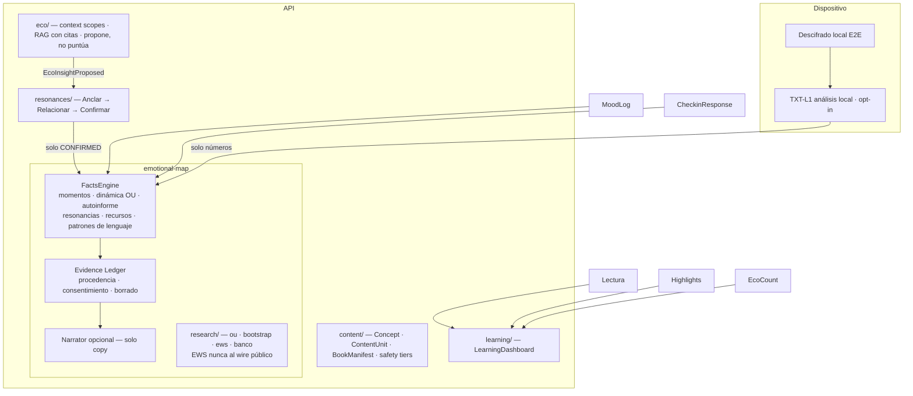

# Mapa Emocional V2 — arquitectura objetivo y programa de transformación

**Estado:** Fase H (Eco contextual · ARC-P1 propósito) · **Fecha:** 2026-07-12
**Decisión de producto (usuario, 2026-07-11):** el Mapa Emocional **se transforma, no se elimina**. La página "Tu Mapa Emocional" sigue siendo el centro del producto; cambia su semántica (fuentes explícitas, procedencia, gates honestos) y qué lo alimenta.

> La auditoría completa de Fase A (arquitectura verificada, fórmulas, contradicciones código↔investigación↔UI, mapa de privacidad) vive en el hilo de sesión y se resume aquí. Fuentes empíricas: [paper-1-results.md](../research/paper-1-results.md) · [emotional-map-benchmark.md](../research/emotional-map-benchmark.md) · [ADR 0007](../adr/0007-e2e-encryption-diario-eco.md).

---

## 1. Principios no negociables

1. **Aprendizaje ≠ psicología.** Lectura, minutos, rachas, capítulos, mensajes a Eco, highlights y annotations alimentan un **LearningDashboard**, nunca ejes emocionales. Matriz completa: [learning-vs-emotional-map.md](../product/learning-vs-emotional-map.md).
2. **Sin porcentaje global.** `pct` ("Comprensión emocional") no tiene interpretación defendible; V2 no lo expone (compat: `legacy.pct` oculto).
3. **Ningún LLM crea puntuaciones psicológicas.** Separación FactsEngine (hechos + procedencia + incertidumbre) → Narrator (solo copy, apagable sin alterar datos).
4. **Nada entra al mapa silenciosamente.** Highlight ≠ resonancia; resonancia requiere confirmación del usuario (ciclo ARC). Todo insight puede revisarse/corregirse/rechazarse/eliminarse y su fuente desactivarse.
5. **Procedencia obligatoria.** Cada insight: fuente, fecha, modelo (ID del [Model Registry](../research/emotional-map-model-registry.md)), N observaciones, incertidumbre, estado.
6. **No diagnóstico.** El flujo de crisis permanece 100 % separado del mapa (verificado: hoy ya lo está).
7. **EWS-R1 es research-only.** FP 6 % / sensibilidad 40 % (paper E5) — no dirige experiencia pública, nudges ni notificaciones. Flag: `EMOTIONAL_MAP_EWS_PUBLIC`.

## 2. Arquitectura objetivo

**Regla dura:** ninguna arista va de `learning/` a `FactsEngine`.

## 3. Estructura de la página (V2 — transforma, no elimina)

Secciones independientes en "Tu Mapa Emocional": **Mi momento** (autoinforme) · **Dinámica de mis registros** [Experimental, con timeline + banda ± + gaps + base del análisis] · **Cómo me describí** (check-ins, label "Autoinformado") · **Mis resonancias** (confirmadas) · **Recursos practicados** · **Patrones de lenguaje** (opt-in). El radar puede conservarse **solo** como "Resumen de tus respuestas" (dimensiones homogéneas del check-in, sin % global) — decisión L2 pendiente. Cada tarjeta abre un Evidence drawer (Por qué aparece esto / Fuente / Periodo / N / Método / [Corregir][Ocultar][Eliminar][Desactivar fuente]).

## 4. Gates de la dinámica afectiva (política pública)

| n registros | Se muestra                                                              |
| ----------- | ----------------------------------------------------------------------- |
| <8          | Historial básico; "aún no hay suficientes registros"                    |
| 8–29        | Nivel central aproximado · base limitada                                |
| 30–59       | Nivel + variación descriptiva · intervalos amplios                      |
| 60–99       | + tendencia; recuperación/persistencia solo internas                    |
| 100+        | Ritmo de retorno/persistencia con intervalo (θ identificable, paper E1) |
| cualquier n | EWS: research-only                                                      |

Estado tras Fase B' (L1 aplicada): `RECOVERY_MIN_OBS = 100` en el scoring — recuperación/persistencia se retienen hasta n=100 con nota honesta en la UI; "Confianza N %" fue reemplazado por la etiqueta de base de evidencia (`evidenceBaseLabel`: limitada <20 · moderada <100 · más sólida ≥100); el EWS quedó fuera del wire público (`EMOTIONAL_MAP_EWS_PUBLIC` default off, sigue corriendo interno para research/banco). Fase F alineó el gate de tendencia: bajo el contrato V2 la dirección up/down se retiene hasta `TREND_PUBLIC_MIN_OBS = 60` (el fit detrendado sigue corriendo — estabilidad/nivel no cambian); legacy conserva el comportamiento anterior hasta el flip del flag.

## 5. Fases

**B (✅ mergeada):** Model Registry + flags + contratos + tests de caracterización + FK cascade de `DiaryTextFeature`. Cero cambio público.
**B' (✅ mergeada — L1):** EWS fuera del wire · gate recuperación 20→100 · copy afectivo neutro descriptivo · landing sin claims falsos.
**C (✅ mergeada):** LearningDashboard resuelto sobre lo existente — **Evolución ES el LearningDashboard** (`EvolucionStats` ganó `conversacionesEco` + `marcasLectura`); el mapa dejó de presentar contadores de actividad como fuentes (MapFeed/feed mobile → puntero a Evolución); palanca `EMOTIONAL_MAP_V2` cableada en el scoring (engagement fuera de ejes, confianzas y payload del LLM cuando se encienda; default off).
**D (✅ mergeada):** opt-in TXT-L1 con borrado en cascada del consentimiento (decisión L4: `PrivacySettings.localTextAnalysis` default off · endpoint 403 sin opt-in · scoring ignora filas dormidas · opt-out borra derivados · consent card web/mobile) + Evidence lite (`dimension.evidence {modelId, n}` del Model Registry en el modal ⓘ). El Evidence Ledger persistido (tabla + corregir/ocultar/eliminar por insight) llega con ARC en Fase E; las secciones V2 completas, en Fase F.
**E (✅ mergeada):** ciclo ARC v1 — `Resonance` (confirmaciones explícitas «me resonó», idempotentes por concepto, eliminables) + catálogo curado `CHAPTER_CONCEPTS` en @psico/types (el content graph con tablas Concept/ContentUnit/BookManifest queda para cuando Author B2B lo justifique) + nudge post-subrayado en el lector + sección «Mis resonancias» en el mapa (web/mobile, con procedencia y borrado) + modelo ARC-C1: bajo `EMOTIONAL_MAP_V2`, conexión se alimenta EXCLUSIVAMENTE de resonancias confirmadas. `CONTENT_RESONANCE` default on (todo el ciclo es consentimiento explícito).
**F (✅ mergeada):** UI V2 web/mobile + L2 + L3. (a) **L3**: bajo `EMOTIONAL_MAP_V2` el LLM **jamás** produce puntuaciones (provider.score no se invoca; ejes interpretativos sin fuente medida → "Reuniendo datos"); nace el **Narrator NAR-L1** (`EMOTIONAL_MAP_NARRATOR`, default off) — copy sobre hechos ya calculados, apagable sin alterar datos. (b) **L2**: el radar sobrevive SOLO como «Resumen de tus respuestas» (3 ejes del check-in, "Autoinformado", sin % global). (c) **Wire V2**: marker `v2` + secciones `momento` / `lenguaje` (TXT-L1 descriptivo — ya no puntúa ejes) / `narrative`; `pct` queda en el wire por compat (cron de snapshots + blobs cacheados) pero la UI V2 nunca lo renderiza. (d) **Rollout server-driven**: el marker solo viaja con `EMOTIONAL_MAP_V2` on **y** `EMOTIONAL_MAP_LEGACY_UI` off — la ventana de dual-run sirve el contrato V2 bajo el layout legacy; los clientes ramifican por el response, sin envs de cliente. (e) Gate de tendencia a n=60 bajo V2 + modal ⓘ con copy V2.
**G (✅ mergeada):** el V2 es el producto. (a) **Defaults flipped**: `EMOTIONAL_MAP_V2` default **on** · `EMOTIONAL_MAP_LEGACY_UI` default **off** — encender el env `EMOTIONAL_MAP_V2=off` queda como palanca de rollback a nivel de datos (el scoring legacy sobrevive solo para eso). (b) **Layout legacy borrado**: MapStage/MapDims (web) + la rama stage/dims del mapa mobile + el radar 6-ejes/% del mini-map de Inicio; los clientes renderizan la UI V2 siempre (null-tolerant ante un rollback de datos). (c) **Copy-ratchet en CERO**: `KNOWN_VIOLATIONS = {}` — cualquier término prohibido en una superficie pública del mapa rompe el build, sin excusa legacy. (d) **Evolución**: la serie «Comprensión emocional» (pct) fue reemplazada por **«Cobertura de tu mapa»** — `EmotionalMapSnapshot.coverage` (migración aditiva), el cron escribe ambas, los charts web/mobile trazan cobertura (cuánta señal respalda el mapa, no un puntaje psicológico) y saltan las filas pre-Fase-G sin fabricar datos. `pct` sigue en el wire/tabla solo como columna histórica + rollback.
**H (✅ mergeada):** Eco contextual + ARC-P1 (Propósito). (a) **Scope de lectura**: los mensajes desde el dock/sheet del lector llevan `{bookSlug, chapterOrder}` — el RAG se acota a ese libro, el prompt se ancla al tema del capítulo, y Eco **propone** el concepto del capítulo como resonancia confirmable (evento `done.resonanceOffer`; solo un tap del usuario lo persiste con `source: "eco"`). (b) **Citas deterministas**: `done.sources` lista los pasajes libro/capítulo realmente recuperados (nunca claims del LLM) — el cliente los muestra como «contexto consultado». (c) **ARC-P1 → Propósito**: `Resonance.important` (toggle ⭐ en «Mis resonancias» + `PATCH /api/resonances/:id`); bajo `EMOTIONAL_MAP_V2`, Propósito = temas importantes distintos / 3 (satura), «Medido», evidencia `{ARC-P1, n}`. Cierra el último eje que reunía datos bajo V2.
**I/J:** media multi-modal + safety tiers por obra.

**Migración sin inferencia retrospectiva:** highlights siguen siendo highlights; mood logs → Momentos; check-ins → Autoinforme; text features → patrones experimentales. Se ofrece "Revisar antiguas marcas" para confirmar resonancias manualmente. Dual-run comparando contratos, nunca "mejor score".

## 6. Decisiones abiertas (requieren aprobación)

| #   | Decisión                                                          | Recomendación                                               | Estado                                                                                                                                                                                                                                                     |
| --- | ----------------------------------------------------------------- | ----------------------------------------------------------- | ---------------------------------------------------------------------------------------------------------------------------------------------------------------------------------------------------------------------------------------------------------- |
| L1  | Hotfix B' (EWS off + gate 100 + copy neutro)                      | Sí — riesgo ético más alto, fix barato                      | ✅ aprobada e implementada (Fase B')                                                                                                                                                                                                                       |
| L2  | Radar: solo autoinforme ("Resumen de tus respuestas") vs quitarlo | Conservarlo restringido (mapa se transforma, no se elimina) | ✅ aprobada e implementada (Fase F): radar = 3 ejes del check-in, "Autoinformado", sin % global                                                                                                                                                            |
| L3  | Provider LLM → Narrator (solo copy) vs eliminar                   | Narrator opcional apagable                                  | ✅ aprobada e implementada (Fase F): score jamás bajo V2 · NAR-L1 con `EMOTIONAL_MAP_NARRATOR` **default on desde 2026-07-12** (encendido; sigue apagable — `=off` es el rollback, y cualquier fallo de narrate() cae a narrative null sin romper el mapa) |
| L4  | Opt-in análisis local                                             | Default off + pantalla de consentimiento                    | ✅ aprobada e implementada (Fase D): default off · gate 403 server-side · borrado on opt-out · consent card en Seguridad                                                                                                                                   |
| L5  | Naming                                                            | Mantener **Eco** / **Psico Platform**                       | ✅ implícita                                                                                                                                                                                                                                               |
| L6  | Alcance Fase C                                                    | Endpoint + página LearningDashboard propios                 | ✅ resuelta (Fase C): Evolución ES el LearningDashboard — página y endpoint ya existían; se completaron con los contadores que faltaban en vez de duplicar superficie                                                                                      |
