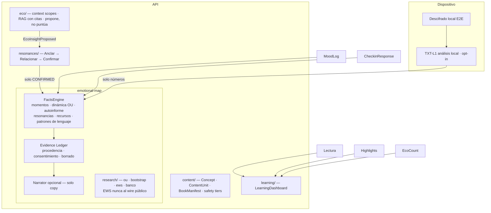

# Mapa Emocional V2 — arquitectura objetivo y programa de transformación

**Estado:** Fase B (contratos) · **Fecha:** 2026-07-11
**Decisión de producto (usuario, 2026-07-11):** el Mapa Emocional **se transforma, no se elimina**. La página "Tu Mapa Emocional" sigue siendo el centro del producto; cambia su semántica (fuentes explícitas, procedencia, gates honestos) y qué lo alimenta.

> La auditoría completa de Fase A (arquitectura verificada, fórmulas, contradicciones código↔investigación↔UI, mapa de privacidad) vive en el hilo de sesión y se resume aquí. Fuentes empíricas: [paper-1-results.md](../research/paper-1-results.md) · [emotional-map-benchmark.md](../research/emotional-map-benchmark.md) · [ADR 0007](../adr/0007-e2e-encryption-diario-eco.md).

---

## 1. Principios no negociables

1. **Aprendizaje ≠ psicología.** Lectura, minutos, rachas, capítulos, mensajes a Eco, highlights y annotations alimentan un **LearningDashboard**, nunca ejes emocionales. Matriz completa: [learning-vs-emotional-map.md](../product/learning-vs-emotional-map.md).
2. **Sin porcentaje global.** `pct` ("Comprensión emocional") no tiene interpretación defendible; V2 no lo expone (compat: `legacy.pct` oculto).
3. **Ningún LLM crea puntuaciones psicológicas.** Separación FactsEngine (hechos + procedencia + incertidumbre) → Narrator (solo copy, apagable sin alterar datos).
4. **Nada entra al mapa silenciosamente.** Highlight ≠ resonancia; resonancia requiere confirmación del usuario (ciclo ARC). Todo insight puede revisarse/corregirse/rechazarse/eliminarse y su fuente desactivarse.
5. **Procedencia obligatoria.** Cada insight: fuente, fecha, modelo (ID del [Model Registry](../research/emotional-map-model-registry.md)), N observaciones, incertidumbre, estado.
6. **No diagnóstico.** El flujo de crisis permanece 100 % separado del mapa (verificado: hoy ya lo está).
7. **EWS-R1 es research-only.** FP 6 % / sensibilidad 40 % (paper E5) — no dirige experiencia pública, nudges ni notificaciones. Flag: `EMOTIONAL_MAP_EWS_PUBLIC`.

## 2. Arquitectura objetivo

**Regla dura:** ninguna arista va de `learning/` a `FactsEngine`.

## 3. Estructura de la página (V2 — transforma, no elimina)

Secciones independientes en "Tu Mapa Emocional": **Mi momento** (autoinforme) · **Dinámica de mis registros** [Experimental, con timeline + banda ± + gaps + base del análisis] · **Cómo me describí** (check-ins, label "Autoinformado") · **Mis resonancias** (confirmadas) · **Recursos practicados** · **Patrones de lenguaje** (opt-in). El radar puede conservarse **solo** como "Resumen de tus respuestas" (dimensiones homogéneas del check-in, sin % global) — decisión L2 pendiente. Cada tarjeta abre un Evidence drawer (Por qué aparece esto / Fuente / Periodo / N / Método / [Corregir][Ocultar][Eliminar][Desactivar fuente]).

## 4. Gates de la dinámica afectiva (política pública)

| n registros | Se muestra                                                              |
| ----------- | ----------------------------------------------------------------------- |
| <8          | Historial básico; "aún no hay suficientes registros"                    |
| 8–29        | Nivel central aproximado · base limitada                                |
| 30–59       | Nivel + variación descriptiva · intervalos amplios                      |
| 60–99       | + tendencia; recuperación/persistencia solo internas                    |
| 100+        | Ritmo de retorno/persistencia con intervalo (θ identificable, paper E1) |
| cualquier n | EWS: research-only                                                      |

Estado tras Fase B' (L1 aplicada): `RECOVERY_MIN_OBS = 100` en el scoring — recuperación/persistencia se retienen hasta n=100 con nota honesta en la UI; "Confianza N %" fue reemplazado por la etiqueta de base de evidencia (`evidenceBaseLabel`: limitada <20 · moderada <100 · más sólida ≥100); el EWS quedó fuera del wire público (`EMOTIONAL_MAP_EWS_PUBLIC` default off, sigue corriendo interno para research/banco). Pendiente del gate: el bloque de tendencia aún se muestra desde n≈8 en vez de n=60 (se alinea en Fase F con la UI V2).

## 5. Fases

**B (✅ mergeada):** Model Registry + flags + contratos + tests de caracterización + FK cascade de `DiaryTextFeature`. Cero cambio público.
**B' (✅ mergeada — L1):** EWS fuera del wire · gate recuperación 20→100 · copy afectivo neutro descriptivo · landing sin claims falsos.
**C (✅ mergeada):** LearningDashboard resuelto sobre lo existente — **Evolución ES el LearningDashboard** (`EvolucionStats` ganó `conversacionesEco` + `marcasLectura`); el mapa dejó de presentar contadores de actividad como fuentes (MapFeed/feed mobile → puntero a Evolución); palanca `EMOTIONAL_MAP_V2` cableada en el scoring (engagement fuera de ejes, confianzas y payload del LLM cuando se encienda; default off).
**D:** Evidence Ledger + secciones V2 + opt-in TXT-L1 + borrado/consentimiento.
**E:** Content graph (Concept/ContentUnit/BookManifest) + ciclo ARC (`CONTENT_RESONANCE`).
**F/G:** UI V2 web/mobile (legacy tras `EMOTIONAL_MAP_LEGACY_UI`).
**H:** Eco contextual (scopes + citas + propuestas confirmables).
**I/J:** media multi-modal + safety tiers por obra.

**Migración sin inferencia retrospectiva:** highlights siguen siendo highlights; mood logs → Momentos; check-ins → Autoinforme; text features → patrones experimentales. Se ofrece "Revisar antiguas marcas" para confirmar resonancias manualmente. Dual-run comparando contratos, nunca "mejor score".

## 6. Decisiones abiertas (requieren aprobación)

| #   | Decisión                                                          | Recomendación                                               | Estado                                                                                                                                                                |
| --- | ----------------------------------------------------------------- | ----------------------------------------------------------- | --------------------------------------------------------------------------------------------------------------------------------------------------------------------- |
| L1  | Hotfix B' (EWS off + gate 100 + copy neutro)                      | Sí — riesgo ético más alto, fix barato                      | ✅ aprobada e implementada (Fase B')                                                                                                                                  |
| L2  | Radar: solo autoinforme ("Resumen de tus respuestas") vs quitarlo | Conservarlo restringido (mapa se transforma, no se elimina) | ⬜ pendiente                                                                                                                                                          |
| L3  | Provider LLM → Narrator (solo copy) vs eliminar                   | Narrator opcional apagable                                  | ⬜ pendiente                                                                                                                                                          |
| L4  | Opt-in análisis local                                             | Default off + pantalla de consentimiento                    | ⬜ pendiente                                                                                                                                                          |
| L5  | Naming                                                            | Mantener **Eco** / **Psico Platform**                       | ✅ implícita                                                                                                                                                          |
| L6  | Alcance Fase C                                                    | Endpoint + página LearningDashboard propios                 | ✅ resuelta (Fase C): Evolución ES el LearningDashboard — página y endpoint ya existían; se completaron con los contadores que faltaban en vez de duplicar superficie |
