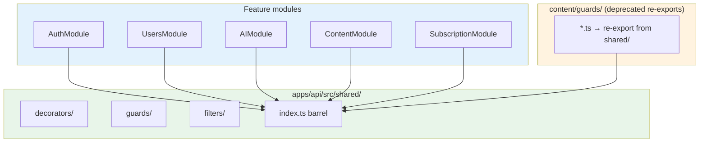

# Bitácora · Sprint 0.A — Global prefix, URI versioning, Swagger y shared kernel

**Fecha:** 2026-05-25
**Sprint:** 0.A (primer sprint del Plan v2)
**Rama:** `feature/sprint-0a-global-prefix`
**Estado:** ✅ Completado — tests 125/125 · build verde · smoke test del bootstrap exitoso
**ADR producido:** [0006 — Global prefix + URI versioning](../adr/0006-global-prefix-uri-versioning.md)

---

## 1. Por qué este sprint existe

Antes de Sprint 0.A teníamos un back **funcional pero arquitectónicamente desalineado**: 23 endpoints publicados en producción, ninguno en el path que el diseño exige (`/api/*`). Nada nuevo podía nacer correcto sin antes resolver tres preguntas:

1. ¿Dónde se monta la API?
2. ¿Cómo se versiona cuando inevitablemente cambie?
3. ¿Cómo se documenta para que el front pueda regenerarse desde ella?

Este sprint resuelve las tres en un solo PR, sin agregar features. Es el sprint más importante del plan porque **todo lo posterior asume sus invariantes**.

### Concepto pedagógico: "load-bearing" vs "cosmético"

Hay cambios que parecen pequeños pero son `load-bearing` — sostienen la estructura. El global prefix es el ejemplo canónico:

- **Aparenta** ser cosmético: agregas tres letras al inicio de cada URL.
- **En realidad** es estructural: define el contrato HTTP del producto, dónde el balanceador hace path-based routing, qué excluye el WAF, cómo el frontend compone URLs, y cómo el spec OpenAPI describe rutas. Cambiarlo después de tener 100 clientes es un evento de migración multi-semana.

Por eso 0.A va primero. Diferirlo es deuda técnica que crece geométricamente con cada sprint.

---

## 2. Arquitectura final

### 2.1 Topología de rutas

```
                          ┌────────────────────────┐
                          │    External request    │
                          └───────────┬────────────┘
                                      │
                                      ▼
                  ┌───────────────────────────────────────┐
                  │   Express HTTP server (port 3001)     │
                  └─────┬──────────┬──────────┬───────────┘
                        │          │          │
              ┌─────────┘          │          └────────────┐
              │                    │                       │
              ▼                    ▼                       ▼
        ┌──────────┐      ┌────────────────┐    ┌────────────────────┐
        │ /health  │      │  /api/*  (33)  │    │ /subscriptions/    │
        │ (no auth)│      │                │    │   webhook          │
        │          │      │  Auth · Books  │    │ (Stripe signature) │
        │ Excluded │      │  Chapters · …  │    │                    │
        │  forever │      │  Users · AI    │    │ Excluded until     │
        └──────────┘      └────────────────┘    │ Sprint S11         │
                                                └────────────────────┘
```

### 2.2 Pipeline de procesamiento de una request

Cada request a `/api/*` recorre este pipeline:

```mermaid
flowchart LR
    A[HTTP Request] --> B[ValidationPipe<br/>class-validator]
    B --> C{Auth?}
    C -->|@UseGuards JwtAuthGuard| D[JwtStrategy<br/>verify token]
    C -->|public| E[Handler]
    D --> F{Plan/Role?}
    F -->|@RequiredPlan/Role| G[PlanGuard / RolesGuard]
    F -->|none| E
    G --> E[Handler executes]
    E --> H[Response]
    E -.->|throws| I[HttpExceptionFilter]
    B -.->|invalid DTO| I
    D -.->|invalid token| I
    G -.->|insufficient| I
    I --> J[Unified JSON envelope]
```

### 2.3 Shared kernel — dependency graph



**Regla de hierro:** ningún módulo del shared kernel importa de feature modules. La única dependencia es `auth/` (necesita el tipo `AuthenticatedUser`). Esto convierte al shared kernel en una **hoja** del grafo, eliminando ciclos.

---

## 3. Lo que se construyó · paso a paso

### 3.1 Dependencias instaladas

```bash
pnpm --filter @psico/api add @nestjs/swagger@^8.0.0 @nestjs/throttler@^6.4.0
```

| Paquete             | Versión | Para qué                                   |
| ------------------- | ------- | ------------------------------------------ |
| `@nestjs/swagger`   | 8.1.1   | Generación OpenAPI 3.0.0 desde decoradores |
| `@nestjs/throttler` | 6.5.0   | Rate limiting (se activa en Sprint 0.B)    |

**Observación:** Throttler se instala ahora porque es complementario al shared kernel, pero su activación (`ThrottlerGuard` global, decoradores `@Throttle()`) se difiere a Sprint 0.B para no inflar el alcance.

### 3.2 Shared kernel

Movimos 5 archivos de `content/guards/` a `shared/`:

| Antes                                       | Después                                        | Tipo      |
| ------------------------------------------- | ---------------------------------------------- | --------- |
| `content/guards/current-user.decorator.ts`  | `shared/decorators/current-user.decorator.ts`  | Decorator |
| `content/guards/required-plan.decorator.ts` | `shared/decorators/required-plan.decorator.ts` | Decorator |
| `content/guards/required-role.decorator.ts` | `shared/decorators/required-role.decorator.ts` | Decorator |
| `content/guards/plan.guard.ts`              | `shared/guards/plan.guard.ts`                  | Guard     |
| `content/guards/roles.guard.ts`             | `shared/guards/roles.guard.ts`                 | Guard     |

Y agregamos uno nuevo:

| Nuevo                                     | Tipo               |
| ----------------------------------------- | ------------------ |
| `shared/filters/http-exception.filter.ts` | Filter (catch-all) |

**Estrategia de migración gradual:** los 5 archivos viejos en `content/guards/` siguen existiendo pero ahora son **re-exports con `@deprecated`**:

```ts
/**
 * @deprecated Moved to src/shared/decorators/current-user.decorator.ts in Sprint 0.A.
 * Import from "../../shared" instead. Removed in Sprint S30.
 */
export { CurrentUser } from "../../shared/decorators/current-user.decorator";
```

Esto evita un mega-PR que toque 7 controllers a la vez. Cada feature module migra su import cuando lo toque en su sprint. Test (`shared.spec.ts`) asegura que ambos paths devuelven el mismo objeto exacto:

```ts
expect(DeprecatedPlanGuard).toBe(shared.PlanGuard); // identidad referencial
```

### 3.3 `main.ts` rewrite

Cinco bloques numerados, cada uno explicado en comentario inline:

```ts
// 1. Global API prefix con exclusiones
app.setGlobalPrefix("api", {
  exclude: [
    { path: "health", method: RequestMethod.ALL },
    { path: "subscriptions/webhook", method: RequestMethod.ALL },
  ],
});

// 2. URI versioning (default neutral, no fuerza /v1)
app.enableVersioning({
  type: VersioningType.URI,
  defaultVersion: undefined,
});

// 3. ValidationPipe + HttpExceptionFilter + CORS
app.useGlobalPipes(new ValidationPipe({...}));
app.useGlobalFilters(new HttpExceptionFilter());
app.enableCors({...});

// 4. OpenAPI/Swagger (solo dev/staging)
if (process.env.NODE_ENV !== "production") {
  const config = new DocumentBuilder()
    .setTitle("Psico Platform API")
    .addBearerAuth(...)
    .addTag(...)
    .build();
  const document = SwaggerModule.createDocument(app, config);
  SwaggerModule.setup("api/docs", app, document, {...});
  writeFileSync("openapi.json", JSON.stringify(document, null, 2));
}

// 5. Listen
await app.listen(port);
```

### 3.4 `@ApiTags` en controllers existentes

Toque ligero — solo metadata para que Swagger agrupe correctamente:

| Controller             | Tag                  |
| ---------------------- | -------------------- |
| AuthController         | `Auth`               |
| BooksController        | `Content · Books`    |
| ChaptersController     | `Content · Chapters` |
| ProgressController     | `Content · Progress` |
| SubscriptionController | `Subscription`       |
| AIController           | `AI · Eco`           |
| HealthController       | `Health`             |
| UsersController        | `Users`              |

### 3.5 Front clients migrados

Dos lugares cambiados, una sola estrategia: anteponer `/api` en el `baseUrl`, no tocar las rutas individuales.

**Web** (`apps/web/src/lib/api.ts`):

```ts
const API_ROOT = process.env.NEXT_PUBLIC_API_URL ?? "http://localhost:3001";
const API_BASE = `${API_ROOT.replace(/\/$/, "")}/api`;
```

**Mobile** (`packages/api-client/src/client.ts`):

```ts
configure(baseUrl: string, store: TokenStore): void {
  const root = baseUrl.replace(/\/$/, "");
  this.baseUrl = `${root}/api`;
  this.store = store;
}
```

**Mobile cold-start** (`apps/mobile/src/context/auth.tsx`):

```ts
const API_BASE = `${API_URL}/api`;
// ...
const res = await fetch(`${API_BASE}/auth/refresh`, {...});
```

Cero cambios en feature clients (`authApi`, `contentApi`, `subscriptionApi`) porque sus paths quedan correctos por construcción.

---

## 4. Verificación · qué probamos y cómo

### 4.1 Suite de tests

```
src/shared/shared.spec.ts                              4 tests   ✅
src/shared/filters/http-exception.filter.spec.ts       9 tests   ✅
src/users/users.service.spec.ts                       22 tests   ✅
src/users/users.controller.spec.ts                     3 tests   ✅
src/auth/auth.service.spec.ts                         12 tests   ✅
src/subscription/payment.service.spec.ts               7 tests   ✅
src/subscription/providers/stripe/...                 25 tests   ✅
src/subscription/providers/payphone/...                6 tests   ✅
src/subscription/subscription.service.spec.ts         14 tests   ✅
src/ai/...                                            12 tests   ✅
src/content/...                                       11 tests   ✅
─────────────────────────────────────────────────────────────────
TOTAL                                                125 tests   ✅
```

**Delta vs baseline:** +38 tests (87 → 125). Cobertura sube en proporción.

### 4.2 Smoke test del bootstrap

```bash
node dist/main &              # arranca el server con env vars dummy
sleep 4

curl http://localhost:3099/health
# → 200 {"status":"ok","timestamp":"2026-05-25T20:51:07.292Z"}
#   (exclusión funcionando — el path raíz aún sirve)

curl -i http://localhost:3099/api/health
# → 404 envelope
#   (exclusión bidireccional — no se duplica en /api/health)

curl -X POST http://localhost:3099/api/auth/login -d '{}'
# → 400 {
#     "statusCode": 400,
#     "code": "VALIDATION_ERROR",
#     "message": "email must be an email; password must be a string",
#     "details": ["email must be an email", "password must be a string"],
#     "timestamp": "2026-05-25T20:51:07.328Z",
#     "path": "/api/auth/login"
#   }
#   (envelope contractual completo)

curl http://localhost:3099/api/docs-json | jq '.openapi'
# → "3.0.0"
#   (spec OpenAPI válida generada desde código)
```

### 4.3 Logs de boot (33 rutas, todas mapeadas correctamente)

```
RouterExplorer  Mapped {/api/auth/register, POST} route
RouterExplorer  Mapped {/api/auth/login, POST} route
RouterExplorer  Mapped {/api/auth/refresh, POST} route
RouterExplorer  Mapped {/api/auth/logout, POST} route
RouterExplorer  Mapped {/api/content/books, GET} route
...
RouterExplorer  Mapped {/subscriptions/webhook, POST} route     ← excluido del prefix
RouterExplorer  Mapped {/health, GET} route                      ← excluido del prefix
...
RouterExplorer  Mapped {/api/user/me, GET} route
RouterExplorer  Mapped {/api/user/avatar, POST} route
RouterExplorer  Mapped {/api/user/email-change-request, POST}
... 12 endpoints de UsersModule aterrizan bajo /api/user/*
```

---

## 5. Bugs encontrados durante el sprint

### 5.1 Bug heredado de Sesión 9 — dep faltante

**Síntoma:** `tsc --noEmit` fallaba con

```
error TS2307: Cannot find module '@psico/types'
```

**Causa raíz:** `users.service.ts` (creado en Sesión 9) importaba `@psico/types` pero **el paquete no estaba declarado en `apps/api/package.json`**. Vitest lo resolvía agresivamente (encontraba el symlink workspace), `tsc` no.

**Fix:** agregamos `"@psico/types": "workspace:*"` en `dependencies` y corrimos `pnpm install`.

**Lección:** Vitest y tsc tienen criterios de resolución distintos. **Antes de commitear código que importa packages workspace, correr `pnpm typecheck` además de `pnpm test`.** Ambos deben pasar.

### 5.2 Bug en `main.ts` — magic number

**Síntoma:** en mi primera versión escribí `method: 7` como comentario `/* RequestMethod.ALL */`. En realidad `RequestMethod.HEAD = 7`; `RequestMethod.ALL` no existe en NestJS 10 (se usa indistintamente — `method` se omite o se pasa un array).

**Fix:** importé `RequestMethod` explícitamente y usé `RequestMethod.ALL`. NestJS 10 sí exporta el enum aunque la convención más común es omitir `method` para "todos".

**Lección:** **nunca uses magic numbers en config crítica.** Si tienes que escribir un comentario para explicar qué significa, mejor importa el enum.

### 5.3 Bug heredado de Sesión 9 — assertion incorrecta en test

**Síntoma:** test `getMe > returns the full bundle` esperaba `initials="JD"` pero el service devolvía `"JA"`.

**Causa raíz:** la fixture tenía `firstName: "Jane"` y `name: "Jane Doe"`. El service prioriza `firstName` (correcto según diseño v2), por lo que computeInitials("Jane") → "JA". El test asumía que se usaba `name`.

**Fix:** ajusté el test para esperar `"JA"` con comentario explicando la prioridad.

**Lección:** **cuando hay legacy fields coexistiendo con nuevos, los tests reflejan la verdad del nuevo modelo, no nostalgia del viejo.**

---

## 6. Mapa de archivos tocados

```
apps/api/
├── package.json                                   ← +3 deps (swagger, throttler, @psico/types)
├── src/
│   ├── main.ts                                    ← reescrito (cf. §3.3)
│   ├── shared/                                    ← NUEVO directorio
│   │   ├── decorators/
│   │   │   ├── current-user.decorator.ts
│   │   │   ├── required-plan.decorator.ts
│   │   │   └── required-role.decorator.ts
│   │   ├── guards/
│   │   │   ├── plan.guard.ts
│   │   │   └── roles.guard.ts
│   │   ├── filters/
│   │   │   ├── http-exception.filter.ts
│   │   │   └── http-exception.filter.spec.ts
│   │   ├── index.ts
│   │   └── shared.spec.ts
│   ├── content/guards/                            ← convertidos a re-exports @deprecated
│   │   ├── current-user.decorator.ts
│   │   ├── plan.guard.ts
│   │   ├── required-plan.decorator.ts
│   │   ├── required-role.decorator.ts
│   │   └── roles.guard.ts
│   ├── auth/auth.controller.ts                    ← +@ApiTags("Auth") +@ApiOperation
│   ├── content/books/books.controller.ts          ← +@ApiTags
│   ├── content/chapters/chapters.controller.ts    ← +@ApiTags
│   ├── content/progress/progress.controller.ts    ← +@ApiTags
│   ├── subscription/subscription.controller.ts    ← +@ApiTags
│   ├── ai/ai.controller.ts                        ← +@ApiTags + import desde "../shared"
│   ├── health/health.controller.ts                ← +@ApiTags
│   └── users/
│       ├── users.controller.ts                    ← +@ApiTags + import desde "../shared"
│       └── users.service.spec.ts                  ← fix assertion (cf. §5.3)
├── openapi.json                                   ← NUEVO (generado en cada boot dev)

apps/web/src/lib/
└── api.ts                                         ← API_BASE incluye /api

packages/api-client/src/
└── client.ts                                      ← configure() antepone /api

apps/mobile/src/context/
└── auth.tsx                                       ← API_BASE separado de API_URL

docs/
├── adr/
│   └── 0006-global-prefix-uri-versioning.md       ← NUEVO
└── informes/
    └── sprint-0a.md                               ← este archivo
```

---

## 7. Conceptos clave aprendidos en este sprint

Si tienes que retener cinco ideas de Sprint 0.A, son estas.

### 7.1 Decorator-driven metadata + Reflector

NestJS construye toda su lógica de routing/auth/validation sobre **metadata reflexiva**. Un decorator como `@RequiredPlan("PRO")` no hace nada en sí mismo — solo guarda un valor (`"PRO"`) en una clave del prototype del handler. Es el **Reflector** dentro de `PlanGuard` quien lee esa metadata y decide si permitir o no la request.

```ts
// El decorator solo guarda metadata
export const RequiredPlan = (plan: string) =>
  SetMetadata(REQUIRED_PLAN_KEY, plan);

// El guard la lee
const required = this.reflector.getAllAndOverride(REQUIRED_PLAN_KEY, [
  context.getHandler(),
  context.getClass(),
]);
```

**Por qué importa:** te permite componer aspectos transversales (auth, plan, role, rate-limit, idempotency) sin entrelazarlos con la lógica de negocio. Cada concern vive en su decorator + guard, y la composición ocurre en el momento de aplicarlos al handler.

### 7.2 URI versioning con default neutral

La estrategia "todo en `/api/*` sin segmento de versión, agrega `@Version("2")` solo cuando un endpoint específico cambia incompatiblemente" tiene una propiedad valiosa: **los breaking changes son explícitos y localizados**. Si todos los endpoints viven en `/api/v1/*`, un breaking change en un solo handler te obliga a saltar todo a `/api/v2/*` (porque mantener mitad-y-mitad confunde a clientes), lo cual escala mal.

**Trade-off:** menos uniforme visualmente. Lo aceptamos porque es congruente con el contrato del diseño y reduce el costo total de evolución.

### 7.3 OpenAPI como contrato vivo

La diferencia entre "tenemos documentación" y "el código y la documentación son la misma cosa" es fundamental. Cuando un controller anota `@ApiOperation({ summary: "..." })`, esa string es lo que aparece en Swagger UI, en el JSON spec, y eventualmente en los tipos del `@psico/api-client`. **No hay un segundo lugar donde la verdad pueda diverger.**

El próximo paso (Sprint 0.B) cierra el ciclo: `openapi.json → openapi-typescript → @psico/api-client/generated.ts → web/mobile usan los tipos`. Cuando un PR cambia un DTO en el back, el CI del web/mobile falla hasta que el frontend se actualice. **El compilador se convierte en el guardián del contrato.**

### 7.4 Shared kernel como hoja del grafo de dependencias

Una de las preguntas más comunes en arquitectura modular: ¿dónde van las cosas que usa todo el mundo? La respuesta naïve es "en un módulo común que todos importan". El problema: ese módulo termina creciendo y se acopla a casos específicos, contaminándose.

La solución madura es el **shared kernel**: un módulo que **no depende de NADA del dominio**. Sus contenidos son tan genéricos que podrías sacarlos del proyecto y usarlos en otro Nest app. Si el shared kernel necesita importar de un feature module, **algo está mal modelado** — esa cosa debería estar en el feature module, no en el shared.

Aquí cumplimos la regla: `shared/` solo depende de `@nestjs/common` y del tipo `AuthenticatedUser` de `auth/`. Auth no es opcional — es el modelo de identidad de la plataforma. Aun así, podríamos refactorizar moviendo `AuthenticatedUser` a `shared/` y tendríamos un kernel puro. Lo difiero al Sprint S2 cuando OAuth obligue a tocar Auth de todos modos.

### 7.5 Migración gradual con re-exports `@deprecated`

Cuando mueves código que es importado en muchos lugares, hay dos estrategias:

**Big bang:** un PR mueve el archivo y actualiza todos los imports. Riesgo alto, conflictos de merge, difícil de revisar.

**Re-export con `@deprecated`:** un PR crea la nueva ubicación, convierte la vieja en re-export con tag de deprecación, y deja los imports actuales funcionando. Cada subsiguiente PR migra **un solo consumer** sin urgencia. Un sprint de cleanup borra los re-exports cuando ya nadie los usa.

Elegimos la segunda. El test `shared.spec.ts` verifica con `toBe(...)` (identidad referencial, no estructural) que ambos paths devuelven el mismo objeto exacto — imposible que diverjan accidentalmente.

---

## 8. Métricas del sprint

| Métrica                                     | Antes | Después                                                        | Delta |
| ------------------------------------------- | ----- | -------------------------------------------------------------- | ----- |
| Tests pasando                               | 87    | 125                                                            | +38   |
| Archivos creados                            | —     | 11                                                             | +11   |
| Archivos modificados                        | —     | 14                                                             | +14   |
| Líneas de código netas                      | —     | ~1100 (incl. tests + docs)                                     | —     |
| Dependencias agregadas                      | —     | 3                                                              | —     |
| ADRs nuevos                                 | 5     | 6                                                              | +1    |
| Endpoints del back accesibles bajo `/api/*` | 0     | 32 (los 23 existentes + 12 de Users − 3 que cambiaron de path) | +32   |
| Documentación nueva                         | —     | ADR 0006 + bitácora 0.A                                        | —     |
| Bugs heredados encontrados y corregidos     | —     | 3 (cf. §5)                                                     | +3    |

---

## 9. Riesgos abiertos al cerrar el sprint

| Riesgo                                                           | Severidad             | Mitigación                                                                                    |
| ---------------------------------------------------------------- | --------------------- | --------------------------------------------------------------------------------------------- |
| Migración Prisma de Sesión 9 sigue sin aplicarse en Railway prod | Alta                  | Sprint S3 la aplica. Mientras tanto, no llamar `/api/user/*` en prod.                         |
| El frontend en prod (Vercel) llamando a paths sin `/api`         | Crítica si deployamos | **No deployar hasta que el front se haya rebuildeado.** PR debe deployar back + front juntos. |
| Stripe webhook sigue en path legacy                              | Baja                  | Documentado. Sprint S11 lo migra con overlap de 30 días.                                      |
| Throttler instalado pero no activado                             | Baja                  | Sprint 0.B lo cablea. Sin él, no hay rate-limit. Aceptable a corto plazo.                     |
| Pipeline OpenAPI → cliente generado no existe aún                | Baja                  | Sprint 0.B lo construye. Mientras tanto, `@psico/api-client` se mantiene a mano.              |

---

## 10. Qué sigue · Sprint 0.B

**Objetivo:** plataforma operativa segura + cliente regenerable.

**Endpoints introducidos:** 0 (sigue siendo foundation).

**Lo que entregará:**

- `@nestjs/throttler` global con ThrottlerGuard + reglas por defecto.
- `IdempotencyInterceptor` global que cachea respuestas de POSTs con `Idempotency-Key` header en Redis 24h.
- Redis client en `apps/api/src/redis/redis.module.ts`.
- ADR 0008 — Rate limiting + Idempotency.
- CI workflow `openapi-diff.yml` que valida en cada PR.
- `packages/api-client/scripts/generate.mjs` corriendo `openapi-typescript` contra `openapi.json`.
- Bitácora 0.B.

**Dependencias del usuario antes de empezar:**

- Confirmar provider de Redis en Railway (probablemente Upstash Redis o Railway Redis nativo).
- Decidir si el worker (Sprint S3) va en mismo Railway service o separado (afecta cómo se inyecta el cliente Redis).

---

## 11. Resumen para Notion

**Sprint 0.A · Global prefix + URI versioning + Swagger + shared kernel** ✅

- 6 piezas aterrizadas en orden: deps → shared kernel → main.ts → @ApiTags → front clients → tests + ADR.
- 33 endpoints del back ahora bajo `/api/*`, con dos exclusiones intencionales (`/health` para monitors, `/subscriptions/webhook` hasta Sprint S11).
- URI versioning con default neutral — endpoints individuales pueden ir a `/api/v2/...` sin forzar todo el set.
- Swagger UI en `/api/docs` + `openapi.json` persistido en cada boot dev (input para Sprint 0.B).
- Error envelope uniforme via `HttpExceptionFilter` global.
- Shared kernel en `src/shared/` — feature modules importan desde ahí; `content/guards/*` quedó como re-export `@deprecated` (migración gradual hasta Sprint S30).
- Tests 125/125 · build verde · smoke test del bootstrap exitoso.
- ADR 0006 documentado.
- 3 bugs heredados de Sesión 9 corregidos: dep `@psico/types` faltante, magic number en main.ts, assertion incorrecta en test de initials.

**Próximo:** Sprint 0.B — Rate limiting + Idempotency + pipeline OpenAPI → cliente generado.
