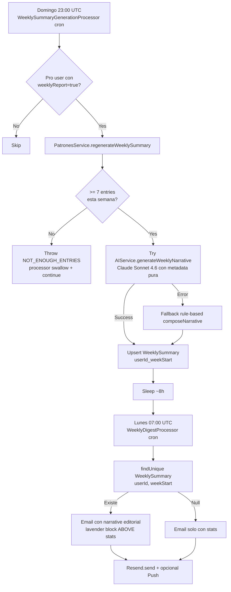

# Sprint S46 — Auto-generate WeeklySummary (cierre del loop S38/S44/S45)

**Rama sugerida:** `feature/sprint-46-auto-weekly-summary`
**Tests:** 392 API + 34 crypto (384 → 392, +8 nuevos · 1 skipped sentinel).

---

## 1. Scope

Cierra el bucle de retention que arrancó en S38 y S44:

- **S38** — `PatronesService.regenerateWeeklySummary` genera narrative LLM-backed.
- **S44** — `WeeklyDigestProcessor` envía email digest los lunes 07:00 UTC.
- **S45** — Digest **lee** WeeklySummary y lo incrusta en el email **si existe**.
- **S46** — **GENERA** WeeklySummary los domingos 23:00 UTC para que cuando el digest del lunes lo busque, lo encuentre.

Antes de este sprint, la fila `WeeklySummary` solo existía si un Pro user manualmente clickeaba "Regenerar" en `/dashboard/patrones`. El digest mandaba el editorial al cuerpo del email casi nunca. Después de este sprint, todo Pro user con `weeklyReport=true` recibe el editorial automáticamente.

Sin tocar:

- Schema (no nuevos modelos, no migración).
- Endpoints HTTP (sigue siendo cron-driven).
- Tipos compartidos / OpenAPI (la surface al cliente no cambia).
- UI (Pro users ya veían "Regenerar" — sigue ahí para casos manuales).

---

## 2. Decisiones

1. **Domingo 23:00 UTC, NO viernes 03:00.** Generar viernes capturaría solo Lun→Jue del current ISO week. Domingo 23:00 cubre la semana completa **Mon→Sun** y deja 8 horas de buffer antes del digest del lunes 07:00 UTC — espacio para retries si el LLM tira un 5xx transitorio.
2. **Reusar `PatronesService.regenerateWeeklySummary`** en lugar de duplicar la lógica en el processor. El servicio ya tiene:
   - Validación de plan (FREE → ForbiddenException).
   - Threshold de 7 entries mínimo (lanza `NOT_ENOUGH_ENTRIES`).
   - Cómputo de aggregate stats privacy-safe (sin tocar `textCiphertext`).
   - Try LLM → catch fallback rule-based.
   - Upsert idempotente en `(userId, weekStart)`.
     El processor de S46 es **solo** un fan-out + retry shell.
3. **Candidate set: Pro+ con `weeklyReport=true`.** FREE devolvería 403 al primer call; weeklyReport=false significa que el digest ni siquiera los toca — no tiene sentido pagar el LLM para ellos.
4. **Failure isolation per-user.** Un LLM 5xx para user A NO debe abortar la corrida. Errores se loggean + continúa al siguiente. `NOT_ENOUGH_ENTRIES` se cuenta aparte (es el caso esperado).
5. **Idempotente por design.** El upsert sobre `(userId, weekStart)` significa que re-correr el mismo domingo solo sobreescribe la fila. Safe para retries de BullMQ.
6. **dryRun opcional.** Útil para ops cuando ANTHROPIC_API_KEY esté cerca del límite — corrida sin LLM solo cuenta candidates.
7. **Worker importa PatronesModule.** Cascada de imports: `WorkerAppModule → PatronesModule → AIModule + PrismaModule`. El AnthropicSDK boota en el worker process. Si `ANTHROPIC_API_KEY` no está seteado, las llamadas al LLM se rompen → fallback rule-based se activa per user → cada user igual recibe SU narrative.

---

## 3. Cambios

### Queue infrastructure (`apps/api/src/jobs/queue-names.ts`)

- 1 nueva queue: `WEEKLY_SUMMARY_GENERATION`.
- 1 payload type: `WeeklySummaryGenerationJobPayload` (`targetWeekStart?` + `dryRun?`).
- 1 job name: `RUN_WEEKLY_SUMMARY_GENERATION`.

### Producer (`apps/api/src/jobs/jobs.service.ts`)

- Inject `@InjectQueue(QueueName.WEEKLY_SUMMARY_GENERATION)` en el constructor.
- `upsertJobScheduler` en `onModuleInit`:
  - id: `"weekly-summary-sunday-23-utc"`
  - pattern: `"0 23 * * 0"` UTC (domingo 23:00 UTC)
  - attempts: 3, exponential 5min/25min/2h
  - removeOnComplete: age 30 días, removeOnFail: false

### Producer module (`apps/api/src/jobs/jobs.module.ts`)

- `BullModule.registerQueue` extendido.

### Worker module (`apps/api/src/jobs/worker.module.ts`)

- `imports` extendido con `PatronesModule` (cascade: AIModule + PrismaModule).
- `BullModule.registerQueue` extendido.
- `providers` extendido con `WeeklySummaryGenerationProcessor`.

### WeeklySummaryGenerationProcessor (`apps/api/src/jobs/processors/weekly-summary.processor.ts`)

- Inyecta `PrismaService` + `PatronesService`.
- `process()`:
  - Query candidates: `plan IN (PRO, ANNUAL, B2B)` AND `notificationSettings.weeklyReport=true` AND `isActive=true`.
  - Si `dryRun=true` → solo lista y exit.
  - Loop per-user con try/catch:
    - `NOT_ENOUGH_ENTRIES` → `skippedNotEnough++`, continue.
    - `ForbiddenException` (race con plan change) → log + continue.
    - Cualquier otro error → `failed++`, log + continue.
    - Éxito → `generated++`.
  - Log final con counts.

### Tests

- `weekly-summary.processor.spec.ts` — **7 tests**: unknown job, where-clause shape + service called per user, NOT_ENOUGH_ENTRIES swallowed, ForbiddenException swallowed, arbitrary error swallowed, dryRun short-circuit, empty candidate set.
- `jobs.service.spec.ts` — **+1 test** asserts el cron registrado con id+pattern+name correctos. Spec constructor actualizado a 7 args (las 4 existentes + 3 nuevas de S44+S46).

---

## 4. Verificación

- API tests: **392/392** + 1 skipped sentinel (+8 nuevos).
- @psico/crypto: 34/34 (sin cambios).
- API typecheck OK.
- API lint: 4 warnings preexistentes (Stripe.Invoice namespace), 0 errores nuevos.
- OpenAPI `generate:check`: in sync (sin cambios al wire — el cron es interno).

---

## 5. Deuda técnica abierta

- **Timezone-aware scheduling** — un user en LATAM tiene digest "domingo 18:00 → lunes 02:00" local. Para v2, cuando tengamos `Profile.timezone`, hacer fan-out per-TZ. Por ahora UTC.
- **Sin tracking de telemetría** del LLM cost — `BillingUsageDay` podría enriquecerse con `weeklySummaryTokensIn/Out`. Diferido hasta que Anthropic spend cruce un threshold que justifique tracking detallado.
- **Sin metrics de éxito visibles** — `generated`/`skippedNotEnough`/`failed` solo se ven en worker logs. Cuando Pulso v2 aterrice un panel "Engagement", surface ahí.
- **WeeklyDigestProcessor sigue sin "lastDigestSentAt" tracking** — si el digest del lunes 07:00 corre dos veces (deploy + manual rerun), el user recibe el email duplicado. Mismo argumento de S44: deferred hasta que pase 1 vez.
- **Sin alerting si el cron NO corre** — si el worker process está caído un domingo, ningún user obtiene narrative el lunes. Necesita health check externo (Railway uptime hook) — diferido.
- **Sin diff entre weeks anterior y actual** — el LLM podría hacer mejor narrative comparando con `lastWeekSummary`. Opcional, no bloqueante.

---

## 6. Resumen para Notion

**Qué cerramos en Sprint S46:**

- Cron BullMQ `weekly-summary-sunday-23-utc` registrado vía `JobsService.onModuleInit`.
- `WeeklySummaryGenerationProcessor` que fan-outs sobre Pro users con `weeklyReport=true`.
- Worker importa `PatronesModule` (cascada AIModule + PrismaModule).
- 8 tests nuevos cubren happy path + 3 error branches + dryRun + empty + cron registration.
- Cierre del loop: S38 (LLM) + S44 (cron digest) + S45 (digest lee summary) + S46 (genera summary) → todo Pro user con weeklyReport=true recibe el editorial automáticamente.

**Qué viene:**

- **Sprint S47 sugerido — Web push (VAPID + Notifications API):** completa la simetría mobile/web del push. Mobile ya tiene push real desde S43; web se queda sin notifications fuera de email.
- **Pulso v2 Overview:** KPIs + sparklines (segunda surface admin).
- **Timezone-aware schedules:** `Profile.timezone` field + fan-out per-TZ.
- **Bugfix #2:** Stripe price IDs reales (tarea del usuario).
- **Tests UI dedicados:** componentes de Settings + sidebar.
- **WeeklyDigestProcessor lastDigestSentAt:** tracking idempotente para evitar dupes.

---

## 7. Diagrama del loop completo (S38 → S46)

---

## 8. Privacy invariant — no cambia

El cripto E2E del Diario (ADR 0007) sigue intacto:

- El server NO descifra `DiaryEntry.textCiphertext`.
- `PatronesService.computeWeeklyStats` opera SOLO sobre `mood` (categorical) + `tags` (plaintext metadata que el user mismo escribió) + `createdAt`.
- El LLM recibe `{ entryCount, dominantMood, moodCounts, topTags, weekStartIso }` — nada del cuerpo.
- El processor de S46 no toca ninguno de estos fields directamente; delega 100% al `PatronesService` que ya tiene el invariant cubierto.

CI privacy guard (`apps/api/src/diario/diario.privacy.spec.ts`) sigue verde — el processor de S46 vive en `jobs/processors/`, fuera del scope del grep, pero su única dependencia (`PatronesService`) está cubierta.
