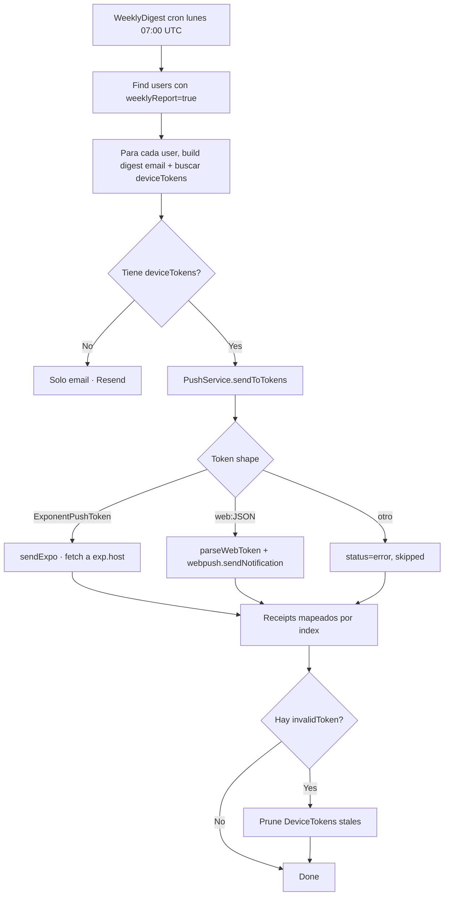

# Sprint S47 — Web Push (VAPID + Service Worker + dual-platform PushService)

**Rama sugerida:** `feature/sprint-47-web-push`
**Tests:** 400 API + 24 web + 34 crypto (392 → 400, +8 nuevos · 1 skipped sentinel).

---

## 1. Scope

Cierra la simetría mobile/web del push que S43–46 abrieron en mobile pero dejaron a la web fuera del loop. Con S47:

- El backend acepta **dos shapes** de `DeviceToken`: `ExponentPushToken[…]` (mobile S43) y `web:<JSON>` (browser S47).
- El `PushService` routea cada token al transport correcto: Expo Push HTTP API vs Web Push (RFC 8030) con VAPID JWT.
- El web tiene un **Service Worker** mínimo y un **toggle** en `/dashboard/notifications` para suscribir/desuscribir desde la UI.
- Los procesos cron de S44 (`WeeklyDigestProcessor`, `InactiveNudgeProcessor`) ahora alcanzan tanto a tokens Expo como Web sin saber la diferencia — el routing es transparente.

Sin tocar:

- Schema Prisma (el campo `DeviceToken.token` ya estaba diseñado para hold both shapes desde S43; solo subimos el límite del DTO de 256 → 2048 chars para acomodar el JSON serializado de `PushSubscription`).
- Endpoints HTTP (sigue siendo `POST /api/notifications/devices` con `platform: WEB`).
- Mobile (paridad lograda en S43; este sprint solo agrega el branch web).

---

## 2. Decisiones

1. **`web-push` lib oficial sobre custom JWT signing.** La librería maneja:
   - JWT VAPID con ES256 (curva P-256).
   - Encripción del payload con ECDH + HKDF-SHA256 + AES-GCM (RFC 8291 / 8188).
   - POST al endpoint del push service (Mozilla, Google, Apple, etc) con `TTL` + headers Urgency/Topic.
     Implementar esto a mano es ~500 líneas de cripto delicado. La lib pesa ~150KB.
2. **`web:<JSON>` token shape.** El backend NO necesita una segunda columna o tabla. El token se almacena como `web:<JSON-stringified PushSubscription>` en `DeviceToken.token`. `PushService.parseWebToken()` lo des-serializa en send time.
3. **VAPID env trio (`VAPID_PUBLIC_KEY` + `VAPID_PRIVATE_KEY` + `VAPID_SUBJECT`)** como optional en el schema. Tolera "todos vacíos" (web push simply disabled) pero **rechaza half-set** en el `superRefine` — siempre viene de un env shuffle mal hecho.
4. **Service Worker mínimo (sólo push).** No agregamos Workbox / offline cache — eso es otro SW con otro scope. El SW de S47 sólo escucha `push` y `notificationclick`.
5. **Auth via `apiBase + accessToken` props** (no `apiClient` singleton). El web no inicializa el cliente porque cookies viven en el server; replicamos el patrón de `EcoShell` donde el page Server Component lee el token y lo prop-drilla.
6. **Lazy + memoized VAPID init.** `PushService.ensureVapid()` setea las claves en `web-push` la primera vez que llega un token web, y memoiza el resultado.
7. **Per-subscription parallel send con `Promise.allSettled`.** Cada Web Push hits un endpoint diferente (Mozilla/Google/Apple). No queremos que un sub roto bloquee a otro.
8. **Stale subscription pruning (404/410).** Si web-push devuelve esos status, marcamos el token como `invalidToken` para que los processors (S44) lo eliminen — mismo flow que `DeviceNotRegistered` en Expo.
9. **`BufferSource` cast manual.** TS lib.dom espera `ArrayBuffer`-backed Uint8Array para `applicationServerKey`. Pasamos `.buffer as ArrayBuffer` después de allocar el buffer explícitamente. Documentado en línea.
10. **Versionado del SW por comentario.** Cualquier cambio al SW fuerza re-registro porque los browsers comparan byte-by-byte. Mantenemos un comment `// Version: N` para hacer las bumps visibles en review.

---

## 3. Cambios

### Backend

**`apps/api/package.json`:**

- `web-push@^3.6.7` (deps), `@types/web-push@^3.6.4` (dev).
- Script `gen:vapid` que ejecuta `scripts/gen-vapid.mjs`.

**`apps/api/scripts/gen-vapid.mjs`** (nuevo):

- One-shot script para generar VAPID keypair. Imprime los 3 envs a stdout. NO commits — el operador los pega manualmente en Railway + Vercel.

**`apps/api/src/config/env.schema.ts`:**

- 3 nuevos campos optional: `VAPID_PUBLIC_KEY`, `VAPID_PRIVATE_KEY`, `VAPID_SUBJECT`.
- `superRefine` extendido: rechaza half-set state (algunos sí, otros no).

**`apps/api/src/notifications/dto/register-device.dto.ts`:**

- `@Length(8, 256)` → `@Length(8, 2048)` (necesario para serialized PushSubscription).
- Comentarios actualizados para describir el shape `web:<JSON>`.

**`apps/api/src/notifications/push.service.ts`** (rewrite):

- Inyecta `ConfigService` para leer VAPID env.
- Particiona tokens por platform (`startsWith` test): Expo, Web, unknown.
- `sendExpo` (la lógica de S43, sin cambios funcionales).
- `sendWeb` (nuevo): para cada sub, `webpush.sendNotification(sub, payload, { TTL: 3600 })`. Captura WebPushError, mapea 404/410 → `invalidToken`.
- `ensureVapid` (private): set details on first use, memoiza.
- `parseWebToken` (exportado para tests): valida shape estricto del JSON.

**`apps/api/src/notifications/push.service.spec.ts`** (extendido):

- Constructor a 1 arg (ConfigService mock con `get` por key).
- `vi.mock("web-push")` con `vi.hoisted` para que `sendNotification` + `setVapidDetails` sean spies.
- +5 tests nuevos: web sin VAPID, web envía + receipt ok, web 410 → invalidToken, web malformado → invalidToken, orden preservado en mixed batch.
- +4 tests para `parseWebToken`: no-web, JSON malformado, fields faltantes, válido.

### Web

**`apps/web/public/sw.js`** (nuevo):

- Service Worker mínimo. Eventos `push` (renderiza notification) + `notificationclick` (focus tab existente o abre nueva con la URL del payload).
- Sin caching de assets — feature dedicado.

**`apps/web/src/lib/web-push.ts`** (nuevo):

- `detectWebPushSupport()` — feature detection (insecure context, no-SW, no-PushManager, no-Notifications).
- `urlBase64ToUint8Array()` — pad + URL-safe → standard base64 → Uint8Array con ArrayBuffer-backed buffer.
- `subscribeWebPush(apiBase, accessToken)` — permission + SW register + `pushManager.subscribe` + POST a la API. Throws con códigos estables (`permission-denied`, `no-vapid-key`, `subscribe-failed`, `register-failed`).
- `unsubscribeWebPush(apiBase, accessToken, deviceTokenId)` — best-effort: unsubscribe local + DELETE remoto.

**`apps/web/src/components/dashboard/notifications/WebPushToggle.tsx`** (nuevo):

- Client Component con state machine de 7 phases (`loading`, `unsupported`, `blocked`, `off`, `on`, `submitting`, `error`).
- UX: copy explicativo por estado + botón único (Activar / Desactivar / No disponible).
- Recibe `apiBase` + `accessToken` por props (patrón EcoShell).

**`apps/web/src/app/dashboard/notifications/page.tsx`:**

- Lee `accessToken` de cookies via `getAccessToken()`.
- Computa `API_BASE` desde env.
- Renderiza `<WebPushToggle>` ARRIBA del form de toggles (descubribilidad alta — primer cosa que ves al entrar).

### Sin cambios

- Mobile (ya tenía push real desde S43; este sprint solo cierra el lado web).
- Tipos compartidos (`@psico/types`).
- OpenAPI surface (no nuevos endpoints — el `web:` prefix se valida silenciosamente).

---

## 4. Verificación

- API tests: **400/400** + 1 skipped sentinel (+8 nuevos · 4 PushService web branch + 4 parseWebToken).
- @psico/crypto: 34/34.
- API typecheck OK · API lint: 4 warnings preexistentes (`Stripe.Invoice` namespace), 0 errores nuevos.
- Web typecheck OK · Web lint clean · Web build OK · Web tests 24/24.
- Mobile typecheck + lint OK.
- OpenAPI `generate:check` in sync (no cambios al wire).

---

## 5. Deuda técnica abierta

- **Sin tests del SW** — service worker registration / push event handling no se prueba en Vitest porque la API solo existe en el browser real. Pendiente: agregar Playwright E2E que dispare una notif via web-push test endpoint.
- **Generar VAPID + configurar Railway/Vercel** — `pnpm --filter @psico/api gen:vapid` y pegar 3 envs en Railway (API + worker) y 1 en Vercel (`NEXT_PUBLIC_VAPID_PUBLIC_KEY`). Sin esto el toggle muestra "No disponible: Falta configurar VAPID en el servidor".
- **No re-prompt programático tras denial.** Spec del browser no expone forma de re-pedir permiso tras "denied". El toggle muestra hint pero el user tiene que ir a chrome://settings o equivalent.
- **Sin retry on transport failure en web push** — los fan-outs de S44 ya hacen BullMQ retry global, pero cada sub falla independientemente y NO se re-intenta dentro de la misma run. Si una run completa cae por network blip, el job retry re-envía a TODOS los tokens (incluso los que ya recibieron). Idempotency vía `Topic` header sería más limpio (cuando los push services lo soporten universalmente).
- **El SW no actualiza tags** — push events que llegan con el mismo `tag` reemplazan la notification anterior, lo cual es el behavior que queremos. Pero si el server quiere "actualizar" un notif (e.g. "tienes 3 mensajes nuevos" → "tienes 5"), nuestro payload no incluye tag dynamically. Diferido hasta que se justifique.
- **Sin push silent / background sync** — todo push es user-visible (`userVisibleOnly: true`). Si en futuro queremos sync background (e.g. pre-fetch del digest editorial), agregar el opt-out.
- **iOS Safari < 16.4** no soporta Web Push. Detección lo marca como `no-push-manager`. iOS 16.4+ requiere instalar el PWA al home screen para que el SW persista, copy adicional en futuro.

---

## 6. Resumen para Notion

**Qué cerramos en Sprint S47:**

- `web-push` library + VAPID env trio + script `gen:vapid`.
- `PushService` extendido a dual-platform: Expo + Web. Routing transparente, receipts compatibles.
- Service Worker mínimo en `/sw.js` (push + notificationclick).
- `/dashboard/notifications` con toggle "Notificaciones del navegador" — permission flow + subscribe + register en el server.
- 8 unit tests cubren la web branch + el parser de subscription.

**Qué viene:**

- **Sprint S48 sugerido — Pulso v2 Overview:** segunda surface admin con KPIs + sparklines (DAU/WAU/MAU, retención, churn, errores Eco). Necesita agregación nocturna sobre `BillingUsageDay` + Eco reports.
- **Timezone-aware schedules:** `Profile.timezone` field + fan-out per-TZ (deuda S44+S46).
- **Bugfix #2 Stripe price IDs reales:** tarea del usuario.
- **Generar VAPID en prod y configurar Railway + Vercel.**
- **iOS PWA install hint en mobile-web users:** copy en el toggle cuando detectamos iOS Safari sin PWA installed.

---

## 7. Diagrama del dual-platform push flow

---

## 8. Privacy / Security notes

- VAPID private key vive solo en Railway env (API + worker). NUNCA en git, nunca en Vercel.
- Notification payloads SE cifran en transit (ECDH + AES-GCM) por web-push lib — los push services intermedios (Mozilla, Google) no pueden leer title/body. Solo el browser del user con la subscription key puede descifrar.
- DiaryEntry ciphertext NUNCA se incluye en notifications. Misma regla de ADR 0007 que digest email.
- `deviceLabel` se setea a "Chrome" / "Firefox" / "Safari" / "Edge" — short UA shorthand. NO trackeamos full UA por defecto.
- Subscription endpoints contienen identifiers únicos al user — los tratamos con el mismo cuidado que `passwordHash` (no logged, no exposed por API).
