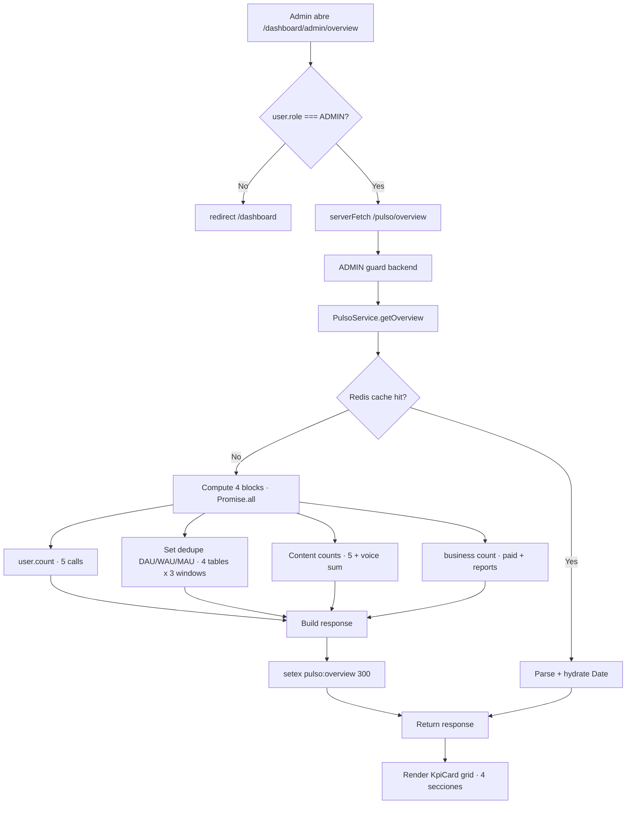

# Sprint S48 — Pulso v2 · Overview (admin KPIs dashboard)

**Rama sugerida:** `feature/sprint-48-pulso-overview`
**Tests:** 404 API + 24 web + 34 crypto (400 → 404, +4 nuevos · 1 skipped sentinel).

---

## 1. Scope

Segunda surface de **Pulso v2** después del reports inbox (S42). El admin ahora tiene un dashboard de "cómo va la plataforma" en una sola pantalla con KPIs agrupados:

- **Usuarios** — total, nuevos en 24h / 7d / 30d.
- **Engagement** — DAU / WAU / MAU (usuarios distintos con actividad).
- **Contenido (7d)** — entradas de Diario, mensajes de Eco USER, eventos de crisis, minutos de voz transcrita, sesiones de lectura.
- **Negocio** — usuarios Pro+, reports Eco en backlog.

Sin tocar:

- Schema Prisma (todos los counts se computan sobre tablas existentes).
- Mobile (Pulso es desktop-only por design — admins operacionales).
- Tipos compartidos del resto del producto (solo se agregan los nuevos del Overview).

---

## 2. Decisiones

1. **Rolling windows en lugar de calendar boundaries.** "Hoy" = últimas 24h, "semana" = últimos 7 días, "mes" = últimos 30 días. Cuando agreguemos "vs período anterior" (S49+), los deltas son comparables sin saltos en lunes/primer-día-de-mes.
2. **Sin sparklines v1.** Agregar `recharts` (~80KB gzip) solo para 2-3 curvas no se justifica todavía. Cuando tengamos un endpoint de time series, vuelve la decisión.
3. **Cache Redis 5min** (single key `pulso:overview`, global — ADMIN ve una sola plataforma, no per-user). Counts ligeramente stale son aceptables; el costo del multi-table aggregate se amortiza entre las reloads agresivas que hacen los admin dashboards.
4. **Active = diary OR eco USER OR voice OR reading.** Dedupe vía `Set<userId>` en aplicación porque Prisma no nos da `UNION` directo sobre 4 tablas distintas. Para 50k users es ~50ms; cuando crezcamos, materializar a una tabla `UserActivityDaily`.
5. **`paidUsers = plan IN (PRO, ANNUAL, B2B)`.** No incluye estado de `Subscription.status === active` porque el campo `User.plan` ya refleja el último estado conocido (downgrade lo limpia en el webhook handler). Si esto se desincroniza, lo arreglamos cuando aparezca.
6. **`reportsBacklog = total` (v1).** Cuando agreguemos `EcoMessageReport.resolvedAt`, narrow a `where: { resolvedAt: null }`. Por ahora total funciona como proxy.
7. **Privacy invariant FUERTE.** El response solo tiene counts agregados. NUNCA `userId`, `email`, `IP`, `content snippet`. Test explícito asserta esto.
8. **ADMIN-only doble gate.** Backend con `RolesGuard + @RequiredRole("ADMIN")` a nivel del controller; frontend redirect a `/dashboard` si `user.role !== "ADMIN"`. Defensive in depth.
9. **Sidebar nav `Pulso · Overview` ARRIBA de `Pulso · Reports`** — Overview es la landing natural; Reports es la herramienta cuando hay algo que revisar.

---

## 3. Cambios

### Backend

**`@psico/types`:**

- 5 nuevos shapes: `PulsoOverviewResponse`, `PulsoOverviewPeriod`, `PulsoOverviewUsersBlock`, `PulsoOverviewEngagementBlock`, `PulsoOverviewContentBlock`, `PulsoOverviewBusinessBlock`.

**`apps/api/src/pulso/pulso.service.ts`:**

- Inyecta `REDIS_CLIENT` (constructor a 2 args).
- Nuevo `getOverview()`:
  - Cache hit: `redis.get('pulso:overview')`, parse, return.
  - Compute: 4 `user.count` calls + 4 active-user UNION-via-Set + 5 content counts + voice sum + 2 business counts (parallel `Promise.all` within blocks).
  - Cache write: `setex 5min` fire-and-forget.
- Private `countActiveUsers(since)` helper que une distinct userIds de 4 tablas.

**`apps/api/src/pulso/pulso.module.ts`:**

- `imports` extendido con `RedisModule`.

**`apps/api/src/pulso/pulso.controller.ts`:**

- `GET /api/pulso/overview` agregado al controller existente (mismo guard stack ADMIN).

**`apps/api/src/pulso/pulso.service.spec.ts`:**

- `buildPrisma` extendido con `user.count`, `diaryEntry/ecoMessage/voiceTranscription/readingSession` mocks.
- Nuevo `buildRedis` helper.
- Constructor calls actualizados a 2 args.
- **+4 tests** en `describe("PulsoService.getOverview")`:
  1. Zero state.
  2. Aggregation completa con counts distintos por bloque.
  3. Cache hit serves from Redis sin tocar Prisma.
  4. **Privacy invariant**: el JSON del response NUNCA contiene los userIds internos usados para la dedupe.

### Cliente

**`@psico/api-client/pulso.ts`:**

- Nuevo `pulsoApi.getOverview()` → `GET /pulso/overview`.

**`generated.ts`:**

- Regenerado (no shape changes en el wire fuera del nuevo endpoint).

### Web

**`apps/web/src/components/dashboard/admin/KpiCard.tsx` (nuevo):**

- Componente compacto con `label / value / helper / accent`. `accent` opcional para danger/warning/success.

**`apps/web/src/app/dashboard/admin/overview/page.tsx` (nuevo):**

- Server Component, `dynamic = "force-dynamic"`.
- ADMIN gate via `getSessionUser()` + `redirect("/dashboard")`.
- 4 secciones: Usuarios / Engagement / Contenido / Negocio.
- `Intl.NumberFormat("es")` para los numerales (separadores de miles correctos).
- Helper text por card explicando la ventana o la fuente.
- `accent="danger"` cuando `ecoCrisisThisWeek > 0` (visibilidad inmediata de eventos sensibles).

**`apps/web/src/app/dashboard/_DashboardShell.tsx`:**

- `ADMIN_NAV_ITEMS` extendido con Overview ARRIBA de Reports.

### Sin cambios

- Schema, migración, OpenAPI surface más allá del nuevo endpoint.
- Mobile (Pulso es desktop-only).
- Tour overlay (la nueva entry no es un step del tour porque solo ADMIN la ve).

---

## 4. Verificación

- API tests: **404/404** + 1 skipped sentinel (+4 nuevos: zero state · aggregation · cache hit · privacy invariant).
- @psico/crypto: 34/34.
- API typecheck OK · API lint: 4 warnings preexistentes, 0 errores nuevos.
- Web typecheck OK · Web lint clean · Web build OK · Web tests 24/24.
- Mobile typecheck + lint OK.
- OpenAPI `generate:check`: in sync.

---

## 5. Deuda técnica abierta

- **Sin time series / sparklines** — agregar cuando el admin pida "¿está mejorando?". Probablemente sprint propio con tabla `PlatformMetricDaily` materializada por cron nocturno.
- **DAU/WAU/MAU vía Set en aplicación** — escalable hasta ~100k users activos. Pasar a query SQL con `UNION DISTINCT` o tabla materializada cuando aparezca el problema.
- **Sin "vs período anterior" delta** — el card muestra solo el valor actual. Necesita o doble query o time series.
- **`paidUsers` no chequea `Subscription.status`** — confiamos en `User.plan` actualizado por webhook. Si encontramos drift, fix en el webhook handler, no acá.
- **`reportsBacklog = total` v1** — añadir `EcoMessageReport.resolvedAt` cuando el flujo de "marcar como revisado" exista (probablemente S49 con Reports UI extendido).
- **Sin pivote por country / locale** — design original de Pulso menciona segmentación; v1 no.
- **5min cache no invalida en writes** — un admin agregando otro admin a la plataforma puede ver count viejo por hasta 5min. Aceptable v1.
- **Sin "última run del worker"** — útil para ops saber si `WeeklySummaryGenerationProcessor` está vivo. Diferido.

---

## 6. Resumen para Notion

**Qué cerramos en Sprint S48:**

- `GET /api/pulso/overview` con 4 bloques de KPIs (Users · Engagement · Content · Business).
- Cache Redis 5min vía `pulso:overview` global key.
- `/dashboard/admin/overview` Server Component con grid de KpiCards.
- Sidebar nav extendido con `Pulso · Overview` arriba de `Pulso · Reports`.
- 4 unit tests nuevos cubren zero state · aggregation · cache hit · privacy invariant.

**Qué viene:**

- **Sprint S49 sugerido — Reports UI extendido:** agregar `resolvedAt` field + flujo "marcar como revisado" + filtro Resolved/Unresolved. Cierra el loop del admin operations.
- **Time series + sparklines:** tabla materializada + chart lib + cards con sparkline + delta.
- **Timezone-aware schedules:** sigue abierto desde S44+S46.
- **Bugfix #2 Stripe price IDs:** sigue siendo tarea del usuario.
- **iOS Safari PWA hint en Web Push:** S47 deuda.

---

## 7. Diagrama del flujo

---

## 8. Privacy / security notes

- El response shape contiene SOLO integer counts. Sin `userId`, `email`, `IP`, `content snippet`.
- Test explícito (`response contains NO per-user identifiers`) ejecuta `JSON.stringify(res)` y asserta que ninguno de los userIds usados para la dedupe interna leakea al wire.
- Cache key es global (no per-user) — la response es la misma para cada admin.
- ADMIN-only doble gate: backend (`RolesGuard + @RequiredRole`) + frontend redirect.
- El campo `period.from`/`to` es UTC ISO date (YYYY-MM-DD), sin component de tiempo.
- `generatedAt` es timestamp UTC del compute — útil para que el admin sepa qué tan stale es el snapshot.
