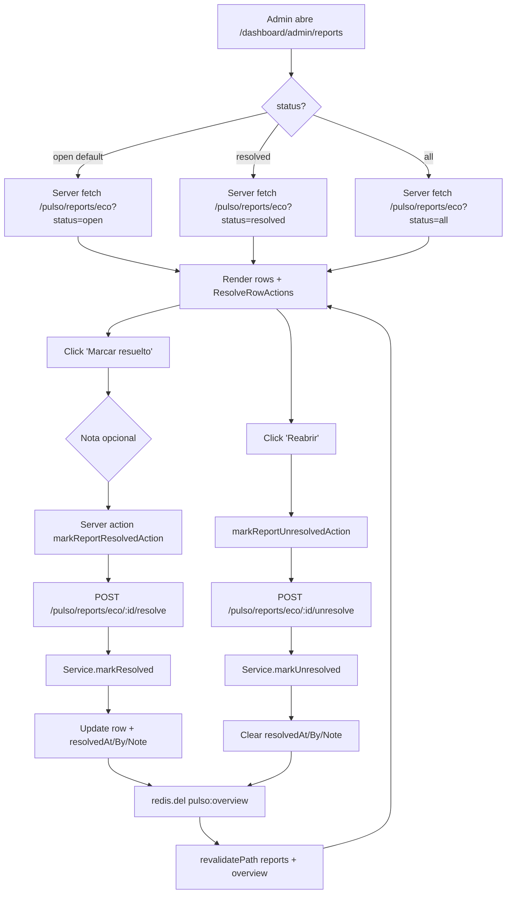

# Sprint S49 — Pulso v2 · Reports resolution flow

**Rama sugerida:** `feature/sprint-49-reports-resolved`
**Tests:** 411 API + 24 web + 34 crypto (404 → 411, +7 nuevos · 1 skipped sentinel).

---

## 1. Scope

Cierra el loop de admin operations sobre Pulso v2. Después de S42 (inbox) y S48 (overview), el admin podía VER reports pero no MARCAR nada. S49 entrega resolución idempotente + tabs de filtro + UI inline.

Lo que entrega:

- **Schema** — 3 columnas opcionales en `EcoMessageReport` (`resolvedAt`, `resolvedBy`, `resolutionNote`) + índice compuesto para que el count del backlog se mantenga barato.
- **2 endpoints nuevos** — `POST /api/pulso/reports/eco/:id/resolve` y `POST /api/pulso/reports/eco/:id/unresolve`. ADMIN-only (heredan el guard stack del controller).
- **Filtros de status** — `GET /api/pulso/reports/eco?status=open|resolved|all` (default `open`) y mismo flag en `/summary`.
- **Cierre de la deuda S48** — `getOverview.business.reportsBacklog` ahora cuenta solo `resolvedAt IS NULL` en lugar de `total`.
- **UI** — tabs "Abiertos | Resueltos | Todos" en `/dashboard/admin/reports`; botón "Marcar resuelto" / "Reabrir" inline con nota opcional ≤500c.

Sin tocar:

- Tipos / cliente / OpenAPI fuera de los shapes nuevos del flow.
- Mobile (Pulso sigue siendo desktop-only).
- AIService, EcoService — el resolution flow es admin-side; los usuarios siguen reportando como en S42.

---

## 2. Decisiones

1. **Resolución idempotente, no transición de estado.** `markResolved` siempre escribe `resolvedAt = now()`, `resolvedBy = admin.sub`, `resolutionNote = note`. Si el row ya estaba resuelto, lo sobreescribe — admins re-marcando casi siempre están corrigiendo la nota previa, no señalando un conflicto. Cero 409s.
2. **`resolutionNote` opcional, ≤500c.** Mismo tope que el `EcoMessageReport.comment` del user — consistencia + leakage prevention si alguien quiere copiar contexto.
3. **Default `status=open` en list + summary.** El admin landea en el inbox accionable, no en el archivo. Migración silent: clients viejos sin parámetro reciben behavior nuevo, lo cual es DESEABLE (el "todo + reasonChip filter" anterior incluía resueltos en el conteo).
4. **`statusWhereClause` helper module-level.** Tres ramas (`open`/`resolved`/`all`) → fragmento de where. Spread-able sin nullish checks en el caller. Test directo de la rama lo cubre.
5. **Cache invalidation post mutation.** `markResolved`/`markUnresolved` hacen `redis.del("pulso:overview")` fire-and-forget. Sin esto, el admin vería el backlog desactualizado por hasta 5 min — UX confuso cuando el botón parece no haber hecho nada.
6. **`reportsBacklog` ahora narrow.** Migration aditiva ⇒ rows preexistentes son `resolvedAt = NULL` ⇒ "open" ⇒ el count se mantiene igual al rollout pero converge a "real backlog" cuando los admins triagean. Cierra exactamente lo que S48 anotó como deuda.
7. **UI server-driven con tabs + querystring.** `StatusTabs` es zero-JS (`<Link>` × 3); el composer de nota es Client Component con `useTransition` para optimistic spinner. La página entera se re-fetcha al cambiar tab — más simple que sincronizar state.
8. **Server actions para resolve/unresolve.** `revalidatePath` toca tanto `/dashboard/admin/reports` como `/dashboard/admin/overview` para que el KPI del backlog (S48) se vea fresco después de marcar.
9. **Note inline, no modal.** El admin triagea muchos rows seguidos; una textarea inline + botón "Añadir nota" → "Marcar resuelto" es más rápido que abrir/cerrar modales.
10. **Re-asignación al admin actuante.** `resolvedBy` guarda el `sub` (cuid del User). Pulso v3 puede mostrar "resuelto por @alice" con un join cuando se justifique.

---

## 3. Cambios

### Schema (`apps/api/prisma/schema.prisma`)

`EcoMessageReport` extendido con:

- `resolvedAt     DateTime?`
- `resolvedBy     String?`
- `resolutionNote String?`
- `@@index([resolvedAt, createdAt])` — para que el count del backlog (S48) y la list filtrada por status sean baratos.

### Migration (`20260606000000_s49_report_resolution/migration.sql`)

```sql
ALTER TABLE "EcoMessageReport"
  ADD COLUMN "resolvedAt"     TIMESTAMP(3),
  ADD COLUMN "resolvedBy"     TEXT,
  ADD COLUMN "resolutionNote" TEXT;

CREATE INDEX "EcoMessageReport_resolvedAt_createdAt_idx"
  ON "EcoMessageReport" ("resolvedAt", "createdAt");
```

Aditiva, sin backfill. Rows existentes son implícitamente "open".

### Backend (`apps/api/src/pulso/pulso.service.ts`)

- `getEcoReportSummary(status?)` ahora acepta filtro de status (default `open`).
- `listEcoReports({ ..., status? })` acepta `status` (default `open`); el filtro se construye con `statusWhereClause(status)` y se spread junto al `reason`.
- `markResolved(reportId, adminUserId, note)` — verifica existencia (`NotFoundException("REPORT_NOT_FOUND")` si no), update con `resolvedAt = now()`, busta cache de overview.
- `markUnresolved(reportId)` — symmetric inverse, limpia los 3 campos.
- `invalidateOverviewCache()` private — fire-and-forget `redis.del("pulso:overview")`.
- `getOverview.business.reportsBacklog` ahora usa `where: { resolvedAt: null }`. **Cierra deuda S48.**
- Bug-fix de paso: `readingSession.findMany/count` usaba `updatedAt` (no existe) — corregido a `lastSeenAt` (el campo `@updatedAt`). El compile error estaba latente desde S48 pero solo lo cazó el typecheck al agregar el nuevo where.

### DTO (`apps/api/src/pulso/dto/list-reports.dto.ts`)

- `ListEcoReportsQueryDto.status?` enum `open|resolved|all`, default `open`.
- Nuevo `MarkResolvedDto.note?` String 1-500c.

### Controller (`apps/api/src/pulso/pulso.controller.ts`)

- `getSummary(@Query("status"))` propaga al service.
- `list(@Query() query)` propaga `query.status`.
- Nuevos handlers `resolve(admin, id, body)` y `unresolve(id)` con `@CurrentUser()` para capturar el actor.

### Tipos compartidos (`@psico/types`)

- `PulsoReportRow` extendido con `resolvedAt: Date | null`, `resolvedBy: string | null`, `resolutionNote: string | null`.
- `PulsoReportStatus = "open" | "resolved" | "all"`.
- `PulsoMarkResolvedRequest { note?: string }`.

### Cliente (`@psico/api-client/pulso.ts`)

- `getEcoSummary(status?)` y `listEcoReports({ ..., status })` con propagación de querystring.
- `markResolved(id, body)` y `markUnresolved(id)`.

### Web

- `actions/pulso-reports.ts` — server actions `markReportResolvedAction` y `markReportUnresolvedAction` con `revalidatePath` de reports + overview.
- `components/dashboard/admin/StatusTabs.tsx` — tab strip zero-JS (3 `<Link>`).
- `components/dashboard/admin/ResolveRowActions.tsx` — Client Component con state machine para nota opcional + resolver/reabrir. Optimistic UI con `useTransition`.
- `components/dashboard/admin/ReportsList.tsx` — render del nuevo bloque `<ResolveRowActions row={row} />` por item.
- `app/dashboard/admin/reports/page.tsx` — parsea `?status=…`, fetcha summary + list con el filtro, pasa `<StatusTabs>` arriba de chips.

### Sin cambios

- ConfigService, RedisModule, NestModule wiring (S48 ya los tenía).
- Tour overlay (admin features no son tour steps).
- Mobile.

---

## 4. Verificación

- API tests: **411/411** + 1 skipped sentinel (+7 nuevos: 1 backlog narrow + 2 markResolved + 1 markUnresolved + 3 status filter).
- @psico/crypto: 34/34.
- API typecheck OK · API lint: 4 warnings preexistentes, 0 errores nuevos.
- Web typecheck OK · Web lint clean · Web build OK · Web tests 24/24.
- Mobile typecheck + lint OK.
- OpenAPI `generate:check` in sync.

---

## 5. Deuda técnica abierta

- **Sin tests UI dedicados para ResolveRowActions / StatusTabs.** Cubrir en el batch de UI tests cuando se justifique (mismo argumento que en sprints anteriores).
- **`resolvedBy` no se renderiza en UI.** El backend lo persiste pero el componente no muestra el "resuelto por @alice". Falta un join al User para resolver el nombre. Bajo prio.
- **Sin auditoría de cambios.** Si admin A resuelve, admin B reabre, admin A re-resuelve, perdemos el historial. v2: agregar tabla `EcoReportEvent { reportId, actorId, type, at }`.
- **Sin bulk resolve.** Admin que llega con 50 reports nuevos tiene que clickar uno por uno. Cuando volumen lo justifique, agregar selección + bulk action.
- **Cache invalidation no aplica a `summary`.** El summary chips se cachea por requests (Next dynamic = force-dynamic, así que cada navegación re-fetch). Si en futuro cacheamos summary también, agregar invalidación.
- **Mobile no tiene este flow.** Si admins terminan operando desde el móvil, paridad. No hoy.
- **Sin email de "report nuevo".** Volume bajo → el admin no necesita ping en tiempo real. Si crece, suscribir Pulso a `EcoMessageReport.created`.

---

## 6. Resumen para Notion

**Qué cerramos en Sprint S49:**

- `EcoMessageReport.resolvedAt/resolvedBy/resolutionNote` + migración aditiva + índice compuesto.
- `POST /api/pulso/reports/eco/:id/resolve` y `/unresolve` con idempotencia + cache bust.
- `?status=open|resolved|all` en list + summary, default `open`.
- Overview backlog narrow a `resolvedAt IS NULL` — cierra deuda S48.
- `StatusTabs` + `ResolveRowActions` UI en `/dashboard/admin/reports`.
- 7 unit tests nuevos cubren backlog narrow + markResolved happy/404 + markUnresolved + 3 status filter branches.

**Qué viene:**

- **Sprint S50 sugerido — Pulso v2 time series:** tabla `PlatformMetricDaily` materializada por cron nightly + sparklines en KpiCard + delta "vs período anterior".
- **Timezone-aware schedules:** sigue abierto desde S44/S46.
- **Bugfix #2 Stripe price IDs:** sigue siendo tarea del usuario.
- **iOS Safari PWA hint en Web Push:** deuda S47.
- **Tests UI dedicados:** componentes admin + settings.
- **Pulso v2 vistas restantes** del design (`docs/design/pulso/HANDOFF.md`) cuando aterricen.

---

## 7. Diagrama del flujo de resolución



---

## 8. Privacy / security notes

- `markResolved` requiere `JwtAuthGuard + RolesGuard + @RequiredRole("ADMIN")` (heredados del controller). PSYCHOLOGIST no basta.
- `resolutionNote` se trata como texto admin-side — no es texto del usuario y no toca el cripto del Diario.
- `resolvedBy` guarda el `User.id` del actor. Si en futuro Pulso lo render-ea, requiere join al User pero NUNCA exponer el email/nombre del actor a otros admins sin necesidad.
- El response del list incluye `userId` del reporter (mismo trade-off de S42, navegabilidad para drill-down).
- Privacy invariant del overview NO afectado — el backlog count sigue siendo un integer agregado.
