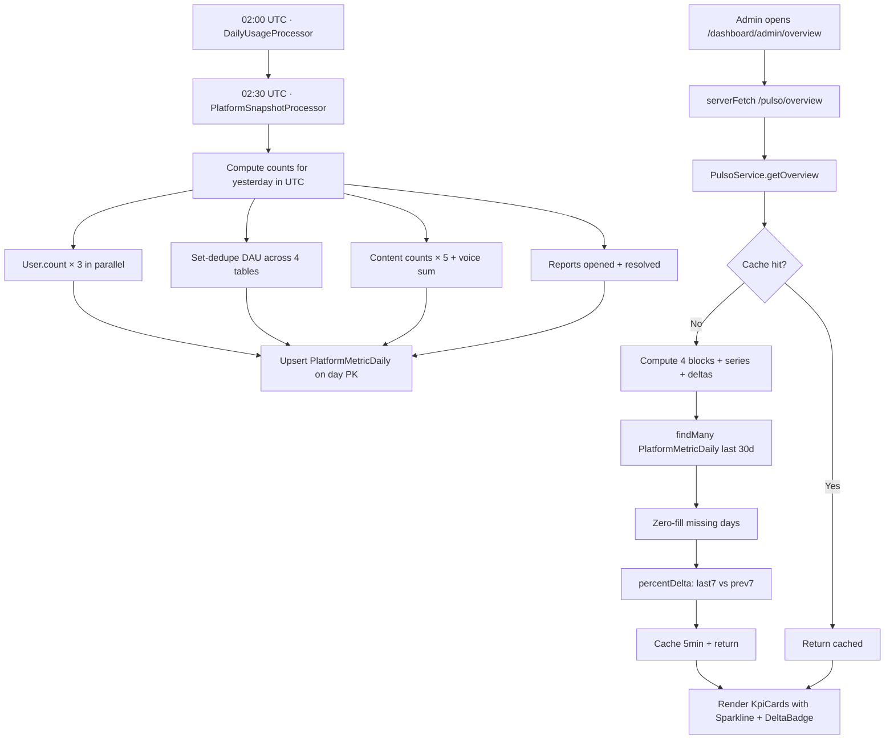

# Sprint S50 — Pulso v2 · Time series + sparklines (cierre del overview)

**Rama sugerida:** `feature/sprint-50-pulso-timeseries`
**Tests:** 422 API + 24 web + 34 crypto (411 → 422, +11 nuevos · 1 skipped sentinel).

---

## 1. Scope

Cierra la deuda más visible de S48 ("sin time series / sparklines" + "sin vs período anterior delta"). Entrega una tabla materializada de snapshots diarios, un cron que la rellena cada noche, y la extensión del Overview para mostrar sparklines + deltas por KPI.

Cierra de paso:

- El loop de Pulso v2 visual: Overview (S48) + Reports inbox (S42) + Resolution flow (S49) + time series (S50).
- El bug latente "no hay historia" — los admins ven evolución, no solo el snapshot del momento.

Sin tocar:

- Frontend mobile (Pulso sigue siendo desktop-only).
- AIService, EcoService, BillingService — el snapshot lee tablas existentes, no escribe en feature modules.
- Cliente: `pulsoApi.getOverview()` solo cambia su shape (campos nuevos, no signature).

---

## 2. Decisiones

1. **Tabla materializada separada (`PlatformMetricDaily`)** en lugar de agregar `BillingUsageDay`. Tres razones:
   - `BillingUsageDay` es per-user; charting necesita totales platform-wide.
   - DAU es un metric per se (no la suma de `BillingUsageDay`).
   - Columnas como `reportsOpened`/`reportsResolved`/`paidUsers`/`totalUsers` no existen en `BillingUsageDay`.
2. **Snapshot de "ayer en UTC", no "hoy".** "Hoy" está en vuelo a las 02:30; "ayer" está cerrado y estable. Idempotente por `day` (PK), retries safe.
3. **Cron a las 02:30 UTC**, justo después del `DAILY_USAGE` rollup a las 02:00. Sin contención de recursos, billing data ya asentada.
4. **30-day window por default.** Cubre la delta de "last 7 vs prev 7" + 2 semanas adicionales de contexto. Si el admin pide history más larga, sprint propio (con `?window=` param).
5. **Last-7 vs prev-7 para el delta**, no day-vs-day. Menos ruidoso, alineado con el cadence semanal que admin usa.
6. **`percentDelta` clamps a 999** cuando prev=0 y last>0 → UI muestra "+>999%" en lugar de dividir por cero. Devuelve `null` cuando hay menos de 14 días de historia o ambos buckets son 0.
7. **Sparkline inline SVG, no `recharts`.** ~50 líneas de JSX, 0 KB runtime. Para 30 datapoints y un grid de KPI cards, la lib externa no se justifica.
8. **`KpiCard` extendido con props opcionales** (`series?`, `delta?`, `deltaInverted?`). Backward-compatible: cards sin series ni delta renderizan idéntico a S48.
9. **`deltaInverted` para métricas donde "más = peor"** (crisis, reports opened). Color sage cuando baja, rose cuando sube.
10. **Privacy invariant preservado.** El snapshot agrega counts; ningún `userId`/`email` cruza el wire. Los `PlatformMetricDaily` rows son safe de loggear + compartir.

---

## 3. Cambios

### Schema (`apps/api/prisma/schema.prisma`)

Nuevo modelo `PlatformMetricDaily`:

```prisma
model PlatformMetricDaily {
  day DateTime @id          // UTC midnight

  totalUsers      Int   @default(0)  // cumulative
  newUsers        Int   @default(0)
  paidUsers       Int   @default(0)  // cumulative
  dau             Int   @default(0)
  diaryEntries    Int   @default(0)
  ecoMessages     Int   @default(0)
  ecoCrisis       Int   @default(0)
  voiceMinutes    Float @default(0)
  readingSessions Int   @default(0)
  reportsOpened   Int   @default(0)
  reportsResolved Int   @default(0)

  generatedAt DateTime @default(now())
  updatedAt   DateTime @updatedAt

  @@index([day(sort: Desc)])
}
```

### Migration (`20260608000000_s50_platform_metric_daily/migration.sql`)

`CREATE TABLE` + descending index. Aditiva, sin backfill (el cron lo llenará desde mañana).

### Backend (`apps/api/src/jobs/...`)

- `queue-names.ts`: `PLATFORM_SNAPSHOT` queue + `PlatformSnapshotJobPayload { targetDay?, dryRun? }` + `RUN_PLATFORM_SNAPSHOT` job name.
- `jobs.service.ts`: injecta `platformSnapshotQueue`; registra cron `30 2 * * *` UTC en `onModuleInit` con retry 3 + exp 5min/25min/2h.
- `jobs.module.ts` + `worker.module.ts`: `BullModule.registerQueue` extendido.
- `processors/platform-snapshot.processor.ts` (nuevo):
  - Resuelve target day (default "yesterday" UTC; opcionalmente `payload.targetDay`).
  - Computa 4 bloques en paralelo: users (3 counts), engagement (DAU vía Set sobre 4 tablas), content (5 counts + voice aggregate), pulso ops (2 counts).
  - Upsert on `day` PK — idempotente.
  - `dryRun: true` loggea y exit sin escribir.

### Backend (`apps/api/src/pulso/pulso.service.ts`)

- Nuevo `SERIES_WINDOW_DAYS = 30`.
- `buildSeriesAndDeltas(now)` private — fetches últimas N days, zero-fills sparse days, computa deltas.
- Helper module-level `percentDelta(series)` — last-7 vs prev-7, clamp + null branches.
- `getOverview` extiende el response con `series` + `deltas` blocks. Cache 5min hereda — series + deltas también se cachean.

### Tipos compartidos (`@psico/types`)

- `PulsoOverviewSeries { windowDays, dau, paidUsers, diaryEntries, ecoMessages, ecoCrisis, reportsOpened, reportsResolved }` (cada uno `number[]`).
- `PulsoOverviewDeltas { dau, diaryEntries, ecoMessages, reportsOpened, reportsResolved }` (cada uno `number | null`).
- `PulsoOverviewResponse` extendido con `series` + `deltas`.

### Cliente (`@psico/api-client`)

- Sin cambios en la firma — `getOverview()` sigue retornando `PulsoOverviewResponse`, ahora con campos adicionales.
- OpenAPI regenerado (sin diff porque el wire es JSON-libre, los nuevos shapes se reflejan en `generated.ts`).

### Web

- `components/dashboard/admin/Sparkline.tsx` (nuevo): inline SVG, polyline + opcional fill. 100×30 viewBox, sin libs.
- `components/dashboard/admin/DeltaBadge.tsx` (nuevo): chip ↑/↓ con %, color sage/rose. `inverted` flag para métricas tipo "más = peor".
- `components/dashboard/admin/KpiCard.tsx`: extendido con props opcionales `series?`, `delta?`, `deltaInverted?`. Backward-compatible.
- `app/dashboard/admin/overview/page.tsx`: pasa `series` + `delta` a 8 KpiCards (DAU, paidUsers, diaryEntries, ecoMessages, ecoCrisis, reportsBacklog). El resto sigue sin sparkline porque la data semanal del overview ya carga la story.

### Tests (`apps/api/src/...`)

- `processors/platform-snapshot.processor.spec.ts` (nuevo): 6 tests
  - Unknown job name throws.
  - Default targetDay = yesterday UTC.
  - `targetDay: "2026-06-01"` parsea como UTC midnight.
  - `dryRun=true` no upserta.
  - Field mapping completo (users 3 calls, eco USER+CRISIS, voice minutes from seconds, reports opened+resolved, DAU union).
  - Invalid targetDay string throws.
- `pulso.service.spec.ts`:
  - `buildPrisma` extendido con `platformMetricDaily.findMany`.
  - +4 tests S50: zero-history → empty series + null deltas; sparse history zero-fills; percent-delta math (last-7 vs prev-7); clamp 999 cuando prev=0 y last>0.
- `jobs.service.spec.ts`:
  - Mock queue añadido, constructor a 8 args.
  - +1 test asserta el cron `platform-snapshot-02-30-utc` con pattern `30 2 * * *` y retry policy.

### Sin cambios

- Mobile.
- Endpoints HTTP existentes — `getOverview` solo crece su shape.
- Resto del controller (`markResolved`, `listEcoReports`, etc).
- Tour overlay.

---

## 4. Verificación

- API tests: **422/422** + 1 skipped sentinel (+11 nuevos: 6 processor + 4 series/deltas + 1 cron).
- @psico/crypto: 34/34.
- API typecheck OK · API lint: 4 warnings preexistentes, 0 errores nuevos.
- Web typecheck OK · Web lint clean · Web build OK · Web tests 24/24.
- Mobile typecheck + lint OK.
- OpenAPI `generate:check` in sync.

---

## 5. Deuda técnica abierta

- **Backfill histórico** — la tabla empieza vacía. Los próximos 30 días los sparklines crecen del baseline; deltas son `null` hasta ≥14 días. Un script ops one-shot que iterate `--targetDay=YYYY-MM-DD` desde el primer registro de actividad llenaría la historia. Diferido — el cron natural cierra el gap en una semana.
- **Sin sparklines para `paidUsers` con delta** — la métrica es cumulative, los deltas serían ruidosos. Renderizamos solo la curva. Sprint v2 puede agregar "new paid this week" como métrica separada.
- **Sin sparklines para `voiceMinutes` ni `readingSessions`** en la card — campos sí existen en `series`, decisión UI fue limitar a 6 cards con chart para no saturar. Trivial agregar.
- **Sin window selector** (`?window=7|30|90`). 30 es default duro. Cuando el admin pida lookback más largo, query param.
- **Tests UI** dedicados para Sparkline + DeltaBadge — siguen pendientes (mismo argumento que sprints anteriores; sembrar infra cuando volumen lo justifique).
- **Tabla crece sin upper bound** — 1 row/día × indefinido. 10 años = 3650 rows, despreciable. Si llegamos a esa frontera, particionar por año.
- **Sin alerting cuando el cron NO corre** — si el worker está caído un viernes, perdemos un row del viernes. La tabla sigue siendo consultable con el gap zero-filled, pero el dato real se pierde. Diferido a observability sprint.
- **`getOverview` cache 5min** hereda en series + deltas. Aceptable porque snapshot solo cambia 1×/día.
- **Sin diferenciación `paidUsers` cumulative vs `newPaid` per-day** — el sparkline de `paidUsers` muestra acumulado monotónico. Útil para "growth trajectory" pero menos para "weekly delta". v2.

---

## 6. Resumen para Notion

**Qué cerramos en Sprint S50:**

- `PlatformMetricDaily` table + migración aditiva.
- `PlatformSnapshotProcessor` con cron BullMQ 02:30 UTC nightly.
- `PulsoService.buildSeriesAndDeltas` — 30-day window zero-filled + last-7 vs prev-7 percent delta.
- `getOverview` response extendido con `series` + `deltas` blocks (sin cambios al endpoint URL).
- Web: `Sparkline.tsx` + `DeltaBadge.tsx` componentes inline SVG; `KpiCard` extendido backward-compat.
- 6 sparklines + 5 deltas wired en el Overview page.
- 11 tests nuevos.

**Qué viene:**

- **Sprint S51 sugerido — Pulso v3 cohort analysis:** retention curves por cohort de signup. Reusa `PlatformMetricDaily` + cross-join con `User.createdAt`.
- **Tests UI dedicados** para Sparkline / DeltaBadge / KpiCard extendido — Vitest + RTL.
- **Backfill script** ops one-shot para llenar historia previa.
- **Timezone-aware schedules** — sigue abierto desde S44/S46.
- **Bugfix #2 Stripe price IDs** — sigue siendo tarea del usuario.
- **iOS Safari PWA hint en Web Push** — deuda S47.

---

## 7. Diagrama del flujo de time series



---

## 8. Privacy / security notes

- `PlatformMetricDaily` columns son TODOS integer + float counts. No `userId`/`email`/IP en la tabla.
- El snapshot processor usa el mismo `Set<userId>` dedupe que `getOverview` (S48) para DAU; los IDs viven en RAM durante el compute, nunca llegan a la columna.
- Privacy invariant del `getOverview` (S48) intacto — el response sigue siendo aggregate counts only. `series` + `deltas` son arrays de números.
- Snapshot rows quedan en Postgres indefinidamente. Si en futuro el VC requiere "retention max" para metrics, agregar TTL via cron de pruning (≥365 días).
- ADMIN-only doble gate intacto (backend `RolesGuard` + frontend redirect). Sparklines + deltas no se exponen a non-admin users.
