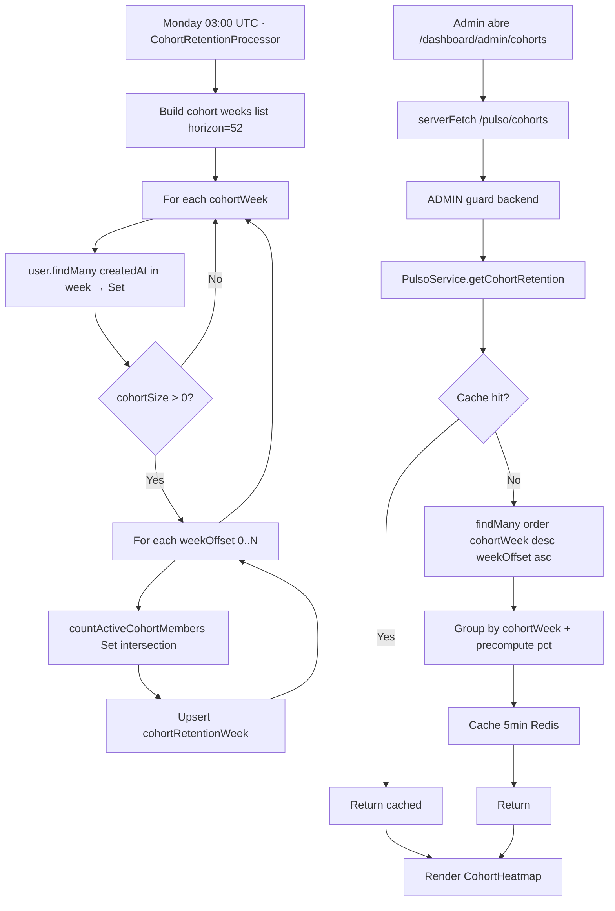

# Sprint S51 — Pulso v2 · Cohort retention triangle

**Rama sugerida:** `feature/sprint-51-cohort-retention`
**Tests:** 433 API + 24 web + 34 crypto (422 → 433, +11 nuevos · 1 skipped sentinel).

---

## 1. Scope

Cierra el loop analítico de Pulso v2 con la métrica clásica SaaS: retention curves por cohort de signup. Después de Overview (S48), Reports inbox/resolution (S42+S49) y time series (S50), el admin tiene ahora la pregunta "¿se queda la gente que entra?" respondida en un heatmap.

Lo que entrega:

- **Schema** — `CohortRetentionWeek` con PK compuesta `(cohortWeek, weekOffset)` + índice descendente sobre `cohortWeek`.
- **Cron + processor** — `cohort-retention-monday-03-utc`. Recalcula la triangle completa (default 52 cohorts × 52 offsets) cada lunes 03:00 UTC, justo después del platform snapshot.
- **Endpoint** — `GET /api/pulso/cohorts` ADMIN-only con cache Redis 5min.
- **Tipos compartidos** + cliente `pulsoApi.getCohorts()`.
- **Heatmap web** — `/dashboard/admin/cohorts` Server Component + tabla HTML con celdas coloreadas por retention %.
- **Sidebar nav** — `📐 Pulso · Cohorts` como 3a entrada admin.

Sin tocar:

- Frontend mobile (Pulso sigue siendo desktop-only).
- AIService, EcoService, BillingService, NotificationsModule.
- Endpoints existentes.

---

## 2. Decisiones

1. **Tabla materializada con PK compuesta** sobre `(cohortWeek, weekOffset)`. Triangle queries son O(N²); precomputed table los hace O(read). Recompute weekly es barato vs query-time fan-out.
2. **Weekly cron, no daily.** Cohorts son week-anchored (Lun→Dom). Day-frequency runs no agregan signal — la columna actual solo cambia una vez por semana.
3. **Activity definition reusada de S50.** "Active in week X" = mismo conjunto que DAU (diary OR eco USER OR voice OR reader). Mantiene coherencia con lo que el admin ve en Overview.
4. **Cohort filter client-side** (Set intersection) en lugar de Prisma `userId IN (...)`. Funciona con cohorts de 1k+ donde la IN clause overflowa.
5. **`activeUsers` se computa por offset, no acumulado**. La pregunta "¿estuvo activo en la semana N tras signup?" responde mejor que "¿estuvo activo alguna vez hasta la semana N?" para detectar drop-off.
6. **`pct` precomputado server-side** (`activeUsers / cohortSize × 100`, 1 decimal). UI no hace math.
7. **`pct = 0` cuando `cohortSize = 0`** (guard contra divide-by-zero). Los rows del cohort vacío se skipean en el processor.
8. **Horizon default 52 semanas** (1 año). Más allá los cohorts viejos tienen 1-2 users y el heatmap se vuelve ilegible. Configurable via `payload.horizonWeeks`.
9. **`dryRun` flag** para ops verification cuando cambies horizon o algoritmo.
10. **Cache Redis 5min** (key `pulso:cohorts`). Source data cambia weekly; staleness invisible.
11. **Empty-state UX** — cuando la tabla está vacía (fresh install, primer cron aún no corrió), copy claro "vuelve el próximo lunes 03:00 UTC".
12. **Heatmap como `<table>`**, no SVG ni canvas. CSS gradient en background, accessible, screen-reader friendly.
13. **HSL color interpolation** para el gradient lavender. Midrange (50%) sigue siendo visiblemente purple-tinted, no gris.
14. **Sticky left column** (cohort label + N) para que el header sea legible cuando el offset count crece.
15. **Privacy invariant FUERTE** — tabla solo tiene integer counts; processor maneja userId-sets en RAM y los descarta antes del upsert.

---

## 3. Cambios

### Schema (`apps/api/prisma/schema.prisma`)

```prisma
model CohortRetentionWeek {
  cohortWeek  DateTime    // Monday 00:00 UTC
  weekOffset  Int         // 0 = signup week, 1 = +1w, ...
  cohortSize  Int @default(0)
  activeUsers Int @default(0)
  generatedAt DateTime @default(now())
  updatedAt   DateTime @updatedAt

  @@id([cohortWeek, weekOffset])
  @@index([cohortWeek(sort: Desc)])
}
```

### Migration (`20260608100000_s51_cohort_retention/migration.sql`)

`CREATE TABLE` + descending index. Aditiva.

### Backend (`apps/api/src/jobs/...`)

- `queue-names.ts`: nueva `COHORT_RETENTION` queue + `CohortRetentionJobPayload { horizonWeeks?, dryRun? }` + `RUN_COHORT_RETENTION` job name.
- `jobs.service.ts`: injecta `cohortRetentionQueue`; registra cron `0 3 * * 1` UTC (Lunes 03:00) con retry 3 + exp 5min/25min/2h.
- `jobs.module.ts` + `worker.module.ts`: registers queue + provider.
- `processors/cohort-retention.processor.ts` (nuevo):
  - Resuelve `horizonWeeks` (default 52) y la lista de Mondays.
  - Para cada cohortWeek: fetch users del cohort (`createdAt` en `[cohortWeek, +7d)`).
  - Para cada `weekOffset` desde 0 hasta `weeksBetween(cohortWeek, thisMonday)`: `countActiveCohortMembers(cohortIds, window)` — intersección Set en RAM.
  - Upsert idempotente sobre `(cohortWeek, weekOffset)`.
  - `dryRun: true` loggea sin escribir.
  - Helper module-level: `startOfThisISOWeekUtc`, `addDays`, `weeksBetween`.

### Backend (`apps/api/src/pulso/pulso.service.ts`)

- Nuevo `getCohortRetention()`: cache hit Redis → o fetch `cohortRetentionWeek.findMany({ orderBy: [cohortWeek desc, weekOffset asc] })` → reshape a rows + cells + maxWeekOffset → cache write 5min → return.
- Precompute `pct` server-side; guard `cohortSize === 0` → `pct = 0`.

### Backend (`apps/api/src/pulso/pulso.controller.ts`)

- Nuevo `GET /api/pulso/cohorts` ADMIN-only (hereda guard stack del controller).

### Tipos compartidos (`@psico/types`)

- `PulsoCohortCell { weekOffset, activeUsers, pct }`.
- `PulsoCohortRow { cohortWeek, cohortSize, cells }`.
- `PulsoCohortRetentionResponse { generatedAt, rows, maxWeekOffset }`.

### Cliente (`@psico/api-client`)

- `pulsoApi.getCohorts()` → `GET /pulso/cohorts`.

### Web

- `components/dashboard/admin/CohortHeatmap.tsx` (nuevo): tabla HTML triangular con celdas coloreadas via HSL interpolation. Sticky left column. Empty-state pulido.
- `app/dashboard/admin/cohorts/page.tsx` (nuevo): Server Component, ADMIN gate, pre-fetch, renderiza `<CohortHeatmap>`.
- `app/dashboard/_DashboardShell.tsx`: `ADMIN_NAV_ITEMS` extendido con `📐 Pulso · Cohorts`.

### Tests

- `processors/cohort-retention.processor.spec.ts` (nuevo): **5 tests**
  - Unknown job → throw.
  - No users → no upsert (empty cohorts skipped).
  - 1-cohort case → upsert único con cohortSize + activeUsers correctos.
  - `dryRun=true` → no upsert.
  - Activity NOT in cohort no se cuenta (privacy del cell count).
  - Triangle math: horizon=2 → 6 cells (1+2+3).
- `pulso.service.spec.ts` (+4):
  - Empty table → rows=[] maxWeekOffset=0.
  - Group by cohortWeek + precompute pct.
  - Guard divide-by-zero (cohortSize=0 → pct=0).
  - Cache hit serve from Redis (no prisma).
- `jobs.service.spec.ts` (+1): cron `cohort-retention-monday-03-utc` con pattern `0 3 * * 1` y retry policy.

### Sin cambios

- Mobile.
- OpenAPI surface fuera del nuevo endpoint.
- Tour overlay.

---

## 4. Verificación

- API tests: **433/433** + 1 skipped sentinel (+11 nuevos: 6 processor + 4 service + 1 cron).
- @psico/crypto: 34/34.
- API typecheck OK · API lint: 4 warnings preexistentes, 0 errores nuevos.
- Web typecheck OK · Web lint clean · Web build OK · Web tests 24/24.
- Mobile typecheck + lint OK.
- OpenAPI `generate:check` in sync.

---

## 5. Deuda técnica abierta

- **Cron primer-run** — la tabla empieza vacía hasta el primer lunes post-deploy. Para llenarla antes, ops puede enviar `BullMQ.add('cohort-retention', { horizonWeeks: 52 })` manualmente.
- **Cell hover details** — el `title` tooltip muestra `activeUsers / cohortSize`. Si admin quiere drill-down (qué usuarios), no hay UI. Próximo sprint si lo piden.
- **Sin filtros** (date range, cohort size threshold). 52 cohorts × 52 offsets cabe bien en pantalla; cuando crezca, add `?horizon=...&minCohortSize=...`.
- **Sin exportación CSV.** Cuando un admin necesite copiar a sheets.
- **Sin alerting si la retention week-1 cae** — natural fit con `WeeklyDigest` infra de S44.
- **Sin retention por feature** (diary-only, eco-only, etc.). Diferido — el "any activity" es el primer-orden metric.
- **Tabla crece O(N²) en weekly history.** En 5 años: 260×260=67k rows. Despreciable.
- **Tests UI** dedicados para CohortHeatmap — siguen pendientes en el batch de S39/S40/S41 deuda.
- **Cohort de "this week"** muestra solo W0 con 100%. Útil para ver el cohort tamaño pero la retention story interesante empieza en W1+.

---

## 6. Resumen para Notion

**Qué cerramos en Sprint S51:**

- `CohortRetentionWeek` table + migración aditiva.
- `CohortRetentionProcessor` con cron BullMQ `0 3 * * 1 UTC` (Lunes 03:00).
- `PulsoService.getCohortRetention` con cache Redis 5min y precompute de `pct`.
- `GET /api/pulso/cohorts` ADMIN-only.
- Web `/dashboard/admin/cohorts` con `CohortHeatmap.tsx` (tabla HTML triangular + HSL gradient).
- Sidebar nav `📐 Pulso · Cohorts`.
- 11 tests nuevos (processor 6, service 4, cron 1).

**Qué viene:**

- **Sprint S52 sugerido — Pulso cohort drill-down:** click en celda → modal con breakdown de activity por feature (diary/eco/voice/reader).
- **Tests UI dedicados** para CohortHeatmap + Sparkline + DeltaBadge.
- **Backfill script** ops one-shot para llenar historia previa (cohorts + platform snapshots).
- **Timezone-aware schedules** — sigue abierto desde S44/S46.
- **Bugfix #2 Stripe price IDs** — tarea del usuario.
- **iOS Safari PWA hint** — deuda S47.

---

## 7. Diagrama del flujo



---

## 8. Privacy / security notes

- `CohortRetentionWeek` columns son TODOS integer counts. No `userId`/`email`/IP en la tabla.
- El processor maneja `Set<userId>` en RAM durante el compute; los IDs nunca llegan a la columna de Postgres.
- ADMIN-only doble gate intacto (backend `RolesGuard` + frontend redirect).
- Heatmap UI muestra solo aggregate counts + porcentajes. Sin drill-down por usuario en v1.
- Cohort retention rows se pueden conservar indefinidamente — son aggregate snapshots, sin user-level data. Si en futuro queremos retention TTL, agregar cron de pruning ≥5 años.
