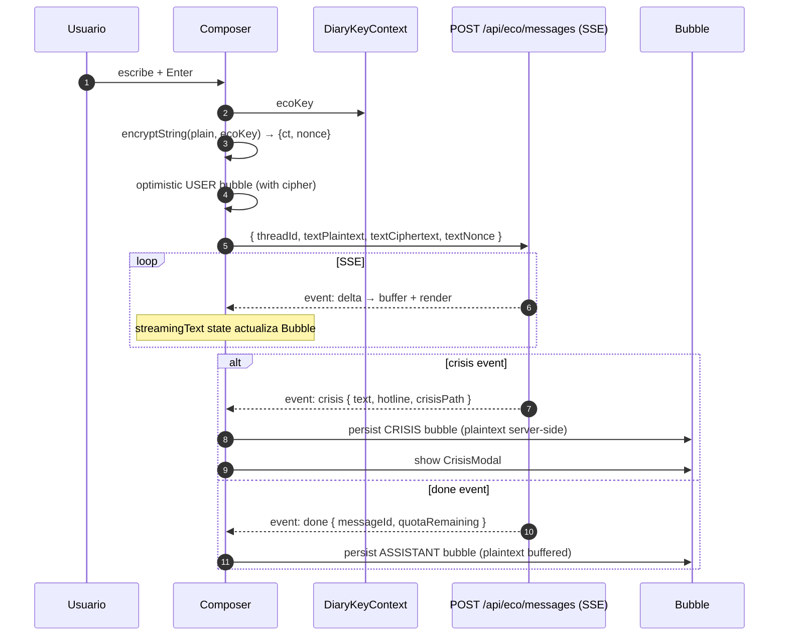

# Sprint front-eco — Chat UI con SSE + cripto cliente (Web + Mobile)

**Fecha:** 2026-05-27
**Rama:** `feature/sprint-front-eco`
**Tests:** 323/323 API + 34/34 crypto (sin cambios — sprint UI)
**Bitácora previa:** [sprint-front-voz.md](sprint-front-voz.md)

---

## §1 · Scope

Último UI sprint de Fase 1. Consume el S10 EcoModule: chat conversacional con SSE streaming, sidebar de hilos, cifrado cliente del mensaje USER, crisis modal no-negociable.

Con esto, el front consume **todos** los counters expuestos en `/api/subscriptions/usage` (eco + voice + diary + books).

---

## §2 · Lo que se construyó

### Shared — `DiaryKeyContext` extendido

Web y mobile: añadido `ecoKey: Uint8Array | null` al contexto. Derivado de `masterKey` con `HKDF(ECO_KEY_INFO)` en `unlock` y `adoptMasterKey`. Zerificado en `lock`.

Mobile: el `diaryKeyStore` ahora también `saveEco/loadEco` para persistir la subkey en SecureStore (Keychain/Keystore). `clear()` borra ambas keys.

`@psico/api-client`: nuevo `apiClient.getAccessToken()` público. La sendMessage de Eco usa fetch+reader y bypasea el pipeline del client; necesita el token explícito.

### Web (`apps/web`)

**Página + shell:**

- `/dashboard/eco/page.tsx` — Server Component que paraleliza `/eco/caps` + `/eco/threads`. `dynamic = "force-dynamic"`.
- `EcoShell.tsx` — Client orchestrator: rail state, active thread state, gates por `ecoKey` (locked → CTA a Diario para unlock).
- `ThreadRail.tsx` — sidebar con thread list. Title ciphertexts descifrados inline con `ecoKey`; fallback a "Conversación · {fecha}" cuando no hay título.
- `ChatArea.tsx` — message history (decrypts USER cipher, renders assistant plaintext) + composer + SSE consumer. Aborta + reemplaza con modal cuando llega un `crisis` event.
- `CrisisModal.tsx` — non-dismissable banner con hotline 1800-4-SALUD + tel: deep link + findahelpline.com fallback.
- DashboardShell extendido con item "🌿 Eco" en la sidebar.

**Decisión clave: api-client singleton no configurado en web.**

El `apiClient.get/post/etc` usa un singleton que en web nunca se configura (cookies viven en el server). Para no requerir setup global, los endpoints non-stream del Eco (`listThreads`, `createThread`, `getThread`) los llamamos via fetch directo con el `apiBase` + token plumbed desde la página. El `ecoApi.sendMessage` ya acepta `baseUrl + accessToken` explícitos y se usa tal cual.

### Mobile (`apps/mobile`)

**Pantalla:**

- `(tabs)/eco/index.tsx` — chat completo en un solo screen.
- `KeyboardAvoidingView` para iOS para que el composer no quede oculto.
- Header con persona + botón "list" que abre el `ThreadRailModal`.
- `ScrollView` con `onContentSizeChange` para auto-scroll al final.
- `Bubble` component que decripta USER ciphers inline (memoised) y renderea plain text del assistant.
- `Composer` con `TextInput multiline` + send button.
- `ThreadRailModal` (bottom-sheet style) con lista de hilos + "Nueva conversación".
- `CrisisModal.tsx` — mismo contenido que web, `tel:` deep link via `Linking.openURL`.

**Decisión clave: rail como modal en mobile.**

En desktop el sidebar permanente funciona. En mobile, un sidebar permanente quita demasiado espacio del chat. Optamos por un modal bottom-sheet que se abre con un botón en el header — patrón idiomático mobile (Telegram, Signal, etc.).

**Eco como tab visible:** registrado en `(tabs)/_layout.tsx` con ícono `leaf` entre Diario y Mi plan. Es feature flagship — merece su tab.

### Auto-create thread

Cuando el usuario llega al chat sin hilos previos, ambos clientes auto-crean un thread para que el composer tenga algo a dónde escribir. Web usa `useRef` para evitar double-fire bajo React strict mode; mobile usa un useEffect dependiente de `ecoKey` (su strict mode no se aplica igual).

---

## §3 · Diseño del flow



**Privacy invariants observados:**

- `textPlaintext` SOLO va en el request body. Server side existe in-flight; nunca persiste.
- `textCiphertext + textNonce` es lo único que persiste para mensajes USER.
- Mensajes ASSISTANT/CRISIS llegan plaintext (server las acabó de generar) y se persisten plaintext server-side. Cliente las renderea sin descifrar.
- El cliente **no almacena el plaintext del USER**: tras enviar, el bubble se reemplaza con el cipher y se descifra al render.

---

## §4 · Decisiones de diseño

### Single context para diary + eco

Misma `masterKey` deriva ambos subkeys con info distinto. Reutilizamos `DiaryKeyProvider`: nada que el usuario unlock en Diario rinde fruta también para Eco. UX: una sola contraseña, dos features, sin re-prompts.

### Hotline `tel:` deep link

Cuando el usuario tap "Llamar", web usa `<a href="tel:...">`, mobile usa `Linking.openURL("tel:...")`. Ambos OS marcan el número directo. Crítico para crisis — un click menos puede ser la diferencia.

### Auto-scroll suave

Web: `scrollTop = scrollHeight` cada vez que `messages`/`streamingText` cambian. Sin smooth-scroll porque interrumpe el flujo de lectura cuando los deltas llegan rápido.

Mobile: `ScrollView.scrollToEnd({ animated: true })` via `onContentSizeChange`. Animated porque RN renderiza más lento que la red.

### Title decryption con fallback

Si el `ecoKey` actual no abre el cipher del título (escenario: usuario cambió contraseña y este hilo no fue re-cifrado), mostramos "🔒 Hilo cifrado" en vez de crashear. Defensive coding para una invariante que NO debería ocurrir post-S23 rekey.

---

## §5 · Bugs corregidos durante el sprint

1. **`@psico/api-client` no era dep de `@psico/web`.** El web client nunca había usado el package — siempre fetch directo via `lib/api.ts`. Añadido como `workspace:*` dep.
2. **`react-hooks/exhaustive-deps` no instalado en web ESLint config.** Reemplacé el `// eslint-disable-next-line` con un patrón `useRef`-based para evitar el lint rule unknown error en build.
3. **`apiClient.getAccessToken()` no existía.** El singleton tenía el getter privado vía store, pero ningún método público lo exponía. Sin esto, mobile no podía pasar el token al `ecoApi.sendMessage` (que bypasea el pipeline).

---

## §6 · Deuda técnica abierta

- **Sin tests UI dedicados.** Mismo argumento que sprints anteriores (Vitest + RTL setup → próximo sprint).
- **Reports menu (UI) no implementado.** El backend acepta `POST /eco/messages/:id/report` desde S10; el cliente no expone la acción. Long-press / right-click → reason picker llegaría en S11/S12.
- **No thread title generation.** Los hilos quedan sin título (fallback "Conversación · fecha"). Cliente podría cifrar el primer mensaje y enviarlo como title — backend ya acepta `titleCiphertext + titleNonce` en el schema, pero el endpoint /eco/threads aún no lo recibe. Diferido.
- **Sin paginación de mensajes en el thread.** v1 pide la primera página (50 msgs) y no carga más. Para hilos largos hay que agregar infinite-scroll con cursor.
- **Web: api-client singleton NO configurado.** Solo el `ecoApi.sendMessage` pasa baseUrl+token explícitos. Si más adelante queremos usar el cliente desde web client-components para otros endpoints, hay que configurar el singleton (con cookies plumbed via Server Component → Client prop).
- **Sin manejo de network desconexión durante stream.** Si la SSE se corta mid-stream, el cliente queda con un bubble incompleto. v2: detectar `ReadableStream` close y reintentar / marcar como "incompleto".
- **Backend bloqueante para deploy:** `ANTHROPIC_API_KEY` sin configurar en Railway. Sin esa key, /eco/messages crashea al hablar con Claude.

---

## §7 · Verificación

```bash
# back (sin cambios)
pnpm --filter @psico/api test          # 323/323 ✓
pnpm --filter @psico/api typecheck     # ✓
pnpm --filter @psico/api lint          # ✓

# shared
pnpm --filter @psico/crypto test       # 34/34 ✓
pnpm --filter @psico/api-client generate:check   # ✓
pnpm --filter @psico/api-client build  # ✓

# web
pnpm --filter @psico/web typecheck     # ✓
pnpm --filter @psico/web lint          # ✓
pnpm --filter @psico/web build         # ✓

# mobile
pnpm --filter @psico/mobile typecheck  # ✓
pnpm --filter @psico/mobile lint       # ✓
```

---

## §8 · Resumen para Notion

**¿Qué se construyó?** Pantalla Eco en web (`/dashboard/eco`) y mobile (`(tabs)/eco`). Chat conversacional con SSE streaming token-by-token, sidebar de hilos (sidebar permanente en desktop, modal bottom-sheet en mobile), cifrado cliente del mensaje USER con `ecoKey` derivado del masterKey, crisis modal no-negociable con hotline `tel:` deep link, persistencia de hilos pasados con decrypt inline. Auto-create del primer hilo si el rail está vacío.

Con esto, **Fase 1 UI está completa**: Mi Plan + Voz + Eco consumiendo todos los endpoints de S6-S10.

**¿Qué viene?** Tres caminos:

1. **Deploy a Railway** (recomendado): aplicar 10 migraciones + configurar 5-6 envs (ANTHROPIC/OPENAI/DEEPGRAM/RESEND/REDIS/GOOGLE) + smoke test en producción. Ya hay valor para usuarios reales.
2. **Reports UI** + thread title generation + paginación de mensajes (deuda técnica del sprint).
3. **Sprint S11 PatternsModule** (Pro feature): heatmap del Diario + LLM-generated insights.

**Bloqueante crítico de deploy:** 10 migraciones Prisma acumuladas + envs sin configurar en Railway. El feature Eco en particular requiere `ANTHROPIC_API_KEY`.
