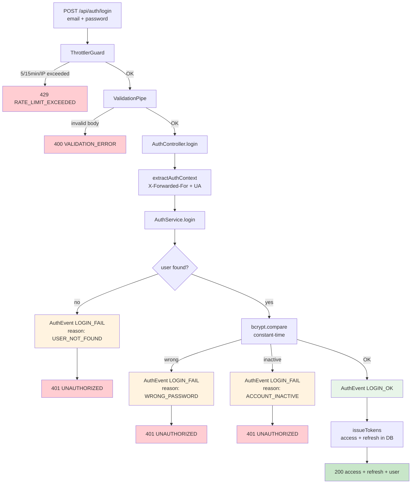
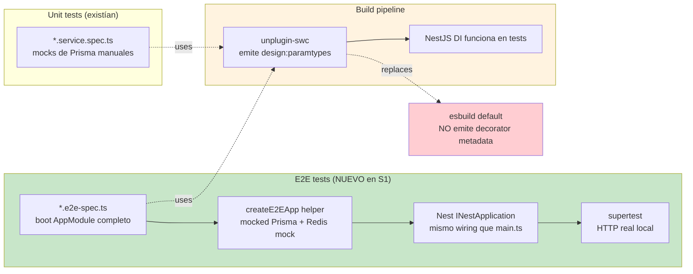

# Bitácora · Sprint S1 — AuthModule audit + throttle + E2E testing infra

**Fecha:** 2026-05-25
**Sprint:** S1 (primer sprint de Fase 1 — Core experience)
**Rama:** `feature/sprint-s1-auth-hardening`
**Estado:** ✅ Completado — tests 159/159 · build verde · primer E2E suite operativa
**ADRs producidos:** [0007 — E2E encryption Diario/Eco](../adr/0007-e2e-encryption-diario-eco.md) (anticipado)
**Sin endpoints nuevos** — endurecimiento del AuthModule existente

---

## 1. Por qué este sprint existe

Los 4 endpoints de Auth funcionaban en producción desde Sesión 2. Pero el módulo seguía **operativamente ciego**:

| Pregunta de operaciones                                | ¿Se podía contestar antes de S1? |
| ------------------------------------------------------ | -------------------------------- |
| "¿Cuántos logins fallaron en la última hora?"          | No                               |
| "¿Qué IP está intentando enumerar emails?"             | No                               |
| "¿Mi usuario tiene sesiones activas en otros devices?" | No                               |
| "¿Alguien usó un refresh token revocado?"              | No                               |
| "¿Por qué un usuario nuevo abandonó el funnel?"        | No                               |

S1 cierra todas con una sola pieza: **`AuthEvent`** — append-only audit log + 3 índices estratégicos. Sin queries de aplicación que la usen todavía: la data se captura ya, los dashboards llegan en Sprint S25 (Pulso).

### Concepto pedagógico: "instrument first, query later"

Es tentador postergar la captura de datos hasta que tengas el dashboard que los visualice. Mala idea por dos razones:

1. **Los datos pasados no se recuperan.** Si quieres mostrar "logins fallidos en las últimas 24h" y no hay tabla histórica, tu dashboard arranca vacío y tarda 24h en ser útil.
2. **El costo de instrumentar después es alto.** Modificar `auth.service.ts` para que escriba un log nuevo es un cambio chico; agregar la lógica + tabla + índices + tests + revisar caminos felices y de error es 5× el costo si lo haces "cuando llegue".

**Regla:** cuando tienes una operación de negocio crítica y baja-cardinality (auth, payment, booking), instrumenta su evento **el día que escribes el código**. La tabla puede estar vacía por meses — eso es OK.

---

## 2. Arquitectura

### 2.1 Pipeline de una request de login



**Observa:** los 3 caminos de error escriben un AuthEvent **distinto** con metadata diferenciada. La respuesta al cliente es la misma (`401 UNAUTHORIZED · Invalid credentials`) — solo nosotros sabemos qué pasó realmente.

### 2.2 Pipeline de testing post-S1



### 2.3 AuthEvent — schema + uso futuro

```mermaid
flowchart TB
    subgraph schema["Prisma AuthEvent (S1)"]
        T[(AuthEvent table)]
        T --- F1[type · userId? · email? · ipAddress? · userAgent? · metadata · createdAt]
        I1[index userId, createdAt desc]
        I2[index type, createdAt desc]
        I3[index ipAddress, createdAt desc]
        T --- I1
        T --- I2
        T --- I3
    end

    subgraph writers["Quién escribe (S1)"]
        AUTH[AuthService<br/>register · login · refresh · logout]
        AUTH -->|sync, swallowed on error| T
    end

    subgraph readers["Quién lee (futuro)"]
        PULSO[Sprint S25 · Pulso Funnel<br/>"signups + login_ok por día"]
        ALERTS[Sprint futuro · Security alerts<br/>"5+ LOGIN_FAIL del mismo IP en 5min"]
        EXPORT[Sprint S3 · Data export worker<br/>"historial de auth del usuario"]
    end

    I1 -.-> EXPORT
    I2 -.-> PULSO
    I3 -.-> ALERTS

    style schema fill:#fff3e0
    style writers fill:#e8f5e9
    style readers fill:#e1bee7
```

**Decision:** index `(userId, createdAt desc)` no `(userId, createdAt)` porque las queries siempre piden el evento **más reciente** primero. El sort en el índice elimina el cost del sort en runtime.

---

## 3. Lo que se construyó

### 3.1 Endpoints throttled

| Endpoint                  | Throttle decorator                                        | Razón                                                     |
| ------------------------- | --------------------------------------------------------- | --------------------------------------------------------- |
| `POST /api/auth/login`    | `@Throttle({ default: { limit: 5, ttl: 15 * 60_000 } })`  | OWASP baseline. 5 intentos / 15min / IP.                  |
| `POST /api/auth/register` | `@Throttle({ default: { limit: 10, ttl: 60 * 60_000 } })` | 10 / hora. Spam mitigation sin frenar usuarios legítimos. |
| `POST /api/auth/refresh`  | (default global 60/min)                                   | Refresh es benigno; default es suficiente.                |
| `POST /api/auth/logout`   | (default global 60/min)                                   | Idem.                                                     |

### 3.2 `AuthEvent` schema

```prisma
model AuthEvent {
  id        String   @id @default(cuid())
  type      String     // REGISTER · LOGIN_OK · LOGIN_FAIL · REFRESH · REFRESH_REUSED · LOGOUT
  userId    String?   // null si el evento no tiene user (LOGIN_FAIL on unknown email)
  email     String?   // capturado en LOGIN_FAIL incluso si userId es null
  ipAddress String?
  userAgent String?
  metadata  Json?     // { reason: "WRONG_PASSWORD" }, { revokedCount: 1 }, etc.
  createdAt DateTime @default(now())

  user User? @relation(fields: [userId], references: [id], onDelete: SetNull)

  @@index([userId, createdAt(sort: Desc)])
  @@index([type, createdAt(sort: Desc)])
  @@index([ipAddress, createdAt(sort: Desc)])
}
```

**Por qué `String` en lugar de un enum Prisma:** evitar migraciones cada vez que agreguemos un tipo nuevo (PASSWORD_RESET en S2, OAUTH_LINK en S2). El set canónico se documenta en `apps/api/src/auth/auth-event.type.ts`.

### 3.3 `AuthRequestContext` + `extractAuthContext()` helper

```ts
interface AuthRequestContext {
  ipAddress?: string;
  userAgent?: string;
}

function extractAuthContext(req: Request): AuthRequestContext {
  const xff = req.headers["x-forwarded-for"];
  return {
    userAgent: req.headers["user-agent"],
    ipAddress: xff?.split(",")[0]?.trim() ?? req.socket.remoteAddress,
  };
}
```

Aplicado en los 4 handlers. Sin duplicación.

### 3.4 Audit logging sync con swallow-on-error

```ts
private async recordEvent(input): Promise<void> {
  try {
    await this.prisma.authEvent.create({ data: { ... } });
  } catch {
    // TODO senior: Sentry breadcrumb. NO throw — el outcome del auth manda.
  }
}
```

**Por qué sync (no fire-and-forget):**

- Auth events son críticos para seguridad y compliance.
- bcrypt ya tarda 100+ ms, +5ms del audit es negligible.
- Si el audit falla, queremos saberlo — el log de Sentry (futuro) lo captura.

**Por qué swallow:**

- Si la DB del audit se cae, NO queremos rechazar logins legítimos.
- El outcome del auth (success/failure) es lo que importa al cliente.

### 3.5 Primer E2E test suite

`auth.e2e-spec.ts` — 10 tests que validan el stack completo:

| Categoría             | Tests                                                                           |
| --------------------- | ------------------------------------------------------------------------------- |
| Global prefix         | `/api/auth/login` existe · `/auth/login` 404 · `/health` 200                    |
| Validation + envelope | 400 con `details[]` en body inválido · 401 con envelope en wrong password       |
| Auth flow             | Register 201 · Login 200 + audit · Logout 204 + audit · Logout sin bearer → 401 |
| Throttler             | 5 logins seguidos OK · 6º → 429 con envelope `RATE_LIMIT_EXCEEDED`              |

**Lo que esto cubre que ningún unit test podía:**

- Que `setGlobalPrefix("api")` esté aplicado y excluyendo `/health`.
- Que `HttpExceptionFilter` envuelva errores de class-validator + Throttler + JwtAuthGuard con el mismo shape.
- Que `IdempotencyInterceptor` no se active cuando no hay `@Idempotent()`.
- Que `ThrottlerGuard` use el `RedisThrottlerStorage` (mock Redis) correctamente.

### 3.6 Harness E2E reutilizable

`apps/api/src/test/e2e-app.ts` expone:

```ts
const h = await createE2EApp();
// h.app — INestApplication wired exactamente como main.ts
// h.prisma — Prisma mock programable
// h.redis — ioredis-mock fresh
// h.resetMocks() — entre tests, limpia counters + cache
```

**Patrón importante:** el harness duplica intencionalmente el wiring de `main.ts` (prefix, versioning, ValidationPipe, HttpExceptionFilter). Cualquier cambio en `main.ts` requiere actualizar el harness — pero es el único lugar de duplicación, y el E2E se asegura de que coincida.

---

## 4. Trabas técnicas resueltas durante S1

### 4.1 Decorator metadata bajo Vitest

**Síntoma:** `TypeError: Cannot read properties of undefined (reading 'get')` en el constructor de `StorageService` cuando el harness boot eaba.

**Causa raíz:** Vitest usa **esbuild** como transformer por defecto. esbuild **no emite `Reflect.metadata("design:paramtypes", ...)`** que NestJS DI necesita para inyectar dependencias.

**Fix:** instalar `unplugin-swc` + `@swc/core` y configurar Vitest con SWC como transformer.

```ts
import swc from "unplugin-swc";
export default defineConfig({
  plugins: [
    swc.vite({
      jsc: {
        parser: { decorators: true },
        transform: { decoratorMetadata: true },
      },
    }),
  ],
});
```

**Lección pedagógica:** **`emitDecoratorMetadata: true` en tsconfig no es suficiente** — es una directiva para `tsc` que NO leen los bundlers modernos. Para frameworks decorator-heavy (NestJS, TypeORM, TypeStack), siempre configura SWC/Babel/swc explícitamente o vas a perder horas.

### 4.2 Mocks de `@prisma/client` rompieron bajo SWC

**Síntoma:** después de habilitar SWC, 2 tests viejos (`subscription.service.spec.ts`, `stripe.provider.spec.ts`) empezaron a fallar con `No "PrismaClient" export is defined on the "@prisma/client" mock`.

**Causa raíz:** los mocks viejos solo exportaban los enums (`Plan`, `SubscriptionStatus`) porque eso era lo único que el spec usaba. esbuild evaluaba lazy; SWC evalúa eager y sigue las cadenas de import — `prisma.service.ts` extiende `PrismaClient`, módulo no carga.

**Fix:** agregar `PrismaClient: class {}` al mock — stub class porque nunca se instancia en unit tests.

**Lección pedagógica:** **mocks parciales son frágiles ante cambios de transformer.** Cuando declaras `vi.mock(modulo)`, el mock REEMPLAZA todo lo que tenía el módulo. Si tu código sigue cadenas de tipos a través del módulo mockeado, **declara stubs de todo lo que se importa**, no solo lo que usas activamente.

### 4.3 ESM directory imports en `voyageai`

**Síntoma:** `Error: Directory import '/voyageai/dist/esm/api' is not supported`.

**Causa raíz:** el SDK de Voyage AI tiene `dist/esm/api` (un directorio) referenciado desde otros archivos sin `index.mjs` explícito. Node ESM strict resolver rechaza. Esbuild + node modules normales toleran.

**Fix:** `server.deps.inline: ["voyageai"]` en `vitest.config.ts` — fuerza a Vite a re-transformar el módulo.

**Lección pedagógica:** **librerías populares pueden tener ESM rotos en escenarios estrictos.** `deps.inline` de Vitest es el escape hatch — `noExternal` el equivalente en SSR. Conocer estos hatches ahorra tiempo cuando bumpeas Node major version.

### 4.4 Vitest no matchea `*.e2e-spec.ts` por default

**Síntoma:** `auth.e2e-spec.ts` no se ejecutaba en `pnpm test`. Solo corría cuando lo llamábamos por path explícito.

**Causa raíz:** el glob default de Vitest es `**/*.{test,spec}.?(c|m)[jt]s?(x)`. En micromatch, `*` antes de `.spec.ts` no matchea archivos con un `.` extra (`auth.e2e-spec.ts` tiene `.e2e-spec.ts`, no `.spec.ts`).

**Fix:** `vitest.config.ts` con `include: ["src/**/*.{test,spec}.ts", "src/**/*.e2e-spec.ts"]`.

**Lección pedagógica:** **los glob patterns no son intuitivos.** Si tu naming convention va más allá de `.test.ts` / `.spec.ts`, declara includes explícitos.

### 4.5 Prisma `Json` field y TypeScript

**Síntoma:** `Type 'Record<string, unknown>' is not assignable to type 'NullableJsonNullValueInput | InputJsonValue'`.

**Causa raíz:** Prisma define `InputJsonValue` como un tipo recursivo restrictivo (no acepta `unknown` por seguridad). `Record<string, unknown>` no satisface el contrato porque "unknown" podría ser una función, un Date, etc.

**Fix:** cast `(input.metadata ?? undefined) as never`. Documentado en el código.

**Lección pedagógica:** **tipos del ORM son estrictos por buena razón — pero a veces el dev sabe más.** El cast es soundness-preserving si tú garantizas que solo pasas objetos JSON-serializables. Documenta el "por qué" del cast en un comentario para que el próximo dev no lo limpie sin entender.

---

## 5. Métricas del sprint

| Métrica                                 | Antes (post-0.B) | Después                        | Delta                                              |
| --------------------------------------- | ---------------- | ------------------------------ | -------------------------------------------------- |
| Tests pasando                           | 140              | 159                            | +19 (9 audit + 10 E2E)                             |
| Test files                              | 16               | 17                             | +1 (auth.e2e-spec.ts)                              |
| Endpoints throttled específicamente     | 0                | 2 (login + register)           | +2                                                 |
| Tablas Prisma                           | 19               | 20                             | +1 (AuthEvent)                                     |
| Índices DB sobre AuthEvent              | 0                | 3                              | +3                                                 |
| ADRs documentados                       | 7                | 8                              | +1 (ADR 0007)                                      |
| Bytes del openapi.json                  | 20923            | ~21300                         | (Throttle decorator no aparece en spec — esperado) |
| Bugs encontrados por la nueva infra E2E | —                | 5                              | +5 (todos fixed)                                   |
| Líneas de doc nuevas                    | —                | ~900 (README + ADR + bitácora) | —                                                  |

---

## 6. Mapa de archivos tocados

```
apps/api/
├── prisma/schema.prisma                           ← +AuthEvent + relation User.authEvents
├── package.json                                   ← +supertest +@types/supertest +unplugin-swc +@swc/core
├── vitest.config.ts                               ← NUEVO (SWC + e2e-spec glob + setupFiles)
├── src/
│   ├── auth/
│   │   ├── auth-event.type.ts                     ← NUEVO (canonical AuthEventType + LoginFailReason)
│   │   ├── auth.controller.ts                     ← +@Throttle decorators + extractAuthContext helper
│   │   ├── auth.service.ts                        ← refactor: AuthRequestContext + recordEvent + nuevos flujos
│   │   ├── auth.service.spec.ts                   ← +9 tests de audit
│   │   ├── auth.e2e-spec.ts                       ← NUEVO (10 tests E2E)
│   │   └── README.md                              ← NUEVO
│   ├── subscription/subscription.service.spec.ts  ← stub PrismaClient en vi.mock
│   ├── subscription/providers/stripe/stripe.provider.spec.ts ← idem
│   └── test/
│       ├── setup-env.ts                           ← NUEVO (env stubs antes de import AppModule)
│       └── e2e-app.ts                             ← NUEVO (createE2EApp harness)

packages/api-client/src/generated.ts               ← regenerado (no diff funcional, regenerate:check OK)

docs/
├── adr/
│   └── 0007-e2e-encryption-diario-eco.md          ← NUEVO (anticipado)
└── informes/
    └── sprint-s1.md                               ← este archivo
```

---

## 7. Conceptos clave aprendidos en este sprint

### 7.1 Audit log como "exhaust" del sistema

Los logs de aplicación (Pino, Winston) capturan **qué pasó técnicamente**. El audit log captura **qué pasó semánticamente** desde el punto de vista del negocio. Son complementarios — no reemplazables.

- **App log:** "POST /api/auth/login → 200 in 142ms"
- **Audit log:** "AuthEvent { type: LOGIN_OK, userId: 'abc', ipAddress: '203.0.113.5', userAgent: 'Mozilla/5.0' }"

El audit log:

- Se queda **forever** (compliance) — los app logs rotan.
- Es **estructurado** desde el inicio (no necesitas regex sobre líneas de log).
- Tiene **índices** en la DB que permiten queries instantáneos.
- Es **inmutable append-only** — no se actualiza, no se borra.

### 7.2 Constant-time como defensive default

Cualquier endpoint que diferencie su comportamiento basado en data privada (existencia de un email, validez de un token, presencia de un permiso) es **susceptible a timing attacks** si su latencia varía perceptiblemente.

Pattern: ejecutar la operación cara **siempre**, incluso cuando ya sabes que el resultado va a ser "no". El bcrypt-on-fake-hash en `auth.service.login()` es el ejemplo canónico.

```ts
// MAL — la latencia revela si el email existe
const user = await db.findByEmail(email);
if (!user) throw new UnauthorizedException(); // ← respuesta instantánea
const valid = await bcrypt.compare(password, user.hash); // ← respuesta lenta

// BIEN — latencia idéntica en ambos casos
const user = await db.findByEmail(email);
const hash = user?.passwordHash ?? PLACEHOLDER_HASH;
const valid = await bcrypt.compare(password, hash);
if (!user || !valid) throw new UnauthorizedException();
```

Esta es una microoptimización de seguridad que **no aparece en tests funcionales**, pero protege contra adversarios sofisticados.

### 7.3 La diferencia entre E2E y "unit con muchos mocks"

Antes de S1 nuestros unit tests usaban `mockPrisma` extensivamente. Eso da cobertura de la **lógica del service**, no de la **integración del stack**.

El E2E test de S1 cubre cosas que unit nunca podría:

| Cubre el unit? | Cubre el E2E? | Caso                                                                                                 |
| -------------- | ------------- | ---------------------------------------------------------------------------------------------------- |
| ✅             | ✅            | `AuthService.login` con password equivocado lanza UnauthorizedException                              |
| ❌             | ✅            | El `HttpExceptionFilter` transforma esa exception a `{ statusCode: 401, code: "UNAUTHORIZED", ... }` |
| ❌             | ✅            | El `ValidationPipe` rechaza un body `{}` con 400 antes de llegar al service                          |
| ❌             | ✅            | El `ThrottlerGuard` bloquea el 6º intento sin invocar al service                                     |
| ❌             | ✅            | El `setGlobalPrefix` está activo (POST `/auth/login` da 404, POST `/api/auth/login` no)              |

**Regla:** unit tests para la **lógica del dominio**. E2E para la **integración del framework**. Necesitas ambos.

### 7.4 SWC como transformer en testing

`unplugin-swc` no es solo un nice-to-have — es **estructural** para cualquier proyecto NestJS que use Vitest. Sin él:

- No funciona DI con tipo (`@Inject` por interface).
- No funcionan resolvers automáticos de parámetros de constructores.
- No funcionan decoradores de validación de class-validator a nivel runtime.

**Si vas a usar Vitest en un proyecto NestJS, configura SWC el día 1.** Lo aprendí ahora. Tú aprendelo en este sprint.

### 7.5 Anticipar ADRs sin escribir el código

ADR 0007 (E2E encryption) se escribió en S1 aunque su primer código aparezca en S6. Beneficios:

1. **Más tiempo para review.** Un colega de seguridad puede leerlo durante las próximas 4 semanas sin bloquear ningún sprint.
2. **Las decisiones de schema en sprints intermedios respetan el plan.** Ya sabemos que `JournalEntry` tendrá `textCiphertext + textNonce` cuando llegue S6. Sprint S3 (Users) ya documentó que el `password-change` debe re-encriptar el Diario cuando exista.
3. **Cambiar de opinión es barato.** Si en una revisión semana-3 alguien sugiere "deberíamos usar AES-GCM en lugar de XChaCha20", lo cambiamos en el ADR y nadie escribió código aún.

**Patrón:** identifica las decisiones "load-bearing" del proyecto, escribe el ADR cuando el contexto está fresco (incluso si el código viene meses después). El ADR es **cheaper than the code**.

---

## 8. Riesgos abiertos al cerrar S1

| Riesgo                                                                                                                   | Severidad                         | Mitigación                                                                                             |
| ------------------------------------------------------------------------------------------------------------------------ | --------------------------------- | ------------------------------------------------------------------------------------------------------ |
| Migración Prisma del AuthEvent sin aplicar en Railway prod                                                               | Media                             | Sprint S3 hace la migración. Mientras tanto, prod sigue sin audit (deuda asumida).                     |
| Throttler usa IP del primer XFF — un proxy mal configurado podría hacer que un servicio interno comparta IP con clientes | Media                             | Documentar el contrato con el reverse proxy. Posiblemente agregar verificación de header en Sprint S2. |
| El E2E test usa mock de Prisma — no captura bugs de queries reales                                                       | Media                             | Aceptado para S1. Sprint futuro: agregar testcontainers para 1 test full-stack del happy path crítico. |
| Audit log podría llenarse rápido (cada login = 1 row)                                                                    | Baja                              | Particionar por mes si crece más de 10M rows. No urgente.                                              |
| ADR 0007 todavía no validado externamente                                                                                | Alta (para el día que se ejecute) | Coordinar review con consultor de seguridad antes de Sprint S6.                                        |
| `password-change` (sesión 9) revoca refresh tokens pero no re-encripta Diario porque éste aún no existe                  | Baja                              | Cuando llegue S6, agregar precondición al endpoint.                                                    |

---

## 9. Qué sigue · Sprint S2

**Objetivo:** completar el catálogo de Auth con flows de email (forgot/reset/verify) + OAuth Google/Apple.

**Endpoints nuevos:**

- `POST /api/auth/forgot-password` (3/hora/IP)
- `POST /api/auth/reset-password`
- `POST /api/auth/verify-email`
- `POST /api/auth/resend-verification`
- `POST /api/auth/oauth/:provider` (google | apple)

**Lo que entrega:**

- `NotificationsModule` con Resend client + React Email templates
- Prisma: `PasswordResetToken`, `EmailVerificationToken`
- `auth/strategies/google.strategy.ts`, `apple.strategy.ts`
- `User.authProvider` enum (LOCAL · GOOGLE · APPLE)
- ADR 0009 — OAuth con Passport
- README de NotificationsModule
- Bitácora S2

**Decisiones bloqueantes antes de empezar S2:**

1. ¿Resend o SendGrid? Resend es más moderno + buen DX con React Email. Default: Resend.
2. ¿Google OAuth con verified branding ahora o con "unverified" mientras esperamos el proceso (4-6 sem)? Default: empezar con unverified, iniciar verification en paralelo.
3. Apple Sign-in requiere Apple Developer account — ¿lo tenemos ya? Si no, S2 entrega solo Google y Apple va a backlog hasta tener cuenta.

---

## 10. Resumen para Notion

**Sprint S1 · AuthModule audit + throttle + E2E infra** ✅

- **Sin endpoints nuevos** — endurecimiento de los 4 existentes.
- Throttle decorativos: login `5/15min/IP`, register `10/hora/IP`. Default global cubre refresh/logout.
- Tabla `AuthEvent` (REGISTER · LOGIN_OK · LOGIN_FAIL · REFRESH · REFRESH_REUSED · LOGOUT) escrita sync con IP/UA. 3 índices estratégicos. Set canónico en `auth-event.type.ts`.
- Constant-time login preservado (bcrypt-on-fake-hash siempre se ejecuta).
- Primera infra E2E con supertest + harness `createE2EApp` reutilizable. 10 tests cubren stack completo: global prefix, validation, JwtAuthGuard, ThrottlerGuard, HttpExceptionFilter, audit log.
- `unplugin-swc` instalado y configurado para emitir `design:paramtypes` que NestJS DI necesita.
- README del AuthModule documentado.
- **ADR 0007 anticipado** — E2E encryption para Diario/Eco (Argon2id + XChaCha20-Poly1305 + ECDH X25519). 4 sem de buffer para review externa antes de su primer uso en S6.
- Tests 159/159 ✅ (140 → 159, +19). Bugs encontrados por la nueva infra E2E: 5 (todos fixed).

**Próximo:** Sprint S2 — Auth email flows (Resend) + OAuth Google/Apple.
