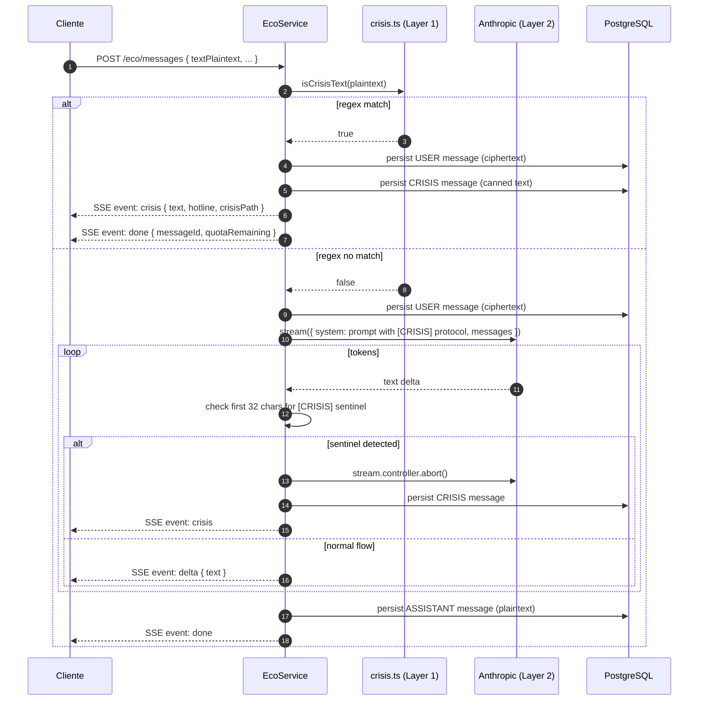

# Sprint S10 — AIModule conversacional (Eco)

**Fecha:** 2026-05-27
**Rama:** `feature/sprint-s10-eco-chat`
**Tests:** 323/323 API + 34/34 crypto (296 → 323, +27 tests nuevos · 1 skipped sentinel)
**ADRs aplicados:** [0007 §C](../adr/0007-e2e-encryption-diario-eco.md) — Eco hybrid encryption, parcialmente
**Bitácora previa:** [sprint-s8-voice.md](sprint-s8-voice.md)

---

## §1 · Scope

Implementación de `docs/design/handoff/08-eco.md`: companion conversacional con IA. Cierra el último counter pendiente de `/api/subscriptions/usage` (`eco.messagesThisPeriod`) — todos los counters ahora reportan datos reales.

**Lo que SÍ aterriza en S10:**

- 6 endpoints bajo `/api/eco/*`.
- Streaming SSE de respuestas del LLM.
- Crisis detection en dos capas (regex pre-LLM + sentinel del LLM).
- Cuota FREE 10/día + PRO 200/periodo.
- Hybrid encryption: ciphertext del user persistido, plaintext del assistant persistido.

**Lo que NO aterriza (diferido a S10.5 o sprint UI):**

- UI del frontend (web + mobile) — quedan los placeholders.
- Resumen de hilo cada 20 mensajes (design 08-eco.md).
- `intent: "suggest"` con dispatch a un endpoint distinto — v1 lo route por el mismo LLM call.
- E2E completo (assistant cifrado por cliente post-stream).

---

## §2 · Lo que se construyó

### Backend (6 endpoints nuevos)

| Endpoint                       | Método | Auth | Throttle    | Descripción                                             |
| ------------------------------ | ------ | ---- | ----------- | ------------------------------------------------------- |
| `/api/eco/caps`                | GET    | sí   | global      | Persona (name, voice, caps).                            |
| `/api/eco/threads`             | GET    | sí   | global      | Sidebar rail (últimos 50 hilos del user).               |
| `/api/eco/threads`             | POST   | sí   | global      | Crear hilo vacío.                                       |
| `/api/eco/threads/:id`         | GET    | sí   | global      | Mensajes paginados (cursor).                            |
| `/api/eco/threads/:id`         | DELETE | sí   | global      | Borrar hilo + cascada de mensajes.                      |
| `/api/eco/messages`            | POST   | sí   | 30/min/user | Enviar mensaje, response SSE streaming.                 |
| `/api/eco/messages/:id/report` | POST   | sí   | global      | Reportar respuesta de Eco (HALLUCINATION/OFF_TONE/...). |

### Schema

- **`EcoThread`** — id, userId, titleCiphertext?, titleNonce?, lastMessageAt.
- **`EcoMessage`** — id, threadId, kind (USER|ASSISTANT|CRISIS|SUGGESTION), textCiphertext?, textNonce? (USER only), assistantText? (no-USER only), suggestedBookId?, input/outputTokens.
- **`EcoMessageReport`** — id, messageId, userId, reason enum, comment?.
- Enums: `EcoMessageKind`, `EcoMessageReportReason`.
- Migración `20260530000000_s10_eco_threads`.

Backward-compat: `Conversation` y `ConversationMessage` viejos siguen ahí, junto a `/api/ai/chat`. Nuevo código usa EcoModule.

### Servicios

- **`EcoService`** — orquestador:
  - `listThreads / createThread / getThread / deleteThread`.
  - `sendMessage(userId, dto): Observable<SseEvent>` — pre-flight quota, crisis check L1, RAG, Anthropic stream, sentinel detection L2, persist assistant, bump quota.
  - `reportMessage(userId, messageId, reason, comment?)`.
  - `getCaps()` — persona estática.
  - `countUserMessagesInPeriod(userId, start, end)` — usado por UsageService.
- **`crisis.ts`** — `isCrisisText(plaintext)` + `CRISIS_MESSAGE` + constants. Accent/case insensitive.
- **`persona.ts`** — `buildSystemPrompt({ bookContext })` con el protocolo `[CRISIS]` sentinel.

### Wire-up con S7

- `UsageService.eco.messagesThisPeriod` ahora cuenta `EcoMessage` con `kind=USER` (antes hardcoded 0). 🎉 último counter del `/usage`.
- `DailyUsageProcessor` (BullMQ nightly) popula `BillingUsageDay.ecoMessages`.
- Post-mensaje: `usageService.invalidate(userId)` busta el cache 5-min.

### Shared

- **`@psico/types` +9 tipos:** `EcoMessageKind`, `EcoMessageReportReason`, `EcoPersona`, `EcoThreadRailItem`, `EcoThreadListResponse`, `EcoThreadCreatedResponse`, `EcoMessage`, `EcoThreadResponse`, `EcoSendMessageRequest`, `EcoSseEvent` (union), `EcoReportMessageRequest`.
- **`@psico/api-client`:** nuevo `ecoApi` con SSE consumer (`sendMessage` usa Fetch + reader, parsea `event:`/`data:` frames). `generated.ts` 67.0 KB → 72.2 KB.

---

## §3 · Decisiones lockeadas con el usuario antes de implementar

| #   | Pregunta                                            | Respuesta lockeada                               | Razón                                                                                                                            |
| --- | --------------------------------------------------- | ------------------------------------------------ | -------------------------------------------------------------------------------------------------------------------------------- |
| 1   | ¿Qué alcance E2E damos a los mensajes de Eco en v1? | **Hybrid: cliente envía plaintext + ciphertext** | El LLM necesita plaintext. Server lo recibe in-flight, NO persiste. User msg persistido cifrado; assistant msg plaintext.        |
| 2   | ¿Protocolo de streaming?                            | **Server-Sent Events (SSE)**                     | Estándar del design doc, tipado en EcoSseEvent, soportado nativamente por web. Mobile usa fetch+reader (mismo helper que voice). |
| 3   | ¿Qué layers de safety/crisis detection?             | **Ambos (regex pre-LLM + sentinel LLM)**         | Defensa en profundidad. Layer 1 es rápida y barata, layer 2 cubre falsos negativos del regex.                                    |

---

## §4 · Modelo criptográfico

```
Client                                Server                              LLM
──────                                ──────                              ───
encryptString(text, ecoKey)
  → { ciphertext, nonce }
POST { textPlaintext,                 receive request
       textCiphertext, textNonce }    │
                                      ├─ persist USER message
                                      │  { ciphertext, nonce } ✓
                                      │  (plaintext NEVER stored)
                                      │
                                      ├─ isCrisisText(plaintext)?
                                      │  └─ si: emit crisis, return
                                      │
                                      ├─ Anthropic.stream(plaintext)  ───→  LLM(plaintext)
                                      │                              ←───  delta tokens
                                      ├─ SSE: event: delta
                                      │  data: { text: token }
                                      │
                                      ├─ persist ASSISTANT message
                                      │  { assistantText: plaintext } ✓
                                      │
                                      └─ SSE: event: done
                                         data: { messageId, quotaRemaining }
```

**Por qué el assistant queda en plaintext (no E2E completo en v1):**

- El assistant NO es input privado del user; es output del LLM que ya vio plaintext.
- Cifrar el assistant con la `ecoKey` del user requiere que el cliente cifre POST-stream (flow de 2 fases) — más complejidad sin diferencia material de privacidad para el threat model v1.
- Si en el futuro queremos zero-knowledge sobre el assistant (Pulso admin no debe leer respuestas), agregamos un sprint S10.5 con re-encrypt.

**Privacy invariant enforced:**

- `eco.privacy.spec.ts` walk del directorio + regex que falla el build si algún `logger.*` o `console.*` referencia `textPlaintext`, `textCiphertext`, `textNonce`, `titleCiphertext`, o `titleNonce`.

---

## §5 · Crisis detection — diseño en detalle



**Por qué dos layers:**

- **Layer 1 (regex):** patrones que SIEMPRE deben derivar — no queremos ni una llamada al LLM si el usuario escribe "quiero suicidarme". Conservador para evitar falsos positivos en mensajes con palabras parciales ("matarte" en juego de palabras, etc.).
- **Layer 2 (LLM):** el modelo lee el contexto completo y puede detectar señales sutiles que regex no captura ("ya no puedo más", "no le encuentro sentido a nada"). El sentinel `[CRISIS]` es una contraseña de salida — si el LLM lo emite como primer token, el server reemplaza la respuesta y deriva.

**Por qué el sentinel y no parsing libre:**

- Parsing semántico del LLM output es frágil (el modelo puede decir "creo que estás en crisis" sin que sea una derivación formal).
- Un token literal es trivial de detectar en el stream y robusto contra reformulaciones.

---

## §6 · UX trade-offs

### History LLM solo lee `assistant` past turns

`loadHistoryForLLM` filtra mensajes USER porque solo tenemos ciphertext y no podemos decrypt server-side. El LLM ve el turn actual del user (plaintext en la request body) + los assistant turns anteriores. La conversación funciona pero la "memoria" del LLM sobre lo que el user dijo en turnos previos es parcial — solo recuerda por inferencia de sus propias respuestas.

Mitigación v2: el cliente puede mantener un "summary" plaintext en RAM y enviarlo en el siguiente turn como parte del prompt. O cifrarlo y mandar al server para que lo incluya.

### Quota FREE = daily, PRO = period

- FREE: 10 user-messages por UTC-day. Reset 00:00 UTC.
- PRO/ANNUAL: 200 user-messages por billing period (alinea con voice + diary del `/usage`).
- B2B: unlimited.

Distinto al voice por diseño: el caps de FREE para Eco fue elegido daily porque el design 08-eco.md lo dice explícitamente ("free: 10 mensajes/día"). No vale la pena unificar a per-period.

### Reports — no escalation automática

`POST /eco/messages/:id/report` solo INSERTa la fila. No notifica a un humano, no abre ticket. Es input para review offline (queries SQL agregadas por `reason`). En S11 o S12 podemos agregar un dashboard interno en Pulso para revisar reports.

### `intent: "suggest"` por mismo path

El design define un flag `intent: "free" | "suggest"` para distinguir mensajes "libres" de "pídele a Eco un libro". v1 acepta el flag pero NO lo dispatchea diferente — el LLM ya tiene en su system prompt que puede sugerir libros cuando es relevante. Si en producción vemos que el LLM no sugiere lo suficiente cuando `intent=suggest`, agregamos un re-router con un system prompt distinto.

---

## §7 · Bugs corregidos durante el sprint

1. **Subject.complete() en `finally` antes del error event:** primera versión tenía `void runSendMessage().catch(err => subject.next(error))` pero `runSendMessage` ya completaba el subject en su propio `finally`. RxJS dropea eventos en subjects completados → el test del quota gate veía 0 eventos. Fix: mover el try/catch INSIDE el método runner (`runSendMessage` con un `inner` separado), emitir error inline, complete una vez al final.
2. **`UsageService` spec mock faltaba `ecoMessage`:** el agregador ahora cuenta `EcoMessage` → el mock Prisma necesitaba `ecoMessage.count`. Añadido al helper makePrismaMock.
3. **Anthropic SDK mock con stream.on("text"):** drenar chunks vía `Promise.resolve().then` para que el service registre `.on("text", ...)` ANTES de los chunks. Si los chunks se emiten síncronamente, el listener no está registrado todavía.

---

## §8 · Deuda técnica abierta

- **History parcial del user:** LLM no ve los user-turns anteriores (solo el actual). v2: client-side summary ephemeral.
- **Sin frontend UI.** El backend está listo, pero el chat-screen web+mobile + integration con el flow del Diario son sprint UI dedicado. Mientras tanto, la página Eco se queda en placeholder.
- **`intent: "suggest"` no diferencia el system prompt.** v2 si los usuarios reportan que pidieron una sugerencia y Eco no la dio.
- **Sin resumen de hilo cada 20 mensajes** (design 08-eco.md). Cuando el thread crece >20 turns, el context window se infla. v2.
- **Sin tests E2E con stream real.** Los tests mockean Anthropic; un test integration con un fixture pequeño daría más confianza pero requiere ANTHROPIC_API_KEY en CI.
- **Sin tests del LLM-sentinel path (layer 2).** El test del crisis cubre layer 1 (regex). Layer 2 necesita un mock de stream que emita "[CRISIS]" como primer chunk + verificar abort + reemplazo. Cubrir en S11.
- **`ANTHROPIC_API_KEY`, `OPENAI_API_KEY`, `DEEPGRAM_API_KEY` no configurados en Railway.** Bloqueante de deploy para AI features.
- **10 migraciones Prisma acumuladas en Railway** desde Sesión 9. Crítica de deploy.
- **Reports no van a una bandeja humana.** Solo INSERT en `EcoMessageReport`. Operaciones revisa vía SQL hasta que tengamos Pulso admin.
- **Mobile RN sin fetch streaming nativo confiable:** EventSource no existe en RN sin polyfill. `ecoApi.sendMessage` usa `fetch + reader` que funciona en Hermes 0.74+ pero hay edge cases con HTTP/2. Validar cuando aterrice el UI mobile.
- **El `Conversation` viejo + `/ai/chat` siguen vivos.** Cuando el front migre a `/eco/*`, deprecate + eventually remove en una migración separada.

---

## §9 · Verificación

```bash
# back
pnpm --filter @psico/api test          # 323/323 ✓ (+27 desde S8) + 1 skipped sentinel
pnpm --filter @psico/api typecheck     # ✓
pnpm --filter @psico/api lint          # ✓

# shared
pnpm --filter @psico/types build       # ✓
pnpm --filter @psico/crypto test       # 34/34 ✓
pnpm --filter @psico/api-client build  # ✓
pnpm --filter @psico/api-client generate:check   # ✓ in sync

# front (no cambios)
pnpm --filter @psico/web typecheck     # ✓
pnpm --filter @psico/mobile typecheck  # ✓
```

**Smoke boot del API:**

```
5 rutas nuevas mapeadas bajo /api/eco/*:
  GET    /api/eco/caps
  GET    /api/eco/threads
  POST   /api/eco/threads
  GET    /api/eco/threads/:id
  DELETE /api/eco/threads/:id
  POST   /api/eco/messages       (SSE)
  POST   /api/eco/messages/:id/report
```

---

## §10 · Resumen para Notion

**¿Qué se construyó?** AIModule conversacional completo: 6 endpoints `/api/eco/*` con streaming SSE, cifrado hybrid (user cifrado, assistant plaintext), detección de crisis en dos layers (regex + LLM sentinel), cuotas enforced (FREE 10/día, PRO 200/periodo), wire-up con `/usage` (cierra el último counter pendiente — todos reportan datos reales ahora). Backward-compat: el viejo `/ai/chat` sigue vivo.

**¿Qué viene?** Fase 1 backend completa. Próximas opciones:

1. **Front UI completo** (web + mobile): Mi Plan + Voz + Eco chat consumiendo S6–S10.
2. **S11 PatternsModule** (Pro feature): análisis de patrones del Diario con LLM.
3. **Deploy + migración Railway**: aplicar las 10 migraciones acumuladas, configurar las 3 API keys faltantes (ANTHROPIC/OPENAI/DEEPGRAM), promover a producción.

**Bloqueante de deploy:** 10 migraciones Prisma + 3 API keys + `RESEND_API_KEY` + `REDIS_URL` (Upstash) sin configurar en Railway. Necesita una ventana de mantenimiento sólida antes del próximo deploy.
