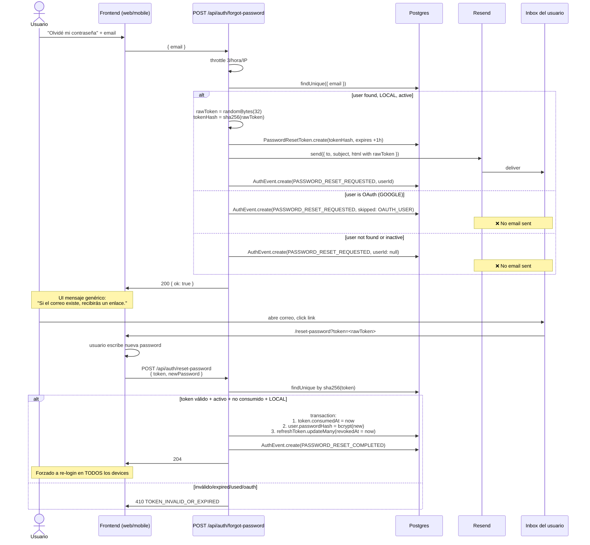
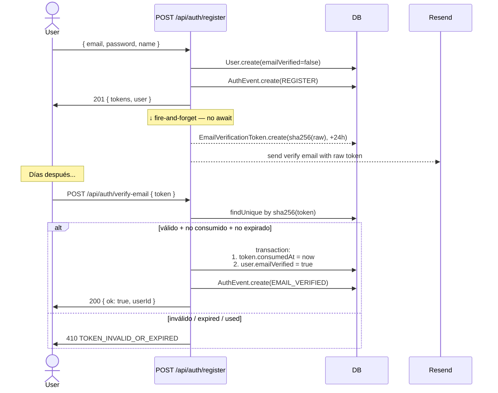
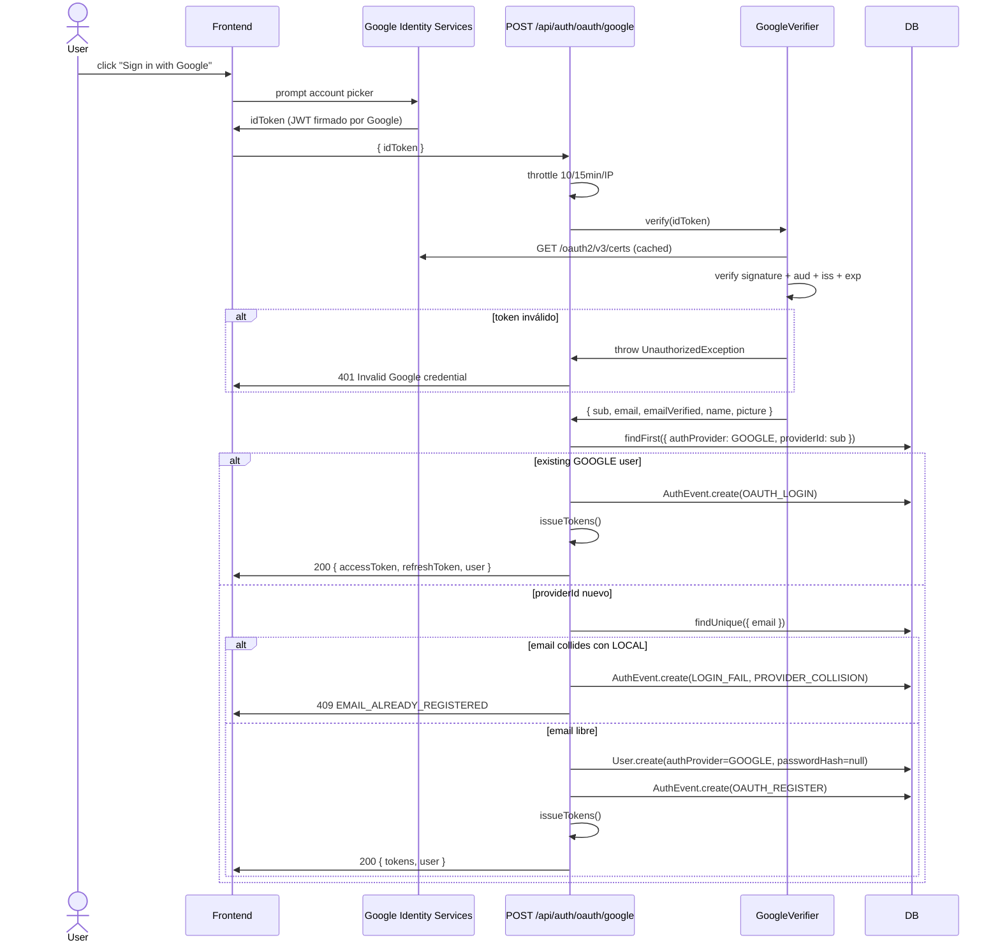

# Bitácora · Sprint S2 — Email flows + OAuth Google

**Fecha:** 2026-05-26
**Sprint:** S2 (segundo de Fase 1 — Core experience)
**Rama:** `feature/sprint-s2-auth-email-oauth`
**Estado:** ✅ Completado — tests 179/179 · build verde · 4 endpoints nuevos · OAuth funcional con stubs en dev
**ADR producido:** [0009 — OAuth via Google ID token verification](../adr/0009-oauth-with-google-id-token.md)

---

## 1. Por qué este sprint existe

Después de S1, el AuthModule estaba **endurecido** pero **incompleto** para producción real:

| Sin S2                     | Consecuencia                                                                                                                                           |
| -------------------------- | ------------------------------------------------------------------------------------------------------------------------------------------------------ |
| Sin "olvidé mi contraseña" | El primer usuario que olvide su password queda bloqueado de su diario E2E para siempre. UX inviable.                                                   |
| Sin verificación de email  | No podemos confiar en que el email es del usuario que se registró. Caja de Pandora para abuso (spam, suplantación).                                    |
| Sin OAuth                  | La fricción de "elegir password segura, escribirla, recordarla" en mobile mata conversion. Las apps de wellness modernas TODAS ofrecen Google Sign-in. |

S2 cierra los tres con **una infraestructura compartida** (Resend para email, `NotificationsModule` global) y **una decisión arquitectónica nueva** (ID token verification flow para OAuth — ADR 0009).

### Concepto pedagógico: "infraestructura primero, features después"

Sería tentador construir cada endpoint como un silo:

- `forgot-password` con su propio cliente SMTP inline.
- `verify-email` con HTML hardcodeado.
- Cuando llegue Sprint S3 y haya que enviar `email-change-request`, recreate todo.

Mala idea. Por dos razones:

1. **Drift garantizado.** Cada silo evoluciona por su cuenta — los templates divergen, el manejo de errores diverge, los dashboards de Resend tienen tags inconsistentes.
2. **Reescribir es más caro que centralizar.** Sacar la lógica de email de 4 lugares más adelante requiere git archeology + refactor coordinado.

**La regla:** cuando una capacidad transversal aparece por segunda vez, **extráela inmediatamente**. En S2 sabíamos de 3 emails (verify, reset, email-change futuro en S3) — eso ya justificaba `NotificationsModule` global desde el día uno.

---

## 2. Arquitectura

### 2.1 Pipeline de un email transaccional

```mermaid
flowchart TB
    Caller[AuthService<br/>UsersService] -->|input: { to, subject, html, text?, tag? }| RS[ResendService]
    RS -->|RESEND_API_KEY set?| Branch{}
    Branch -->|yes| Resend[Resend SDK<br/>POST emails.send]
    Branch -->|no| Console[Logger.log<br/>full body to stdout]
    Resend --> Result[email queued by Resend]
    Console --> Done[void]
    Result -.->|webhook future S2.5| Tracking[(open / click / bounce)]

    style Resend fill:#c8e6c9
    style Console fill:#fff3e0
```

El `ResendService` es **agnóstico a la presencia del API key**: en dev (sin Resend), logea el HTML completo a consola. Esto permite trabajar offline + tener tests rápidos sin mocks complicados.

### 2.2 Forgot password — flujo end-to-end



**Tres principios visibles en el diagrama:**

1. **No-leak**: el endpoint **siempre** retorna 200 al frontend, sin importar si el email matchea o no. Un atacante intentando enumerar usuarios no aprende nada del response.
2. **Token solo existe raw en el email**: la DB guarda SHA-256(token). Filtración de la DB no permite reuse.
3. **Revocación global al cambiar password**: todos los refresh tokens del usuario se invalidan. Devices comprometidos pierden acceso inmediatamente.

### 2.3 Verify email — fire-and-forget desde register



**Por qué fire-and-forget en `register()`:**

- Sin esto, el response del register se bloquea esperando Resend (~200-500ms típico). UX degradada.
- Si Resend falla, el registro **igual succeed**. El usuario puede pedir resend más tarde (endpoint futuro S2.5).
- El audit log de `REGISTER` no depende del email — captura igual.

**Trade-off explícito:** si Resend está caído permanentemente, los usuarios nuevos no reciben verification. Acceptamos: el usuario puede igual usar la app, solo `emailVerified=false`. Pulso (S25) podrá alertar si la tasa de verificación cae anormalmente.

### 2.4 OAuth Google — ID token verification



Ver [ADR 0009](../adr/0009-oauth-with-google-id-token.md) para la decisión arquitectónica completa.

---

## 3. Lo que se construyó

### 3.1 Nuevos modelos Prisma

```prisma
enum AuthProvider {
  LOCAL
  GOOGLE
  // APPLE — diferido hasta tener Apple Developer account
}

model User {
  // ...
  passwordHash  String?   // nullable: OAuth users have no password
  authProvider  AuthProvider @default(LOCAL)
  providerId    String?   // Google `sub`; unique with authProvider
  // ...
  @@unique([authProvider, providerId])
  @@index([providerId])
}

model PasswordResetToken {
  id, userId, tokenHash (unique), expiresAt, consumedAt?, createdAt
  @@index([userId])
}

model EmailVerificationToken {
  // same shape
}
```

### 3.2 NotificationsModule

```
apps/api/src/notifications/
├── notifications.module.ts      ← @Global module
├── resend.service.ts            ← Resend SDK wrapper (dev fallback to console)
├── templates/
│   ├── base.ts                  ← email shell + HTML escape helper
│   ├── verify-email.template.ts ← welcome email
│   └── password-reset.template.ts ← reset email (mentions request IP)
└── index.ts
```

**Decisión: plain HTML strings, no @react-email/components.** Razones documentadas en `base.ts`. Migración a JSX templates es un sprint de polish futuro si llegamos a >5 templates.

### 3.3 GoogleVerifier

```
apps/api/src/auth/oauth/
└── google-verifier.ts           ← google-auth-library wrapper
```

API:

- `isEnabled(): boolean` — si `GOOGLE_CLIENT_ID` está configurado.
- `verify(idToken): Promise<VerifiedGoogleIdToken>` — firma + audience + issuer + exp.

Falla → `UnauthorizedException` con mensaje genérico (sin leak de la causa específica).

### 3.4 AuthService — 4 métodos nuevos

| Método                      | Líneas | Lo que hace                                                                            |
| --------------------------- | ------ | -------------------------------------------------------------------------------------- |
| `forgotPassword(dto, ctx)`  | ~70    | Generar token, enviar email, auditar. Always success.                                  |
| `resetPassword(dto, ctx)`   | ~50    | Validate token, transaction { rotate password, revoke refresh, consume token }, audit. |
| `verifyEmail(dto, ctx)`     | ~30    | Validate token, transaction { mark verified, consume token }, audit.                   |
| `loginWithGoogle(dto, ctx)` | ~80    | Verify ID token, branch on providerId/email, create or login.                          |

Y la `register()` modificada para fire-and-forget verification email + `sendVerificationEmail()` helper privado.

### 3.5 AuthController — 4 endpoints nuevos

Todos con throttles específicos:

| Endpoint          | Throttle       | HTTP code happy path |
| ----------------- | -------------- | -------------------- |
| `forgot-password` | 3/hora/IP      | 200                  |
| `reset-password`  | 5/15min/IP     | 204                  |
| `verify-email`    | global default | 200                  |
| `oauth/google`    | 10/15min/IP    | 200                  |

### 3.6 Tests

| Spec                   | Antes   | Después | Delta                                          |
| ---------------------- | ------- | ------- | ---------------------------------------------- |
| `auth.service.spec.ts` | 21      | 34      | +13 (forgot×3 + reset×4 + verify×2 + google×4) |
| `auth.e2e-spec.ts`     | 10      | 17      | +7 (email flows×5 + oauth×2)                   |
| **Total tests**        | **159** | **179** | **+20**                                        |

### 3.7 Documentación

- [ADR 0009](../adr/0009-oauth-with-google-id-token.md) — OAuth via Google ID token (rechaza Passport redirect)
- `apps/api/src/auth/README.md` actualizado con sección "Email flows" + "OAuth"
- Esta bitácora

---

## 4. Bugs encontrados y resueltos

### 4.1 `passwordHash` ahora nullable rompió 2 lugares

**Síntoma:** typecheck falló con `bcrypt.compare(password, user.passwordHash)` porque `passwordHash: string | null` no satisface el segundo argumento `string`.

**Causa raíz:** S2 hizo `passwordHash` opcional para soportar OAuth users. Pero `users.service.ts` (de Sesión 9) usaba `bcrypt.compare` directamente en `changePassword` y `requestDelete` asumiendo siempre presente.

**Fix:** agregar guard explícito antes del bcrypt:

```ts
if (!user.passwordHash) {
  throw new BadRequestException({
    code: "OAUTH_USER_NO_PASSWORD",
    message:
      "Esta cuenta usa <provider> sign-in. No tiene contraseña que cambiar.",
  });
}
```

Mejor UX que un `401 Invalid credentials` críptico para usuarios OAuth que intenten cambiar password.

**Lección pedagógica:** **hacer un campo opcional propaga errores río abajo.** Cada lugar que asumía non-null tiene que actualizarse con guards explícitos. TypeScript te encuentra los lugares — pero la decisión de qué hacer en cada uno (rechazar, fallback, etc.) es de diseño, no automática.

### 4.2 Auth tests viejos rompieron por nuevas deps en el constructor

**Síntoma:** `AuthService` ahora requiere `ResendService` y `GoogleVerifier` además de los 3 originales. Los tests construían `new AuthService(prisma, jwt, config)` — typecheck falló.

**Fix:** agregar `mockResend` y `mockGoogleVerifier` al spec + pasarlos al constructor. Total ~30 líneas nuevas en el spec.

**Lección pedagógica:** **agregar deps a un service usado en muchos tests tiene un costo.** En un proyecto maduro, querrías un fixture compartido (`buildAuthService(overrides?)`) para no actualizar 21 tests cada vez. Para S2 está aceptable, pero es un patrón a considerar cuando crezca.

### 4.3 Tests E2E pidieron extender el harness

**Síntoma:** los nuevos tests E2E para reset-password / verify-email fallaron con "Cannot read property 'findUnique' of undefined" — el harness no tenía mocks de `passwordResetToken` ni `emailVerificationToken`.

**Fix:** agregué los modelos al `makePrismaMock()` en `e2e-app.ts`.

**Lección pedagógica:** **el harness E2E es un punto de mantenimiento centralizado.** Cada sprint que agrega tablas Prisma probablemente necesite tocar el harness. El alternativa (auto-generar el mock desde el schema Prisma) existe (paquetes como `prisma-mock`) pero introduce dependencias y comportamiento mágico. Para 17 tablas, el approach manual sigue siendo más simple.

### 4.4 `vi.clearAllMocks` borró los `mockResolvedValue` defaults

**Síntoma:** después de actualizar el spec con nuevos mocks, algunos tests fallaron porque `mockPrisma.authEvent.create` retornaba `undefined` (no Promise) tras `vi.clearAllMocks()`.

**Causa raíz:** `clearAllMocks` resetea las implementaciones a no-op. Las llamadas `.mockResolvedValue(undefined)` declaradas al crear el mock se pierden.

**Fix:** re-establecer los defaults en `beforeEach`:

```ts
beforeEach(() => {
  vi.clearAllMocks();
  mockPrisma.authEvent.create.mockResolvedValue(undefined);
  mockPrisma.emailVerificationToken.create.mockResolvedValue(undefined);
  mockResend.send.mockResolvedValue(undefined);
  // ...
});
```

**Lección pedagógica:** **`clearAllMocks` y `resetAllMocks` no son intercambiables.** El primero limpia call history pero NO restaura impls. El segundo limpia call history Y restaura defaults declarados con `vi.fn(() => ...)`. Conocer la diferencia te ahorra un debug session.

---

## 5. Métricas

| Métrica                             | Antes (post-S1) | Después                         | Delta                                                                                                |
| ----------------------------------- | --------------- | ------------------------------- | ---------------------------------------------------------------------------------------------------- |
| Tests pasando                       | 159             | 179                             | +20                                                                                                  |
| Endpoints totales en API            | 33              | 37                              | +4                                                                                                   |
| Endpoints throttled específicamente | 2               | 6                               | +4                                                                                                   |
| Tablas Prisma                       | 20              | 22                              | +2                                                                                                   |
| Auth event types canónicos          | 6               | 11                              | +5 (PASSWORD_RESET_REQUESTED, PASSWORD_RESET_COMPLETED, EMAIL_VERIFIED, OAUTH_REGISTER, OAUTH_LOGIN) |
| ADRs documentados                   | 8               | 9                               | +1 (ADR 0009)                                                                                        |
| Bytes generated.ts (cliente)        | 30.8 KB         | 35.0 KB                         | +4.2 KB (4 endpoints nuevos + DTOs)                                                                  |
| Dependencias agregadas              | —               | 2 (resend, google-auth-library) | —                                                                                                    |

---

## 6. Conceptos clave de este sprint

### 6.1 No-leak en `forgot-password`

El antipattern clásico:

```ts
// ❌ Mal — leaks "this email is / isn't registered"
const user = await db.findByEmail(email);
if (!user) throw new NotFoundException("Email not registered");
sendResetEmail(user);
return { ok: true };
```

El attacker hace `POST /forgot-password` con cada email de un dump y aprende cuáles están en nuestra DB.

**El patrón correcto:**

```ts
// ✅ Bien — same response shape regardless of match
const user = await db.findByEmail(email);
if (user && user.isActive && user.authProvider === "LOCAL") {
  sendResetEmail(user);
}
return { ok: true }; // siempre
```

Más sutil: la **latencia** también puede leakar. Si el caso "user exists + email send" tarda 800ms y "user not found" tarda 5ms, el attacker mide. Mitigación: **fire-and-forget el envío de email** (await sin bloquear el response) o usar el patrón de "siempre tarda lo mismo" agregando delay artificial. Por S2 acepto la latencia diferencial — la mejora es cara para muy poco beneficio.

### 6.2 Token de un solo uso con SHA-256

Tres reglas:

1. **El raw token solo existe en el email.** Server genera con `randomBytes(32).toString("hex")`, hashea, persiste hash, descarta raw.
2. **Lookup por hash.** Cuando el usuario presenta el token, server hashea otra vez y busca por hash. No usa equality check sobre raw.
3. **`consumedAt` antes que delete.** Marcar consumido en lugar de borrar permite distinguir "token never existed" de "token already used" — útil para auditoría. Pero **al cliente** ambos responden idéntico (410 GONE).

```ts
// Generar
const raw = randomBytes(32).toString("hex");
const hash = sha256(raw);
await db.passwordResetToken.create({ tokenHash: hash, ... });
await sendEmail({ link: `/reset?token=${raw}` });

// Consumir
const stored = await db.passwordResetToken.findUnique({ where: { tokenHash: sha256(req.body.token) } });
if (!stored || stored.consumedAt || stored.expiresAt < now()) throw 410;
await db.$transaction([
  db.passwordResetToken.update({ where: { id: stored.id }, data: { consumedAt: now() } }),
  // ... resto de la operación
]);
```

**Por qué no random JWT firmado en lugar de DB lookup:** podríamos hacer tokens autocontenidos (JWT con sub + exp firmado por nuestra clave). Pero:

- No habría manera de invalidar antes del expiry (e.g. "el usuario pidió 3 resets seguidos, los 2 primeros deben morir").
- La DB lookup es ~5ms — negligible para un endpoint de baja frecuencia.

DB-backed tokens ganan por flexibilidad.

### 6.3 Auto-link de cuentas: por defecto, NO

Cuando un usuario hace Google Sign-in con un email que ya está registrado como LOCAL, hay tres opciones:

| Opción                              | Pros                       | Contras                                                                                                                    |
| ----------------------------------- | -------------------------- | -------------------------------------------------------------------------------------------------------------------------- |
| **Auto-link silencioso**            | UX magic ("solo funciona") | Vector de takeover: si un atacante poseé el email en Google pero no la password Local del usuario, puede heredar la cuenta |
| **Pedir confirmación con password** | Seguro                     | Fricción + requiere flujo dedicado                                                                                         |
| **Rechazar con 409** (lo elegido)   | Seguro + simple            | El usuario tiene que entender qué hacer ("tienes una cuenta con email + password, usa esa")                                |

Para v1 elegimos **rechazar** + mensaje claro. Cuando tengamos demanda demostrada, agregamos el flujo "confirma con password" (post-v1).

**Regla:** seguridad por defecto cuando hay duda. UX magical mode se gana por feature requests, no por presunción.

### 6.4 ResendService con fallback a consola

Patrón valioso para cualquier servicio externo en testing/dev:

```ts
class ResendService {
  constructor(config: ConfigService) {
    const apiKey = config.get("RESEND_API_KEY");
    if (apiKey) {
      this.client = new Resend(apiKey);
    } else {
      this.client = null;
      // log a warning
    }
  }

  async send(input) {
    if (!this.client) {
      logger.log(`[email · console fallback] ${JSON.stringify(input)}`);
      return; // no network call
    }
    await this.client.emails.send(input);
  }
}
```

**Beneficios:**

- Tests no necesitan `vi.mock("resend")` para flujos secundarios. La service degrada gracefully.
- Devs sin internet (avión, café flaky) siguen pudiendo ejecutar la app.
- Onboarding de dev nuevo es más simple — no obligado a configurar Resend para correr el back local.

**Cuándo aplicar:** cualquier integración externa cuyo failure es no-crítico (email, analytics, telemetría). NO aplicar a integraciones críticas (Stripe webhooks, Anthropic en Eco) — esas deben fallar loud.

### 6.5 Fire-and-forget como UX strategy

`register()` envía el verification email sin `await`:

```ts
void this.sendVerificationEmail(user.id, user.email, user.name).catch(err => {
  this.logger.warn(`Email send failed: ${err.message}`);
});

return this.issueTokens(user, ...);
```

**Por qué:**

- Response time de register ahora es ~150ms (bcrypt + DB) en lugar de ~600ms (+ Resend latency).
- Si Resend está down, el registro succeed igual. El usuario puede pedir resend desde el perfil.
- El audit log captura el evento independientemente del email.

**Cuándo NO usar fire-and-forget:**

- Cuando el email es **crítico** para el siguiente paso (e.g. magic-link login: sin el email, el usuario no puede continuar).
- Cuando el cliente espera confirmación de envío (e.g. `forgot-password` desde la UI muestra "te enviamos el correo" — pero en realidad no sabemos si llegará, solo que se intentó).

Para `register()`, el verification email es "nice to have promptly, not critical right now" — fire-and-forget es lo correcto.

---

## 7. Riesgos abiertos al cerrar S2

| Riesgo                                                | Severidad                   | Mitigación                                                                                                                            |
| ----------------------------------------------------- | --------------------------- | ------------------------------------------------------------------------------------------------------------------------------------- |
| Migración Prisma de S1+S2 sin aplicar en Railway      | Media                       | Sprint S3 ejecuta `prisma migrate deploy`. Hasta entonces, prod corre con schema viejo (sin authProvider, sin tokens).                |
| `RESEND_API_KEY` no configurado en Railway            | Media                       | Boot funciona (fallback a consola) pero emails reales no salen. Bloqueante para usuarios reales — configurar antes de cerrar S3.      |
| Verification email failures se logean pero no alertan | Baja                        | Sprint futuro: Sentry integration + alert si la tasa de send-failures > 1%.                                                           |
| Test mock de Google verifier no valida la JWS real    | Media                       | Aceptado: tests E2E para el shape, smoke test manual con un real ID token antes de cada release.                                      |
| Google Cloud Console "unverified" durante 4-6 semanas | Baja (decisión del usuario) | Usuarios verán "this app isn't verified" en consent screen. Proceso de verification en paralelo.                                      |
| Apple Sign-in diferido                                | Media (negocio)             | Cuando se obtenga Apple Developer account: `AppleVerifier` análogo + `POST /api/auth/oauth/apple`. Cero cambio en shape de endpoints. |
| `resend-verification` endpoint no existe              | Baja                        | Si verification email falla, usuario está bloqueado. Mitigación: S2.5 pequeño agrega el endpoint (~30 min de trabajo).                |

---

## 8. Qué sigue · Sprint S3

**Objetivo:** completar UsersModule (de Sesión 9) con la infraestructura real ahora que tenemos Resend + BullMQ pronto.

**Endpoints terminados:** los 12 de UsersModule ahora funcionan end-to-end (no stubs).

**Lo que entregará:**

- Aplicar **migraciones Prisma acumuladas** (S1 AuthEvent + S2 AuthProvider/tokens + Sesión 9 UserSettings) a Railway staging y prod.
- Conectar `requestEmailChange` (UsersModule) con `ResendService` — re-usa la infra de S2.
- Crear `apps/worker/` con BullMQ:
  - Queue `email` (pico de demanda futura)
  - Queue `data-export` (UsersModule.requestDataExport)
  - Queue `account-deletion` (UsersModule.requestDelete tras 30 días)
- Implementación real (no stubs) de los workers de data-export y account-deletion.
- ADR 0010 — Background jobs con BullMQ
- Bitácora S3

**Decisiones bloqueantes antes de empezar S3:**

1. ¿Worker en mismo Railway service o servicio separado? Default: separado (escalan independiente).
2. Data export contiene **diario y eco** que aún no existen. Para S3, generamos export con solo "user profile + progress + subscription history". Cuando llegue S7/S9, ampliamos.

---

## 9. Resumen para Notion

**Sprint S2 · Email flows + OAuth Google** ✅

- **4 endpoints nuevos:** `forgot-password` (3/hora/IP, no-leak), `reset-password` (5/15min/IP, transaction de rotación + revocación), `verify-email`, `oauth/google` (10/15min/IP, ID token verification).
- **`NotificationsModule` global** con `ResendService` (dev fallback a consola) + 2 templates HTML (`verify-email`, `password-reset`).
- **`GoogleVerifier`** con `google-auth-library` — flujo de ID token verification, no Passport redirect. ADR 0009.
- **2 modelos Prisma nuevos:** `PasswordResetToken` + `EmailVerificationToken`. SHA-256 hash en DB, raw token solo en email.
- **`User` actualizado:** `passwordHash` opcional + `authProvider` enum (LOCAL/GOOGLE) + `providerId` con unique compuesto.
- **Auto-linking rechazado por defecto:** Google email que colisiona con LOCAL → 409, no merge silencioso.
- **Fire-and-forget verification email** desde `register()` — no bloquea el response.
- **Tests 179/179** ✅ (159 → 179, +20).
- **4 bugs corregidos** durante S2 (passwordHash propagation, test mock setup, harness extension, clearAllMocks subtlety).

**Próximo:** Sprint S3 — UsersModule prod-ready (migraciones + Resend wiring + BullMQ worker).
