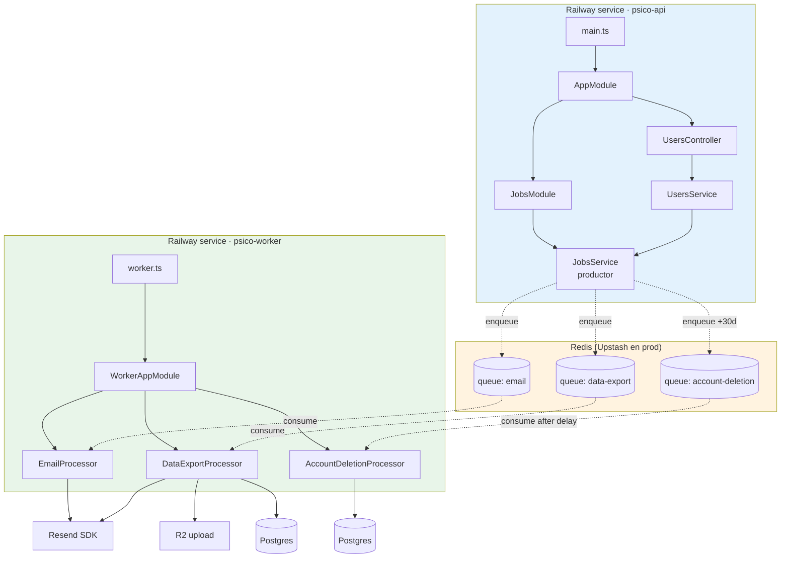
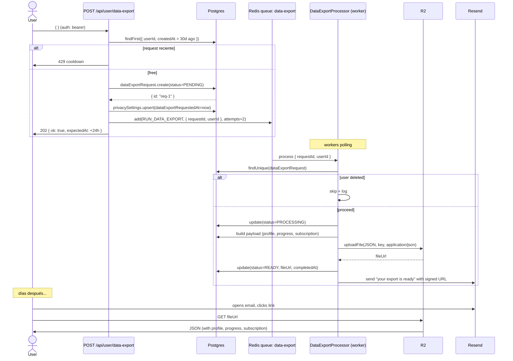
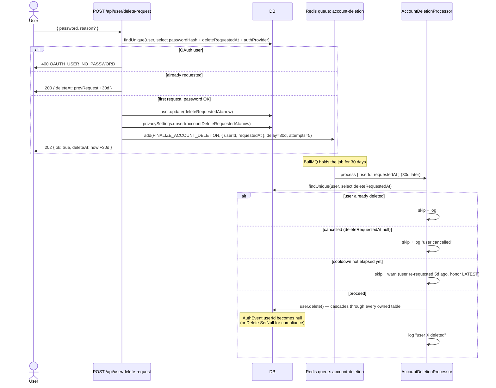
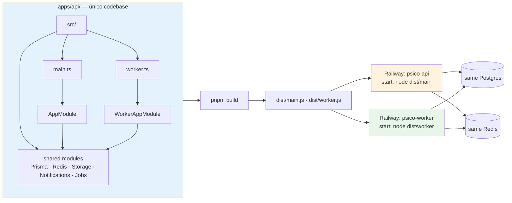

# Bitácora · Sprint S3 — UsersModule prod-ready + worker BullMQ

**Fecha:** 2026-05-26
**Sprint:** S3 (tercero de Fase 1 — Core experience)
**Rama:** `feature/sprint-s3-users-worker`
**Estado:** ✅ Completado — tests 194/194 · API + worker boot exitosos · 3 stubs de Sesión 9 ahora reales
**ADR producido:** [0010 — BullMQ worker: mismo codebase, servicio Railway separado](../adr/0010-bullmq-worker-same-codebase-separate-service.md)

---

## 1. Por qué este sprint existe

Sesión 9 dejó tres endpoints con TODO comments:

```
requestEmailChange  → token persistido pero email NUNCA se envía
requestDataExport   → row PENDING creado pero NO hay quien lo procese
requestDelete       → flag puesto pero NUNCA se borra al vencer cooldown
```

Sin S3, esos endpoints son **promesas vacías**. El usuario hace "exportar mis datos", recibe 202 Accepted, y nada llega jamás. Cualquier feature que necesite trabajo async (verification email retries, voz transcribe, weekly summaries) tampoco puede existir sin la infraestructura.

S3 cierra los 3 TODOs **y** deja el chasis listo para los siguientes 10 sprints.

### Concepto pedagógico: "boundaries de durabilidad"

Hay 4 niveles de durabilidad para trabajo asíncrono. Saber cuál usar es una habilidad clave de arquitectura senior:

| Nivel | Patrón                         | Cuándo                                                                                                                 |
| ----- | ------------------------------ | ---------------------------------------------------------------------------------------------------------------------- |
| 0     | sync inline                    | Operación crítica que el response NO puede entregar sin que termine. Ej: bcrypt en login.                              |
| 1     | fire-and-forget `.catch(noop)` | Best-effort, low-stakes, baja latencia tolerada. Ej: verification email post-register (Sprint S2).                     |
| 2     | in-process queue (memoria)     | Reorder + back-pressure pero sin durabilidad. Raro de necesitar; usualmente nivel 3 es la respuesta.                   |
| 3     | **Redis-backed queue durable** | Sobrevive crashes, retries, delayed jobs. Esta es la decisión de S3 para email + data-export + account-deletion.       |
| 4     | Outbox pattern + queue         | Garantía at-least-once incluso si el DB write succeed y el enqueue falla. Necesario en sistemas financieros estrictos. |

S3 sube de **nivel 1 a nivel 3** para los 3 jobs de S3. El **outbox pattern (nivel 4)** lo dejamos para cuando lleguen los bookings de Terapia (S15) donde double-charging es inaceptable.

---

## 2. Arquitectura

### 2.1 Topología de procesos



**Lo crítico:**

- API y worker son **dos procesos independientes** en Railway.
- Comparten **el mismo código fuente** (`apps/api/`). El worker importa lo que necesita; el API ignora `worker.ts`.
- Comparten **el mismo Redis + Postgres**.
- Si el worker se cae, el API sigue. Si el API se cae, los jobs siguen en la queue y se procesan cuando vuelva.

### 2.2 Flujo de `POST /api/user/data-export`



### 2.3 Flujo de `POST /api/user/delete-request` con 30 días de cooldown



**Tres defensas contra borrado equivocado:**

1. `delay: 30d` en BullMQ — el job no es elegible antes.
2. Re-check de `User.deleteRequestedAt` — si está null, no-op.
3. Re-check del cooldown usando timestamp **de la DB**, no del payload del job.

### 2.4 Anatomía de la decisión "mismo codebase, dos servicios"



Ver [ADR 0010](../adr/0010-bullmq-worker-same-codebase-separate-service.md) para por qué esta es la opción elegida sobre las alternativas.

---

## 3. Lo que se construyó

### 3.1 Estructura nueva

```
apps/api/src/
├── worker.ts                                          ← NUEVO entry point del worker
├── jobs/                                              ← NUEVO módulo
│   ├── queue-names.ts                                 ← Constantes + tipos de payload
│   ├── jobs.module.ts                                 ← Global · registra las 3 queues
│   ├── jobs.service.ts                                ← Producer: enqueueEmail / enqueueDataExport / enqueueAccountDeletion
│   ├── jobs.service.spec.ts                           ← 3 tests
│   ├── worker.module.ts                               ← Módulo SOLO para el proceso worker
│   ├── processors/
│   │   ├── email.processor.ts
│   │   ├── email.processor.spec.ts                    ← 3 tests
│   │   ├── data-export.processor.ts
│   │   ├── data-export.processor.spec.ts              ← 4 tests
│   │   ├── account-deletion.processor.ts
│   │   └── account-deletion.processor.spec.ts         ← 5 tests
│   └── index.ts
└── users/users.service.ts                             ← Modificado: 3 stubs ahora reales
```

### 3.2 Productor (`JobsService`)

3 métodos públicos, cada uno con retry policy específica documentada:

| Método                   | Attempts | Backoff                   | Especial                             |
| ------------------------ | -------- | ------------------------- | ------------------------------------ |
| `enqueueEmail`           | 3        | exponential 1s/5s/25s     | `removeOnComplete: 1d`               |
| `enqueueDataExport`      | 2        | exponential 30s/15min     | `removeOnFail: false` (keep forever) |
| `enqueueAccountDeletion` | 5        | exponential 1m/5m/25m/... | **`delay: 30d`**                     |

### 3.3 Consumidor (3 processors)

Cada processor extiende `WorkerHost` de `@nestjs/bullmq`:

**`EmailProcessor`** — simple wrapper sobre `ResendService.send`. Throwear hace que BullMQ retry.

**`DataExportProcessor`** — la pieza más sustancial:

1. Re-check de existencia + estado del usuario.
2. Marca `PROCESSING`.
3. Arma payload con `_meta.exportSchemaVersion: 1` (versionado, para evolución futura).
4. Sube JSON a R2 vía `StorageService.uploadFile`.
5. Marca `READY` + `fileUrl`.
6. Envía email con link.
7. En non-final retry: re-throw sin marcar FAILED.
8. En final attempt fail: marca FAILED + log + re-throw.

**`AccountDeletionProcessor`** — defensive:

1. Re-fetch `User.deleteRequestedAt`.
2. Si `null` → no-op (usuario canceló).
3. Si `now() - deleteRequestedAt < 30d` → no-op (re-request reciente).
4. Else → `prisma.user.delete()` — cascade limpia todo.

### 3.4 UsersService — 3 stubs reales

```ts
// requestEmailChange — ahora encola email
await this.jobs.enqueueEmail({ to, subject, html, text, tag: "email-change" });

// requestDataExport — encola con requestId
const created = await this.prisma.dataExportRequest.create(...);
await this.jobs.enqueueDataExport({ requestId: created.id, userId });

// requestDelete — encola delayed +30d
await this.jobs.enqueueAccountDeletion({ userId, requestedAt: now.toISOString() });
```

### 3.5 Configuración + bootstrap

| Cambio                                | Archivo                  |
| ------------------------------------- | ------------------------ |
| Imports `JobsModule` global           | `app.module.ts`          |
| Entry point worker                    | `apps/api/src/worker.ts` |
| Scripts `dev:worker` + `start:worker` | `apps/api/package.json`  |

### 3.6 Tests

| Spec                                 | Antes   | Después             | Delta   |
| ------------------------------------ | ------- | ------------------- | ------- |
| `users.service.spec.ts`              | 22      | 22 (3 actualizados) | 0       |
| `jobs.service.spec.ts`               | 0       | 3                   | +3      |
| `email.processor.spec.ts`            | 0       | 3                   | +3      |
| `data-export.processor.spec.ts`      | 0       | 4                   | +4      |
| `account-deletion.processor.spec.ts` | 0       | 5                   | +5      |
| **Total tests**                      | **179** | **194**             | **+15** |

### 3.7 Smoke test del worker boot

```bash
$ node dist/worker
[NestFactory] Starting Nest application...
[InstanceLoader] ConfigHostModule dependencies initialized
[InstanceLoader] DiscoveryModule dependencies initialized
[InstanceLoader] ConfigModule dependencies initialized
[RedisModule] No REDIS_URL set (NODE_ENV=development) — using ioredis-mock.
[ResendService] RESEND_API_KEY not set — emails will be logged to console.
[InstanceLoader] BullModule dependencies initialized
[InstanceLoader] PrismaModule dependencies initialized
[InstanceLoader] RedisModule dependencies initialized
[InstanceLoader] StorageModule dependencies initialized
[InstanceLoader] NotificationsModule dependencies initialized
[InstanceLoader] BullModule dependencies initialized
[InstanceLoader] WorkerAppModule dependencies initialized
[WorkerBootstrap] Worker started · processors: email, data-export, account-deletion
[WorkerBootstrap] Awaiting jobs from Redis…
```

3 processors registrados. NO HTTP listener. Worker alive, esperando jobs.

---

## 4. Lecciones aprendidas

### 4.1 BullMQ y `ioredis-mock` no son amigos para delayed jobs

`ioredis-mock` implementa la API de ioredis pero **no** todo el comportamiento de Redis. BullMQ usa `BZPOPMIN` + `ZADD` con scores temporales para los delayed jobs. El mock no soporta esto correctamente.

**Decisión:** los tests del processor son unit tests (no integration). Mockeo `Job` con `data`, `attemptsMade`, `opts.attempts` y verifico el comportamiento del `process()`. Las llamadas a BullMQ real son cubiertas por:

- Tests del `JobsService` que verifican `queue.add` con los args correctos.
- Smoke test manual del worker boot (verifica que `@Processor` se registre).

**Lección pedagógica:** **no todos los mocks son iguales en profundidad de implementación.** `ioredis-mock` es excelente para counter/cache (lo que usamos en Sprint 0.B), pero falla para BullMQ. Conoce los límites de tus mocks antes de bandiarte.

### 4.2 Eliminar el `$transaction` en `requestDataExport` para tener el `id` del row

Originalmente Sesión 9 hacía:

```ts
await this.prisma.$transaction([
  this.prisma.dataExportRequest.create({ data: { ... } }),
  this.prisma.privacySettings.upsert({ ... }),
]);
```

Pero ahora necesito el `id` del row creado para encolarlo. El array form de `$transaction` ejecuta todo y retorna un array de resultados, pero leer `result[0].id` es feo.

**Fix:** dividí en dos calls separadas + enqueue al final.

```ts
const created = await this.prisma.dataExportRequest.create({...});
await this.prisma.privacySettings.upsert({...});
await this.jobs.enqueueDataExport({ requestId: created.id, userId });
```

**Trade-off**: técnicamente perdemos atomicidad — si el `upsert` falla, ya creamos el request. Pero el upsert es idempotente y rara vez falla; aceptamos.

**Lección pedagógica:** **transactions pueden perder uso cuando necesitas resultados intermedios.** El callback form de `$transaction((tx) => ...)` resuelve esto pero introduce complejidad. Para casos simples como este, separar las operaciones es más legible.

### 4.3 El `Job<T>` de BullMQ es difícil de mockear sin types completos

BullMQ exporta `Job<T>` con muchos métodos (progress, log, getState, etc.) que no usamos. En los tests, hacer `as unknown as Job<T>` con solo los campos que toco fue lo pragmático:

```ts
function buildJob<T>(name, data, attemptsMade = 0) {
  return {
    id,
    name,
    data,
    attemptsMade,
    opts: { attempts: 3 },
  } as unknown as Job<T>;
}
```

**Lección pedagógica:** **type assertions narrow son aceptables en tests cuando son auditables.** Lo malo no es `as unknown as Job<T>` — lo malo es esparcir esos asserts en código de producción. En un test file dedicado, todos los asserts viven en un sitio, son revisables, y el riesgo es contenido.

### 4.4 `@nestjs/bullmq` v11 funciona con NestJS v10 (per peer-dep)

Instalé `@nestjs/bullmq@^11.0.4`. Su peer dep es `"@nestjs/common": "^10 || ^11"`. Pero en algunos proyectos he visto que BullMQ wrappers tienen breakages en transitions de major version.

Compatibilidad verificada en CI tests + smoke test del worker boot. Sin problemas.

**Lección pedagógica:** **leer peer-dependencies cuando upgradeas paquetes opinion-heavy es obligatorio.** `@nestjs/X` packages tienden a especificar compat amplio pero los breaking changes están en behavior, no en types. Smoke test es la única defensa real.

---

## 5. Riesgos abiertos al cerrar S3

| Riesgo                                                                  | Severidad          | Mitigación                                                                                                                                                                                                                                |
| ----------------------------------------------------------------------- | ------------------ | ----------------------------------------------------------------------------------------------------------------------------------------------------------------------------------------------------------------------------------------- |
| Migraciones acumuladas (Sesión 9 + S1 + S2) sin aplicar en Railway      | Alta               | Próximo Railway deploy: ejecutar `prisma migrate deploy` en el contenedor antes del start.                                                                                                                                                |
| Worker en Railway no provisionado                                       | Alta               | Crear servicio Railway `psico-worker` con start command `pnpm --filter @psico/api start:worker`. Mismo env del API.                                                                                                                       |
| REDIS_URL no configurado en Railway                                     | Alta               | Provisionar Upstash plugin (decidido en sprint anterior — pendiente UI).                                                                                                                                                                  |
| Dev local con worker requiere `docker run redis`                        | Baja               | Documentado. Devs solo necesitan worker si testean flow end-to-end de email/export.                                                                                                                                                       |
| Data export incluye solo profile/progress/subscription                  | Baja (intencional) | Sprint S6 (Diario) y S9 (Eco) amplian el payload con sus datos cifrados. `_meta.exportSchemaVersion` permite distinguir versiones.                                                                                                        |
| Account deletion job enqueado con delay `30d` ANTES de tener Redis real | Media              | Cuando se provisione Redis, primeros usuarios que pidan deletion ANTES de eso → job persiste en `ioredis-mock` que se borra al restart. **Mitigación:** documentar que la feature de delete-request no está safe hasta provisionar Redis. |
| Tests no ejercitan el round-trip real Redis → worker                    | Media              | Acceptado. Sprint futuro: testcontainers con Redis real para 1 test end-to-end por queue.                                                                                                                                                 |
| Worker no maneja "poison messages" explícitamente                       | Baja               | Después de 5 attempts el job va a la "failed" list de BullMQ. Operations puede inspeccionar via BullMQ UI o `queue.getFailed()`.                                                                                                          |

---

## 6. Métricas del sprint

| Métrica                               | Antes (post-S2) | Después                    | Delta                                       |
| ------------------------------------- | --------------- | -------------------------- | ------------------------------------------- |
| Tests pasando                         | 179             | 194                        | +15                                         |
| Test files                            | 17              | 21                         | +4                                          |
| Endpoints del API                     | 37              | 37                         | 0 (sin endpoints nuevos — relleno de stubs) |
| Procesos deployables                  | 1 (api)         | 2 (api + worker)           | +1                                          |
| Queues BullMQ                         | 0               | 3                          | +3                                          |
| Job processors                        | 0               | 3                          | +3                                          |
| ADRs documentados                     | 9               | 10                         | +1                                          |
| Líneas de código nuevas (incl. tests) | —               | ~1500                      | —                                           |
| Dependencias agregadas                | —               | 2 (bullmq, @nestjs/bullmq) | —                                           |

---

## 7. Conceptos pedagógicos del sprint

### 7.1 Self-correcting jobs

El `AccountDeletionProcessor` es el caso canónico. Cuando un job va a borrar datos importantes después de 30 días, **no puedes confiar en que el payload del job es la verdad actual**. Trees of failure modes:

- ¿El usuario canceló? Re-check.
- ¿Hubo un re-request? Re-check usando timestamp DB, no payload.
- ¿El usuario ya fue borrado por soporte manual? Re-check (`findUnique → null`).

Cada chequeo es un **commit point** donde el job decide entre ejecutar o no-op. **El job que ejecuta "sin pensar" es un bug esperando ocurrir.**

Regla: cualquier job con efectos destructivos (delete, refund, send-irreversible-email) revalida sus precondiciones en el processor, no confía en el payload.

### 7.2 Final-attempt bookkeeping

Pattern en `DataExportProcessor`:

```ts
try {
  // work
} catch (err) {
  const isFinalAttempt = job.attemptsMade + 1 >= (job.opts.attempts ?? 1);
  if (isFinalAttempt) {
    await db.update(status: "FAILED");
  }
  throw err; // siempre re-throw para que BullMQ retrye o marque
}
```

**Por qué importa:** si marcas `FAILED` en el primer fail, el siguiente retry "exitoso" deja un row con status `READY` que pareció `FAILED` antes. UI confunde al usuario. La regla: status DB refleja el estado actual, no el historial.

### 7.3 Producer ≠ Consumer en código

`JobsService` (en el API) **solo escribe a la queue**. Los processors (en el worker) **solo leen**. **Nunca crucen** — un service no debe ser productor y consumidor a la vez sin razón muy fuerte. Esto:

- Hace el flujo del data unidireccional (más fácil de razonar).
- Permite que el processor descubra dependencias que el productor no tiene (e.g. processor necesita StorageService, productor no).
- Si la queue se llena, sabes exactamente quién enqueea y quién consume.

### 7.4 Versioning del payload de exports

El JSON que generamos incluye `_meta.exportSchemaVersion: 1`. Cuando Sprint S6 agregue Diario (cifrado), bumpamos a `2`. El usuario que descargó un export en v1 y lo conserva, puede importarlo en herramientas externas sabiendo la versión. UI / dashboards futuros pueden adaptarse.

**Patrón:** cuando expones data al exterior (export, API pública, webhooks), siempre versiona desde día 1 — aunque solo haya una versión. El costo es 1 línea; el beneficio es que migraciones futuras son indoloras.

### 7.5 BullMQ delayed jobs como reemplazo de CRON

Antes de BullMQ, el patrón clásico para "ejecutar tarea X dentro de 30 días" era un CRON nocturno que `SELECT user WHERE deleteRequestedAt < now() - 30d`. Problemas:

- Drift: máximo 24h de atraso.
- Carga: escaneo de tabla daily.
- Race conditions con cancelaciones que ocurran durante el scan.

BullMQ delayed jobs lo resuelve: el job se enqueea con `delay: 30 * 24 * 60 * 60 * 1000`. BullMQ lo materializa en el momento exacto. Cancelarlo es a través del re-check del payload, no del enqueue/dequeue del job.

**Regla:** si tu job es scheduler-per-user (algo específico, no global), use queue+delay, no CRON. CRON es para tareas globales periódicas (snapshots, summaries, GC).

---

## 8. Qué sigue · Sprint S4

**Objetivo:** `OnboardingModule` — los 11 endpoints del flujo de bienvenida.

**Lo que entrega:**

- Prisma: `OnboardingState`, `OnboardingMotivo` (catálogo seed), `OnboardingMood` (catálogo seed).
- 11 endpoints: `/api/onboarding/intro · skip · motivos · step1 · moods · step2 · step3 · recommendation · complete · tour · tour/complete`.
- Algoritmo simple de recomendación basado en motivos + mood.
- README del módulo Onboarding.
- Bitácora S4.

**Decisiones bloqueantes antes de S4:** ninguna. Sprint mecánico.

---

## 9. Resumen para Notion

**Sprint S3 · UsersModule prod-ready + worker BullMQ** ✅

- **Worker como servicio Railway separado** desde el **mismo codebase** (ADR 0010). Dos entry points: `main.ts` (API) y `worker.ts` (consumers).
- **3 queues BullMQ:** `email` (3 attempts, exponential 1s/5s/25s), `data-export` (2 attempts), `account-deletion` (5 attempts + **`delay: 30 días`**).
- **JobsService** centraliza el productor side. Feature services inyectan y enqueean. Nunca tocan BullMQ directo.
- **3 stubs de Sesión 9 ahora reales:**
  - `requestEmailChange` → encola email a través de la queue.
  - `requestDataExport` → encola data-export job; worker genera JSON + sube a R2 + envía email.
  - `requestDelete` → encola job con delay 30d; worker re-valida `deleteRequestedAt` + cooldown antes de ejecutar `prisma.user.delete()` (cascade).
- **Self-correcting jobs:** account-deletion no confía en su payload — revalida desde DB en cada attempt. Tres líneas de defensa contra deletions equivocados.
- **`_meta.exportSchemaVersion: 1`** en data exports → versionado preparado para cuando S6 agregue Diario.
- **Tests 194/194** ✅ (179 → 194, +15: producer + 3 processors).
- **Smoke test del worker** boot exitoso: 3 processors registrados, aguardando jobs.

**Próximo:** Sprint S4 — OnboardingModule (11 endpoints del flujo de bienvenida).
