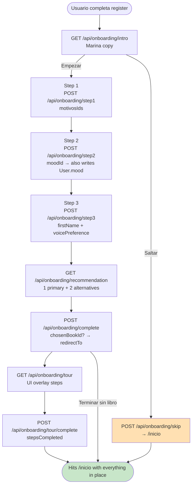
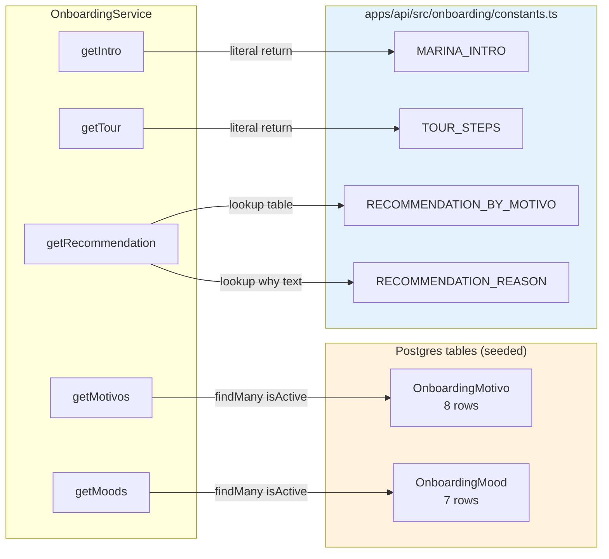
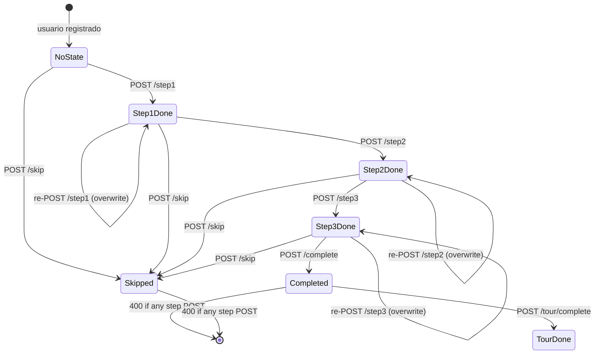

# Bitácora · Sprint S4 — OnboardingModule

**Fecha:** 2026-05-26
**Sprint:** S4 (cuarto de Fase 1 — Core experience)
**Rama:** `feature/sprint-s4-onboarding`
**Estado:** ✅ Completado — tests 217/217 · build verde · 11 endpoints registrados bajo `/api/onboarding/*`
**ADR producido:** ninguno (sprint mecánico, sin decisiones nuevas)

---

## 1. Por qué este sprint existe

Sin onboarding:

- El primer login deja al usuario en `/inicio` viendo libros que pueden no ser relevantes — abandono ~70 % típico (datos de otras apps en el espacio).
- No tenemos información estructurada de **por qué** un usuario está aquí. La capa de recomendaciones (Pulso S25, recos en biblioteca S5) opera ciega.
- El campo `firstName` (Sesión 9) está vacío para todos los usuarios LOCAL — la UI muestra "Hola, [email]" en lugar de "Hola, Jorge".

Con onboarding:

- 4 pasos en ≤90 segundos → primer libro relevante en pantalla cuando llegan a `/inicio`.
- Estructura los motivos del usuario para nutrir features futuros (Patrones S10, Pulso S25, Eco persona S9).
- Es **opcional** — el `skip` está ahí desde el primer momento, no es dark pattern.

### Concepto pedagógico: "audit table vs canonical state"

Un dilema recurrente cuando agregas state derivado del onboarding:

- ¿`firstName` vive en `User.firstName` o en `OnboardingState.firstName`?
- ¿`mood` vive en `User.mood` o en `OnboardingState.initialMoodId`?

**Respuesta canónica:** los **datos vivos** (los que el resto de la app lee y muta) viven en su tabla canónica (`User`, `UserPreferences`). El **audit** del onboarding captura el **pick original**, jamás se sobreescribe.

| Campo            | Audit (OnboardingState)  | Live (User / UserPreferences)     |
| ---------------- | ------------------------ | --------------------------------- |
| First name       | —                        | `User.firstName`                  |
| Voice preference | `initialVoicePreference` | `UserPreferences.voicePreference` |
| Mood             | `initialMoodId`          | `User.mood`                       |
| Recommended book | `recommendedBookId`      | (no equivalente — es solo audit)  |
| Chosen book      | `chosenBookId`           | (no equivalente — es solo audit)  |

**Por qué importa:** cuando un PM pregunta "¿cuántos usuarios pusieron `mood=ansiedad` originalmente vs ahora?" la respuesta requiere ambas columnas. Sin el audit, el dato del primer pick se pierde para siempre tras el primer cambio.

**Regla:** cuando un flow guiado captura inputs del usuario, separa `original` de `current`. La columna `current` es la que tu app lee normalmente. La columna `original` es read-only para analytics.

---

## 2. Arquitectura

### 2.1 Flujo de los 4 pasos



### 2.2 Layout de catalogs vs constants



**Por qué dos lugares:**

- **DB tables** para los catálogos que los usuarios eligen — necesitamos referential integrity (`OnboardingState.motivosIds` debe poder validarse) + i18n futuro + edición sin deploy.
- **Code constants** para texto editorial (Marina intro, tour copy) y mapping internos (motivo → bookSlug, why text) — cambian raro, editing es code-review territory, y no necesitan ser referenciados por user state.

### 2.3 Idempotencia + lifecycle guard



**Reglas explícitas:**

- Step POSTs son **idempotentes** mientras el flow esté abierto — se puede re-enviar step1 con motivos distintos.
- Una vez `complete` o `skip` → todos los step POSTs subsiguientes devuelven `400 ONBOARDING_ALREADY_COMPLETED` o `ONBOARDING_ALREADY_SKIPPED`.
- `tour/complete` es independiente del lifecycle del onboarding (puedes saltar el onboarding y hacer el tour, o viceversa).

---

## 3. Lo que se construyó

### 3.1 Schema Prisma — 3 modelos nuevos

```prisma
// Catalogs (seeded)
model OnboardingMotivo { id (PK) · label · icon · order · isActive }
model OnboardingMood   { id (PK) · label · swatch · order · isActive }

// Per-user state (1:1 with User)
model OnboardingState {
  userId @unique
  motivosIds              String[]
  initialMoodId           String?
  initialVoicePreference  String?
  recommendedBookId       String?
  chosenBookId            String?
  step1CompletedAt        DateTime?
  step2CompletedAt        DateTime?
  step3CompletedAt        DateTime?
  onboardingCompletedAt   DateTime?
  onboardingSkippedAt     DateTime?
  tourCompletedAt         DateTime?
  tourStepsCompleted      Int @default(0)
}
```

Update en `User`: nueva relación `onboardingState OnboardingState?`.

### 3.2 Seed

`prisma/seed.ts` extendido con:

- **7 motivos** (ansiedad, tristeza, relaciones, vínculos, trabajo, duelo, explorar).
- **7 moods** (calma, foco, energía, reflexión, alegría, ansiedad, tristeza).

Idempotente (`upsert` por id). Ejecutar con `pnpm --filter @psico/api prisma db seed`.

### 3.3 Estructura del módulo

```
apps/api/src/onboarding/
├── constants.ts                         ← Marina intro, tour steps, recommendation mapping
├── onboarding.module.ts
├── onboarding.controller.ts             ← 11 handlers + @ApiTags + @ApiBearerAuth
├── onboarding.controller.spec.ts        ← 3 tests (metadata posture)
├── onboarding.service.ts                ← 11 service methods + helpers
├── onboarding.service.spec.ts           ← 20 tests
├── dto/
│   ├── step1.dto.ts                     ← motivosIds[] (1-5 strings)
│   ├── step2.dto.ts                     ← moodId
│   ├── step3.dto.ts                     ← firstName (regex unicode letters) + voicePreference
│   ├── complete.dto.ts                  ← chosenBookId?: string | null
│   └── tour-complete.dto.ts             ← stepsCompleted: 0-20
├── README.md
└── index.ts
```

### 3.4 Tests

| Spec                            | Tests   | Cobertura                                                                                                                                                  |
| ------------------------------- | ------- | ---------------------------------------------------------------------------------------------------------------------------------------------------------- |
| `onboarding.service.spec.ts`    | 20      | Cada endpoint + edge cases (unknown motivos, inactive mood, fallback recommendation, completed-already, skipped-already, chosenBookId=null, catalog drift) |
| `onboarding.controller.spec.ts` | 3       | JwtAuthGuard aplicado, 11 handlers exactos, path = "onboarding"                                                                                            |
| **Delta total**                 | **+23** | 194 → 217                                                                                                                                                  |

### 3.5 Tipos exportados desde `@psico/types`

11 tipos nuevos:

- `OnboardingIntro`, `OnboardingMotivo`, `OnboardingMood`, `OnboardingTourStep`, `OnboardingVoicePreference`
- Request DTOs: `OnboardingStep1Request`, `OnboardingStep2Request`, `OnboardingStep3Request`, `OnboardingCompleteRequest`, `OnboardingTourCompleteRequest`
- Response DTOs: `OnboardingStepResponse`, `OnboardingBookRecommendation`, `OnboardingRecommendationResponse`, `OnboardingCompleteResponse`

### 3.6 Cliente OpenAPI

`generated.ts` regenerado: **35.0 KB → 44.9 KB** (+10 KB de tipos onboarding). `generate:check` sigue verde.

---

## 4. Lecciones aprendidas

### 4.1 String[] en Prisma vs FK explícita para `motivosIds`

Tuve dos caminos para almacenar los motivos elegidos:

**A. `String[]`** — array nativo de Postgres. Sin FK. Aplicación valida.
**B. Join table `UserOnboardingMotivo`** — N:M con FK constraint.

Elegí **A** porque:

- 1-5 motivos por usuario, en una única write. El cardinality justifica array.
- La FK la **emulamos en la aplicación** (`findMany({ where: { id: { in: ids } } })` con count check).
- Si en el futuro queremos analizar "cuántos usuarios eligieron motivo X", una sola query (`SELECT count(*) FROM "OnboardingState" WHERE 'X' = ANY("motivosIds")`).

**Trade-off:** sin FK, un motivo borrado físicamente (no `isActive=false`) deja referencias huérfanas. Mitigación: nunca borramos, solo desactivamos.

**Regla:** cuando la cardinality es low (≤10 elements) y el array no cambia frecuentemente, el array nativo es legítimo. Para N:M reales con queries complejas (joins, agregaciones por elemento), join table.

### 4.2 Validación de referential integrity en el service

Implementé `saveStep1` con dos queries:

```ts
const valid = await prisma.onboardingMotivo.findMany({
  where: { id: { in: dto.motivosIds }, isActive: true },
  select: { id: true },
});
const validIds = new Set(valid.map((m) => m.id));
const unknown = dto.motivosIds.filter((id) => !validIds.has(id));
if (unknown.length > 0) throw new BadRequestException({ code: "UNKNOWN_MOTIVO_IDS", ... });
```

**Por qué no confiar en Postgres y dejar que la inserción falle:**

- El error de Postgres ("invalid input value for enum/text array") es opaco al cliente.
- No podemos decir **cuáles** son los IDs malos.
- El status code sería 500, no 400.

**Validar en aplicación nos da:**

- 400 explícito con un código machine-readable (`UNKNOWN_MOTIVO_IDS`).
- Lista de los IDs problemáticos en `message`.
- Aceptable performance (~5ms para 7 motivos).

**Regla:** cuando una validación cruza una tabla referenciada, hazla en la aplicación para producir errores accionables. La FK de Postgres es el último cinturón de seguridad, no la primera capa.

### 4.3 `OnboardingState.upsert` vs separar create/update

Mi instinto inicial fue:

```ts
const existing = await prisma.onboardingState.findUnique({ where: { userId } });
if (existing) {
  await prisma.onboardingState.update({ where: { userId }, data: { ... } });
} else {
  await prisma.onboardingState.create({ data: { userId, ... } });
}
```

**Problema:** race condition. Dos requests del mismo usuario en concurrencia pueden ambos hacer `findUnique → null` y ambos tratar de `create` → uno falla con unique constraint.

**Solución:** `prisma.onboardingState.upsert({ where, create, update })`. Atómico vía SQL `INSERT ... ON CONFLICT (userId) DO UPDATE`.

**Regla:** cuando una tabla tiene `@@unique` y haces "if exists update, else create", usa siempre `upsert`. Es más corto, más correcto, y mejor performance (1 round-trip vs 2).

### 4.4 Cover token determinístico cuando falta el dato real

El design pide `cover: "cool" | "warm" | "mixed"` en cada recommendation. El `Book` model actual no tiene esa columna (eso llega en Sprint S22 con `BookCover`).

Mi solución: **hash determinístico del bookId** → uno de los 3 tokens:

```ts
private pickCoverToken(bookId: string): "cool" | "warm" | "mixed" {
  let hash = 0;
  for (let i = 0; i < bookId.length; i++) hash = (hash * 31 + bookId.charCodeAt(i)) >>> 0;
  return tokens[hash % 3]!;
}
```

**Por qué determinístico:** el mismo libro siempre obtiene el mismo cover token. UX consistente sin DB column.

**Por qué temporal:** cuando S22 lande `BookCover.token`, una sola línea cambia el método. Las UI cards ya muestran consistentemente; solo cambiamos la fuente.

**Regla:** cuando el contrato exige un campo que aún no tienes la DB column para, prefiere un fallback **determinístico** sobre uno aleatorio. UX consistente > UX correcta-pero-cambiante.

---

## 5. Métricas

| Métrica                                      | Antes (post-S3) | Después | Delta               |
| -------------------------------------------- | --------------- | ------- | ------------------- |
| Tests pasando                                | 194             | 217     | +23                 |
| Test files                                   | 21              | 23      | +2                  |
| Endpoints totales                            | 37              | 48      | +11                 |
| Tablas Prisma                                | 22              | 25      | +3                  |
| Tipos en `@psico/types`                      | ~70             | ~84     | +14                 |
| Líneas generated.ts                          | ~900            | ~1180   | +280                |
| ADRs documentados                            | 10              | 10      | 0 (sprint mecánico) |
| Bytes generated.ts                           | 35.0 KB         | 44.9 KB | +9.9 KB             |
| Líneas de código nuevas (incl. tests + docs) | —               | ~1700   | —                   |

---

## 6. Riesgos abiertos al cerrar S4

| Riesgo                                                                                | Severidad             | Mitigación                                                                                                                       |
| ------------------------------------------------------------------------------------- | --------------------- | -------------------------------------------------------------------------------------------------------------------------------- |
| Migración Prisma de S4 (3 modelos nuevos) sin aplicar en Railway                      | Alta                  | `prisma migrate dev --name s4_onboarding` cuando se haga deploy. Combinable con migraciones acumuladas.                          |
| Catálogos no seedeados en Railway prod                                                | Alta                  | Después del deploy: `prisma db seed`. Sin seed, `/onboarding/motivos` devuelve `{ motivos: [] }`.                                |
| El `book.author` field todavía no existe → recommendation hardcodea "Marina Quintana" | Baja                  | Sprint S5 (BookAuthor model) lo plug-ea. Cliente acepta el field como string hoy.                                                |
| `chapter1Preview` usa `book.description` como stand-in                                | Baja                  | Sprint S5 (Lector + ChapterBlock model) lo conecta a la primera bloque real.                                                     |
| El `cover` token es hash-derived, no real                                             | Baja                  | Sprint S22 (Author book design) introduce `BookCover.token`. Una línea de cambio.                                                |
| Tests no ejercitan el flujo end-to-end con DB real                                    | Media                 | E2E con Prisma mocked. Si seed cambia y rompe el algoritmo de recomendación, falla en producción. Sprint futuro: testcontainers. |
| Frontend de onboarding (web + mobile) inexistente                                     | Crítico para producto | Front companion sprint S4-front cuando el usuario lo apruebe.                                                                    |

---

## 7. Conceptos pedagógicos del sprint

### 7.1 Catálogos en DB vs constants en código

Decisión por dimensión:

| Dimensión                                | DB table                                     | Constants in code                       |
| ---------------------------------------- | -------------------------------------------- | --------------------------------------- |
| **Cambia frecuencia**                    | Media-alta (motivos pueden agregarse cada Q) | Baja (Marina intro cambia 1 vez al año) |
| **Necesita FK desde otra tabla**         | Sí                                           | No                                      |
| **Editor no-técnico debe poder cambiar** | Sí (idealmente con admin UI)                 | No                                      |
| **i18n**                                 | Sí (1 row por locale o JSON column)          | Hardcoded por locale                    |
| **Atomic con otros writes**              | Sí                                           | N/A                                     |

`OnboardingMotivo` y `OnboardingMood` cumplen 3 de 4 → DB. `MARINA_INTRO` y `TOUR_STEPS` cumplen 0 de 4 → constants.

### 7.2 Idempotency-by-overwrite

Los step POSTs son idempotentes pero **no** vía Idempotency-Key (que es el patrón del Sprint 0.B). Aquí la idempotencia es semántica: el state final solo depende del último POST, no del número de POSTs.

```ts
upsert({
  where: { userId },
  create: { userId, motivosIds: dto.motivosIds, step1CompletedAt: now },
  update: { motivosIds: dto.motivosIds, step1CompletedAt: now },
});
```

Re-POST con datos distintos → overwrite. Re-POST con datos idénticos → no-op (los timestamps se actualizan pero el resultado no cambia).

**Cuándo usar este patrón vs Idempotency-Key:**

- **Step writes en un flow guided** (este sprint, autosave de Editor de autor en S20): semantic idempotency.
- **Cobros, bookings, irreversible side effects** (S11 billing, S15 terapia): Idempotency-Key strict.

### 7.3 Audit vs canonical: dos tablas, dos verdades

Lección de §1.3 — captura el original Y la versión actual:

```
User.firstName      ← lo que la app muestra cuando saluda al usuario hoy
OnboardingState.??  ← (no captured here intentionally — firstName never changes in onboarding alone)

User.mood              ← mood actual (se cambia desde /inicio)
OnboardingState.initialMoodId  ← mood elegido el día del registro
```

**Cuándo agregar audit:** cuando un dato puede cambiar y querrías saber el valor original para analítica. **No** todo dato lo merece — `User.name` cambia (rename) pero pocos productos analizan rename frequency. `mood` sí lo merece: trayectoria emocional es producto.

### 7.4 Fallback en cascada para datos faltantes

El método `toRecommendation()` tiene 3 niveles de fallback:

```ts
const reasonKey = matchedMotivo ? `${matchedMotivo}:${bookSlug}` : null;
const why = reasonKey
  ? (RECOMMENDATION_REASON[reasonKey] ?? FALLBACK_REASON)
  : FALLBACK_REASON;
```

1. **Best case**: motivo matchea con book + tenemos `why` específico → mensaje personalizado.
2. **Medium**: motivo matchea pero no tenemos `why` específico → fallback genérico.
3. **Worst**: ningún motivo matcheó → fallback genérico.

El UX nunca rompe; siempre hay un `why` legible. La calidad degrada gradualmente.

**Regla:** APIs públicas (que ven usuarios) deben **siempre** retornar shape válido. Edge cases se manejan con fallbacks en cascada, no con `null` o errores HTTP.

### 7.5 Validación de DTO con Unicode regex

Step 3 acepta `firstName` con regex `/^[\p{L}\p{M}\s'.-]+$/u`. Breakdown:

- `\p{L}` — cualquier letra Unicode (incluyo acentos, latín extendido).
- `\p{M}` — combining marks (necesario para algunas grafías).
- `\s` — espacios (María José).
- `'.-` — apóstrofo (O'Connor), punto (J.R.), guion (Smith-Jones).

**Lo que rechaza:** dígitos, símbolos, emoji, control chars.

**Lección:** el regex `/^[A-Za-z]+$/` te falla con "María" o "François". Usa siempre `/\p{L}/u` para names. Es POSIX y JavaScript moderno (con flag `u`).

---

## 8. Qué sigue · Sprint S5

**Objetivo:** **HomeModule** + expansión de **BooksModule** según el diseño.

**Lo que entrega:**

- `GET /api/home` — endpoint agregado que sirve el dashboard de `/inicio` (libros + plan + diario prompt + último Eco thread).
- Sprint S5 también amplia `BooksModule`: rebrand de `/content/books` a `/books`, agregar `BookFavorite`, `BookBookmark`, `BookReview`, `BookAuthor` model, endpoints `recos`, `categories`, `authors`, `reviews`.
- ~9 endpoints nuevos en total.
- Bitácora S5.

**Decisiones bloqueantes antes de S5:**

1. Stripe webhook actual está en `/subscriptions/webhook` — moverlo a `/billing/webhook` (S11) o quedarse con el namespace `/content/books` (S5 path). Sin urgencia, son sprints distintos.
2. ¿Mantener `content/books` y `content/chapters` namespaces hasta cleanup en S30, o renombrar en S5? Default: agregar `/books` namespace nuevo + dejar `/content/books` como alias deprecated por 90 días.

---

## 9. Resumen para Notion

**Sprint S4 · OnboardingModule** ✅

- **11 endpoints** bajo `/api/onboarding/*` mapeando los 4 pasos del diseño + skip + tour.
- **3 modelos Prisma:** `OnboardingMotivo` (catálogo, 8 entries seeded), `OnboardingMood` (catálogo, 7 entries), `OnboardingState` (1:1 con User).
- **Audit vs canonical separation:** OnboardingState captura el **pick original** (motivosIds, initialMoodId, initialVoicePreference, recommendedBookId, chosenBookId); el state vivo va a `User` y `UserPreferences`.
- **Recommendation algorithm:** mapping hardcoded (motivo → bookSlug) en `constants.ts` con fallback al anchor book (`emociones-en-construccion`). Why text personalizado por par `motivo:bookSlug`.
- **Lifecycle guard:** `assertNotAlreadyClosed()` rechaza step POSTs después de skip o complete (400 con código machine-readable).
- **Catalog validation:** `saveStep1`/`saveStep2` valida cada id contra la DB y produce `400 UNKNOWN_MOTIVO_IDS` / `UNKNOWN_MOOD_ID` con la lista de IDs malos.
- **Tests 217/217** ✅ (194 → 217, +23 tests para S4).
- **Cliente OpenAPI regenerado:** 35.0 KB → 44.9 KB (+10 KB de tipos).
- **README del módulo** con tabla de endpoints + data model + lifecycle + cómo editar catalogs.

**Próximo:** Sprint S5 — HomeModule (`GET /api/home` agregador) + expansión de BooksModule (recos, categories, authors, favorites, bookmarks, reviews).
