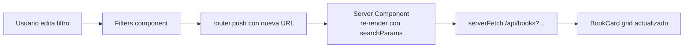

# Sprint S5-front — Web companion (Home + Biblioteca + Detalle + Diario)

**Fecha:** 2026-05-26
**Rama:** `feature/sprint-s5-front`
**Tests:** 252/252 pasando (sin cambios en cobertura backend)
**ADRs producidos:** ninguno (sprint orientado a UI)
**Bitácora previa:** [sprint-s6.md](sprint-s6.md)

---

## §1 · Decisiones del usuario antes de empezar

1. **Web primero, mobile después** — el dev loop de Next.js es más rápido y la mayoría de los handoffs tienen el layout completo para desktop.
2. **Orden de pantallas:** Home → Biblioteca → Detalle → Diario básica.
3. **Implementar el diseño de Claude Design** — usar los HTML/CSS como referencia visual fiel, NO copiar el JSX directamente (per CLAUDE.md mentor mode).

---

## §2 · Lo que se construyó

### Páginas (4 nuevas / re-implementadas)

| Ruta                               | Estado     | Notas                                                                                         |
| ---------------------------------- | ---------- | --------------------------------------------------------------------------------------------- |
| `/dashboard`                       | ♻️ rewrite | Greeting + ContinueBook + EcoMoment + Recos + Stats + ReflectionPrompt + SideRail             |
| `/dashboard/biblioteca`            | ✨ new     | Filtros (tabs + categoría + autor + sort + search debounced) + grid 1/2/3/4 cols + paginación |
| `/dashboard/biblioteca/[idOrSlug]` | ✨ new     | Hero + author card + chapters list + reviews + rating breakdown + paywall block               |
| `/dashboard/diario`                | ✨ new     | Composer (placeholder hasta S6-crypto) + entries list + prompt-of-the-day                     |

### Componentes nuevos (16)

**Home dashboard** (`apps/web/src/components/dashboard/home/`):

- `GreetingHero` — saludo + eyebrow + streak badge
- `ContinueBookCard` — libro en curso con CTA "Seguir leyendo"
- `EcoMomentCard` — prompt del día (botones deshabilitados hasta S10)
- `RecosRow` — 3 cards con reason text
- `StatsGrid` — 3 KPI cards (racha · esta semana · entradas diario)
- `ReflectionPromptCard` — prompt con dismiss client-side (POST `/reflection-prompts/:id/dismiss`)
- `SideRail` — UpgradeCard (free) + StreakCard (ring conic-gradient) + ShortcutsCard
- `EmptyHomeState` — fallback cuando `/api/home` falla

**Biblioteca** (`apps/web/src/components/dashboard/biblioteca/`):

- `BookCard` — grid card con toggles optimistas para favorito/bookmark
- `Filters` — sticky bar: tabs + search debounced (250ms) + 2 selects + sort
- `Pagination` — page query mutation

**Detalle** (`apps/web/src/components/dashboard/detalle/`):

- `BookHero` — cover + meta + author + stats + CTA con POST `/start`
- `ChaptersList` — TOC con badges (completed/started/locked)
- `ReviewsSection` — rating breakdown + 5 reviews + "Escribir reseña" gated

**Diario** (`apps/web/src/components/dashboard/diario/`):

- `CryptoNotice` — banner honesto sobre el gap E2E hasta S6-crypto
- `Composer` — visible pero `Guardar` disabled hasta el módulo cripto
- `EntryList` — render de metadata (mood/tags/kind/date) sin descifrar body

### Helpers

- `cover-gradients.ts` — `coverGradient(token)` reutilizable entre las 4 pantallas para resolver CoverToken → CSS gradient con los tokens del design system (`var(--color-lavender-300)`, `var(--color-sage-700)`, etc.).

### Cambios en el shell

- `_DashboardShell.tsx` — nav rebrand: `/dashboard/books` → `/dashboard/biblioteca` + nuevo item `/dashboard/diario` con icon `✎`. Item `Perfil` removido (sigue en `/perfil` cuando se construya en S?-front).

---

## §3 · Bug crítico encontrado y arreglado en sprint

### `import type` strip-mining de DTO metadata

**Síntoma:** `GET /api/books?view=catalogo` devolvía 400 con `property view should not exist`. Igual para `sort`, `page`, `perPage`. Todos los query params eran rechazados aunque la `ListBooksQueryDto` los declaraba con `@IsOptional()`.

**Causa raíz:** los controllers usaban `import type { ListBooksQueryDto } from ...`. TypeScript erasea esos imports al compilar — el símbolo no existe en runtime. Cuando NestJS intenta leer `Reflect.getMetadata("design:paramtypes", target, key)` para aplicar el `ValidationPipe`, ve `Object` en lugar de la clase real. Con `whitelist: true + forbidNonWhitelisted: true`, eso significa "lista vacía de props permitidas" → todo se rechaza.

**Reach:** 8 controllers afectados (books, chapters, progress, subscription, ai, users, diario, onboarding). **Esta misma trampa quemó el proyecto antes con DI tokens** (ADR/lint override anterior) — la lección no había sido propagada a las DTOs.

**Fix:** convertir `import type { *Dto }` → `import { *Dto }` + `// eslint-disable-next-line @typescript-eslint/consistent-type-imports` en cada controller. Solo el `AuthController` lo tenía bien — por eso los E2E de auth pasaban y el bug no se detectó en S1-S6.

**Verificación post-fix:**

```
GET /api/books?view=catalogo&sort=recent&perPage=10&page=1 → 500 (Prisma — tablas locales sin migrar)
```

La 500 es el siguiente error en la cadena (DB sin migración pgvector local), NO de validación — el pipe ya acepta los params correctamente. En Railway con migraciones aplicadas el endpoint responderá 200.

### Bug secundario: temporal dead zone en `Filters.tsx`

`useEffect` referenciaba `pushParams` antes de la declaración. Fix: mover `useCallback` arriba.

---

## §4 · Disciplina aplicada del diseño Claude Design

Per CLAUDE.md mentor mode, los `docs/design/*.jsx` son prototipos **NO** producción. La implementación siguió este protocolo en cada pantalla:

1. **Abrir el HTML** → entender layout, jerarquía visual, espaciado.
2. **Leer el handoff `.md`** correspondiente → contratos de datos y estados.
3. **Componer con design system tokens existentes** (`apps/web/src/app/globals.css` ya tenía la paleta completa de lavender/sage/warm + Geist font + sombras).
4. **NO copy-paste del JSX** — adaptado a Next.js App Router + Tailwind v4 + Server Components donde aplica.

Resultados:

- Mismo look & feel que los HTML del prototipo
- Código idiomático Next.js + tipado fuerte
- Reutilizable: `coverGradient`, `BookCard`, `SideRail` se reusan entre pantallas
- Estados de loading/error/empty implementados según handoff

---

## §5 · Decisiones del sprint

1. **Composer del Diario disabled (no fake-crypto)** — ADR 0007 §G compromete "no recovery path". Fake-encrypted entries hoy serían unreadable cuando el real cripto aterrice. Honesto: banner + composer visible pero Guardar bloqueado.
2. **Toggles favorito/bookmark optimistas** — flip local, dispatch async, revert si falla. UX crisp sin round-trip por click.
3. **Search con 250ms debounce** — la URL es el source of truth (re-render server-side por Next App Router).
4. **`/api/home` errors → EmptyHomeState** — el dashboard nunca crashea por una hiccup del backend; degrada a "tu primera semana empieza ahora" + CTA explorar.
5. **Server Components everywhere** salvo donde se necesita estado cliente (filtros, toggles, dismiss). Pages son SSR via `dynamic = "force-dynamic"`.
6. **`accessToken` se lee server-side** via `getAccessToken()` cookie y se pasa como prop a Client Components que necesitan llamar la API directamente (toggles).

---

## §6 · Diagramas

### 6.1 — Arquitectura de Server Components

```mermaid
flowchart TB
  classDef sc fill:#dbeafe,stroke:#3b82f6,color:#1e40af
  classDef cc fill:#fce7f3,stroke:#ec4899,color:#831843

  layout[DashboardLayout<br/>Server]:::sc
  shell[DashboardShell<br/>Client - sidebar state]:::cc
  layout --> shell

  home[/dashboard page<br/>Server: serverFetch /home]:::sc
  bib[/dashboard/biblioteca<br/>Server: serverFetch /books with query]:::sc
  det[/dashboard/biblioteca/&#91;id&#93;<br/>Server: serverFetch /books/:id]:::sc
  dia[/dashboard/diario<br/>Server: parallel serverFetch]:::sc

  home --> ContinueBookCard:::sc
  home --> EcoMomentCard:::sc
  home --> RecosRow:::sc
  home --> StatsGrid:::sc
  home --> ReflectionPromptCard:::cc
  home --> SideRail:::sc

  bib --> Filters:::cc
  bib --> BookCard:::cc
  bib --> Pagination:::cc

  det --> BookHero:::cc
  det --> ChaptersList:::sc
  det --> ReviewsSection:::sc

  dia --> CryptoNotice:::sc
  dia --> Composer:::cc
  dia --> EntryList:::sc
```

### 6.2 — Filtros + URL como source of truth



---

## §7 · Verificación

```bash
pnpm --filter @psico/api test            # 252/252
pnpm --filter @psico/api typecheck       # ok
pnpm --filter @psico/api lint            # ok
pnpm --filter @psico/web typecheck       # ok
pnpm --filter @psico/web lint            # ok
pnpm --filter @psico/web build           # ok (8 rutas, ~96 KB first load)
```

API boot — el fix de DTO confirmado:

```
GET /api/books?view=catalogo&sort=recent&perPage=10&page=1
→ 500 INTERNAL_ERROR (DB local sin migraciones — esperado)
  Antes del fix: 400 VALIDATION_ERROR "property view should not exist"
```

---

## §8 · Deuda técnica abierta

- **Mobile companion (S5-front-mobile)** sin implementar — siguiente paso.
- **`/dashboard/profile`** sin implementar (UsersModule completo pero sin UI).
- **Modal "Escribir reseña"** sin implementar — botón visible pero deshabilitado hasta que el usuario complete un libro Y se cree el modal.
- **Cliente cripto (S6-crypto)** — pre-requisito para que el Composer del Diario funcione. Argon2id + XChaCha20-Poly1305 + ECDH X25519 (ADR 0007).
- **Lector** sin implementar — el CTA "Empezar/Continuar" redirige a la página de detalle del libro pero no abre un reader. Sprint S?-reader pendiente.
- **Selector de mood en composer** — fijo a "calma" hasta S6-crypto wire del flow real.
- **`continueBook` ringbuffer** — la app linkea a `/dashboard/biblioteca/:id` en lugar de directamente al reader; el reader lo abre en `chapterN`.
- **Audio player** — botón "Escuchar audio" disabled hasta S8 VoiceModule.

---

## §9 · Aprendizajes / patrones

### `import type` con DTOs

NestJS depende de `reflect-metadata` para leer tipos en runtime. `import type` los borra. **Regla:** en cualquier file donde un DTO se use como parámetro de @Query/@Body/@Param, importarlo como VALUE (no type). Lo mismo aplica para DI tokens. **Esta regla debe vivir en eslint-config** como override permanente cuando termine el proyecto.

### Server Components + Client Components donde toca

App Router permite componer Server Components (default, sin runtime overhead) con Client Components puntuales. La regla práctica:

- **Página = Server** (data fetch + composición)
- **Componentes "tontos" = Server** (BookHero, ChaptersList)
- **Componentes con estado/eventos = Client** (Filters, BookCard toggles, ReflectionPromptCard dismiss)

### URL como state primary

Los filtros en Biblioteca **no** mantienen estado local — todo va a `searchParams`. Pros: links compartibles, refresh-safe, navigation-safe, server-render natural. Cons: cada cambio dispara un re-render (mitigado con `useTransition`).

### Honesty in disabled states

El composer del Diario está disabled con tooltip que dice "S6-crypto". La alternativa (fake crypto que luego no descifra) sería un footgun ético. Cuando un feature no está listo, mostrar el UI deshabilitado + explicar cuándo aterriza es más respetuoso que esconderlo o falsificarlo.

---

## §10 · Próximo paso

**Opción A (sugerida):** Sprint S5-front-mobile — replicar las 4 pantallas en `apps/mobile` adaptando los componentes a RN + StyleSheet.

**Opción B:** S6-crypto — implementar Argon2id + XChaCha20-Poly1305 cliente-side para desbloquear el Diario funcional. Requiere `libsodium-wrappers` + `argon2-browser` + flow de password derivation + key storage (IndexedDB con `wrapKey`).

**Opción C:** Volver al backend con S7 — SubscriptionModule completo (usage, customer-portal, invoices, cancel).
