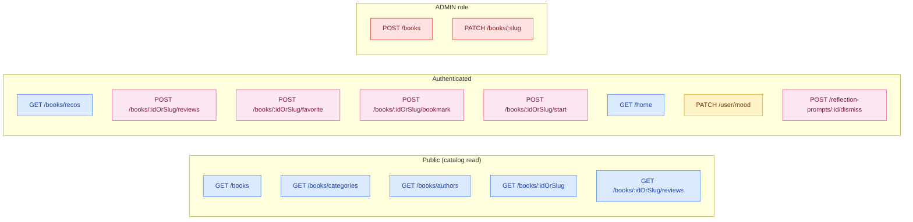
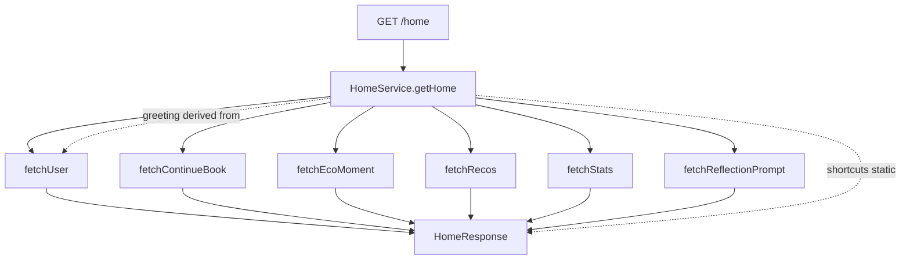
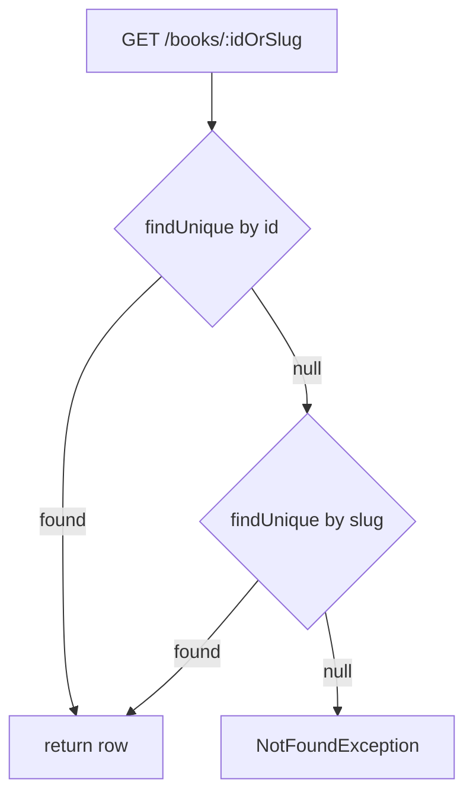

# Sprint S5 — HomeModule + BooksModule expandido

**Fecha:** 2026-05-26
**Rama:** `feature/sprint-s5-home-books`
**Tests:** 234/234 pasando (baseline 217 + 17 nuevos: 16 BooksService + 7 HomeService)
**ADRs producidos:** ninguno (sprint orientado a feature; sin decisiones cross-cutting)
**Bloqueante anterior resuelto:** sync stale resuelto en PR #72 (sesión 17 previa)

---

## §1 · Lo que se construyó

### Endpoints nuevos (13)

**BooksModule** (`/api/books/*`):

| Método | Path                        | Auth     |
| ------ | --------------------------- | -------- |
| GET    | `/books`                    | optional |
| GET    | `/books/recos`              | required |
| GET    | `/books/categories`         | none     |
| GET    | `/books/authors`            | none     |
| GET    | `/books/:idOrSlug`          | optional |
| GET    | `/books/:idOrSlug/reviews`  | none     |
| POST   | `/books/:idOrSlug/reviews`  | required |
| POST   | `/books/:idOrSlug/favorite` | required |
| POST   | `/books/:idOrSlug/bookmark` | required |
| POST   | `/books/:idOrSlug/start`    | required |

(Plus `POST /books` y `PATCH /books/:slug` admin — migrados del legacy ContentModule.)

**HomeModule** (`/api/home`, `/api/user/mood`, `/api/reflection-prompts/:id/dismiss`):

| Método | Path                              | Auth     |
| ------ | --------------------------------- | -------- |
| GET    | `/home`                           | required |
| PATCH  | `/user/mood`                      | required |
| POST   | `/reflection-prompts/:id/dismiss` | required |

### Schema Prisma (6 modelos + 9 columnas nuevas en Book)

- `BookAuthor` — tabla nueva (decisión del usuario: tabla, no string)
- `BookCategory` — tabla, slug + label + order
- `BookFavorite` — usuario × libro, unique compuesta
- `BookBookmark` — idem favorite
- `BookReview` — rating 1-5 + texto, unique compuesta (uno por usuario)
- `ReflectionPrompt` + `DismissedReflectionPrompt` — para Home

Book agrega: `subtitle`, `summary`, `cover` (token), `coverArtUrl`, `pages`,
`durationMinutes`, `language`, `authorId`, `categoryId`, `publishedAt`.

Migración retro-generada: `20260526180000_s5_books_authors_categories_reviews_home/migration.sql`.

### `@psico/types` extendido (+50 tipos)

Tipos de catálogo (`BookListItem`, `BookListResponse`, `BookCategory`,
`BookAuthorSummary`/`BookAuthorDetail`, `Pagination`), detalle
(`BookDetail`, `BookDetailResponse`, `ChapterListItem`, `BookRating`,
`BookReviewSummary`), reseñas (`CreateBookReviewRequest`/`Response`),
home (`HomeResponse` + 7 sub-tipos), enums (`CoverToken`, `BookListSort`,
`BookListView`, `RecoKind`, `ShortcutId`).

### Frontend rebrand

- `packages/api-client/src/books.ts` — nuevo `booksApi` con 10 métodos.
- `packages/api-client/src/content.ts` — `contentApi` queda `@deprecated`,
  apunta a `/books` con `BookListResponse`/`BookDetailResponse`.
- `apps/web/src/lib/api.ts`, `apps/web/src/app/page.tsx`,
  `apps/web/src/app/dashboard/page.tsx`,
  `apps/web/src/components/landing/BooksSection.tsx` — migrados a la nueva
  shape (`BookListItem`, `tierRequired`, `subtitle`, `chapters`,
  `userProgress?.progressPct`).
- `apps/mobile/app/(tabs)/{index,books/index,books/[slug]}.tsx` — idem.

### Limpieza

- `apps/api/src/content/` **eliminado** (módulo legacy + 5 archivos de
  guards `@deprecated`). Los callsites ahora importan de `../shared`.
- Test `apps/api/src/shared/shared.spec.ts` simplificado: ya no testea
  re-exports muertos.

### Seed

Add: 1 author (Marina Quintana, verificada), 7 categorías, 7 reflection
prompts, wire de los 2 libros ancla a author + categoría + portada token

- pages + durationMinutes + publishedAt + cover token (warm/cool).

---

## §2 · Decisiones aplicadas

### Del usuario antes de empezar el sprint

1. **"Renombrar directo, sin alias deprecated."** Justificación: no hay
   consumers en producción, todavía estamos en desarrollo. Aplicado:
   `/content/*` desaparece por completo. Cualquier link viejo da 404 —
   correcto.
2. **"`BookAuthor` como tabla nueva."** Aplicado tal cual; categorías
   también como tabla por el mismo razonamiento (Editor de autor B2B en
   S19 va a necesitar escribir en runtime).

### Tomadas en el sprint sin consulta (alineadas a CLAUDE.md)

3. **`tierRequired` enum `"free"|"pro"`** en la public API en vez de
   exponer `Plan`. Backend mapea en el boundary. Justificación: el
   contrato de diseño habla en tier; mantener el Plan interno permite que
   billing evolucione sin romper UI.
4. **`favorite` y `bookmark` como POST que devuelve `{ active: boolean }`.**
   Más expresivo que DELETE separado; la URL queda estable.
5. **Path `:idOrSlug` acepta ambos.** El handoff 04-detalle.md usa `:id`
   pero el seed y el mobile ya navegan por slug. Resolución a nivel
   service (try id, fall back slug).
6. **Review gating en service**, no en DB. Razón: la regla "haber
   completado todos los capítulos" depende de joins (UserProgress ×
   Chapter.isPublished × Book) — más limpio en código.
7. **Una review por usuario por libro** vía `@@unique([userId, bookId])`
   - upsert en el endpoint POST. Editar tu review reutiliza el mismo
     endpoint. Sin DELETE explícito por ahora.

---

## §3 · Diagramas

### 3.1 — Endpoint surface



### 3.2 — Home aggregation



### 3.3 — Tier mapping at API boundary


### 3.4 — id-or-slug resolution



---

## §4 · Bugs corregidos durante el sprint

### 4.1 · Prisma `chapters` con type-union no asignable al helper

**Síntoma:** typecheck falla en `computeUserProgressSummary` porque el
`include` de Prisma produce una unión "chapter con progress" | "chapter sin
progress" cuando el conditional include depende de `userId`.

**Fix:** cast localizado del `book` a un shape suelto en el callsite. El
helper acepta el contrato relajado; el runtime es idéntico. Documentado en
una comment en `books.service.ts:175`.

### 4.2 · Mock vitest `.findUnique().then(...)` returning undefined

**Síntoma:** 3 tests del HomeService rompían con
`TypeError: Cannot read properties of undefined (reading 'then')`.

**Causa:** `HomeService.getHome` ejecuta 3 llamadas a `prisma.user.findUnique`
concurrentes en `Promise.all`. El spec usaba `.mockResolvedValueOnce` solo
2 veces, así que la tercera resolvía `undefined` y `.then` explotaba.

**Fix:** usar `.mockResolvedValue` con un shape rico que satisfaga las 3
queries simultáneamente.

### 4.3 · Tests viejos del BooksService llamaban a métodos eliminados

**Síntoma:** `findAllPublished is not a function` × 5.

**Causa:** los métodos legacy desaparecieron al rebuild del service.

**Fix:** rewrite total del spec con 16 tests nuevos cubriendo list, detail,
reviews, toggles, start y admin CRUD.

### 4.4 · Web landing fallback type-incompat

**Síntoma:** `BookListResponse | Book[]` no asignable a `Book[]` después
del rename.

**Causa:** `FALLBACK_BOOKS` era `Book[]` (shape legacy) pero `booksApi.findAll`
ahora devuelve `BookListResponse`.

**Fix:** convertir `FALLBACK_BOOKS` a `BookListItem[]` y envolver con la
shape `BookListResponse` en el catch — la landing page consume `.books` igual
que el live path.

---

## §5 · Verificación

```bash
pnpm --filter @psico/api test            # 234/234
pnpm --filter @psico/api typecheck       # ok
pnpm --filter @psico/api lint            # ok
pnpm --filter @psico/types build         # ok
pnpm --filter @psico/api-client build    # ok
pnpm --filter @psico/api-client generate:check   # in sync
pnpm --filter @psico/web typecheck       # ok
pnpm --filter @psico/web lint            # ok
pnpm --filter @psico/mobile typecheck    # ok
pnpm --filter @psico/mobile lint         # ok
```

Smoke boot del API:

- 51 rutas mapeadas correctamente bajo `/api/*`
- `/api/books`, `/api/books/recos`, `/api/books/categories`, `/api/books/authors`,
  `/api/books/:idOrSlug` (+ reviews/favorite/bookmark/start) presentes
- `/api/home`, `/api/user/mood`, `/api/reflection-prompts/:id/dismiss` presentes
- `/api/books/:slug/chapters/:order` (ChaptersModule) mapeada correctamente
- `/api/progress`, `/api/progress/:chapterId` presentes
- Swagger en `/api/docs`
- `openapi.json` regenerado · `generated.ts` 30.8 KB → 53.0 KB
  (+22 KB de nuevos tipos S5)

---

## §6 · Deuda técnica abierta

- **Migración Prisma S5 sin aplicar en Railway.** Acumulada con las de
  S1+S2+S3 (Sprint 0 sigue sin desplegar). Ventana de mantenimiento
  pendiente (documentada en `docs/deploy/v0-5-alpha-cutover.md`).
- **`stats.diaryEntries` y `stats.minutesTotal` siguen retornando 0** —
  necesitan DiaryModule (S6) y ProgressModule maduro.
- **`ecoMoment.pendingMessages` siempre 0** — espera AIModule conversacional
  (S10).
- **Recos** usa "books más recientes" como stub. PatternsModule (S11) lo
  reemplaza.
- **`UserProgress` no separa started vs completed.** El upsert de
  `startBook` reusa la tabla, pero el modelo conceptual es ambiguo. S6
  refactoriza.
- **`fetchEcoMoment.prompt` es hardcoded** — cuando AIModule tenga la capa
  conversacional, el prompt sale del LLM con contexto.
- **Frontend Pull-to-refresh / skeleton states** sin implementar. Es
  responsabilidad del frontend companion sprint (S5-front, diferido por
  decisión del usuario hasta Phase 1 cierre).
- **Sin chapter delete endpoint.** Cuando exista, debe decrementar
  `book.totalChapters` y `book.durationMinutes` (chapters.service.create
  ya incrementa; el inverso falta).

---

## §7 · Aprendizajes / patrones

### Mapear enums internos al boundary

`Book.plan` es interno; el contrato público habla en tier. Localizamos el
mapping en una sola constante (`PLAN_TO_TIER`) y nunca dejamos que el
enum interno se vea hacia afuera. Si Stripe agrega un plan nuevo mañana,
el contrato hacia el frontend no se mueve.

### `include` de Prisma condicional → cast localizado

Cuando el `include` depende de un parámetro runtime, el tipo generado se
vuelve una unión. En vez de propagar la unión por toda la cadena de
helpers, casteamos en un solo punto con un comment que explica por qué.
Mantenible y honesto.

### Agregadores con `Promise.all`

`HomeService.getHome` orquesta 6 queries en paralelo. La latencia total
queda dominada por la query más lenta, no por la suma. Agregar una
séptima concern son 2 líneas (un método privado + un slot en el array).

### Idempotency-by-upsert

Tanto reviews como toggles usan `upsert` (no separate `create`/`update`).
El cliente que reintenta una operación obtiene el mismo resultado final.
Aplicable cuando la entidad tiene una `@@unique` natural (userId+bookId
en este caso).

### Curated catalogs in DB tables (not enums)

Categories y authors son tablas, no enums. El razonamiento:

- Adding a category should be a SQL update, not a Prisma migration.
- Author editing UI (S19) needs runtime writes.
- Soft-disable (`isActive=false`) preserves referential integrity for
  books that reference an author/category that becomes "private".

---

## §8 · Próximo sprint — S6

Próximo en el Plan v2: **DiaryModule con E2E encryption**. ADR 0007 ya
está escrito (Sprint S1). Pre-requisitos:

- Cliente-side crypto (Argon2id + XChaCha20-Poly1305 + ECDH X25519)
- Backend recibe `textCiphertext + textNonce`, nunca texto plano
- `share-with-therapist` con re-encrypt efímero
- `stats.diaryEntries` y `stats.minutesTotal` se llenan al fin

Decisión bloqueante antes de S6:

- **¿Implementamos el web companion sprint (S5-front) primero, o saltamos
  directo a S6?** Default v2 plan: continuar backend → frontend en
  paralelo al final de Fase 1.
