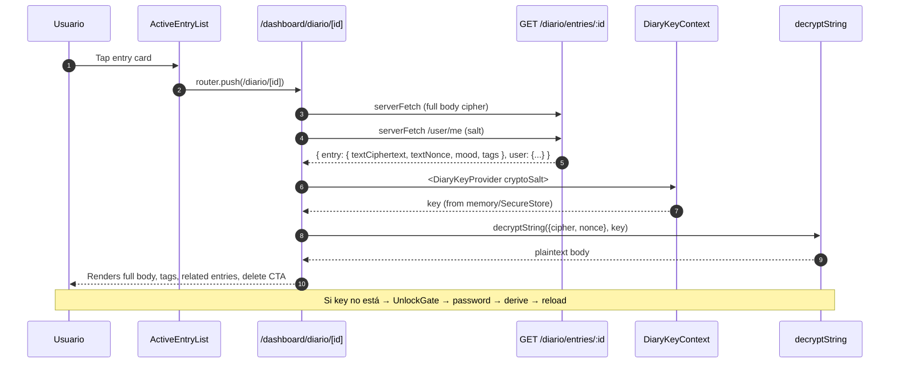

# Sprint S6-crypto-polish — Detail view, legacy migration, BIP39 toolkit

**Fecha:** 2026-05-27
**Rama:** `feature/sprint-s6-crypto-polish`
**Tests:** 286 pasando (252 API + 34 crypto, +10 BIP39)
**ADR aplicado:** [0007 §G](../adr/0007-e2e-encryption-diario-eco.md) — recovery seed phrase toolkit (UI viene en sprint propio)
**Bitácora previa:** [sprint-s6-crypto.md](sprint-s6-crypto.md)

---

## §1 · Scope ajustado

Polish sprint con 4 features candidatos. **Scope reducido a 3** para mantener un PR limpio; los 2 más pesados quedan diferidos a sprints propios:

| #   | Feature                                                      | Status           |
| --- | ------------------------------------------------------------ | ---------------- |
| 1   | Backend: auto-generación de `cryptoSalt` para cuentas legacy | ✅ este sprint   |
| 2   | Detail view del entry (web + mobile, decrypt body + delete)  | ✅ este sprint   |
| 3   | BIP39 toolkit en `@psico/crypto` (utilities, sin UI)         | ✅ este sprint   |
| 4   | UI seed phrase (mostrar / recovery flow)                     | ⏭️ sprint propio |
| 5   | Password change con re-encrypt                               | ⏭️ sprint propio |

Razón: 4 y 5 son flujos delicados de UX que merecen testing manual cuidadoso y mejor entregarlos enfocados.

---

## §2 · Lo que se construyó

### Backend: auto-gen de `cryptoSalt` para legacy

`AuthService.ensureCryptoSalt(user)` — backfill idempotente. Se invoca en:

- `login()` (después de la verificación de password exitosa)
- `refresh()` (al renovar tokens en cold start)
- `googleSignIn()` path 1 (usuario existente con providerId)

El salt nunca está expuesto fuera del response — el cliente lo recibe y deriva. Razón del backfill en login (no en migration): un salt para una cuenta que nunca volverá a loguearse es overhead inútil. El primer login post-S6 lo crea bajo demanda.

### `@psico/crypto` — BIP39 utilities

```ts
masterKeyToSeedPhrase(key: Uint8Array) → string    // 32B → 24 English words
seedPhraseToMasterKey(phrase: string) → Uint8Array // 24 words → 32B
isValidSeedPhrase(phrase: string)     → boolean    // UI form helper
```

**Decisión cripto:** la seed phrase **es** el masterKey serializado (32 bytes = 24 words con checksum BIP39). NO usa PBKDF2 stretching estándar BIP39. Trade-off documentado:

- ✅ Recovery exacto: 24 words ↔ masterKey idéntico, bit-por-bit.
- ⚠️ Password no es estrictamente requerido para recovery — quien tenga las 24 palabras puede leer el diario.

Esto se comunica explícitamente al usuario cuando aparezca la UI de seed phrase (sprint propio).

**Dep nueva:** `@scure/bip39` v1.5.0 (Paul Miller, mismo ecosistema que `@noble/*` — audited, pure JS).

**10 tests nuevos:**

- masterKey → words → masterKey roundtrip
- Normalización de whitespace + case
- Rechazo de wrong word count, invalid words, bad checksum
- Validador `isValidSeedPhrase` no-throwing
- Recovery scenario end-to-end (cifrar con originalKey → seed → recover → descifrar)

### Web: detail view + delete

- `apps/web/src/app/dashboard/diario/[id]/page.tsx` — Server Component. Fetcha `/diario/entries/:id` + `/user/me` (para el salt).
- `apps/web/src/components/dashboard/diario/EntryDetailView.tsx` — Client Component. Envuelve en `DiaryKeyProvider`; si no hay key → `UnlockGate`; si hay → `DecryptedDetail` que descifra el body completo, renderiza tags, related entry links, y un delete con confirm in-place.
- Lista de entradas (`ActiveEntryList`) ahora tiene cards con `<Link href={/dashboard/diario/[id]}>` — la cara visible es clickable, el botón "Mostrar más" queda fuera del link para no conflict.

Bundle: `/dashboard/diario/[id]` = 4 KB (120 KB first load incluyendo cripto).

### Mobile: detail view + delete

- `apps/mobile/app/(tabs)/diario/[id].tsx` — full screen. Mismo gate-or-decrypt pattern.
- Layout actualizado en `_layout.tsx` para registrar la nueva ruta.
- Delete usa nativa `Alert.alert` con confirm destructive — UX RN idiomática vs el confirm in-place del web.
- Lista (`EntryCard`) ahora es `Pressable` → `router.push(/(tabs)/diario/${id})`. El botón "Mostrar más" interior usa `e.stopPropagation` para no triggear navegación.

---

## §3 · Decisiones del sprint

| #   | Decisión                                                       | Razón                                                                                                                                         |
| --- | -------------------------------------------------------------- | --------------------------------------------------------------------------------------------------------------------------------------------- |
| 1   | Auto-gen de salt en login, **NO** migration script             | Backfill bajo demanda es más barato y honesto — solo gastas un INSERT por cuenta que efectivamente vuelve.                                    |
| 2   | Seed phrase como masterKey serializado (32B → 24 words exacto) | Recovery determinístico. La alternativa (PBKDF2 desde seed) introduciría stretching adicional sin valor de seguridad en este threat model.    |
| 3   | Delete confirm in-place en web, Alert nativo en mobile         | UX idiomática por plataforma. Web: el card no tiene espacio para un modal; mobile: native Alert es lo que el usuario espera.                  |
| 4   | List → Link/Pressable a detail                                 | Cards completas tappables son la UX estándar. El botón "mostrar más" usa stopPropagation para coexistir.                                      |
| 5   | Seed phrase UI diferida                                        | Es ~1 día dedicado: modal de "anótalas", confirm de 3 palabras, recovery flow en /login. Mejor sprint propio.                                 |
| 6   | Password change re-encrypt diferido                            | Requiere endpoint nuevo `bulk-rekey` + flow cliente que descifra/recifra todas las entradas + atomic update del password hash. ~1 día propio. |

---

## §4 · Diagrama — flow de detail



---

## §5 · Verificación

```bash
pnpm --filter @psico/crypto test           # 34/34 (24 prev + 10 BIP39)
pnpm --filter @psico/api test              # 252/252
pnpm --filter @psico/api typecheck         # ok
pnpm --filter @psico/web typecheck         # ok
pnpm --filter @psico/web lint              # ok
pnpm --filter @psico/web build             # ok (Diario detail 4 KB / 120 KB FL)
pnpm --filter @psico/mobile typecheck      # ok
pnpm --filter @psico/mobile lint           # ok
pnpm --filter @psico/api-client generate:check  # in sync
```

Privacy invariant grep — verde (sin cambios; el detail decifra client-side, server jamás ve plaintext).

---

## §6 · Deuda técnica abierta (post-polish)

- **Seed phrase UI (web + mobile)** — usar `masterKeyToSeedPhrase` en modal post-unlock, persistir flag "shown" en backend (`User.cryptoSeedShownAt`), recovery flow en /login. Sprint propio.
- **Password change re-encrypt** — endpoint nuevo `POST /api/diario/entries/bulk-rekey` o flow cliente con PATCH per-entry; nuevo password debe ser atomic con el último PATCH. Sprint propio.
- **Edit entry** — el detail tiene delete, falta edit. UX: textarea editable, mismo encrypt flow del composer.
- **`User.cryptoSeedShownAt`** — flag DB para no spam-mostrar el modal del seed phrase. Llega cuando aterrice la UI.

---

## §7 · Aprendizajes

### Auto-backfill > migration scripts

Migraciones script-based para columnas nullable que se rellenan con valores únicos por fila son caras y ruidosas. El patrón "fill it at first contact" (login, refresh) es:

- Cero downtime
- Cero scripts ops
- Cero overhead para cuentas inactivas
- Diff legible en code review (es solo `ensureCryptoSalt`)

### Seed phrase = serialized key vs derived

BIP39 está diseñado para "seed → key vía PBKDF2 stretching". Nosotros vamos al revés (key → seed → key). El cambio de dirección es semánticamente seguro (el espacio de bits es el mismo) pero requiere documentar muy claramente que "tu seed phrase es tu clave". Versionarlo para futuro: cuando llegue Argon2 v2, el bumpeo de algoritmo NO cambia la seed phrase porque la seed sigue siendo los 32B finales.

### `<Link>` + Pressable interior con stopPropagation

Cards 100% navegables con botones secundarios interiores funciona si:

- Web: el botón interior no es `<a>` ni live inside `<Link>`. Coloca fuera o lifestyle de forma adyacente.
- Mobile: `e.stopPropagation?.()` en el Pressable hijo previene la navegación del padre.

---

## §8 · Estado del repo al cerrar Sesión 22

- Branch `feature/sprint-s6-crypto-polish` (este PR)
- 286 tests (252 + 34 crypto)
- Web: 8 rutas + detail view nueva (`/dashboard/diario/[id]`)
- Mobile: 5 pantallas + detail view nueva (`/(tabs)/diario/[id]`)
- ADR 0007: §A-F implementado · §G toolkit listo, UI diferida

---

## §9 · Próximo paso

| Opción | Sprint                             | Qué entrega                                                                               |
| ------ | ---------------------------------- | ----------------------------------------------------------------------------------------- |
| **A**  | **Seed phrase UI**                 | Modal post-unlock + confirm 3-of-24 + recovery flow en /login. Usa el toolkit ya escrito. |
| **B**  | **Password change re-encrypt**     | Endpoint + flow cliente que descifra/recifra todo el diario antes de cambiar password.    |
| **C**  | **S7 SubscriptionModule completo** | `/usage`, `/portal`, `/invoices`, `/cancel` + BullMQ jobs.                                |
| **D**  | **S8 VoiceModule**                 | Whisper/Deepgram + entries kind=voz.                                                      |
