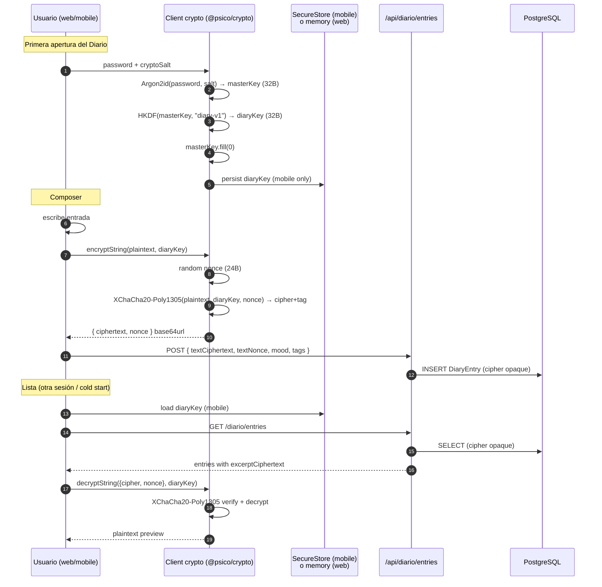
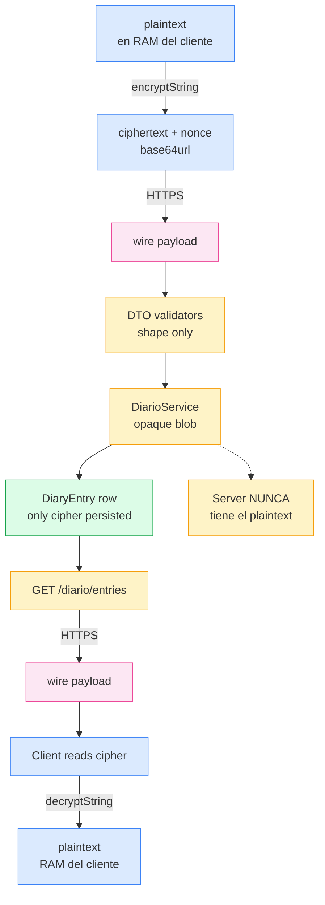

# Sprint S6-crypto — End-to-end encryption en producción

**Fecha:** 2026-05-27
**Rama:** `feature/sprint-s6-crypto`
**Tests:** 276 pasando (252 API + 24 crypto package nuevos)
**ADR aplicado:** [0007 — E2E encryption Diario/Eco](../adr/0007-e2e-encryption-diario-eco.md) — escrito en S1, hoy completa el ciclo: contrato → schema → cripto cliente real.
**Bitácora previa:** [sprint-s5-front-mobile.md](sprint-s5-front-mobile.md)

---

## §1 · Decisión del usuario

Continuar con la **Opción A** del menú post S5-front-mobile: implementar el cliente cripto (Argon2id + XChaCha20-Poly1305 + HKDF) que desbloquea el Composer del Diario funcional **en web y mobile en simultáneo**. Cierra el contrato escrito en ADR 0007 hace 4 sprints.

---

## §2 · Lo que se construyó

### Paquete nuevo `@psico/crypto`

Un solo punto de verdad para el contrato cripto. Pure JavaScript — corre en web (Next.js + browser), React Native (Expo/Hermes) y Node (tests). Sin WASM, sin native modules, sin polyfills.

**Librerías base (decisión de sprint §3):**

- `@noble/hashes` → Argon2id (RFC 9106) + HKDF (RFC 5869)
- `@noble/ciphers` → XChaCha20-Poly1305 + randomBytes vía webcrypto

**API expuesta:**

```ts
deriveMasterKey(password, saltBase64Url) → Uint8Array(32)       // Argon2id m=64MB t=3 p=4
deriveSubKey(masterKey, info)            → Uint8Array(32)       // HKDF-SHA256
encryptString(plaintext, key)            → { ciphertext, nonce } // base64url
decryptString(envelope, key)             → string                // strict UTF-8
```

**Tests (24):** base64url roundtrip, Argon2id determinism + avalanche, HKDF domain separation, AEAD roundtrip Spanish + emoji + multiline, nonce uniqueness per encrypt, decrypt rejection con clave/nonce/ciphertext erróneos.

### Backend (`apps/api`)

- **Schema:** `User.cryptoSalt String?` (nullable para cuentas pre-S6-crypto).
- **Migración:** `20260527090000_s6_crypto_user_salt/migration.sql`.
- **Generación:** al registrar (`AuthService.register`) y en OAuth Google sign-up. 16 bytes random vía `crypto.randomBytes`, base64url.
- **Exposición:**
  - `AuthResponseDto` agrega `cryptoSalt: string | null` (login / register / refresh / oauth).
  - `UserMeResponse` agrega `cryptoSalt` al top level (web Server Components lo leen de `/user/me`).

### Web (`apps/web`)

- `lib/crypto/diary-key-context.tsx` — React Context con `key`, `unlock(password)`, `lock()`. La clave vive solo en memoria de la pestaña (no localStorage, no IndexedDB en v1).
- `components/dashboard/diario/UnlockGate.tsx` — gate UI con password input. Argon2id ~500ms en desktop.
- `components/dashboard/diario/ActiveComposer.tsx` — encripta body + excerpt antes de POST. Trigger router.refresh() para que el Server Component recargue la lista.
- `components/dashboard/diario/ActiveEntryList.tsx` — descifra `excerptCiphertext` por entrada (memoized). Fallback "no preview" si falla.
- `components/dashboard/diario/DiarioShell.tsx` — wrapper que decide UnlockGate vs Active según `key !== null`.
- Diario page consume `serverFetch<UserMeResponse>("/user/me")` para el salt.
- **Removed:** `Composer.tsx` + `EntryList.tsx` + `CryptoNotice.tsx` (placeholders del sprint anterior).

### Mobile (`apps/mobile`)

- `src/crypto/diary-key-store.ts` — wrapper de `expo-secure-store` (Keychain / Keystore). Cachea el `diaryKey` derivado para evitar Argon2id en cada cold start (~800ms en mid-range phone).
- `src/crypto/diary-key-context.tsx` — Context que **restaura** la key del SecureStore on mount; si no hay → UnlockGate.
- `components/dashboard/diario/UnlockGate.tsx` — análogo al web, RN StyleSheet.
- Diario screen wrapped en `<DiaryKeyProvider cryptoSalt={user.cryptoSalt}>` (salt viene de `AuthContext.user`).
- `AuthContext.logout` ahora también limpia `diaryKeyStore` — protege el "lost phone / shared device" scenario.

### Cliente API (`@psico/api-client`)

Regenerated `generated.ts` desde el nuevo OpenAPI: 57.9 KB → 59.5 KB (+1.6 KB del campo `cryptoSalt` en 4 endpoints). No nuevos métodos.

---

## §3 · Decisiones del sprint

### 3.1 · Librería cripto

**Decisión:** `@noble/hashes` + `@noble/ciphers` (autores: Paul Miller, ecosistema Ethereum/Solana/Cosmos).

**Por qué NO `argon2-browser` + `libsodium-wrappers`:**

- Ambas usan WASM. WASM bundling es frágil en Next.js (`asyncWebAssembly`, server bundler) y RN/Hermes (no soportado).
- Mantener un sub-target sin WASM agregaba `argon2-browser-wrapper-for-rn` y empaquetar dos librerías.

**Por qué `@noble/*`:**

- Pure JS (TypeScript con asm.js fallback transparente).
- Audited (Cure53, NCC Group).
- Funciona idéntico en web + RN + Node sin polyfills.
- Bundle: ~30 KB combinados para lo que usamos.

### 3.2 · Storage del diaryKey

**Web:** memoria de la pestaña, re-derive cada session. UX = un password prompt al abrir Diario. Razón: localStorage = vulnerable a XSS persistente; IndexedDB + wrapKey requiere un device-secret handshake que es S6-crypto-v2.

**Mobile:** SecureStore (Keychain iOS, Keystore Android). UX = un password prompt en la primera apertura post-install / post-logout. Razón: hardware-backed storage es el mismo nivel de threat model que iOS/Android usan para credenciales nativas.

Esta divergencia es **intencional** y está documentada en el ADR (§B "Almacenamiento del masterKey").

### 3.3 · Excerpt ciphertext por separado

En lugar de descifrar el body completo en la lista, el cliente genera dos cifras: `textCiphertext` (full body) y `excerptCiphertext` (primeros 140 chars). El backend ya soportaba esto desde Sprint S6; lo activamos ahora.

**Trade-off:** dos AEAD ops por write (~5ms). **Beneficio:** el list view descifra solo previews — no descarga ni descifra el body para 30 entradas al abrir el Diario.

### 3.4 · `lock` borra masterKey ASAP

Una vez derivado el `diaryKey`, el `masterKey` se zero-fillea inmediatamente (`buffer.fill(0)`). Razón: si la pestaña dump-ea memoria (browser crash, debugger), el `masterKey` ya no está. Solo el `diaryKey` permanece — y ese es el que cifra/descifra. Mismo principio que Signal con session keys.

### 3.5 · Sin migración para cuentas legacy

Cuentas creadas antes del Sprint S6-crypto tienen `cryptoSalt = null`. El UnlockGate detecta esto y muestra "tu cuenta no tiene cifrado E2E activado". Razón: forzar la migración requeriría re-derive en cada usuario y un flow de "vuelve a ingresar tu contraseña una vez", lo cual es out-of-scope. Se hará en un mini-sprint posterior si hay cuentas legacy con diario.

### 3.6 · Sin recovery seed phrase

ADR 0007 §G menciona BIP39 24-word como opt-in en el primer login. **NO** se implementa en este sprint — es UX significativo (storage segura del seed, validación de palabras, etc.) y la decisión de producto: queremos que Pulso valide primero si vale la pena pagar el costo de UX antes de implementar.

---

## §4 · Diagramas

### 4.1 — Flujo de cifrado end-to-end



### 4.2 — Storage divergence web vs mobile

```mermaid
flowchart LR
  subgraph web["Web (Next.js)"]
    web_unlock[UnlockGate]
    web_memory[React state<br/>diaryKey en memoria]
    web_lock[lock = setKey(null)]
    web_unlock -- Argon2id+HKDF --> web_memory
    web_memory -- buffer.fill(0) --> web_lock
  end

  subgraph mobile["Mobile (Expo)"]
    mob_unlock[UnlockGate]
    mob_secure[expo-secure-store<br/>Keychain/Keystore]
    mob_memory[React state + cached]
    mob_lock[lock = clear()]
    mob_unlock -- Argon2id+HKDF --> mob_memory
    mob_memory --> mob_secure
    mob_secure -- on mount --> mob_memory
    mob_memory -- buffer.fill(0) --> mob_lock
    mob_lock -.-> mob_secure
  end
```

### 4.3 — Privacy invariant — todo el flujo de ciphertext



---

## §5 · Verificación

```bash
pnpm --filter @psico/crypto test         # 24/24 (incluye Argon2id reales)
pnpm --filter @psico/api test            # 252/252
pnpm --filter @psico/api typecheck       # ok
pnpm --filter @psico/api lint            # ok
pnpm --filter @psico/web typecheck       # ok
pnpm --filter @psico/web lint            # ok
pnpm --filter @psico/web build           # ok (Diario page 17.4 KB con crypto)
pnpm --filter @psico/mobile typecheck    # ok
pnpm --filter @psico/mobile lint         # ok
pnpm --filter @psico/api-client generate:check  # in sync
```

**Privacy invariant grep (sin cambios — sigue verde):**

```bash
grep -rnE '(console\.|logger\.)\s*\([^)]*\b(textCiphertext|textNonce|excerptCiphertext|wrappedKey|ciphertextForTherapist)\b' \
  apps/api/src/ --include='*.ts' --exclude='*.spec.ts' --exclude='*.privacy.spec.ts'
# (no matches)
```

---

## §6 · Deuda técnica abierta

- **Recovery seed phrase (BIP39)** — ADR 0007 §G compromete opt-in. UX significativo (~1 sprint dedicado).
- **Migración de cuentas legacy** — usuarios pre-S6-crypto tienen `cryptoSalt = null`. Un mini-sprint puede:
  1. Generar salt para cuentas existentes
  2. Marcar `requiresKeyRotation = true`
  3. Pedirle al usuario reingresar password al abrir Diario una vez
- **Password change flow** — cuando el usuario cambia password debería re-cifrar Diario. Hoy: rompemos el Diario silenciosamente. Sprint S6-crypto-v2.
- **Detail view del entry** — la lista descifra solo el excerpt. Hacer click debería descifrar el body completo. Funciona técnicamente (basta llamar `decryptString` sobre `textCiphertext`/`textNonce`), pero la UI del detail no existe aún.
- **Share with therapist UX** — backend ya está listo desde Sprint S6 (`POST /diario/entries/:id/share` acepta wrapped key + ephemeral pubkey). UI cliente-side queda para v2 cuando aterrice TherapyModule.
- **Eco crypto** (`eco-v1` HKDF info) — el helper está en `@psico/crypto` listo para usar; AIModule lo wireará en Sprint S10.
- **Re-encrypt en password change** — actualizar el flow del UsersService.

---

## §7 · Aprendizajes / patrones

### Un solo paquete, múltiples consumers

`@psico/crypto` evita re-implementar el contrato en cada app. Si el día de mañana sumamos un Electron desktop, una CLI de export, o un browser extension — todos consumen el mismo `encryptString` / `decryptString`. Cambiar el algoritmo es un PR en un paquete, no una migración cross-stack.

### Pure JS > WASM cuando el threat model lo permite

Argon2id en JS es lento (~500ms desktop, ~800ms mobile), pero corre **una vez por unlock**, no por write. WASM ahorraría ~30% del tiempo pero introduce fragilidad de bundling. Trade-off claro.

### Storage divergence honesta

Web y mobile tienen distintos threat models para "datos privados que viven en el dispositivo". El web pelea XSS; el mobile confía en hardware-backed keystores. Aceptar la divergencia en el diseño produce mejor UX que forzar paridad artificial.

### Excerpt ciphertext es decoupled del body

Cifrar excerpt y body por separado (mismo key, diferentes nonces) es la clave para que la lista funcione sin descargar todos los bodies. Es análogo a cómo Signal hace previews de mensajes en notificaciones — un cipher dedicado para el preview.

### zero-fill del masterKey es barato y necesario

`Uint8Array.fill(0)` es O(n) sobre 32 bytes — nano-segundos. Hacer este step minimiza la ventana donde un memory dump exfiltraría el masterKey. La subkey persiste; el masterKey no necesita.

---

## §8 · Estado del repo al cerrar Sesión 21

- 4 PRs mergeados consecutivos: S5 · S6 · S5-front · S5-front-mobile + Sprint S6-crypto (este)
- 276 tests pasando (252 API + 24 crypto)
- 1 paquete nuevo: `@psico/crypto` v0.1.0
- 1 migración nueva: `20260527090000_s6_crypto_user_salt`
- ADR 0007 ahora **completamente implementado**
- Backend, web, mobile typecheck + lint + build clean

---

## §9 · Próximo paso

Tres opciones:

| Opción | Sprint                             | Qué entrega                                                                                                                        |
| ------ | ---------------------------------- | ---------------------------------------------------------------------------------------------------------------------------------- |
| **A**  | **S7 SubscriptionModule completo** | `/usage`, `/portal`, `/invoices`, `/cancel` + BullMQ jobs sync diaria de usage counters.                                           |
| **B**  | **Polish sprint**                  | Detail view del diary entry (decrypt full body), recovery seed phrase BIP39, migración cuentas legacy, password change re-encrypt. |
| **C**  | **S8 VoiceModule**                 | Whisper/Deepgram + audio entries en Diario (audio NO cifrado al rest per ADR; solo transcript cifrado).                            |
