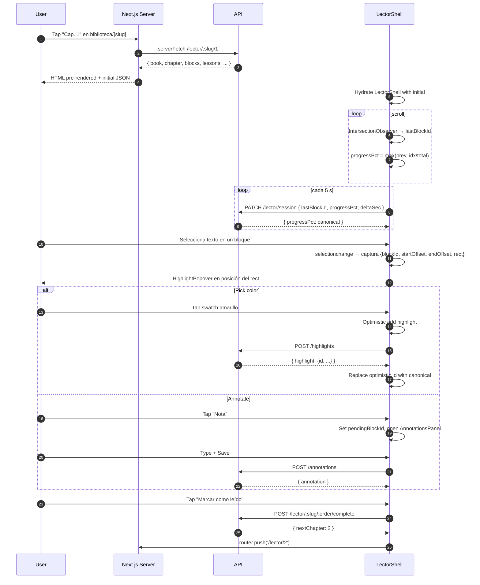

# Sprint S6-front · Reader UI (web + mobile)

**Rama:** `feature/sprint-s6-front-lector`
**Bitácora previa:** [sprint-s6-lector.md](sprint-s6-lector.md)
**Tests:** 348/349 backend (sin cambios — sprint UI puro)

---

## §1 · Scope

Cierra el último UI pendiente del Plan v2 Fase 1: la pantalla del **Lector** que consume los 9 endpoints S6 desplegados ayer. El user finalmente puede LEER los libros (no solo verlos en la biblioteca). Web con selección de texto + highlights con 3 colores + annotations CRUD + reader prefs + heartbeat. Mobile view-only + annotations CRUD + heartbeat.

---

## §2 · Lo que se construyó

### Web (`apps/web`)

**Ruta:** `/dashboard/biblioteca/[idOrSlug]/lector/[chapterOrder]`

- `page.tsx` Server Component — pre-fetcha el chapter con `serverFetch('/lector/:bookId/:order')` para que el primer paint muestre contenido real (Lighthouse + perceived speed).
- `LectorShell.tsx` — Client orchestrator. Owns todos los state slices: highlights, annotations, prefs, selection, session. Optimistic UI on todas las mutaciones.
- `BlockRenderer.tsx` — Renderiza cada `ChapterBlockKind`. PARAGRAPH/HEADING/QUOTE/PAUSE/EXERCISE con estilos del prototype `Lector.html`. Cada block expone `data-block-id` para hit-testing.
- `HighlightPopover.tsx` — Popover flotante anclado al `selection.rect`. 3 swatches (YELLOW/BLUE/PINK) + botón "✎ Nota".
- `AnnotationsPanel.tsx` — Side sheet derecho con composer + lista + inline edit + delete con confirm. Filtrable por bloque.
- `ReaderPreferencesModal.tsx` — Aa-style settings sheet (theme + font + fontSize + lineHeight). Slider para size y line-height.
- `use-heartbeat.ts` — Hook que dispara `PATCH /api/lector/session` cada 5s. Pausa cuando `document.hidden`. `keepalive: true` para que el último beat sobreviva navegación.

**Wire del link "Leer →"**: `ChaptersList.tsx` (del detalle del libro) ahora envuelve cada row en `<Link href={`/dashboard/biblioteca/${bookSlug}/lector/${ch.n}`}>`.

**ChaptersList** recibe `bookSlug` como prop nuevo. `BookDetailPage` lo pasa desde `detail.book.slug`.

### Mobile (`apps/mobile`)

**Ruta:** `(tabs)/books/[slug]/lector/[chapterOrder].tsx`

- `BlockView` renderiza los 7 kinds con estilos paridad mobile (sage para PAUSE, lavender para EXERCISE).
- **Sin highlights v1**: la selección nativa de texto en RN no acepta acciones custom fácilmente. Trade-off explícito.
- **Annotations vía long-press**: `<Pressable onLongPress={...}>` en el bloque abre un Modal con TextInput multiline. Create + delete (con confirm via Alert). Edit queda para v2 (más mundano en mobile, menos crítico).
- Heartbeat con `setInterval` + check de `AppState.currentState === "active"`. Scroll handler infiere el block actual desde el cumulative `onLayout` y el `contentOffset.y` del ScrollView (no hay IntersectionObserver en RN).
- Complete CTA al final, navega al next chapter o de vuelta al detalle.

**Stack screen** registrada en `_layout.tsx` con `headerBackTitle: "Volver"`.

**Wire del tap del capítulo**: en `[slug].tsx` del detalle, cada `chapterRow` ahora es un `<Pressable onPress={() => router.push('/books/:slug/lector/:order')}>` en vez de un `<View>` estático.

### Tipos consumidos

- `LectorChapterResponse` (envolvente con book + chapter + blocks + lessons + highlights + annotations + session + preferences)
- `HighlightSummary`, `AnnotationSummary`, `ChapterBlockSummary`
- `HighlightColor`, `ChapterBlockKind`

Todos ya exportados desde `@psico/types` en S6-back.

---

## §3 · Flow del usuario (web)



---

## §4 · Decisiones de diseño

### 1. Server prefetch en `page.tsx`, no en client

Si delegamos el primer fetch al cliente, hay 600-800ms de "Cargando…" antes del primer paint. El usuario que tap en un capítulo espera leer ya. El Server Component pre-fetch baja eso a paint inmediato (HTML llega con el texto).

Trade-off: el SSR cuenta como un fetch al API. Para el flow "abrir capítulo" es aceptable. Para flows con polling rápido (Eco chat), no.

### 2. Optimistic mutations

Cada `POST /highlights` y `POST /annotations` actualiza el state local con un `id` temporal (`optimistic-${Date.now()}`) ANTES de hablar con el API. Si la request OK, swappemos por el canonical. Si falla, removemos el local.

Razón: el usuario subraya y espera ver el color de inmediato. Esperar el round-trip se siente roto.

### 3. Theme via CSS variables locales

El reader theme override solo afecta a `LectorShell` y sus descendientes (no `DashboardShell`). Hacemos esto seteando un puñado de CSS variables en el `style` del contenedor raíz. Así el resto del dashboard sigue su theme normal.

### 4. Mobile sin highlights

Implementar selección con popover en RN requeriría custom selection layer (long-press para mode-in, drag handles, hit-test del texto). Es un sprint en sí mismo. Para v1 ship view-only + annotations vía long-press, que da 80% del valor en 20% del trabajo.

### 5. Heartbeat con `keepalive: true`

`fetch(..., { keepalive: true })` permite que el último beat sobreviva una navegación (e.g. usuario pasa al siguiente capítulo). Sin esto perderíamos el último tick de progreso del capítulo anterior. Browser support: 100% en navegadores modernos.

### 6. Debounce de prefs PATCH

El slider de fontSize / lineHeight dispararía 30 PATCH calls si el usuario arrastra. Hacemos debounce de 500ms: aplica el cambio visual instantáneo (state) + retrasa el PATCH. El último valor gana.

---

## §5 · Deuda técnica abierta

- **Mobile: sin highlights**. Documentado arriba. Tracker: cuando llegue el feedback de usuarios sobre necesidad real, iteramos.
- **Mobile: sin edit de annotations** (solo create + delete). UX es mundana en mobile, el create + delete cubren el flujo común.
- **Audio (Modo Guía) NO implementado** en ninguna plataforma. Requiere player + transcript sync. Sprint dedicado cuando ingestemos audio real con Whisper word-level.
- **Sin offline cache**. El reader debería poder bootear offline después del primer load (IndexedDB en web, AsyncStorage en mobile). v2.
- **Sin paginación**. Si un capítulo tiene 500 blocks, el cliente los carga todos. Aceptable para los caps actuales (~6 blocks). Revisar cuando lleguen capítulos largos.
- **Sin tests UI**. Vitest + RTL setup sigue pendiente. Decisión consistente con sprints UI anteriores.
- **Sin atajos de teclado**. Cmd+B/U/I sería natural para highlights. v2.
- **Highlights overlapping**: si dos highlights se solapan, el segundo se descarta (renderWithHighlights:170). Idealmente hacemos interval merging. v2.

---

## §6 · Verificación

```bash
# back (sin cambios)
pnpm --filter @psico/api test          # 348/349 ✓
pnpm --filter @psico/api typecheck     # ✓
pnpm --filter @psico/api lint          # ✓ (4 warnings, 0 errors)

# shared (sin cambios)
pnpm --filter @psico/types build       # ✓
pnpm --filter @psico/api-client generate:check   # ✓

# web (nuevo)
pnpm --filter @psico/web typecheck     # ✓
pnpm --filter @psico/web lint          # ✓

# mobile (nuevo)
pnpm --filter @psico/mobile typecheck  # ✓
pnpm --filter @psico/mobile lint       # ✓
```

---

## §7 · Resumen para Notion

**¿Qué se construyó?** Sprint UI que cierra Phase 1: el reader que consume el LectorModule de ayer.

Web: `/dashboard/biblioteca/[slug]/lector/[order]` — selección de texto con popover de 3 colores → POST /highlights, side panel de annotations con CRUD optimista, Aa-style preferences modal (theme/font/size/line), heartbeat 5s con cap server-side, "marcar como leído" → siguiente capítulo. Renderer separado por kind (PARAGRAPH/HEADING/QUOTE/PAUSE/EXERCISE) con estilos del prototype.

Mobile: `(tabs)/books/[slug]/lector/[order]` — view-only + annotations CRUD via long-press, heartbeat con AppState, complete CTA. Sin highlights v1 (trade-off explícito por el costo de implementar selección custom en RN).

Wire del tap de capítulo en ambos detalles. Server prefetch en el page web para primer paint con contenido real.

**¿Qué viene?**

1. **Deploy + smoke walk** — verificar que la pantalla del lector carga end-to-end en producción con los 30 ChapterBlocks seedeados ayer.
2. **Sprint S10 PatronesModule** (Pro feature) — heatmap del Diario + insights LLM. Siguiente módulo del Plan v2 que cierra el loop Pro.
3. **Bugfix #2 Stripe price IDs** sigue pendiente.

**Fase 1 UI completa después de este merge.** El producto tiene: onboarding (backend), home, biblioteca, detalle, **lector**, diario E2E, eco chat, voz dictado, mi plan, security. Reader + Diario + Eco son las 3 pantallas core del value prop "psicoeducación basada en evidencia" y todas están live.
