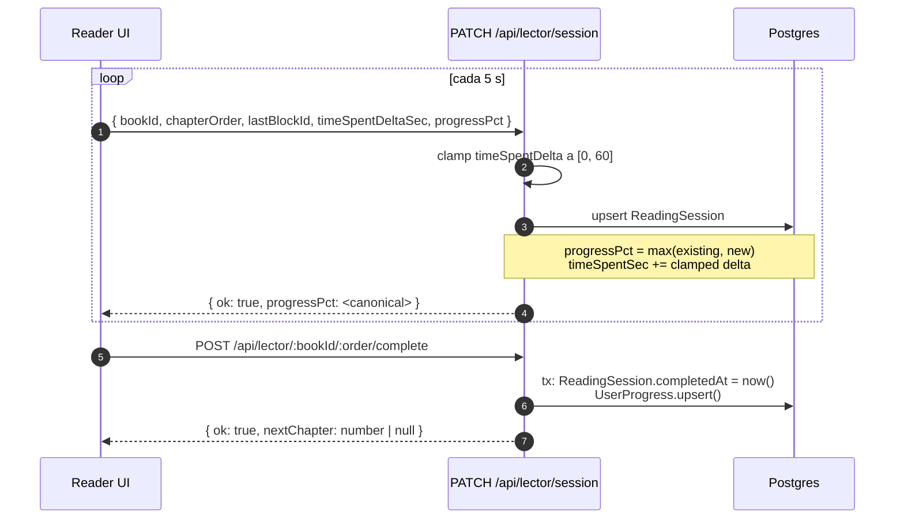

# Sprint S6 — LectorModule (reader + highlights + annotations)

**Rama:** `feature/sprint-s6-lector`
**Bitácora previa:** [deploy-2026-06-01-incident.md](deploy-2026-06-01-incident.md) + [sprint-s11-billing-cleanup.md](sprint-s11-billing-cleanup.md)
**Tests:** 348/349 (323 anteriores + 25 nuevos, 1 skipped sentinel)

---

## §1 · Scope

Cierra el core product que faltaba: la pantalla del **Lector** real. Hasta hoy `/dashboard/biblioteca/[slug]` mostraba metadata + lista de capítulos, pero los capítulos no se podían leer porque su contenido no existía en DB. Este sprint introduce `ChapterBlock` (bloques tipados que reemplazan `Chapter.body String`), highlights, annotations, reading session heartbeat y audio signed URL — los 9 endpoints del diseño `docs/design/handoff/05-lector.md`.

---

## §2 · Lo que se construyó

### Schema (`apps/api/prisma/schema.prisma`)

Cuatro modelos nuevos + dos enums (`ChapterBlockKind`, `HighlightColor`). Migración `20260602100000_s6_lector_chapter_blocks_highlights_annotations.sql` aditiva — no toca tablas existentes.

```
ChapterBlock      { id, chapterId, order, kind, content, meta?, createdAt, updatedAt }
Highlight         { id, userId, blockId, startOffset, endOffset, color, note?, createdAt, updatedAt }
Annotation       { id, userId, blockId, text, createdAt, updatedAt }
ReadingSession   { id, userId, chapterId, lastBlockId?, progressPct, timeSpentSec, startedAt, lastSeenAt, completedAt? }
```

**Por qué `ChapterBlock` en lugar de `Chapter.body String`:**

1. Highlights/annotations anclan a un block id estable, no a rangos en un string que cambia con cada edición editorial.
2. El "Modo Guía" del diseño 05-lector.md sincroniza el transcript del audio con los blocks del libro — necesita un anchor por block.
3. El editor de autor (S19) va a editar bloque por bloque, no archivos markdown gigantes.

### Backend (`apps/api/src/lector/`)

**3 controllers, 3 services:**

| Controller              | Endpoints                                                                                                                                                                                   |
| ----------------------- | ------------------------------------------------------------------------------------------------------------------------------------------------------------------------------------------- |
| `LectorController`      | `GET /api/lector/:bookId/:chapterOrder` · `GET /api/lector/:bookId/:chapterOrder/audio` (Pro) · `PATCH /api/lector/session` (heartbeat) · `POST /api/lector/:bookId/:chapterOrder/complete` |
| `HighlightsController`  | `POST /api/highlights` · `DELETE /api/highlights/:id`                                                                                                                                       |
| `AnnotationsController` | `POST /api/annotations` · `PATCH /api/annotations/:id` · `DELETE /api/annotations/:id`                                                                                                      |

**Decisiones clave:**

1. **`GET /api/lector/:bookId/:chapterOrder` es envolvente.** Devuelve `book + chapter + blocks + lessons + highlights + annotations + session + preferences` en una sola request, igual que `GET /api/plan` del Sprint S11. Razón: el reader debe poder bootear offline después del primer fetch.

2. **Heartbeat con defensa profunda.** El cliente envía `progressPct` y `timeSpentDeltaSec` cada 5 s. El service:
   - Capa `timeSpentDeltaSec` en 60 s (tab que despierta de suspend no puede acreditar horas).
   - Nunca decrementa `progressPct` (scroll-back para releer no debería restar progreso).
   - Soft-fails con `{ ok: true }` cuando el chapter no existe (el cliente podría seguir enviando heartbeats de un chapter despublicado).

3. **Pro gate por chapter, no por book.** El primer chapter de cada libro PRO es preview gratis. El resto exige `plan != FREE`. Cualquier user puede leer libros FREE completos.

4. **Audio v1 = ApiList plain.** El transcript se entrega como un solo segmento (todo el `Audio.transcription`) hasta que VoiceModule aprenda a hacer Whisper word-level (deuda técnica). El `fileUrl` apunta a R2 público v1; el switch a presigned URL queda como `TODO senior` cuando movamos audio a private bucket.

5. **Annotations en plaintext.** El diseño 05-lector.md las trata como notas al libro, no pensamiento personal sensible. No usan el contrato E2E del Diario (ADR 0007). Si en el futuro el producto pide annotations cifradas, se introduce un campo `textCiphertext + textNonce` paralelo.

### Helpers cross-service

`LectorService` expone `assertBlockExists()` y `validateHighlightOffsets()` que `HighlightsService` y `AnnotationsService` consumen. Razón: ambos checks necesitan DB access y queremos un solo lugar que sepa "qué hace válido a un anchor de bloque" — si el editor de autor (S19) cambia las reglas, las dos controllers heredan la nueva validación.

### Seed actualizado

30 ChapterBlocks reales (5 capítulos × 6 blocks cada uno) para los 2 libros ancla:

- **Emociones en Construcción** · cap 1 + cap 2
- **Familias Ensambladas** · cap 1 + cap 2 + cap 3

IDs deterministas (`cb-emo-1-1`, `cb-fam-2-3`, etc.) para que los tests puedan referenciarlos sin round-trip. Mix de KINDs: HEADING + PARAGRAPH + QUOTE + PAUSE + EXERCISE — el reader del front va a poder ejercitar la renderización completa con seed data.

### Tipos (`packages/types/src/index.ts`)

15+ tipos nuevos:

- `ChapterBlockKind`, `HighlightColor` (string unions)
- `ChapterBlockSummary`, `HighlightSummary`, `AnnotationSummary`
- `LectorChapterResponse` (envolvente), `LectorAudioResponse`, `LectorReadingSessionSnapshot`
- `LectorSessionHeartbeatRequest/Response`
- `CreateHighlightRequest/Response`, `CreateAnnotationRequest/Response`, `UpdateAnnotationRequest/Response`
- `ReaderPreferencesResponse` (mirror del existente `UpdateReaderPreferencesRequest`)

### Cliente (`packages/api-client/src/lector.ts`)

`lectorApi`, `highlightsApi`, `annotationsApi` exportados desde `@psico/api-client`. Cada método tipa el request y response contra el tipo central — drift entre back y front se rompe en CI vía `openapi-diff`.

### `PATCH /api/user/reader-preferences`

Ya existía desde Sesión 9 (UsersModule scaffolding). Zero work — el sprint S6 solo lo documenta como parte de la surface del Lector.

---

## §3 · Flow del heartbeat



**Por qué `progressPct = max(existing, new)`:** un usuario que scrollea hacia atrás para releer no debería ver su progreso disminuir. El cliente sigue mandando la posición scroll actual; el server elige no disminuir.

**Por qué transacción en `/complete`:** sin tx hay window donde la `ReadingSession` queda `completedAt = now()` pero el `UserProgress` falla. El front lee `progressPct: 1` y el dashboard sigue mostrando el libro como "en progreso". Hacer ambos writes en una sola transacción elimina ese inconsistency.

---

## §4 · Tests (25 nuevos)

`lector.service.spec.ts` (15 tests):

- Aggregation correcta para user FREE leyendo libro FREE
- Rechazo `PRO_REQUIRED` cuando user FREE intenta chapter 2+ de libro PRO
- Acceso al chapter 1 de libro PRO permitido a user FREE (free preview)
- `NOT_FOUND` cuando book/chapter no existe
- Heartbeat: capa `timeSpentDelta` a 60 s
- Heartbeat: nunca decrementa `progressPct`
- Heartbeat: soft-fail cuando chapter no existe
- `completeChapter` devuelve `nextChapter` o null
- `getAudio` rechaza FREE con `PRO_REQUIRED`
- `getAudio` devuelve `AUDIO_NOT_AVAILABLE` cuando no hay audio
- `getAudio` devuelve metadata para PRO
- `validateHighlightOffsets` rechaza `start >= end`
- `validateHighlightOffsets` rechaza `endOffset > block.content.length`
- `validateHighlightOffsets` acepta rango válido

`highlights.service.spec.ts` (5 tests):

- Crea con default YELLOW
- Delega validación de offsets al LectorService
- Rechaza delete por non-owner (FORBIDDEN)
- 404 cuando highlight no existe
- Permite delete por owner

`annotations.service.spec.ts` (5 tests):

- Crea después de verificar block existe
- Update rechaza non-owner
- Update 404 cuando no existe
- Delete rechaza non-owner
- Delete permite owner

---

## §5 · Deuda técnica abierta

- **Frontend del Lector NO existe todavía.** Backend listo. El sprint UI companion (web + mobile) será el siguiente paso para realmente entregar valor.
- **Audio v1 sirve fileUrl directo de R2 público.** Cuando movamos audio a bucket privado, hay que cambiar `LectorService.getAudio` para mintar presigned URL con TTL 1h.
- **Transcript = 1 segmento.** Whisper produce word-level timestamps cuando se le pide `response_format=verbose_json`. VoiceModule lo ignora hoy y persiste el transcript como string. Cuando lo cambiemos, `Audio.transcription` pasaría a JSON estructurado y `LectorService.getAudio.transcript` haría el split natural.
- **No hay UserProgress migration del legacy.** Users que ya completaron capítulos antes del sprint NO tienen `ReadingSession` rows. El cliente debería crear una al primer scroll (lo cual ya hace via heartbeat) — pero el progreso histórico se pierde. Aceptable porque solo afecta a usuarios del dev environment.
- **Sin paginación de highlights/annotations.** v1 devuelve TODOS los del chapter. Si un user marca 500 highlights, va a cargar todos en cada fetch del chapter. Aceptable para anchor books de ~6 blocks/cap; revisar cuando aterricen libros con caps largos.
- **Sin rate limit específico en heartbeat.** El throttler global (60/min) aplica. Si un cliente bugueado mete 100 heartbeats/s, va a recibir 429s. v2 podría tener un throttle dedicado más generoso para heartbeat.
- **`Annotation.text` sin sanitización HTML.** Si la UI renderiza el texto como innerHTML hay XSS. Mientras el front renderee como texto plano (textContent) está OK.

---

## §6 · Verificación

```bash
# back
pnpm --filter @psico/api test         # 348/349 ✓ (323 + 25 S6)
pnpm --filter @psico/api typecheck    # ✓
pnpm --filter @psico/api lint         # ✓ (4 warnings, 0 errors)

# shared
pnpm --filter @psico/types build      # ✓
pnpm --filter @psico/api-client generate:check  # ✓
pnpm --filter @psico/api-client build # ✓

# web + mobile (no UI changes en este sprint — solo tipos)
pnpm --filter @psico/web typecheck    # ✓
pnpm --filter @psico/mobile typecheck # ✓
```

**Migración aplicada en producción** (`switchyard.proxy.rlwy.net`) antes del merge a develop: 4 tablas nuevas + 30 ChapterBlocks seeded.

---

## §7 · Resumen para Notion

**¿Qué se construyó?** Backend completo del Lector — 9 endpoints, 4 modelos Prisma, 3 services, 25 tests. El reader real para leer los libros que ya están en la biblioteca. ChapterBlocks tipados (PARAGRAPH/HEADING/QUOTE/EXERCISE/AUDIO/IMAGE/PAUSE), highlights con color y nota, annotations en plaintext, reading session con heartbeat defendido contra suspend-resume y scroll-back, audio signed URL Pro-gated, complete con transacción.

**¿Qué viene?**

1. **Frontend del Lector** (web + mobile) — la pantalla `Lector.html` del diseño en código. Es lo siguiente lógico: backend listo, datos seeded en prod, falta la UI.
2. **S10 PatronesModule** (Pro feature) — heatmap del Diario + insights LLM. Próxima feature del roadmap si decides pivotear de S6-front.
3. **Bugfix #2 Stripe price IDs** sigue pendiente — bloqueante revenue, no relacionado a S6.

**Migración aplicada en producción.** Seed corrido. Cliente regenerado. Listo para el frontend.
