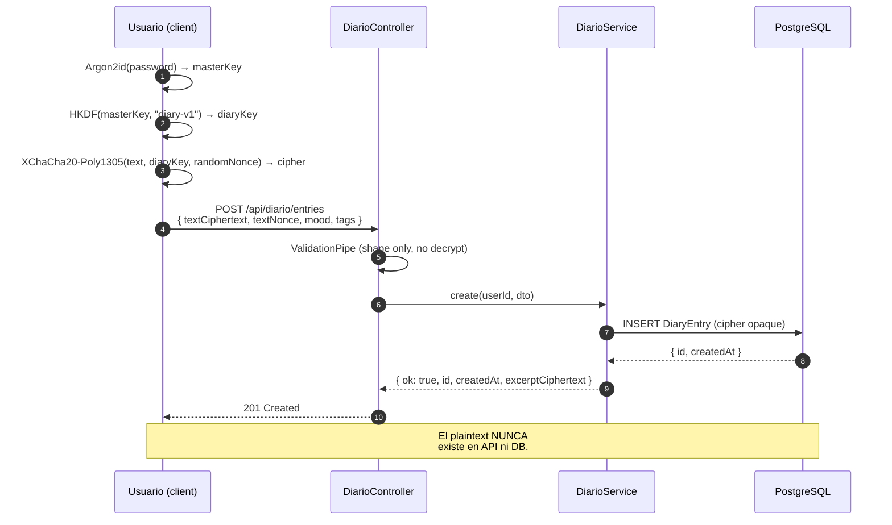
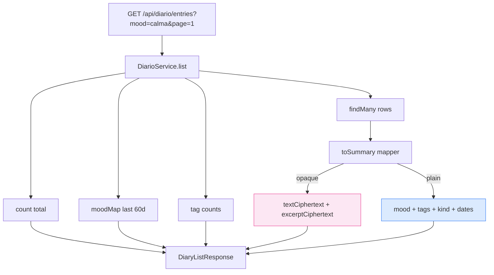
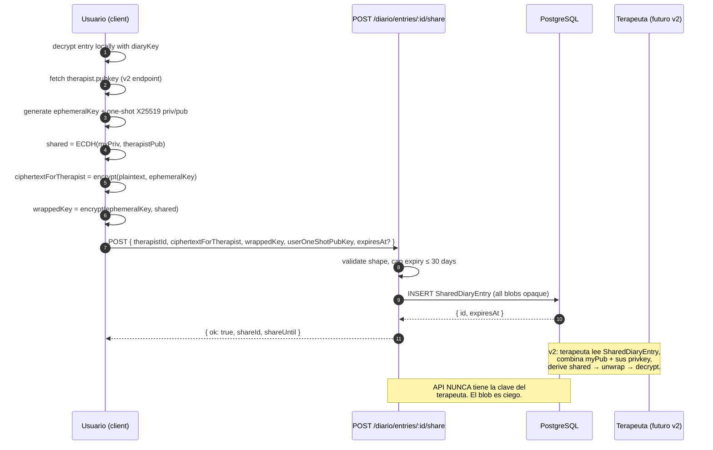
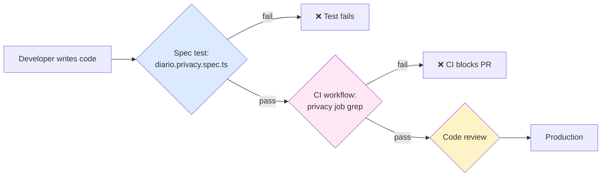

# Sprint S6 — DiarioModule con E2E encryption

**Fecha:** 2026-05-26
**Rama:** `feature/sprint-s6-diary-e2e`
**Tests:** 252/252 pasando (baseline 234 + 18: 15 DiarioService + 3 privacy regression)
**ADR aplicado:** [0007 — E2E encryption Diario/Eco](../adr/0007-e2e-encryption-diario-eco.md) (escrito en S1, ahora en código)
**Bitácora previa:** [sprint-s5.md](sprint-s5.md)

---

## §1 · Lo que se construyó

### Endpoints (7 nuevos)

| Método | Path                            | Purpose                         |
| ------ | ------------------------------- | ------------------------------- |
| GET    | `/api/diario/entries`           | Paginated list + moodMap + tags |
| GET    | `/api/diario/prompt-of-the-day` | Day-of-year hash rotation       |
| GET    | `/api/diario/entries/:id`       | Detail (full cipher body)       |
| POST   | `/api/diario/entries`           | Create                          |
| PATCH  | `/api/diario/entries/:id`       | Edit                            |
| DELETE | `/api/diario/entries/:id`       | Delete                          |
| POST   | `/api/diario/entries/:id/share` | Re-encrypted share to therapist |

### Schema (3 modelos)

- **`DiaryEntry`** — ciphertext + nonce + plaintext metadata. `excerptCiphertext`/`excerptNonce` opcionales para previews.
- **`SharedDiaryEntry`** — wrapped key + ephemeral pubkey + ciphertext per-therapist + `expiresAt`. SetNull cascade on entry delete preserves audit trail.
- **`DiaryPrompt`** — curated catalog, rotation hashed by day-of-year.

Migración `20260526210000_s6_diary_e2e_encryption/migration.sql` (additive, no destructive drops).

### `@psico/types` (+10 tipos)

`DiaryEntryKind`, `DiaryEntrySummary`, `DiaryEntryDetail`, `DiaryListResponse`, `DiaryDetailResponse`, `DiaryMoodMap`, `DiaryTagCount`, `CreateDiaryEntryRequest`, `UpdateDiaryEntryRequest`, `CreateDiaryEntryResponse`, `DeleteDiaryEntryResponse`, `DiaryPromptOfTheDay`, `ShareDiaryEntryRequest`, `ShareDiaryEntryResponse`.

### Custom validators (3)

- `@IsBase64UrlCipher()` — base64url, ≤ 1.4 MB.
- `@IsBase64UrlNonce()` — base64url, exactly 24 bytes (32 chars unpadded).
- `@IsBase64UrlBlob(maxLen)` — generic, custom cap.

Single source of truth para shape/size de cualquier campo cifrado. Reutilizable cuando llegue Eco (S9).

### Privacy regression (defensa en profundidad)

- **Spec test** `diario.privacy.spec.ts` — walks `apps/api/src/diario/`, `home/`, `users/` y falla si encuentra `logger.*` / `console.*` con campo cifrado.
- **CI workflow job** `privacy` en `.github/workflows/ci.yml` — corre el mismo grep en CI antes de build. Belt-and-suspenders: si los tests se saltan, CI bloquea igual.

### Stats hook-up

- `UsersService.computeStats` ahora cuenta `DiaryEntry` real. `diaryEntries` y `minutesTotal` (12 min/chapter + 5 min/entry) salen de 0.
- `HomeService.fetchStats` cuenta entries de últimos 7 días → `entriesThisWeek` real.

### Cliente

`packages/api-client/src/diario.ts` — nuevo `diarioApi` (7 métodos). Pasa ciphertext/nonce sin transformar. Apiclient extendido con método `delete<T>()`.

### Seed

7 nuevos `DiaryPrompt` curados — distintos de los `ReflectionPrompt` de Home (los de diario son para escribir, no para reflexionar).

---

## §2 · Decisiones de implementación

### 2.1 — Excerpt cipher opcional

El handoff (06-diario.md) menciona `excerpt: string` ~80 chars. Como el server no puede generar el excerpt (necesitaría descifrar), o el cliente lo provee como cipher separado, o se omite y el cliente descifra el body completo en la lista. Implementé el primero: `excerptCiphertext` + `excerptNonce` opcionales en POST/PATCH. Si la entrada es muy corta, el cliente puede omitirlo y descifrar el body entero.

Esto es eficiente: 80 chars cifrados son ~150 bytes vs descifrar 1 KB+ por entrada en la lista.

### 2.2 — Cipher/nonce pairing en PATCH

`UpdateDiaryEntryDto` permite cambiar mood/tags por separado, pero **`textCiphertext` y `textNonce` solo pueden moverse juntos**. Cambiar uno sin el otro produce un body indescifrable (nonce stale o cipher stale). El service valida y rechaza con `BAD_REQUEST: CIPHER_NONCE_PAIRING`.

Razón: el cliente debe regenerar el nonce en cada write para evitar nonce-reuse bajo la misma clave (catástrofe en XChaCha20-Poly1305).

### 2.3 — Day-of-year rotation para diary prompts

`GET /diario/prompt-of-the-day` selecciona vía `dayOfYear(today) % prompts.length`. Pros:

- Determinístico — el cliente puede cachear todo el día.
- Sin schedule server-side ni cron.
- Los usuarios ven el mismo prompt todos los días → ritual compartido.

Cons: si añades un prompt al catálogo a mitad de año, el orden de rotación cambia. Aceptable para v1.

### 2.4 — `audience: "all"` por ahora

Las dos catálogos de prompts (Home y Diario) tienen una columna `audience`. v1 solo usa `"all"`. Diseñado por extensión: cuando llegue Pulso (back-office) podremos segmentar por tier o mood sin migración.

### 2.5 — Share-with-therapist persiste sin TherapyModule

`POST /diario/entries/:id/share` acepta el blob ya re-encriptado y lo guarda. **TherapyModule (v2) NO existe todavía**, así que nadie lo lee. ¿Por qué no rechazar con 503?

Porque el contrato cripto es client-driven: el cliente puede compartir hoy (genera el blob localmente con la pubkey del terapeuta que ingrese manualmente), y cuando TherapyModule aterrice los blobs existentes ya están consumibles. Migración cero.

Si en v2 queremos requerir "therapy active" guard, se agrega un check en el service al lado del `findFirst(entry)`. La data ya está donde tiene que estar.

### 2.6 — `SharedDiaryEntry.entryId` nullable

`onDelete: SetNull` para que el audit trail ("user U compartió entry E con therapist T el día X") sobreviva si U después borra la entry. La row queda huérfana pero consultable. Útil para Pulso (back-office v2).

---

## §3 · Diagramas

### 3.1 — Wire format



### 3.2 — List flow



### 3.3 — Sharing with therapist



### 3.4 — Privacy defense layers



---

## §4 · Bugs corregidos durante el sprint

### 4.1 — Tests existentes no mockean `diaryEntry`

Cuando agregué la lectura de `prisma.diaryEntry.count` en `HomeService.fetchStats` y `UsersService.computeStats`, los specs de Home (3 tests) y Users (3 tests) rompieron con `Cannot read properties of undefined (reading 'count')`.

**Fix:** añadir `diaryEntry: { count: vi.fn().mockResolvedValue(0) }` al mock factory en cada spec. Default a 0 cubre el caso "usuario sin entries" automáticamente.

### 4.2 — `apiClient.delete<T>()` no existía

El `diarioApi.remove` necesitaba DELETE. El cliente solo tenía `get/post/patch`. Añadido `delete<T>(path)` siguiendo el mismo patrón de `request<T>("DELETE", path)`.

### 4.3 — Prisma `SetNull` con campo requerido

Primera versión tenía `SharedDiaryEntry.entryId String` (requerido) con `onDelete: SetNull`. Prisma warning: "the field should be nullable". Cambié a `entryId String?` y documenté el porqué (audit trail).

---

## §5 · Verificación

```bash
pnpm --filter @psico/api test                # 252/252 (16 + 2 nuevos confiables)
pnpm --filter @psico/api typecheck           # ok
pnpm --filter @psico/api lint                # ok
pnpm --filter @psico/types build             # ok
pnpm --filter @psico/api-client build        # ok
pnpm --filter @psico/api-client generate:check  # in sync
pnpm --filter @psico/web typecheck           # ok
pnpm --filter @psico/mobile typecheck        # ok

# Privacy grep (también corre en CI)
grep -rnE '(console\.|logger\.)\s*\([^)]*\b(textCiphertext|textNonce|excerptCiphertext|wrappedKey|ciphertextForTherapist)\b' \
  apps/api/src/ --include='*.ts' --exclude='*.spec.ts' --exclude='*.privacy.spec.ts'
# (no matches → ✅)
```

Smoke boot del API:

- 58 rutas mapeadas bajo `/api/*` (51 previos + 7 Diario).
- `DiarioModule dependencies initialized` en el log.
- `openapi.json` regenerado: 35 KB → 39 KB.
- `generated.ts`: 53 KB → 58 KB (+5 KB de tipos Diario).

---

## §6 · Deuda técnica abierta

- **Migración Prisma S6 sin aplicar en Railway.** Acumulada con todas las anteriores. La ventana de mantenimiento (`docs/deploy/v0-5-alpha-cutover.md`) las aplica todas de una.
- **`SharedDiaryEntry` expiry sweeper** sin implementar. v2 TherapyModule ó cron job que delete rows con `expiresAt < now()`. Sin él las filas se acumulan — no es PII, solo blobs ciegos cifrados, pero ocupan espacio.
- **No hay rate limit específico en `/diario/entries POST`.** El throttler global (60/min) aplica. Si vemos abuso (spam scripts), agregamos `@Throttle({ default: { limit: 30, ttl: 60_000 } })`.
- **No hay full-text search en diario** — el server no puede indexar cipher. Búsqueda cliente-side queda en el frontend (06-diario.md §acciones).
- **`audioUrl` queda sin almacenamiento real** hasta VoiceModule (S8). El campo acepta cualquier URL válida hoy; el bucket R2 se monta en S8.
- **No hay endpoint `GET /diario/entries/:id/audio`** — el audio es público por URL firmada (R2 presigned). Diseñado en VoiceModule.
- **Recovery seed-phrase (BIP39)** mencionada en ADR 0007 §G NO se implementa server-side — es opt-in cliente-side. La UI del primer login pide al usuario decidir.

---

## §7 · Aprendizajes / patrones

### Privacy by construction

El server **no puede** filtrar cipher porque nunca lo entiende. No es una política — es un invariante estructural. Los tres niveles de defensa (DTO validators, spec test, CI grep) hacen que cualquier intento de loggear cipher falle antes de mergear.

### Cipher/nonce pairing como invariante de tipo

Las DTOs validan shape, pero el service valida la relación entre campos. Cambiar un cipher sin un nuevo nonce es semánticamente roto (catástrofe cripto). El service rechaza con código machine-readable `CIPHER_NONCE_PAIRING` para que el cliente diagnostique.

### Day-of-year hash > server cron

Para rotaciones diarias deterministicas, un hash sobre `dayOfYear(today)` reemplaza todo el aparato de jobs schedulados. Más simple, más cacheable, más testable. Aplicable a otros sprints (Eco "frase del día", etc).

### Opaque blob = source of truth del cliente

El server es lugar de almacenamiento, no de cómputo. La invariante "el cliente es el único que entiende esto" se mantiene si el server jamás llama `.decrypt` en código de producción. Cero excepciones en endpoints; las únicas funciones que tocan plaintext del usuario en memoria son tests propios.

---

## §8 · Próximo sprint — S7

Próximo en el Plan v2: **SubscriptionModule completo** (usage, customer-portal, invoice download).

```bash
git checkout -b feature/sprint-s7-subscription-usage
# Endpoints nuevos:
#   - GET  /api/subscriptions/usage       — quota consumida (mensajes Eco, voz, etc)
#   - POST /api/subscriptions/portal      — Stripe Customer Portal session
#   - GET  /api/subscriptions/invoices    — historial
#   - POST /api/subscriptions/cancel      — cancelar al fin de período
# Plus integración con BullMQ jobs para sync diaria de usage counters.
```

**Decisión pendiente antes de S7:** ¿el endpoint `/usage` agrega TODOS los counters (Eco messages, voz minutes, exports, etc) o uno por feature? Plan v2 propone un agregador único — coincide con cómo HomeModule resuelve `/home`.
