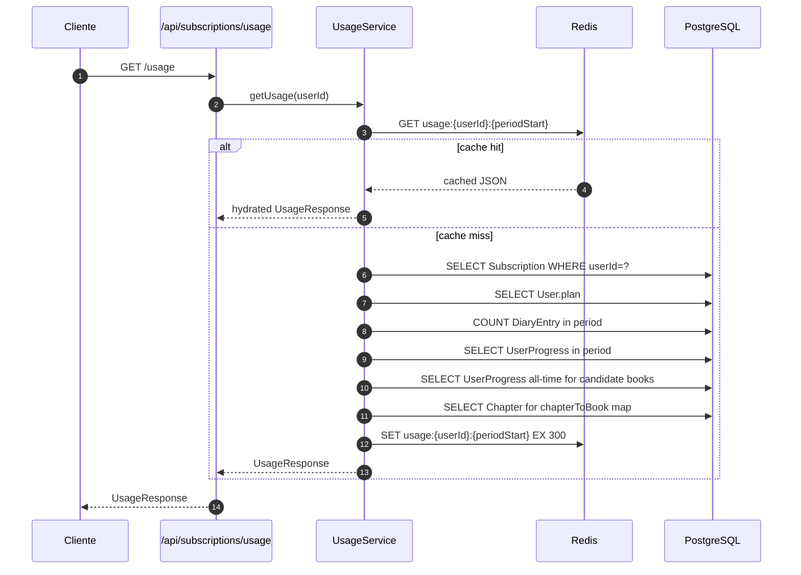
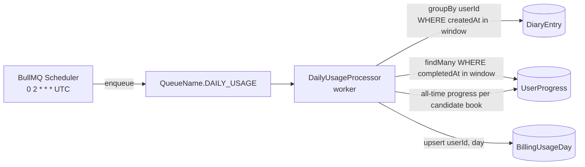

# Sprint S7 — SubscriptionModule completo

**Fecha:** 2026-05-27
**Rama:** `feature/sprint-s7-subscription-usage`
**Tests:** 313 pasando (279 API + 34 crypto) — baseline 252 → 279, +27 tests nuevos
**ADRs aplicados:** ninguno nuevo (decisión documentada inline en código + este informe)
**Bitácora previa:** [sprint-seed-and-password-rekey.md](sprint-seed-and-password-rekey.md)

---

## §1 · Scope

Cierre del SubscriptionModule según docs/design/handoff/09-plan.md y el Plan v2. El módulo ya tenía checkout + portal + webhook desde S4; faltaba:

- **`GET /api/subscriptions/usage`** — agregador único de consumo (libros completados, eco, voz, diario) con quotas del plan.
- **`GET /api/subscriptions/invoices`** — historial de facturación desde Stripe.
- **`POST /api/subscriptions/cancel`** + **`POST /api/subscriptions/reactivate`** — gestión del fin de suscripción.
- **BullMQ daily rollup** — escribe `BillingUsageDay` cada noche para Pulso admin + audit.

Tres decisiones del usuario lockearon el shape (cf. §3).

---

## §2 · Lo que se construyó

### Backend (4 endpoints nuevos)

| Endpoint                              | Método | Auth | Rate-limit              | Notas                                                                        |
| ------------------------------------- | ------ | ---- | ----------------------- | ---------------------------------------------------------------------------- |
| `/api/subscriptions/usage`            | GET    | sí   | global default (60/min) | Agregador único. Cache Redis 5min por (userId, periodStart).                 |
| `/api/subscriptions/invoices?limit=N` | GET    | sí   | global default          | Pasa-thru a `stripe.invoices.list`. `limit` 1-50, default 12.                |
| `/api/subscriptions/cancel`           | POST   | sí   | global default          | Atómico: Stripe `cancel_at_period_end=true` + mirror local + invalida cache. |
| `/api/subscriptions/reactivate`       | POST   | sí   | global default          | Idempotente. Si la sub ya no está pending-cancel, no-op.                     |

### Schema

- **`BillingUsageDay`** nuevo modelo:
  - `(userId, day)` único — idempotencia del rollup.
  - Columnas: `booksCompleted Int @default(0)`, `ecoMessages Int @default(0)`, `voiceMinutes Float @default(0)`, `diaryEntries Int @default(0)`.
  - Migración `20260528000000_s7_billing_usage_day`.

### Servicios

- **`UsageService`** (nuevo) — agregador con cache Redis:
  - `getUsage(userId)` — resuelve periodo (`Subscription.currentPeriodStart` o calendario UTC para FREE), cuenta diary entries, calcula books completed con la heurística "todos los chapters publicados completados", devuelve placeholders 0 para Eco/Voice con sus quotas.
  - `invalidate(userId)` — SCAN-DEL `usage:<userId>:*` después de cancel/reactivate.
- **`SubscriptionService`** extendido con `getUsage`, `listInvoices`, `cancel`, `reactivate`.
- **`PaymentService`** extendido con `listInvoices`, `cancelAtPeriodEnd`, `reactivate` — delega al provider seleccionado.
- **`StripeProvider`** implementa los tres métodos nuevos:
  - `listInvoices` → `stripe.invoices.list({customer, limit})` → mapeo a `InvoiceSummary` con amount en major units.
  - `cancelAtPeriodEnd` → `stripe.subscriptions.update({cancel_at_period_end: true})` + mirror local. Guarda `cancellation_reason` en metadata Stripe.
  - `reactivate` → mismo update con `false`. Idempotente.
- **`PayphoneProvider`** stub: `listInvoices` retorna `[]`, cancel/reactivate lanzan `NotImplementedException`.

### Quotas

`apps/api/src/subscription/quotas.ts` — record por `Plan`. FREE 20/0/null, PRO 200/120/null, B2B unlimited.

### BullMQ daily-usage

- Nueva queue `DAILY_USAGE` registrada en `JobsModule` (producer side, `apps/api`) y `WorkerAppModule` (consumer side, worker process).
- `JobsService.onModuleInit` registra el repeatable-job con `upsertJobScheduler` — cron `0 2 * * *` UTC, id estable `daily-usage-02-utc`.
- `DailyUsageProcessor` (worker) scanea actividad del día anterior y upserta una fila de `BillingUsageDay` por usuario activo. Retry 3 attempts (5min / 25min / 2h). Idempotente por `(userId, day)` unique.

### Shared

- **`@psico/types` +14 tipos**: `UsagePeriod`, `UsageBooks`, `UsageEco`, `UsageVoice`, `UsageDiary`, `UsageResponse`, `InvoiceStatus`, `InvoiceSummary`, `InvoiceListResponse`, `CancelSubscriptionRequest`, `CancelSubscriptionResponse`, `ReactivateSubscriptionResponse`.
- **`@psico/api-client`** `subscriptionApi.createPortalSession`, `getUsage`, `listInvoices`, `cancel`, `reactivate`. `generated.ts` 62.1 KB → 65.5 KB.

---

## §3 · Decisiones lockeadas con el usuario antes de implementar

| #   | Pregunta                                                          | Respuesta lockeada                      | Razón                                                                                                  |
| --- | ----------------------------------------------------------------- | --------------------------------------- | ------------------------------------------------------------------------------------------------------ |
| 1   | ¿`/usage` agregador único o uno por feature?                      | **Agregador único**                     | Mi Plan consume todo a la vez → menos round-trips. Quotas viven en plan, no en feature.                |
| 2   | ¿Cancel/reactivate como POST separados o PATCH con `action` enum? | **POST `/cancel` + POST `/reactivate`** | Una responsabilidad por endpoint. Más fácil de testear y rate-limitar. Plan v2 ya lo sugería.          |
| 3   | ¿`/usage` counters live (query-time) o pre-agregados por BullMQ?  | **Live + cache Redis 5min**             | Datos siempre frescos para el usuario; BullMQ escribe `BillingUsageDay` para Pulso (no para el front). |

---

## §4 · Diseño criptográfico (n/a — sin cambios de cripto)

Este sprint no toca el módulo E2E. La página Mi Plan es completamente plaintext.

---

## §5 · Diseño del flow `/usage`



**Por qué cache 5 min y no longer:**

- Mi Plan se carga una sola vez por sesión típica — el cache rara vez se hit-eará en ruido.
- Un usuario power que escriba 3 diary entries y refresque Mi Plan vería los counters viejos por 5 minutos. Aceptable: el counter es un nice-to-have, no un blocker para una decisión.
- El SCAN-DEL en `invalidate(userId)` después de cancel/reactivate cubre los casos en que la stale data sí importa.

---

## §6 · Diseño del rollup BullMQ



**Por qué un fan-out job único y no per-user:**

- `groupBy` + `findMany` paginan en una sola consulta cada uno — N usuarios activos por día se procesan con O(2N + B) queries donde B = candidate books.
- Per-user jobs serían O(N) en BullMQ overhead + O(N) en Postgres connections — peor para nuestra escala.
- Cuando DAU pase de ~50k, partimos en `bulkAdd` con chunks de 1000 usuarios.

**Idempotencia:**

- `BillingUsageDay.userId_day` es único, y el processor usa `upsert` → re-correr el job para el mismo día es seguro.
- BullMQ retries con backoff 5min/25min/2h cubre fallos transitorios (Postgres restart, OOM).

---

## §7 · UX trade-offs

### Counters Eco/Voice en 0

`UsageResponse.eco.messagesThisPeriod = 0` y `voice.minutesThisPeriod = 0` hasta que aterricen S10 (AIModule conversacional) y S8 (VoiceModule). Las quotas SÍ se exponen — el UI puede renderizar "0 de 200 mensajes Eco" desde el primer día.

**Por qué exponer la quota sin tener el contador:**

- El front diseña la página una vez. Si añadiéramos `quota` después, sería un breaking change para los componentes ya escritos.
- Decir "0 de 200" es semánticamente correcto: el usuario realmente ha enviado 0 mensajes.

### Cancel = `cancel_at_period_end`, no inmediato

`POST /cancel` NO termina la suscripción de inmediato — marca `cancel_at_period_end: true` en Stripe. El usuario conserva su Pro hasta `currentPeriodEnd`. Es lo que dice 09-plan.md ("Tu Pro termina el DD/MM"), lo que Stripe recomienda, y lo que evita disputas por refunds.

`reactivate` revierte el flag mientras la sub aún está active (no canceled). Si pasó el `currentPeriodEnd` y Stripe ya bajó el status, el flow correcto es un nuevo checkout — no un reactivate.

### Cap de 50 invoices por request

`limit ≤ 50` en el DTO de `/invoices`. Stripe permite hasta 100 pero Mi Plan no diseñó paginación; con 12 default y 50 max queda holgado para los próximos 4 años incluso para los users mensual.

---

## §8 · Bugs corregidos durante el sprint

1. **`Stripe.Invoice` no es resoluble como namespace** en Stripe v22 CJS — `import Stripe from "stripe"` da el class+namespace pero `Stripe.Invoice` no funciona. Fix: derivar el tipo con `Awaited<ReturnType<StripeInstance["invoices"]["list"]>>["data"][number]` (mismo patrón que el `StripeSubscription` existente).
2. **Tests de `SubscriptionService` y `JobsService` rompieron** al agregar dependencias al constructor — actualizar los mocks (UsageService + dailyUsageQueue).
3. **Test de `reactivate` fallaba** porque el fixture `makeStripeSub` tiene `id: "sub_stripe_123"` pero el mock Prisma devolvía `stripeSubscriptionId: "sub_1"`. Cambié los mocks Prisma para usar el mismo id — refleja el invariante real (el local mirror guarda el id de Stripe).

---

## §9 · Deuda técnica abierta

- **Eco/Voice counters siempre 0** — wire-up cuando AIModule conversacional (S10) y VoiceModule (S8) aterricen. La quota está expuesta hoy, falta el contador.
- **`booksCompletedThisPeriod` aproximado** — "completado en el periodo" es realmente "tiene progreso en el periodo Y todos los capítulos están completados en algún momento". Para semantics estrictos necesitaríamos guardar `book.completedAt` cuando el usuario marca el último capítulo. Lo dejamos para cuando el UX del libro lo amerite.
- **Sin enforcement de quotas** — el endpoint EXPONE los caps pero ningún feature module los respeta todavía. Wire-up en S8/S10.
- **Sin tests del `DailyUsageProcessor`** — el processor depende de queries Prisma reales para validar. Cubrir con un test integration (Postgres in-memory o testcontainer) en S11.
- **Migración `20260528000000_s7_billing_usage_day` acumulada** con las anteriores desde Sesión 9 (~8 migraciones pendientes). Aplicar todas en una ventana antes del siguiente deploy.
- **Sin endpoint `/api/subscriptions/billing-address`** — el design 09-plan.md menciona "actualizar método de pago" pero ahora el flow es redireccionar al Stripe Customer Portal. Si decidimos UI in-app más adelante necesitaremos un endpoint nuevo.
- **`InvoiceSummary` no incluye `description` ni `lineItems`** — para una UX rica de "qué incluye esta factura" haría falta enriquecer el mapping. v2.
- **Cache invalidation no es proactiva** — un user que escribe una diary entry tiene cache viejo hasta 5 min. Mitigable con un `event-based` invalidate desde DiaryService pero no es worth la complejidad para v1.

---

## §10 · Verificación

```bash
# back
pnpm --filter @psico/api test          # 279/279 ✓
pnpm --filter @psico/api typecheck     # ✓
pnpm --filter @psico/api lint          # ✓

# shared
pnpm --filter @psico/types build       # ✓
pnpm --filter @psico/crypto test       # 34/34 ✓
pnpm --filter @psico/api-client build  # ✓
pnpm --filter @psico/api-client generate:check   # ✓ in sync

# front (no cambios)
pnpm --filter @psico/web typecheck     # ✓
pnpm --filter @psico/mobile typecheck  # ✓
```

**Smoke boot del API:**

```
60+ rutas mapeadas bajo /api/* — entre las nuevas:
  /api/subscriptions/usage         (GET)
  /api/subscriptions/invoices      (GET)
  /api/subscriptions/cancel        (POST)
  /api/subscriptions/reactivate    (POST)
JobsService log: "Daily usage rollup scheduled · id=daily-usage-02-utc · cron=0 2 * * * UTC"
```

---

## §11 · Resumen para Notion

**¿Qué se construyó?** Cuatro endpoints nuevos cierran el SubscriptionModule según el diseño de Mi Plan: agregador de uso, historial de facturas, cancelar al fin de período, reactivar. Más una tabla de rollup nocturna (`BillingUsageDay`) que alimenta Pulso admin sin tocar el path crítico del usuario.

**¿Qué viene?** Phase 1 backend tiene cerrado el subscription path. Próximo sprint candidato: **S8 — VoiceModule** (Whisper/Deepgram para transcripción de audio, entries con `kind="voz"`), o **S10 — AIModule conversacional** (extender el RAG con threads + messages cifrados). Ambos wiring-up los contadores que hoy quedan en 0.

**Bloqueante de deploy:** 8 migraciones Prisma acumuladas desde Sesión 9 siguen sin aplicarse en Railway. Plan: una ventana de mantenimiento + `prisma migrate deploy` antes del próximo PR a `main`.
