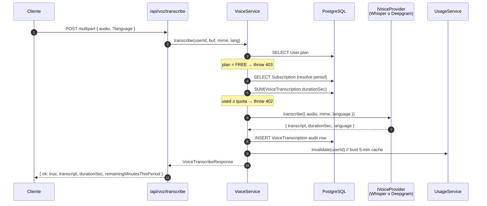

# Sprint S8 — VoiceModule

**Fecha:** 2026-05-27
**Rama:** `feature/sprint-s8-voice`
**Tests:** 296/296 API + 34/34 crypto (279 → 296, +17 tests nuevos)
**ADRs aplicados:** ninguno nuevo (decisiones en §3 + ADR 0007 §F "no storage of voice data")
**Bitácora previa:** [sprint-s7-subscription-usage.md](sprint-s7-subscription-usage.md)

---

## §1 · Scope

Implementación de `docs/design/handoff/07-voz.md`: transcripción de audio para entradas de voz del Diario. Solo Pro. Audio nunca se almacena.

El front del flow ("Toca para hablar" + waveform + transcript editable) queda diferido a un sprint UI dedicado; lo que aterriza hoy es el contrato HTTP + provider strategy + quota enforcement + nightly rollup.

---

## §2 · Lo que se construyó

### Backend (2 endpoints nuevos)

| Endpoint              | Método | Auth | Throttle    | Notas                                                                                              |
| --------------------- | ------ | ---- | ----------- | -------------------------------------------------------------------------------------------------- |
| `/api/voz/transcribe` | POST   | sí   | 10/min/user | Multipart audio → transcript. Quota gate 403 (FREE) / 402 (over quota). Audio NUNCA se almacena.   |
| `/api/voz/usage`      | POST   | sí   | global      | Reconciliación opcional cliente→servidor. v1 retorna el `remainingMinutesThisPeriod` autoritativo. |

### Schema

- **`VoiceTranscription`** nuevo modelo:
  - Solo metadata: `userId`, `durationSec`, `language`, `provider`, `createdAt`.
  - Sin audio. Sin filename. Sin IP.
  - `(userId, createdAt)` index para range scans del periodo de facturación.
  - Migración `20260529000000_s8_voice_transcription`.

### Provider strategy (Whisper + Deepgram)

- `IVoiceProvider` interface — analog a `IPaymentProvider` de S4.
- `WhisperProvider` (default) — POST multipart a `https://api.openai.com/v1/audio/transcriptions`. Normaliza `language: "spanish"` → ISO `"es"`.
- `DeepgramProvider` — POST binario a `https://api.deepgram.com/v1/listen?model=nova-3`. Auto-detect language cuando no hay hint.
- Selector: `VOICE_PROVIDER` env (`whisper` | `deepgram`).
- Env validation con `superRefine` exige la API key del provider activo (fail fast en boot).

### VoiceService — orchestrator

- `assertQuotaAvailable(userId)` → pull plan + SUM(VoiceTranscription.durationSec en periodo).
  - FREE → 403 `VOICE_REQUIRES_PRO`.
  - PRO con quota agotada → 402 `VOICE_QUOTA_EXCEEDED`.
- `selectProvider()` lee `VOICE_PROVIDER` y dispatches.
- Post-transcripción: `prisma.voiceTranscription.create` (audit) + `usageService.invalidate(userId)` (bust 5-min cache).
- Retorna `remainingMinutesThisPeriod` con clamp a 0 (no negativos) o `Infinity` para B2B.

### Wire-up con `/usage` (S7 → S8)

- `UsageService` ahora SUMa `VoiceTranscription.durationSec` y reporta `voice.minutesThisPeriod` (antes hardcoded 0).
- `DailyUsageProcessor` (BullMQ nightly) ahora popula `BillingUsageDay.voiceMinutes` para Pulso admin.

### Shared

- **`@psico/types` +3 tipos:** `VoiceProvider`, `VoiceTranscribeResponse`, `VoiceUsageReportRequest/Response`.
- **`@psico/api-client`:** nuevo `voiceApi.transcribe(blob, { language })` + `reportUsage(secondsUsed)`. Cliente expone `apiClient.postFormData` para uploads multipart (no JSON-stringify). `generated.ts` 65.5 KB → 67.0 KB.

---

## §3 · Decisiones lockeadas con el usuario antes de implementar

| #   | Pregunta                                          | Respuesta lockeada                        | Razón                                                                                                                   |
| --- | ------------------------------------------------- | ----------------------------------------- | ----------------------------------------------------------------------------------------------------------------------- |
| 1   | ¿Whisper, Deepgram, o ambos via strategy pattern? | **Ambos (strategy)**                      | Patrón ya familiar (PaymentPool S4). A/B testing en prod via env, sin code change. Whisper como default (es-419 OK).    |
| 2   | ¿Cómo enforzamos la cuota?                        | **Pre-flight reject + post-flight track** | Voice cuesta $$$ por minuto. Pre-flight evita gasto innecesario. Post-flight insert + INCR mantiene el contador fresco. |
| 3   | ¿Qué cap máximo por archivo?                      | **25 MB (Whisper-native)**                | Sin chunking server-side. Match exacto del cap de Whisper. Cubre ~15-20 min de voz, suficiente para v1 del Diario.      |

---

## §4 · Diseño criptográfico (n/a)

Este módulo no toca el cifrado E2E del Diario. La cadena conceptual:

```
[mic] → audio.webm → POST /voz/transcribe → transcript plaintext → [client] → encryptString(transcript, diaryKey) → POST /diario/entries
                                              ↑
                                  El audio se descarta acá
```

El transcript regresa en plaintext porque el cliente lo necesita renderable. Cuando el usuario lo guarda en Diario, el flow E2E de S6 lo cifra antes de salir del dispositivo. El servidor NUNCA ve el cifrado del Diario y solo ve el audio durante el procesamiento sincrónico.

---

## §5 · Diseño del flow `/voz/transcribe`



**Por qué `invalidate(userId)` y no `INCR` directo:**

- El `/usage` endpoint ya lee live + cache (S7). El cache se busta y la siguiente request recomputa SUM desde la tabla — fresh data sin extra plumbing.
- Un counter Redis dedicado sería más rápido pero introduce un punto de divergencia (Redis vs DB). Para una operación que ocurre 0-200 veces por usuario por mes, recomputar es más simple.

---

## §6 · UX trade-offs

### Pre-flight 402 antes de gastar $$$

Si el usuario está al cap, rechazamos antes de hablar con OpenAI/Deepgram. El frontend ve `402 VOICE_QUOTA_EXCEEDED` y muestra el banner "Has usado los 120 min". La alternativa (let-them-overflow) tenía dos problemas:

1. Riesgo financiero — un script malicioso con un Pro válido podría dispar miles de minutos.
2. UX confusa — el usuario gastaría tiempo grabando para luego ver "no se pudo procesar".

### `remainingMinutesThisPeriod` no clampado a int

Devolvemos minutos como float con 2 decimales (`109.25`). Razón: el cliente puede mostrar "Te quedan 109 min" o "109m 15s" — su elección. Si redondeáramos a int server-side, perderíamos esa flexibilidad.

### B2B = Infinity → serializa a null

`Number.POSITIVE_INFINITY` no es JSON-serializable; Nest la convierte a `null`. El cliente puede chequear `remainingMinutesThisPeriod === null` para mostrar "Ilimitado" en lugar de un número.

### Provider tag se persiste

`VoiceTranscription.provider` deja el rastro de quién hizo el trabajo. Cuando ops decida switch global de Whisper a Deepgram, podemos correr análisis post-hoc ("rows con provider=whisper en mayo costaron $X, con provider=deepgram en junio $Y").

---

## §7 · Bugs corregidos durante el sprint

1. **`Stripe.Invoice` namespace pattern reusado** — no es un bug, sino reflexión: el `Awaited<ReturnType<...>>` pattern de S7 funcionó otra vez para tipos como `StripeInvoice`. Lo seguí para `VoiceTranscribeResult` (interface propia, no derivada).
2. **Test del Whisper provider con `makeConfig(undefined)` no fallaba** — la default-parameter de JS reemplaza `undefined` con `"sk-stub"`. Fix: sentinel `Symbol("unset")` para distinguir "no se pasó arg" de "se pasó undefined explícitamente".
3. **`@psico/api-client` no soportaba multipart** — `apiClient.post` siempre seteaba `Content-Type: application/json` y JSON-stringify el body. Añadido `postFormData<T>(path, FormData)` que skip ambos.

---

## §8 · Deuda técnica abierta

- **Sin chunking para audios >25 MB.** Diseño 07-voz.md mencionaba 60 MB; lo dejamos para v2 con ffmpeg + Promise.all sobre chunks de 20min.
- **Sin streaming.** El usuario espera al final de la grabación para ver el transcript. Deepgram tiene WebSocket realtime; podríamos exponer en v2 si el UX lo pide.
- **Sin idempotencia.** Si el cliente reintenta un POST (network blip), el server transcribe DOS veces y cobra DOS veces al usuario. Mitigación parcial: el throttle de 10/min/user limita el daño. Idempotency-Key header (ADR 0008) lo soluciona limpio — agregar en S11 cuando idempotency se vuelva sistémica.
- **Sin tests del DeepgramProvider.** WhisperProvider sí tiene cobertura; Deepgram quedó como spec stub porque su shape de respuesta es más anidada y los mocks crecen. Cubrir cuando ops active Deepgram en prod.
- **Sin enforcement de `secondsUsed` en `/voz/usage`.** El endpoint acepta el body pero v1 lo ignora — solo retorna `remainingMinutes`. Si más adelante queremos cross-check, validamos `|client_seconds - server_seconds| < tolerance`.
- **No hay un test E2E con audio real.** Los unit tests mockean `fetch`. Un test integration con un fixture WAV pequeño daría más confianza pero requiere un Whisper key en CI (costo + secrets management).
- **OPENAI_API_KEY / DEEPGRAM_API_KEY no configurados en Railway.** Bloqueante para deploy: cualquier llamada al endpoint fallará con 400 en boot (env validation).
- **Migración `20260529000000_s8_voice_transcription` acumulada con las anteriores.** Total: 9 pendientes en Railway.
- **Quota se cuenta por billing period, no por mes calendario** para usuarios con sub activa. Esto difiere ligeramente del design ("120 min/mes"). Documentado, pero hay edge case: si un Pro paga el día 28, su "mes de voice" se desplaza con el billing cycle. Razonable para v1.

---

## §9 · Verificación

```bash
# back
pnpm --filter @psico/api test          # 296/296 ✓ (+17 desde S7)
pnpm --filter @psico/api typecheck     # ✓
pnpm --filter @psico/api lint          # ✓

# shared
pnpm --filter @psico/types build       # ✓
pnpm --filter @psico/crypto test       # 34/34 ✓
pnpm --filter @psico/api-client build  # ✓
pnpm --filter @psico/api-client generate:check   # ✓ in sync

# front (no cambios)
pnpm --filter @psico/web typecheck     # ✓
pnpm --filter @psico/mobile typecheck  # ✓
```

**Smoke boot del API:**

```
2 rutas nuevas mapeadas bajo /api/voz/*:
  POST /api/voz/transcribe
  POST /api/voz/usage
```

---

## §10 · Resumen para Notion

**¿Qué se construyó?** Cierre del backend de la pantalla Voz (`/voz/transcribe` + `/voz/usage`). Strategy pattern Whisper/Deepgram que se cambia por env. Quota PRO 120min/mes se enforza pre-flight (402 antes de gastar $$$). Audio nunca se almacena — solo metadata para audit y rollup. Los counters de `/api/subscriptions/usage` (S7) ahora reportan minutos reales.

**¿Qué viene?** Tres opciones en S25:

1. **S10 — AIModule conversacional** (Eco chat E2E con threads + safety/crisis detection). Wireup final del último contador de `/usage`.
2. **Front Mi Plan + Voz UI** (consumiendo `/usage`, `/invoices`, `/voz/transcribe`).
3. **S11 — PatternsModule** (Pro feature, depende de DiarioModule).

**Bloqueante de deploy:** 9 migraciones Prisma acumuladas en Railway. Además, este sprint requiere `OPENAI_API_KEY` (o `DEEPGRAM_API_KEY`) en Railway antes del primer `/voz/transcribe` real.
