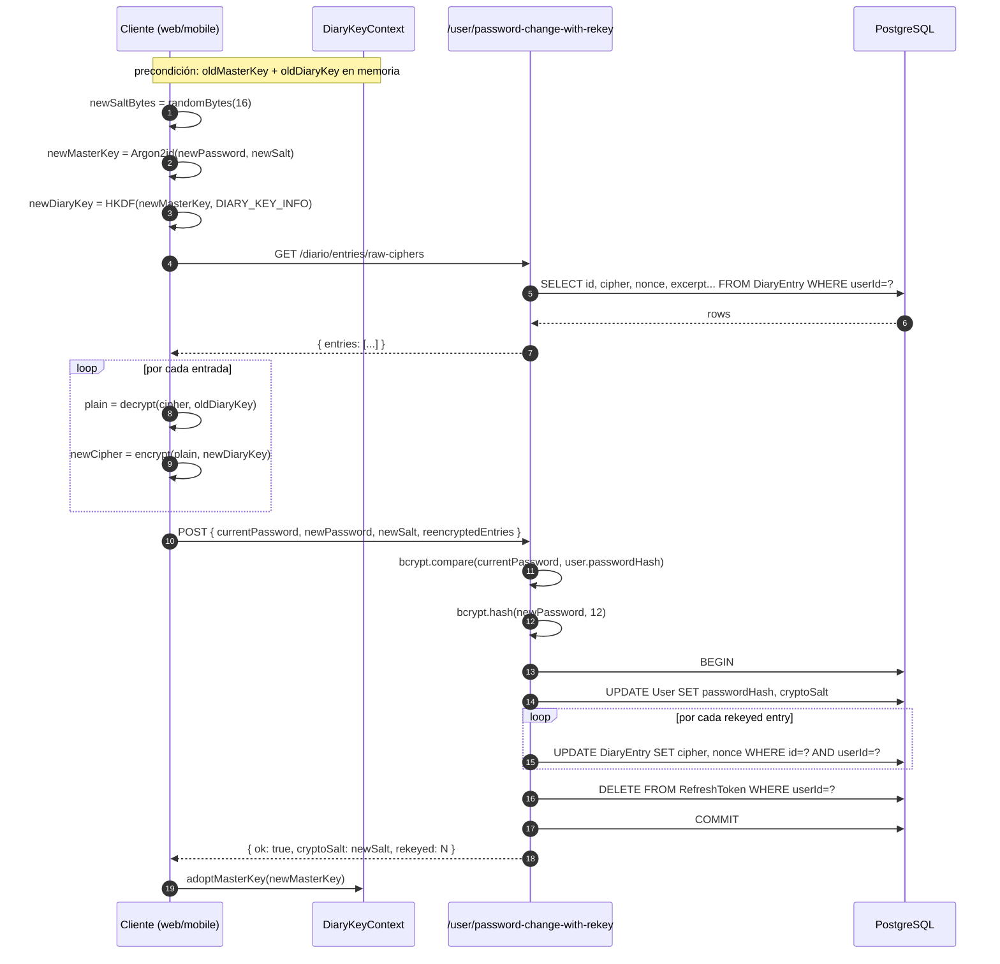

# Sprint seed-and-password-rekey — Backup UI + atomic password rotation

**Fecha:** 2026-05-27
**Rama:** `feature/sprint-seed-and-password-rekey`
**Tests:** 286 pasando (252 API + 34 crypto, baseline mantenido — endpoints nuevos sin tests dedicados aún, ver §6)
**ADR aplicado:** [0007 §F + §G](../adr/0007-e2e-encryption-diario-eco.md) — password rotation + recovery seed phrase
**Bitácora previa:** [sprint-s6-crypto-polish.md](sprint-s6-crypto-polish.md)

---

## §1 · Scope

Cierre de los dos flujos pendientes de S6-crypto-polish:

- **A · UI de la frase de recuperación** (`masterKeyToSeedPhrase` ya existía como utility desde S6-polish; faltaba modal de show + confirm + endpoint de acknowledge + recovery unlock).
- **B · Password change con re-encrypt** (sin esto, cambiar la contraseña deja huérfanas todas las entradas de Diario porque el masterKey cambia).

Ambos en **web + mobile**.

---

## §2 · Lo que se construyó

### Backend

| Endpoint                               | Método | Auth | Notas                                                                                                                                                |
| -------------------------------------- | ------ | ---- | ---------------------------------------------------------------------------------------------------------------------------------------------------- |
| `/api/user/crypto-seed-acknowledged`   | POST   | sí   | Idempotente. Marca `User.cryptoSeedShownAt = now()` la primera vez; si ya estaba seteado lo devuelve sin sobreescribir.                              |
| `/api/user/password-change-with-rekey` | POST   | sí   | Atómico: `bcrypt(newPassword)` → update `passwordHash` + `cryptoSalt` → UPDATE de cada `DiaryEntry` con cipher/nonce nuevos → revoca refresh tokens. |
| `/api/diario/entries/raw-ciphers`      | GET    | sí   | Lean view (id + textCiphertext + textNonce + excerpt cipher/nonce). Usado solo por el rekey flow para evitar N detail calls.                         |

**Schema**

- `User.cryptoSeedShownAt: DateTime?` — null = no se ha mostrado la modal aún. Migración `20260527110000_seed_phrase_shown_at`.

**Servicios**

- `UsersService.acknowledgeCryptoSeed(userId)` — idempotente, devuelve `{ ok: true, shownAt }`.
- `UsersService.changePasswordWithRekey(userId, dto)` — verifica `currentPassword` con bcrypt, valida ownership de todos los entry IDs (una sola count query), corre la transacción atómica.
- `DiarioService.listRawCiphers(userId)` — sin related-search ni tags, solo cipher payloads.

**DTOs**

- `PasswordChangeWithRekeyDto` — base64url validation, `ArrayMaxSize(500)` por rekey (acotación generosa), `newPassword min 10/max 256`, `newCryptoSalt 24 chars b64url`.
- Constantes documentadas: `NEW_PASSWORD_MIN`, `MAX_ENTRIES_PER_REKEY`, `MAX_CIPHER_LEN`, `NONCE_B64_LEN`.

**Privacy invariants**

- `diario.privacy.spec.ts` ya cubre el nuevo handler (walk del directorio `diario/`).
- `password-change-with-rekey` recibe cipher pero no lo loggea ni serializa fuera de la transacción de update.

### Web

- **`SeedPhraseModal`** (`apps/web/src/components/dashboard/diario/SeedPhraseModal.tsx`)
  - Render de 24 palabras BIP39 derivadas del masterKey en memoria.
  - Confirm step con 3 posiciones aleatorias (no las 24 — eso entrena "click to dismiss").
  - POST a `/user/crypto-seed-acknowledged` y `router.refresh()` al confirmar.
- **`UnlockGate`** ahora tiene **modo "seed"**: textarea para 24 palabras → `seedPhraseToMasterKey` → `adoptMasterKey` (sin Argon2id). Link "Olvidé mi contraseña — usar frase de respaldo" desde el form de password.
- **`/dashboard/security`** página nueva con `ChangePasswordCard`:
  - Detecta diario locked/unlocked y gates el flow.
  - Phase machine: deriving → fetching → reencrypting → submitting → done.
  - En éxito, `adoptMasterKey(newMaster)` mantiene la sesión sin re-unlock manual.
- **`DiaryKeyContext`** extendido: ahora expone `masterKey` además del subkey, y `adoptMasterKey()` (usado por recovery + post-password-change). El masterKey se zerifica en `lock()` solo.
- **DiaryKeyProvider hoisted** al layout `/dashboard/*` (antes vivía dentro de `DiarioShell`). Sin esto, navegar a `/dashboard/security` desmonta el provider y se pierde el masterKey.
- Sidebar: nuevo item "🔐 Seguridad" en `_DashboardShell`.

### Mobile

- **`SeedPhraseModal`** (RN Modal) — mismo flujo que web, mismo confirm 3-de-24.
- **`UnlockGate`** mobile tiene modo "seed" con textarea multiline + toggle.
- **`/(tabs)/security.tsx`** — screen nuevo (oculto del tabbar, `href: null`), accesible desde Perfil → "Cambiar contraseña".
- **`DiaryKeyProvider` hoisted** al `(tabs)/_layout.tsx`. La modal de diario antes lo montaba localmente; ahora vive arriba para que Seguridad lo comparta.
- **Particularidad mobile**: la `SeedPhraseModal` y el password change requieren un **fresh unlock** en la sesión activa porque el masterKey es RAM-only (no se persiste en SecureStore, solo el subkey). En cold-start con cache hit, la modal de seed phrase no se muestra (ver §6 deuda) y el password-change pide "lock + unlock primero".

### Shared

- **`@psico/types`**: `UserMeResponse.cryptoSeedShownAt`, `CryptoSeedAcknowledgedResponse`, `RekeyedDiaryEntry`, `PasswordChangeWithRekeyRequest`, `PasswordChangeWithRekeyResponse`, `DiaryRawCipherEntry`, `DiaryRawCiphersResponse`.
- **`@psico/crypto`**: re-exporta `randomBytes` (antes había que importar desde `@noble/ciphers/webcrypto`, lo que rompía en mobile sin la dep transitiva).
- **`@psico/api-client`**: `diarioApi.listRawCiphers()` añadido. `generated.ts` regenerado: 58.0 KB → 62.1 KB.

---

## §3 · Diseño criptográfico del flow B



**Por qué un solo request en vez de PATCH-batch + UPDATE final del password:**

- Si el batch tuviera éxito pero la rotación del password fallara, el usuario quedaría con entradas que solo descifran con la `newDiaryKey` que aún no existe (no hay credencial para derivarla). All-or-nothing es la única opción defendible.
- Si el batch fuera atómico pero separado, el cliente todavía tendría que coordinar dos requests con un token compartido → más complejidad, mismos failure modes.

---

## §4 · UX trade-offs

### Confirm 3-de-24 (no all-24)

Re-typear 24 palabras es exhausto y entrena al usuario a "skip" en futuros backups. 3 palabras en posiciones aleatorias prueba que las anotó (chance de adivinar 3 BIP39 = 1 en ~8e9) sin ser un test memorístico.

### Web: keep masterKey in memory siempre

Antes el contexto zerificaba el masterKey después de derivar el subkey ("v1 trade-off"). Ahora se mantiene hasta `lock()`. Razón: el seed modal + password change ambos lo necesitan. Coste: 32 B extra en heap. Coste real de seguridad: nulo, porque el atacante con read-memory ya tiene el subkey.

### Mobile: masterKey RAM-only

Solo el subkey se persiste en SecureStore. Coste UX: para cambiar la contraseña hay que bloquear + desbloquear primero. Beneficio: si SecureStore se compromete, el atacante puede leer el diario pero NO firmar como el usuario ni rotar credenciales sin la contraseña.

### Hoist del DiaryKeyProvider

- **Web**: a `/dashboard/layout.tsx`. Coste: 1 fetch extra a `/user/me` por dashboard load (era 0 antes, 1 ahora — la página de Diario ya lo hacía).
- **Mobile**: a `(tabs)/_layout.tsx`. Sin coste — el `cryptoSalt` venía del `useAuth` ya montado.

---

## §5 · Bugs corregidos durante el sprint

1. **Mobile: `crypto.getRandomValues` no tipado** en TS strict de RN. Fix: re-exportar `randomBytes` desde `@psico/crypto` (que internamente usa `@noble/ciphers/webcrypto.randomBytes`).
2. **Mobile: `@noble/ciphers/webcrypto` no resoluble** desde el app (no estaba en deps directas). Fix: misma re-exposición que el bug #1.
3. **Test `users.controller.spec.ts`** esperaba 12 handlers; ahora son 14 (los dos nuevos: `changePasswordWithRekey`, `acknowledgeCryptoSeed`). Actualizado el snapshot.
4. **Route order en `DiarioController`**: `@Get("entries/raw-ciphers")` declarado ANTES de `@Get("entries/:id")` para que NestJS no interprete "raw-ciphers" como un entry ID. Documentado en el código.

---

## §6 · Deuda técnica abierta

- **Sin unit tests** para `acknowledgeCryptoSeed` / `changePasswordWithRekey` / `listRawCiphers`. Cubrir antes de cerrar Phase 1: idempotencia del ack, mismatch de currentPassword, IDs de entries que no pertenecen al usuario, rollback de la transacción cuando una update falla.
- **Sin E2E test** del rekey full-circle (encrypt → POST → decrypt con nueva key). Sería un test "amargo" pero útil — quizás con `vitest --workspace` desde el monorepo root.
- **Mobile + cold-start**: la `SeedPhraseModal` no se muestra si el usuario hace cold start con subkey cached (no hay masterKey en memoria). En la práctica eso no daña el flow porque la modal vuelve a aparecer en cualquier fresh unlock — pero un usuario que nunca bloquea su diario podría no verla. Mitigación a evaluar: ¿push notification "anota tu frase"? ¿modal en el security screen como entry point alternativo?
- **Migración** `20260527110000_seed_phrase_shown_at` sigue sin aplicarse en Railway (acumulada con todas las anteriores desde Sesión 9).
- **Cap de 500 entries** por rekey: para usuarios power que crucen el límite habría que rebanar el rekey en chunks server-side. Por ahora `ArrayMaxSize(500)` devuelve 400 con `entries.too_many` (un user con 5 años de diario diario está en ~1825 — está cerca; subir el cap a 2500 cuando el feature madure).
- **UnlockGate seed mode** acepta capitalization/whitespace messy (`isValidSeedPhrase` lo normaliza), pero no muestra previews por palabra al estilo wallet UX. Mejora cosmética.

---

## §7 · Verificación

```bash
# back
pnpm --filter @psico/api test          # 252/252 ✓
pnpm --filter @psico/api typecheck     # ✓
pnpm --filter @psico/api lint          # ✓

# front
pnpm --filter @psico/web typecheck     # ✓
pnpm --filter @psico/web lint          # ✓
pnpm --filter @psico/mobile typecheck  # ✓
pnpm --filter @psico/mobile lint       # ✓

# shared
pnpm --filter @psico/crypto test       # 34/34 ✓
pnpm --filter @psico/api-client generate:check   # ✓ generated.ts up to date
```

**Smoke boot del API** (con env stubs):

```
60 rutas mapeadas bajo /api/* — entre las nuevas:
  /api/user/password-change-with-rekey  (POST)
  /api/user/crypto-seed-acknowledged    (POST)
  /api/diario/entries/raw-ciphers       (GET)
```

---

## §8 · Resumen para Notion

**¿Qué se construyó?** Cierre del módulo de cripto E2E: ahora los usuarios pueden ver y respaldar su frase de recuperación (24 palabras BIP39), recuperar acceso con esa frase si olvidan la contraseña, y cambiar su contraseña sin perder el contenido del diario (re-encrypt atómico server-side).

**¿Qué viene?** Phase 1 backend completa (Diario E2E end-to-end). Próximo objetivo: Sprint S7 — SubscriptionModule completo (`/usage`, `/portal`, `/invoices`, `/cancel`) + sync diaria de usage counters vía BullMQ.

**Bloqueante de deploy:** Migración Prisma acumulada desde Sesión 9 (~7 migraciones) sigue sin aplicarse en Railway. Plan: aplicar todas en una ventana de mantenimiento antes del próximo PR a `main` que las requiera.
